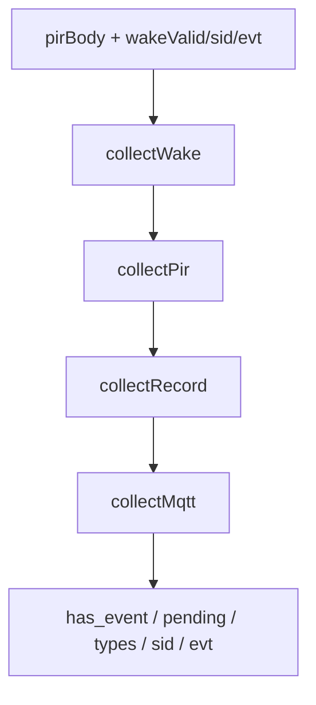

# host_event 待处理业务汇总

> **代码真源**：[`lib/host_event.lua`](../../lib/host_event.lua)  
> **配置**：`HOST_EVT_CFG`（[`config.lua`](../../user/config.lua)）  
> **消费者**：[`user/host_uart.lua`](../../user/host_uart.lua) · [`user/t3x_ctrl.lua`](../../user/t3x_ctrl.lua) · [`user/net_mqtt.lua`](../../user/net_mqtt.lua)  
> **IPC 对照**：[T3X_IPC_4G_INTERACTION.md](../T3X_IPC_4G_INTERACTION.md)

---

## 1. 模块职责

将 Cat.1 侧多源状态汇总为 **HOSTEVT / PIRSTAT** 的 `has_event` 字段，供：

- T3x **HOSTIDLE 轮询**前判断是否有活要干
- **`t3x_ctrl.enterSleep`** 门禁（有 pending 则暂不断电）
- T3x **`AT+HOSTEVT?`** 应答体构建

与 IPC 侧 `host_event.c` 逻辑对称；**不**直接发 MQTT，只读运行时快照。

---

## 2. 事件类型（`types_mask` 位掩码）

| 类型 | 位 | 数据来源 |
|------|-----|----------|
| `wake` | 1 | `host_uart` pending HOSTEVT（`notify_host` 未消费） |
| `pir` | 2 | `pir_ctrl.buildAtBody()` 近期 PIR（`last` + `last_ts`） |
| `record` | 4 | PIRSTAT `recording=1` |
| `mqtt` | 8 | `net_mqtt.hasPendingHostWork()` |

默认 `types_mask = 0x0F`（四类全开）。`FEATURE_CFG.host_evt=false` 或 `HOST_EVT_CFG.enabled=false` 时 `summarize` 返回空。

---

## 3. summarize 流程



### 3.1 wake

- `wakeValid` 来自 `host_uart.getHostEvtPending()`
- 或 PIRSTAT 内 `pending_wake=1` + `pending_sid` / `pending_evt`

### 3.2 pir

`last` 须为 `detected` / `retrigger` / `hw_accept` 之一，且 `last_ts` 在 `pir_pending_max_age_sec`（默认 120s）内。

### 3.3 record

`recording=1` 即计入；单独 record **不**视为可立即 dispatch（见 §4）。

### 3.4 mqtt

条件：`online_status=1` 且 **非** `low_power_mode=1`，且 `net_mqtt.hasPendingHostWork()`：

- `pendingHostQueue` 非空（2006/2007/2009 等需 T3x 的下行）
- 或 PIR `last_stop_reason=device` 且 1011 尚未上报

---

## 4. isDispatchable 与休眠门禁

| 函数 | 规则 |
|------|------|
| `hasPendingWork` | `summarize.has_event == 1` |
| `isDispatchable(sum)` | 有事件且：仅 `record` 或仅 `mqtt` **不可** dispatch（须含 `wake`） |
| `shouldBlockT3xSleep` | `block_t3x_sleep_when_pending` 且（body 含 `has_event=1` / `has_work=1` 或 `hasPendingWork`） |

**语义**：T3x 在 HOSTIDLE 轮询里可处理 wake/PIR；纯录像中或纯 MQTT 排队**阻止进入深睡**，避免丢活。

`t3x_ctrl.shouldBlockSleep` → `host_uart.buildHostEvtBody()` → `shouldBlockT3xSleep`。

---

## 5. host_uart 集成

```text
build_pir_wake_context()
  → pir_ctrl.buildAtBody()
  → getHostEvtPending()
  → host_event.summarize(...)
  → 拼入 AT+HOSTEVT? / AT+PIRSTAT? 应答
```

`getHostEvtPending` **只读** pending，清除走 `AT+HOSTEVTCLR` 成功路径。

---

## 6. 配置（`HOST_EVT_CFG`）

| 键 | 默认 | 说明 |
|----|------|------|
| `enabled` | true | 总开关 |
| `types_mask` | 0x0F | 参与汇总的类型位 |
| `pir_pending_max_age_sec` | 120 | PIR last 有效期 |
| `block_t3x_sleep_when_pending` | true | 有 pending 阻止 T3x sleep |
| `allow_host_idle_sleep` | true | 与 HOSTIDLE 策略配合（host_uart） |
| `poll_interval_ms` 等 | 30s | HOSTIDLE 轮询间隔（host_uart 消费） |

---

## 7. 对外 API

| 函数 | 说明 |
|------|------|
| `isEnabled()` | 模块是否启用 |
| `summarize(pirBody, wakeValid, wakeSid, wakeEvt)` | 完整汇总表 |
| `hasPendingWork(...)` | 布尔：是否有未处理业务 |
| `isDispatchable(sum)` | 是否可立即 dispatch |
| `shouldBlockT3xSleep(...)` | 是否阻止 T3x 进入 sleep |
