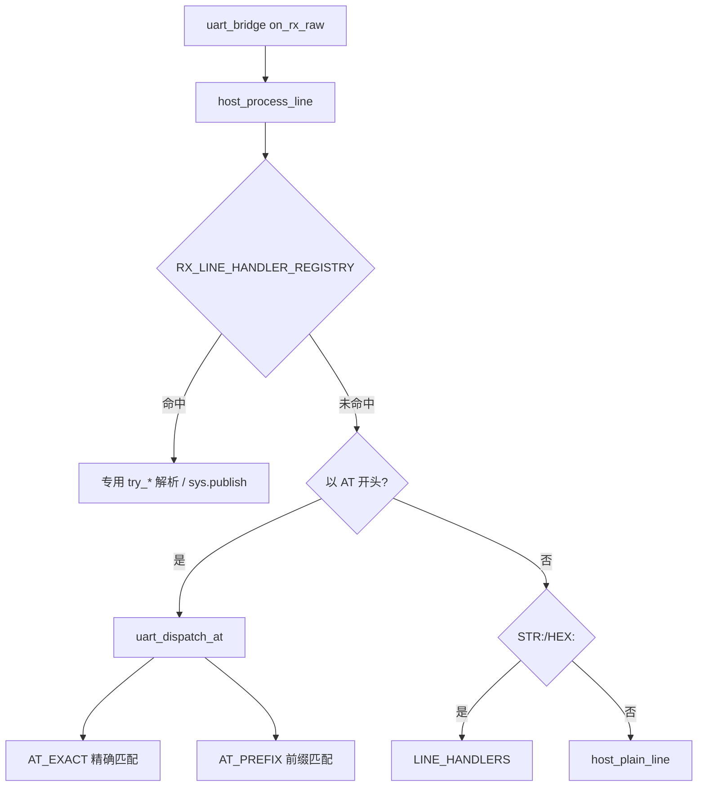

# host_uart AT 分发与上行应答

> **代码真源**：[`user/host_uart.lua`](../../user/host_uart.lua)  
> **协议对照**：[UART_AT_COMMANDS.md](../UART_AT_COMMANDS.md) · [UART_PROTOCOL.md](../UART_PROTOCOL.md)

---

## 1. 数据流

**原则**：T3x 主动上报的 `+XXX:` 应答行 **优先** 走 `RX_LINE_HANDLER_REGISTRY`，避免被 AT 分发误解析。

---

## 2. AT 命令表（`AT_CMD_TABLE`）

构建：`uart_cmd_entry(keys, prefix, handler)` → 编译为 `AT_EXACT` 哈希 + `AT_PREFIX` 数组。

### 2.1 握手 / 版本

| 匹配 | Handler | 说明 |
|------|---------|------|
| `AT` | `uart_at_ack` | 链路存活 |
| `ATI` / `AT+CGMR` / `AT+GETVER` | `uart_ati` | 固件版本 |

### 2.2 状态查询

| 匹配 | Handler | 说明 |
|------|---------|------|
| `AT+GETCFG` | `uart_getcfg` | 4G 综合状态 |
| `AT+PIRSTAT` / `AT+PIRSTAT?` | `uart_pirstat_query` | PIR 宽表 + has_work |
| `AT+RECORD` / `AT+RECORD?` | `uart_record_query` | 4G 侧录像会话 |
| `AT+HOSTEVT` / `AT+HOSTEVT?` | `uart_hostevt_query` | 精简待处理事件 |
| `AT+HOSTIDLE` / `AT+HOSTIDLE?` / `AT+HOSTIDLE=` | `uart_hostidle` | T31 休眠门禁 |
| `AT+TIME` | `uart_time_query` | Unix 时间 |
| `AT+IMEI` / `AT+IMEI?` | `uart_imei` | Cat.1 IMEI |
| `AT+IPCINFO` / `AT+IPCINFO?` | `uart_ipcinfo_query` | IMEI + GB28181 |
| `AT+WLED?` / `AT+WLEDEN?` / `AT+WLED=` / `AT+WLEDEN=` | `uart_wled` | 白光灯 |

### 2.3 T3x 主动上报（前缀 `AT+XXX=`）

| 前缀 | Handler | 典型 URC |
|------|---------|----------|
| `AT+RECORD=` | `uart_record_notify` | 录像开始/结束 |
| `AT+IPCSTATUS=` | `uart_ipcstatus_notify` | IPC 生命周期 |
| `AT+IPCSTAT=` | `uart_ipcstat_notify` | 云状态快照 |
| `AT+TFCARD=` | `uart_tfcard_notify` | TF 卡状态 |
| `AT+SNAPSHOT=` | `uart_snapshot_notify` | 抓拍结果 |
| `AT+PIRMEDIA=` | `uart_pir_media_notify` | PIR 媒体策略 |
| `AT+PERSONCNT=` | `uart_person_cnt_notify` | 人形计数 |
| `AT+IPCALERT=` | `uart_ipc_alert_notify` | IPC 异常告警 |

### 2.4 链路配置

| 前缀 | Handler | 说明 |
|------|---------|------|
| `AT+SERVCREATE=` | `uart_servcreate` | TCP 通道 |
| `AT+MQTTCFG=` | `uart_mqttcfg` | 写 MQTT 配置并重启 |
| `AT+P2PCFG=` / `AT+GB28181CFG=` | 对应 handler | 流媒体配置 |
| `AT+SERVCLOSE=` | `uart_servclose` | 关 TCP |
| `AT+RIL=` | `uart_ril` | modem 透传开关 |
| `AT+MQTTPUB=` | `uart_mqttpub` | T3x 请求 4G 发 MQTT |

### 2.5 低功耗 / USB

| 匹配 | Handler | 说明 |
|------|---------|------|
| `AT+LOWPOWER=` | `uart_lowpower` | 4G rest 进/出 |
| `AT+RNDIS` / `AT+RNDIS=` | `uart_rndis` | USB 网卡 |
| `AT+USBRESET` / `AT+USBRESET?` | `uart_usbreset` | USB 重新枚举 |
| `AT+USBRECOVERY=` | `uart_usbrecovery` | UART 恢复流程 |

### 2.6 电源 / 维护

| 匹配 | Handler | 说明 |
|------|---------|------|
| `AT+REBOOT` | `uart_reboot` | 重启 4G |
| `AT+POWEROFF` | `uart_poweroff` | 关机 |
| `AT+OTA` / `AT+OTACHECK` | `uart_ota` | OTA |
| `AT+SETCFG=` | `uart_setcfg` | 运行时配置 |
| `AT+PIRCLR` | `uart_pirclr` | 清零 PIR 统计 |
| `AT+HOSTEVTCLR` | `uart_hostevt_clr` | 清除 pending 唤醒 |

### 2.7 透传与其它

| 类型 | 说明 |
|------|------|
| `STR:` / `HEX:` 行 | `LINE_HANDLERS` → 原样/十六进制转发 |
| `state.passthrough` + `AT*` | 转交 `hooks.modem_at`（RIL 模式） |

---

## 3. 上行应答注册表（`RX_LINE_HANDLER_REGISTRY`）

按序调用 `try_*`，返回 `true` 表示已消费。

| name | 函数 | 典型行 | 用途 |
|------|------|--------|------|
| encode_uart_error | `try_encode_uart_error` | `+ENCODE:ERROR` | 编码 UART 错误 |
| sound_ack | `try_sound_ack_line` | `+SOUNDACK:` | 提示音 ACK |
| timeset_ack | `try_timeset_ack_line` | `+TIMESET:` | 对时 ACK |
| gb28181 | `try_gb28181_line` | `+GB28181:` | GB28181 配置应答 |
| wled | `try_wled_line` | `+WLED:` | 白光灯状态 |
| tfformat | `try_tfformat_line` | `+TFFORMAT:` | 格式化结果 |
| tfcard | `try_tfcard_line` | `+TFCARD:` | TF 卡查询应答 |
| recordtime | `try_recordtime_line` | `+RECORDTIME:` | MQTT 2022/2023 |
| framerate | `try_framerate_line` | `+FRAMERATE:` | MQTT 2024/2025 |
| recordctrl | `try_recordctrl_line` | `+RECORDCTRL:` | 停录控制 |
| persondet | `try_persondet_line` | `+PERSONDET:` | MQTT 2026/2027 |
| record | `try_record_line` | `+RECORD:` | T3x 录像 URC |
| venc / vencset | `try_venc_*` | `+VENC:` | 视频编码 query/set |
| audio / audioset | `try_audio_*` | `+AUDIO:` | 音频编码 |
| mic / micset | `try_mic_*` | `+MIC:` | 麦克风 MQTT 2028/2029 |
| softphoto / softphotoset | `try_softphoto_*` | `+SOFTPHOTO:` | 软光敏 2030/2031 |
| ipcstat | `try_ipcstat_line` | `+IPCSTAT:` | 云状态 |
| ipcstatus | `try_ipcstatus_line` | `+IPCSTATUS:` | IPC 生命周期 |
| ipcpoweroff | `try_ipcpoweroff_line` | `+IPCPOWEROFF:OK` | 优雅关机 ACK |
| encode_ok_tail | `try_encode_ok_tail` | 行尾 OK | 编码命令完成 |

---

## 4. HOSTIDLE 门禁（与电量联动）

`uart_hostidle` 决策顺序：

1. `FEATURE_CFG.host_evt` / `HOST_EVT_CFG.allow_host_idle_sleep`
2. USB 插入 → `+HOSTIDLE:USB`
3. `build_hostevt_body` 含 `has_event=1` → `BUSY`
4. `battery_guard.shouldAllowHostIdleSleep()` → >20% 回 `BUSY`
5. `battery_guard.canAcceptHostIdleSleep()` → PIR 唤醒 30s 内 `BUSY`
6. 通过 → `t3x_ctrl.enterSleep({ reason="host_idle" })` → `OK`

---

## 5. 扩展新 AT 命令

1. 实现 `local function uart_xxx(cmd) ... end`
2. 在 `AT_CMD_TABLE` 追加 `uart_cmd_entry(...)`
3. 无需改 `uart_dispatch_at`（表自动编译）

扩展新 T3x 上行应答：

1. 实现 `local function try_xxx_line(line) ... end`
2. 在 `RX_LINE_HANDLER_REGISTRY` 追加 `{ name, fn }`（注意顺序：更具体的放前面）

---

**版本**：2026-06-30
