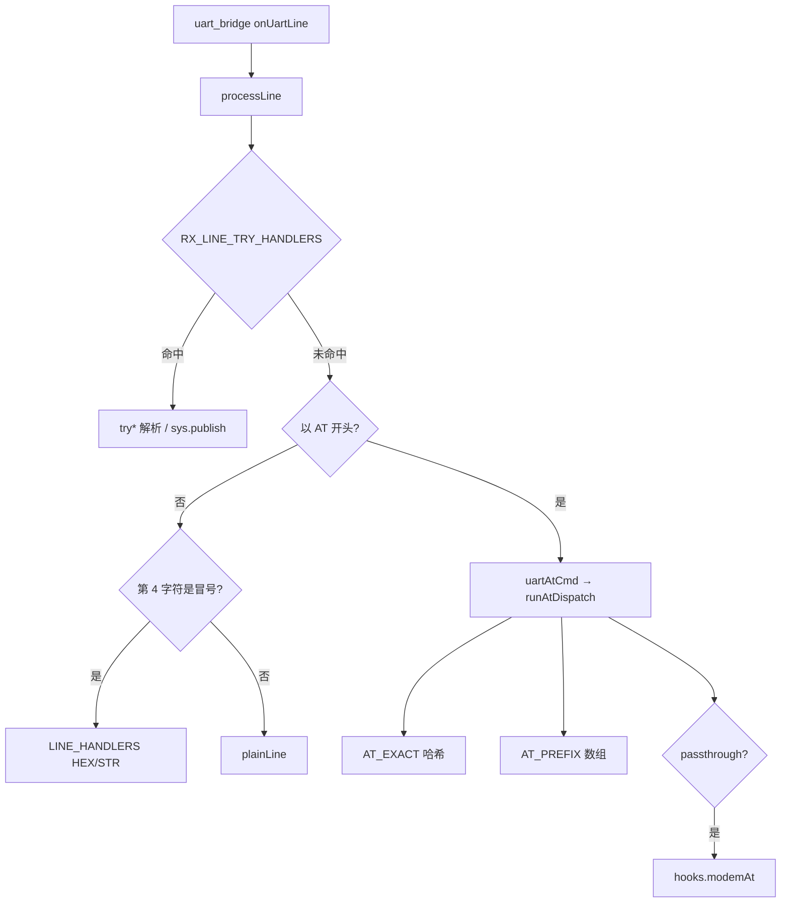

# host_uart AT 分发与上行应答

> **代码真源**：[`user/host_uart.lua`](../../user/host_uart.lua)（互斥、分发、RX 调度、start）  
> **AT 表**：[`user/hif_at.lua`](../../user/hif_at.lua)  
> **AT handler**：[`user/hif_cmd.lua`](../../user/hif_cmd.lua) + `hif_cmd_*`  
> **URC/RX**：[`user/hif_rx.lua`](../../user/hif_rx.lua) + `hif_rx_dsl.lua` / `hif_rx_media.lua`  
> **IPC query/set**：[`user/hif_ipc.lua`](../../user/hif_ipc.lua) + `hif_ipc_*`  
> **协议对照**：[UART_AT_COMMANDS.md](../mqtt/UART_AT_COMMANDS.md) · [UART_PROTOCOL.md](../mqtt/UART_PROTOCOL.md)  
> **bind 头**：`python tools/debug/_gen_bind_header.py --check-all` · spec：`tools/debug/bind_header_specs.json`  
> **回归**：`python tools/debug/_protocol_regression_check.py`

锁 / `SYS_EVT` / `state` 只留在 `host_uart.lua`，不要迁出。`hif_*` 文件名 ≤24 字节。

---

## 0. 模块树与 bind 顺序

```
host_uart.lua              锁 / SYS_EVT / state / processLine / start
├── hif_at.lua              AT_CMD_TABLE → exact 哈希 + prefix 数组
├── hif_cmd.lua             AT 编排（bind 顺序固定）
│   ├── hif_cmd_usb.lua     USBRESET / RNDIS / USBRECOVERY
│   ├── hif_cmd_link.lua    P2P / GB28181 / MQTT / SERV
│   ├── hif_cmd_pir.lua     HOSTEVT / PIRSTAT
│   ├── hif_cmd_t31x.lua     RECORD / UPLOAD / IPCSTAT 等 NOTIFY
│   └── hif_cmd_wled.lua    WLED 影子表 + AT
├── hif_rx.lua              URC 编排，tryHandlers 函数数组
│   ├── hif_rx_dsl.lua      匹配 DSL + 云态/TF/录像/IPC 行
│   └── hif_rx_media.lua    VENC / AUDIO / MIC / FRAMERATE 等
└── hif_ipc.lua             hostQuery / hostSet + 子模块编排
    ├── hif_ipc_rec.lua     UART 恢复、qryHostStat
    ├── hif_ipc_hostq.lua   RECORD / MIC / SOFTPHOTO query/set
    ├── hif_ipc_cloud.lua   云状态 / GB28181（依赖 rec + hostq）
    ├── hif_ipc_power.lua   IPC 关机 / ready（依赖 rec）
    ├── hif_ipc_tffmt.lua   TF format
    └── hif_ipc_encode.lua  VENC / AUDIO
```

**主文件 bind 顺序**（不要改）：

1. 组 `ctx`（含 `pushUsbIdle`，cmd/usb/rec 可快照）
2. `hif_cmd.bind(ctx)` → `hif_at.compile(cmd.at)`
3. `hif_rx.bind(ctx)`，再把 `parseIpcStat` / `patchCloud` 等挂回 `ctx`
4. `hif_ipc.bind(ctx)`：`rec → hostq`（查询挂到 `H`）→ `cloud → power → tffmt → encode`

cmd 里用到 rx 的 `parseIpcStat` / `patchCloud` 必须 **延迟 wrapper**（`return C.foo(...)`），不能 `local foo = C.foo`。

**WLED 两套入口**（不要混）：

| 符号 | 是什么 | 谁用 |
|------|--------|------|
| `C.wledState` | 表 `wledRuntime`（有 `.on`） | `hif_rx_dsl` 写 `C.wledState.on` |
| `C.M.wledState` | getter `wledGet` | `net_mqtt` 调 `hif.wledState()` |

---

## 1. bind 头约定

`hif_cmd_*` / `hif_ipc_*` 在 `function bind(C[, H, …])` 开头只做 **ctx 字段快照** 或 **延迟 wrapper**，业务从第一个非 header 行开始。

| 类型 | 写法 | 适用 |
|------|------|------|
| 快照 | `local state = C.state` | bind 前已存在于 ctx |
| 合并 | `local state, E = C.state, C.E` | 热路径少行 |
| 延迟 wrapper | `local function parseIpcStat(...) return C.parseIpcStat(...) end` | rx.bind 后才挂 ctx |
| 注入 | `local qryHostStat = H.qryHostStat` | rec/hostq 先 bind，查询挂到 H |
| 直用 shared | `shared.defineSet{ ... }` | encode 等于工厂，不必再 local |

新增/改子模块后：

```bash
python tools/debug/_gen_bind_header.py --emit hif_cmd_xxx.lua
python tools/debug/_gen_bind_header.py --check-all
python tools/debug/_protocol_regression_check.py
```

---

## 2. 数据流


```mermaid
flowchart TD
    RX[uart_bridge onUartLine] --> PROC[processLine]
    PROC --> TRY{RX_LINE_TRY_HANDLERS}
    TRY -->|命中| ACK[try* 解析 / sys.publish]
    TRY -->|未命中| AT{以 AT 开头?}
    AT -->|是| DISPATCH[uartAtCmd → runAtDispatch]
    AT -->|否| STR{第 4 字符是冒号?}
    STR -->|是| LINE[LINE_HANDLERS HEX/STR]
    STR -->|否| PLAIN[plainLine]
    DISPATCH --> EXACT[AT_EXACT 哈希]
    DISPATCH --> PREFIX[AT_PREFIX 数组]
    DISPATCH --> RIL{passthrough?}
    RIL -->|是| MODEM[hooks.modemAt]
```

**原则**：T31x 主动上报的 `+XXX:` 行 **优先** 走 `RX_LINE_TRY_HANDLERS`，避免被 AT 分发误解析。

`uartAtCmd`：仅当整串不在 `AT_EXACT` 时才剥尾部 `?`，避免 `AT+USBRESET?` 被剥成 `AT+USBRESET` 真复位。

---

## 3. AT 命令表（`hif_at.compile`）

`uartCmdEntr(keys, prefix, handler)` → `AT_EXACT` 哈希 + `AT_PREFIX` 数组。  
handler 名是 `hif_cmd` 注入表的短键（`at_ack` / `record`），对应函数是 camelCase（`atAck` / `t31x.uartRecord`）。

### 3.1 握手 / 版本 / 状态

| 匹配 | handler 键 | 函数 | 说明 |
|------|------------|------|------|
| `AT` | `at_ack` | `atAck` | 链路存活 |
| `ATI` / `AT+CGMR` / `AT+GETVER` | `ati` | `atVersion` | 固件版本 |
| `AT+GETCFG` | `getcfg` | `atGetCfg` | 4G 综合状态 |
| `AT+PIRSTAT` / `AT+PIRSTAT?` | `pirstat` | `uartPirStatQry` | PIR 宽表 |
| `AT+PIRCLR` | `pirclr` | `uartPirClr` | 清零 PIR |
| `AT+HOSTEVT` / `AT+HOSTEVT?` | `hostevt` | `uartHostEvtQry` | 待处理事件 |
| `AT+HOSTEVTCLR` | `hostevtclr` | `uartHostEvtClr` | 清 pending 唤醒 |
| `AT+RECORD` / `AT+RECORD?` | `record_qry` | `atRecordQry` | 4G 侧录像会话 |
| `AT+TIME` | `time` | `atTime` | Unix 时间 |
| `AT+IMEI` / `AT+IMEI?` | `imei` | `atImei` | Cat.1 IMEI |
| `AT+IPCINFO` / `AT+IPCINFO?` | `ipcinfo` | `uartIpcInfoQry` | IMEI + GB28181 |
| `AT+WLED?` / `AT+WLEDEN?` / `AT+WLED=` / `AT+WLEDEN=` | `wled` | `uartWled` | 白光灯 |
| `AT+HOSTIDLE` / `AT+HOSTIDLE?` / `AT+HOSTIDLE=` | `hostidle` | `atHostIdle` | T31 休眠门禁 |

exact 项顺序不影响分发（哈希）。`HOSTEVT` 与 PIR 排在一起只为阅读。

### 3.2 T31x 主动上报（前缀 `AT+XXX=`）

| 前缀 | handler 键 | 函数 |
|------|------------|------|
| `AT+RECORD=` | `record` | `uartRecord` |
| `AT+IPCSTATUS=` | `ipcstatus` | `uartIpcStatusNtf` |
| `AT+IPCSTAT=` | `ipcstat` | `uartIpcStatNtf` |
| `AT+TFCARD=` | `tfcard` | `uartTfCardNtf` |
| `AT+SNAPSHOT=` | `snapshot` | `uartSnapshot` |
| `AT+PIRMEDIA=` | `pirmedia` | `uartPirMedia` |
| `AT+PERSONCNT=` | `personcnt` | `uartPersonCnt` |
| `AT+IPCALERT=` | `ipcalert` | `uartIpcAlert` |
| `AT+UPLOADNEED=` | `uploadneed` | `uartUploadNeed` |
| `AT+UPLOADRESULT=` | `uploadresult` | `uartUploadResult` |

空参一律 `RSP_ERROR`（`needArg` / `ntfArg`）。`ntfArg` 会先 `noteHostPush()`。

### 3.3 链路 / 低功耗 / USB / 维护

| 匹配 | handler 键 | 说明 |
|------|------------|------|
| `AT+SERVCREATE=` / `AT+SERVCLOSE=` | `servcreate` / `servclose` | TCP 通道 |
| `AT+MQTTCFG=` / `AT+MQTTPUB=` | `mqttcfg` / `mqttpub` | MQTT 配置 / 代发 |
| `AT+P2PCFG=` / `AT+GB28181CFG=` | `p2pcfg` / `gb28181` | 流媒体 |
| `AT+RIL=` | `ril` | modem 透传 |
| `AT+SENDSTR=` / `AT+SENDHEX=` | `sendstr` / `sendhex` | 透传 |
| `AT+LOWPOWER=` | `lowpower` | 4G rest 进/出 |
| `AT+RNDIS` / `AT+RNDIS=` | `rndis` | USB 网卡 |
| `AT+USBRESET` / `AT+USBRESET?` | `usbreset` | USB 重新枚举 |
| `AT+USBRECOVERY=` | `usbrecovery` | UART 恢复流程 |
| `AT+REBOOT` / `AT+POWEROFF` | `reboot` / `poweroff` | 重启 / 关机 |
| `AT+OTA` / `AT+OTACHECK` | `ota` | OTA |
| `AT+SETCFG=` | `setcfg` | 运行时配置 |

`STR:` / `HEX:` 行走 `LINE_HANDLERS`，不进 AT 表。`state.passthrough` 时未命中的 `AT*` 转交 `hooks.modemAt`。

---

## 4. 上行应答（`RX_LINE_TRY_HANDLERS`）

按序调用函数，返回 `true` 表示已消费。注册表是 **函数数组**，不是 `{ name, fn }`。

| 函数 | 典型行 | 用途 |
|------|--------|------|
| `tryEncodeUartErr` | 裸 `ERROR` | 冲掉进行中的 encode 查询 |
| `tryEncodeUartOk` | 裸 `OK` | encode / MIC 查询结束 |
| `trySoundAck` | `+SOUNDACK:` | 提示音 ACK |
| `tryTimesetAck` | `+TIMESET:OK` | 对时 ACK |
| `tryGb28181` | `+GB28181:` | GB28181 配置应答 |
| `tryWledLine` | `+WLED:` | 白光灯状态 |
| `tryTfFormat` | `+TFFORMAT:` | 格式化结果 |
| `tryTfCard` | `+TFCARD:` | TF 卡查询应答 |
| `tryRecTime` | `+RECORDTIME:` | MQTT 2022/2023 |
| `tryRecord` | `+RECORD:` | T31x 录像 URC |
| `tryRecordCtrlLine` | `+RECORDCTRL:` | 停录控制 |
| `tryUploadLine` | `+UPLOADVIDEO:` | 上传 |
| `tryFramerateLine` | `+FRAMERATE:` | MQTT 2024/2025 |
| `tryVenc*` / `tryAudio*` | `+VENC:` / `+AUDIO:` | 视频/音频编码 |
| `tryMic*` | `+MIC:` | 麦克风 MQTT 2028/2029 |
| `trySoftPhoto*` | `+SOFTPHOTO:` | 软光敏 2030/2031 |
| `tryPersonDetLine` | `+PERSONDET:` | 人形开关 |
| `tryIpcStatCloud` | `+IPCSTAT:` | 云状态 |
| `tryIpcStatus` | `+IPCSTATUS:` | IPC 生命周期 |
| `tryIpcPowerOff` | `+IPCPOWEROFF:` | 优雅关机 ACK |

---

## 5. HOSTIDLE 门禁

`atHostIdle` 决策顺序：

1. `FEATURE_CFG.host_evt == false` → `NOT_SUPPORTED`
2. `HOST_EVT_CFG.allow_host_idle_sleep == false` → `DISABLED`
3. USB 挡休眠且 `AT+HOSTIDLE=1` → `+HOSTIDLE:USB`（`=0` 仍回 OK）
4. `bldPirWake(true)` 含 `has_event=1` → `BUSY`
5. `AT+HOSTIDLE?` → 回 `lowpower/usb/host_idle_allow` 快照
6. `battery_guard.shouldHostSleep()` / `canHostSleep()` 任一否 → `BUSY`
7. 通过 → `t31x_ctrl.enterSleep({ reason="host_idle" })` → `OK`

---

## 6. 扩展

新 AT：

1. 在对应 `hif_cmd_*.lua` 写 `local function uartXxx(cmd)`
2. 挂到 `hif_cmd` 的 `at` 表
3. 在 `hif_at.lua` 追加 `uartCmdEntr(...)`
4. 无需改 `runAtDispatch`

新 T31x 上行：

1. 在 `hif_rx_dsl` / `hif_rx_media` 写 `tryXxx(line)`，命中返回 `true`
2. 追加到 `hif_rx.lua` 的函数数组（更具体的放前面）

---

## 7. 本轮 hif_* 精简（可读性，协议语义不变）

目标：少重复、早返回、名字对齐；不改 AT/MQTT 线格式。

| 文件 | 做了什么 |
|------|----------|
| `hif_cmd_t31x.lua` | `needArg` / `ntfArg`；NOTIFY 空参统一 ERROR |
| `hif_cmd.lua` | `atSend` 分 STR/HEX；`atLowPower` 一次读 rest；`atSend` 不用 `and/or` 调两次 |
| `hif_cmd_usb.lua` | 去掉未用 `C.state`；`pushRecover`；RNDIS 开/关合一 |
| `hif_cmd_wled.lua` | `AT+WLED?` / `AT+WLED=` 经 `C.defineQuery` / `C.defineSet` 工厂下发；影子表 `wledRuntime`（勿再命名成 `wledState`） |
| `hif_cmd_link.lua` | `validPassword` |
| `hif_cmd_pir.lua` | `uartHostEvtQry` 走 `bldHostEvtBody()` |
| `hif_rx_dsl.lua` | `publishAck` / `recTimeRow`；TFFORMAT/WLED/IPCPOWEROFF 共用 ACK |
| `hif_rx.lua` | 注册表分组注释 |
| `hif_ipc_cloud.lua` | `flag01` / `liftFlag` |
| `hif_ipc_encode.lua` | `packRows` 不再循环找第一行 |
| `hif_ipc_hostq.lua` | `defineQuery` 对齐；SOFTPHOTO 字段名表 |
| `hif_ipc_rec.lua` | `noteUartLinkOk = clearMissStreak` |
| `hif_ipc_power.lua` | `waitBusyClear` 合成 while |
| `hif_at.lua` | 分区注释；HOSTEVT 与 PIR exact 排一起 |
| `hif_rx_dsl.lua` / `hif_rx_media.lua` | 二次：`trimStr` 并入 `normLine`；`asNum` 由 dsl 导出复用 |
| `hif_ipc_encode.lua` / `hif_ipc_hostq.lua` | 二次：`optTable`/`asTbl` 复用 `utils.optTable` |
| `hif_cmd_wled.lua` / `hif_ipc_cloud.lua` | 二次：删 `hostQuery` 永不读的死 `timeoutCfgKey`/`defaultTimeout`；cloud 快照只取一次 |
| `hif_cmd_usb.lua` | 二次：USBRECOVERY `lastErr` 一行式 |

`hif_ipc.lua` / `hif_ipc_tffmt.lua` / `hif_rx_media.lua` 本轮结构已短，未再拆。

**不要再踩**：

- `atSend`：`fn` 返回 `false` 时不能写成 `extra and fn(...) or fn(...)`（会调两次）。
- `hif_cmd_usb` bind 头不要快照 `C.state`（handler 不用）。
- WLED：表叫 `wledRuntime`，getter 叫 `wledGet`；同名会把表盖成函数，`+WLED:` 写 `.on` 会崩。AT+WLED? / AT+WLED= 走 `C.defineQuery` / `C.defineSet` 工厂（wled 由 `hif_cmd.bind` 早于 `hif_ipc.bind` 装载，工厂运行期经 `C` 惰性取用），**不要**在 wled 里直调 `hostQuery` 手拼 spec（原 `wledQuerySpec` 已删）。
- `hostQuery(waitMs, opts)` 先置 `opts.timeoutMs = waitMs`：调用方传了非 nil 超时后，spec 里的 `timeoutCfgKey`/`defaultTimeout` 即为死字段（例外 `qryHostStat`：`t31x_ctrl` 可能传 nil，回退必须保留）。

---

**版本**：2026-09-02

## 8. 超时常量真源（refactor_plan P2a，2026-09-04）

host_uart 族 7 个文件原各有一张 `TIMEOUT`/`TMO` 表，同一语义（拿锁上限、IPCSTATUS/IPCSTAT 查询超时）在多处重复定义——R4 首版把 quiet 静默常量 `hostIdleMs=2000` 误当 acquire 预算即由此而来。P2a 起：

| 键（`host_uart.lua` `TMO_SHARED`，经 `ctx.TMO_SHARED` 注入） | 值 | 消费方 |
|---|---|---|
| `acquireCapMs` | 8000 | `hif_ipc_power`（IPCPOWEROFF）、`hif_ipc_tffmt`（TFFORMAT） |
| `statusQueryMs` | 2000 | `hif_ipc_rec`（`AT+IPCSTATUS?`）、`hif_ipc_power`（恢复链复查） |
| `cloudStatQueryMs` | 2500 | `hif_ipc_cloud`（`AT+IPCSTAT?`）、`host_uart` 首条 AT 后刷新 |
| `qryDefaultMs` | 3000 | `hif_ipc.TMO.qry`（hostQuery 默认超时）、`hif_cmd_wled`（`AT+WLED?` ack）（P2b） |
| `t31xWaitMs` | 800 | `hif_ipc.TMO.t31xWait`（`ensT31xHost` 默认等待）、`hif_cmd_wled`（P2b） |

规则：**同一语义只在 `TMO_SHARED` 定义一次**；子模块本地表只留模块特有值（`tffmt.formatMs=120000`、`hostq.recOff=22000`、`power.readyDefaultMs` 等）。子模块头部写 `local TMO_SHARED = C.TMO_SHARED`，并在 `tools/debug/bind_header_specs.json` 对应 `c` 列表登记（`_gen_bind_header --check-all` 守护）。

**未并入（同值但语义待定）**：`hif_ipc_hostq.TMO.rec = 3000`（录像查询）与 `qryDefaultMs` 同值，是否同义待定；`mqtt_dl_pir.stopDefault = 22000` 与 `hif_ipc_hostq.TMO.recOff = 22000` 跨族同值，待 P7 ctx.const 统一。

**已知同义不同值（本阶段不改数值，待维护者定）**：串口静默期 quiet——`hif_ipc.TMO.quiet = 1500`（hostQuery/hostSet 走 `armHost`）vs `hif_ipc_power.hostIdleCapMs = 2000` / `hif_ipc_tffmt.hostIdleMs = 2000`（直接 `waitHostIdle`）。统一到哪一个值需实机验证后再收进 `TMO_SHARED`。
