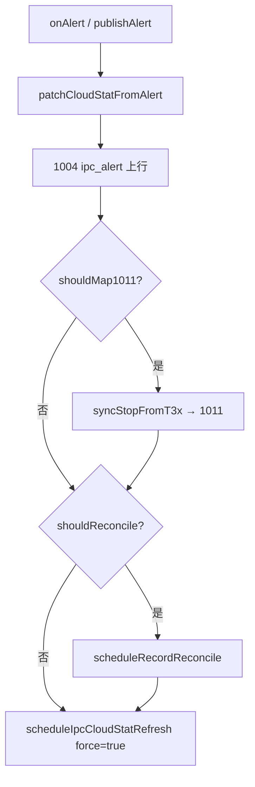

# ipc_supervision IPC 异常监督

> **代码真源**：[`user/ipc_supervision.lua`](../../user/ipc_supervision.lua) · [`user/ipc_alert_contract.lua`](../../user/ipc_alert_contract.lua)  
> **契约**：[T3X_IPC_ALERT_CONTRACT.md](../T3X_IPC_ALERT_CONTRACT.md)  
> **关联**：[HOST_UART_AT_DISPATCH.md](HOST_UART_AT_DISPATCH.md)（`AT+IPCALERT`）· [PIR_CTRL_FLOW.md](PIR_CTRL_FLOW.md)（1011 停录）

---

## 1. 模块职责

| 层级 | 职责 |
|------|------|
| **契约** | `ipc_alert_contract` 定义 `alertCode` → `map1011` / `reconcile` |
| **上行** | T3x `AT+IPCALERT` → 1004 `action=ipc_alert` |
| **副作用** | 补丁 1003 缓存、可选 1011、录像对账、IPCSTAT 刷新 |

`net_mqtt` 在加载后通过 `ipc_supervision.bind(deps)` 注入 `publish_uplink`、`esc_json`、`publish_t3x_record_stop` 等，避免循环依赖。

---

## 2. 主流程（`publishAlert`）



入口：

- `host_uart` 解析 `AT+IPCALERT` → `sys.publish(T3X_IPC_ALERT)` → `app` → `ipc_supervision.onAlert`
- 直接调用 `publishAlert`（测试或内部）

---

## 3. 1003 IPC 扩展字段

`ipcCloudStatFields()` 从 `host_uart.getCachedHostIpcCloudStat()` 拼 JSON 片段：

| 字段 | 含义 |
|------|------|
| `ipcReady` | IPC 就绪 |
| `gb28181Online` | GB28181 在线 |
| `tfPresent` | TF 卡在位 |
| `personDetectEnabled` / `personDetectAvailable` | 人形检测 |
| `timeSynced` | 时间已同步 |
| `recordingT3x` | T3x 侧在录 |
| `cat1Link` | Cat.1 链路 |

`mergeHostIpcCloudCache()` / `refreshIpcCloudStatBefore1003()` 在 1003 发布前合并或拉取 IPCSTAT（须在协程内才发 AT）。

---

## 4. ALERT_CLOUD_PATCH

部分 alert 会**增量补丁** 1003 缓存（T3x 主动推送为主，alert 作补充）：

| alertCode | patch |
|-----------|-------|
| `tf_mount_fail` | `tfPresent=0` |
| `time_sync_fail` / `time_invalid` | `timeSynced=0` |
| `gb28181_register_fail` | `gb28181Online=0` |

---

## 5. 1011 映射（`handleMap1011`）

`ipc_alert_contract.shouldMap1011(code)` 为真时：

1. `pir_ctrl.syncStopFromT3x(alertCode)` 同步 4G 会话
2. `publish_t3x_record_stop` → 1011（`source=t3x`）

典型码：`snapshot_failed`、`no_person`、`time_sync_fail`、`recordctrl_fail` 等（见契约表）。

---

## 6. 录像对账（`scheduleRecordReconcile`）

触发：`shouldReconcile(alertCode)` 或 `afterBatteryStatusPublished()`（1003 发布后）。

```text
canReconcileRecord:
  pir_ctrl.isRecording()
  ∧ T31 已启动 (isT31StartedForHostQuery)
  ∧ host_uart 非 query busy
→ host_uart.reconcileHostRecordSession(3500)
```

去重：`record_reconcile_pending`，延迟 800ms 合并多次触发。

---

## 7. IPCSTAT 后台刷新

`scheduleIpcCloudStatRefresh(force)`：

| 条件 | 行为 |
|------|------|
| `force=false` 且 T3x idle | 跳过（`ipc_stat_skip t3x_idle`） |
| 已有 pending | 合并为一次 |
| `force=true` | 忽略 idle 检查，强制拉取 |

执行：延迟 300ms → `refreshIpcCloudStatBefore1003(2500, force)`。

---

## 8. 与电量模块的衔接

`afterBatteryStatusPublished()` 在 `net_mqtt` 发布含电量的 1003 后调用：

- 调度录像对账（非强制）
- 调度 IPCSTAT 刷新（非强制，T3x 需 awake）

---

## 9. 依赖注入（`bind`）

| dep | 用途 |
|-----|------|
| `publish_uplink` | 1004 上行 |
| `esc_json` | alert 字段转义 |
| `publish_t3x_record_stop` | 1011 |
| `dt_ul_control` / `nc` | dataType 与连接检查 |

未 bind 时 `publishAlert` 打 `unbound` 并返回。
