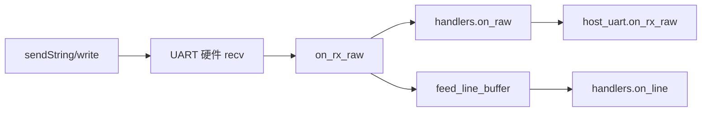

# uart_bridge / gpio_util 底层驱动

> **代码真源**：[`lib/uart_bridge.lua`](../../lib/uart_bridge.lua) · [`lib/gpio_util.lua`](../../lib/gpio_util.lua)  
> **配置**：`UART_CFG` · `GPIO_IN` / `GPIO_OUT`（[`config.lua`](../../user/config.lua)）  
> **上层**：[HOST_UART_AT_DISPATCH.md](HOST_UART_AT_DISPATCH.md) · [PERIPHERAL_LED_FLOW.md](PERIPHERAL_LED_FLOW.md)

---

## 1. 设计原则

| 原则 | 实现 |
|------|------|
| 单 UART 硬件入口 | 仅 `uart_bridge` 调用 `uart.setup` / `uart.write` |
| GPIO 配置统一 | `gpio_util` 将 `GPIO_IN/OUT` 条目转为 `gpio.setup` 参数 |
| lib 不反向依赖 user | `host_uart` / `peripheral` / `usb_charge` 通过回调或 `require` 使用 |

`APP_STACK.uart = "uart_bridge"`（`config.lua`）；`app.setupUartBridge` 注册 RX 并启动 `host_uart`。

---

## 2. uart_bridge 数据流



### 2.1 配置（`UART_CFG`）

| 键 | 默认 | 说明 |
|----|------|------|
| `id` | 1 | UART 端口号 |
| `baud` | 115200 | 波特率 |
| `line_protocol` | true | 是否按 `\r\n` 拆行 |
| `rx_line_max` | 4096 | 行缓冲上限，溢出清空 |

### 2.2 对外 API

| 函数 | 说明 |
|------|------|
| `start({ onRaw, onLine })` | 打开 UART、注册 recv（单次） |
| `stop()` | `uart.close`、清缓冲与回调 |
| `write(data)` | 原始写字节 |
| `sendString(text, with_crlf)` | 默认追加 `\r\n`（`time_sync`、`sound_prompt`、`host_uart` AT） |
| `setOnRaw` / `setOnLine` | 运行时改回调 |
| `getState()` | 字节统计、`last_line`、`rx_pending` |

### 2.3 app 集成

```text
uart_bridge.start({ onRaw = host_uart.on_rx_raw })
  → _G.uart_bridge = uart_bridge
  → host_uart.start({ t3x, hooks... })
```

T3x 烧录模式可 `uart_bridge.stop()` 释放串口给烧录工具。

**注意**：当前 `app.setupUartBridge` 仅注册 `onRaw`；行协议拆行在 `uart_bridge` 内部完成，但 `on_line` 未接 `host_uart`（`host_uart` 自行在 `on_rx_raw` 内按行解析）。

---

## 3. gpio_util GPIO 封装

将 `config.lua` 中的引脚条目转为 LuatOS `gpio.setup` 调用。

### 3.1 映射函数

| 函数 | 说明 |
|------|------|
| `trigger_mode("rising"\|"falling"\|"both")` | → 0 / 1 / 2 |
| `pull("pullup"\|"pulldown")` | → 1 / 2 |
| `in_pin(name)` / `out_pin(name)` | 读 `GPIO_IN/OUT[name].pin` |

### 3.2 输入

`setup_input(pin, callback, opts)`：

- `pull` / `trigger_mode` / `debounce_ms`
- 可选 `gpio.debounce(pin, ms)`

`setup_input_entry(entry, callback)`：从 `GPIO_IN` 条目（含 `usb_det`、`pwr_key`、`pir_det` 等）一键配置。

### 3.3 输出

`setup_output(entry)`：按 `init_level` 初始化，返回 `gpio.set` 闭包。

`set_output(entry, on)`：按 `on_level` / `init_level` 设电平。

**消费者**：`peripheral` 按键、`led_ctrl` 蓝/红灯、`usb_charge` 中断引脚。

---

## 4. 模块依赖关系

```text
gpio_util
  ├─ peripheral（按键、LED）
  ├─ usb_charge（USB_DET / CHG_STATE）
  └─ pir_ctrl.startHw（PIR 中断，经 peripheral）

uart_bridge
  ├─ host_uart（T3x AT 协议）
  ├─ time_sync（AT+TIMESET）
  ├─ sound_prompt（AT+PLAYSOUND）
  └─ t3x_ctrl（深睡时可 stop）
```

---

## 5. 调试与状态

| 模块 | `getState()` 要点 |
|------|-------------------|
| `uart_bridge` | `rx_bytes`/`tx_bytes`、`last_line`、`rx_pending` |
| `gpio_util` | 无状态（纯工具函数） |

日志 TAG：`uart_bridge` 启动时打印 `uart_id`、`baud`、`lineProto`、`rxMax`。
