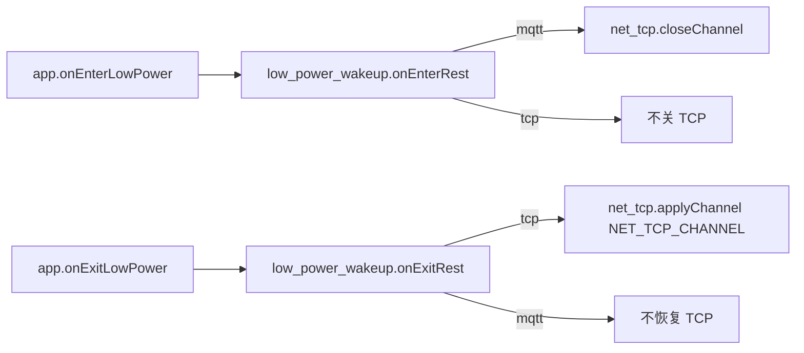

# low_power_wakeup / net_tcp 低功耗唤醒通道

> **代码真源**：[`lib/low_power_wakeup.lua`](../../lib/low_power_wakeup.lua) · [`user/net_tcp.lua`](../../user/net_tcp.lua)  
> **配置**：`LOW_POWER_WAKEUP_CFG.mode`（[`config.lua`](../../user/config.lua)）  
> **详述**：[CAT1_LOWPWR_MQTT_TCP_STRATEGY.md](../CAT1_LOWPWR_MQTT_TCP_STRATEGY.md)  
> **关联**：[NET_MQTT_DOWNLINK_DISPATCH.md](NET_MQTT_DOWNLINK_DISPATCH.md) · [APP_EVENT_BUS.md](APP_EVENT_BUS.md)

---

## 1. 核心结论

云端唤醒 **二选一**，由 `LOW_POWER_WAKEUP_CFG.mode` 切换：

| 模式 | 值 | rest 下长连接 | 唤醒主通道 |
|------|-----|---------------|------------|
| **MQTT**（默认） | `"mqtt"` | `net_mqtt` 保持 | 下行 2001/2002、PIR |
| **TCP** | `"tcp"` | `net_tcp` SERVCREATE 保持 | 服务器 `wake_hex` |

`lib/low_power_wakeup.lua` 是**唯一策略模块**；`net_mqtt` / `net_tcp` 各管连接实现。

---

## 2. 策略 API

| 函数 | mqtt 模式 | tcp 模式 |
|------|-----------|----------|
| `isMqttMode()` / `isTcpMode()` | true / false | 相反 |
| `allowTcpChannel()` | false | true |
| `keepMqttAliveInRest()` | true | false（MQTT 非主唤醒） |
| `shouldCloseTcpOnEnterRest()` | **true**（进 rest 关 TCP） | false |
| `shouldRestoreTcpOnExitRest()` | false | **true**（出 rest 恢复 TCP） |
| `getModemHibernate()` | false | false |

`getModemHibernate()` 固定 `false`：进 rest 蜂窝保持在线，与 `LOW_POWER_CFG.modem_hibernate` 由 `app` 单独读取。

---

## 3. rest 进/出钩子



### 3.1 `onEnterRest`（mqtt 模式）

若 `net_tcp` 已 `SERVCREATE` 配置过通道 → `closeChannel(sid)`，避免 rest 下双通道并存。

### 3.2 `onExitRest`（tcp 模式）

从 `_G.NET_TCP_CHANNEL` 恢复 → `net_tcp.applyChannel(ch)`。

### 3.3 host_uart 桥接

`app.setupUartBridge` 注入：

- `on_servcreate(ch)` → `low_power_wakeup.applyTcpChannel(ch)`
- `on_servclose(sid)` → `low_power_wakeup.closeTcpChannel(sid)`

`host_uart` `SERVCREATE`/`SERVCLOSE` 前查 `allowTcpChannel()`；`AT+GETCFG` 附加 `wakeup_mode` 与 `tcp_on` 字段（`appendGetCfgFields`）。

---

## 4. mode = mqtt（默认产品配置）

| 模块 | rest 下状态 |
|------|-------------|
| MQTT | **保持**，上报 1002 + 周期 1003 |
| TCP | **关闭**（`SERVCREATE` → DISABLED） |
| T3x | **断电**（`t3x_ctrl.enterSleep`） |
| 蜂窝 | 在线 |

`net_mqtt.lua` 模块头注释标明其为 mqtt 模式下的唤醒主通道。

---

## 5. mode = tcp

| 模块 | rest 下状态 |
|------|-------------|
| TCP | **保持**（`onEnterRest` 不关） |
| MQTT | 可仍运行（业务上报），**非唤醒主通道** |
| T3x | **断电** |
| 蜂窝 | 在线 |

完整 TCP 实现需在 `user/net_tcp.lua` 扩展；当前仓库为 **桩模块**。

---

## 6. net_tcp 桩（当前实现）

`user/net_tcp.lua` 为占位，所有操作返回失败或 no-op：

| 函数 | 行为 |
|------|------|
| `applyChannel(ch)` | `false, "tcp_disabled"` |
| `closeChannel(sid)` | `true`（空操作） |
| `appendGetCfgFields()` | `",tcp_on=0"` |
| `getState()` | `configured=false` |

启用 tcp 模式前需实现：`SERVCREATE` 长连接、`wake_hex` 解析、与 `low_power_wakeup` 的 `applyChannel`/`closeChannel` 对接。策略门禁已在 `low_power_wakeup` 就绪。

---

## 7. 配置

```lua
-- user/config.lua
local LOW_POWER_WAKEUP_MODE = "mqtt"  -- 或 "tcp"
_G.LOW_POWER_WAKEUP_CFG = { mode = LOW_POWER_WAKEUP_MODE }
```

切换模式后需与 `host_uart` GETCFG/SETCFG、云端下行策略一致；详见 [CAT1_LOWPWR_MQTT_TCP_STRATEGY.md](../CAT1_LOWPWR_MQTT_TCP_STRATEGY.md)。

---

## 8. 调用方一览

| 调用方 | 用法 |
|--------|------|
| `app.lua` | 进/出 rest → `onEnterRest` / `onExitRest` |
| `host_uart.lua` | TCP 通道门禁、`GETCFG` 扩展字段 |
| `net_mqtt.lua` | mqtt 模式 rest 保持连接 |
| `net_tcp.lua` | tcp 模式长连接（待实现） |
