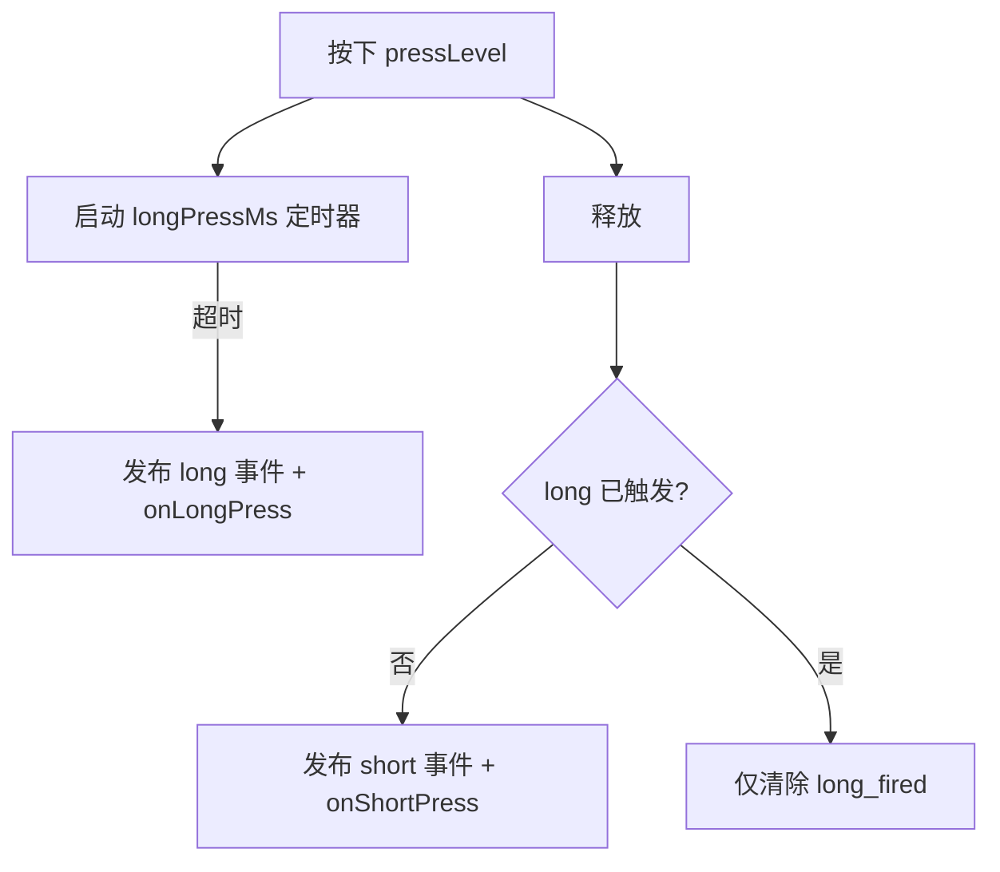
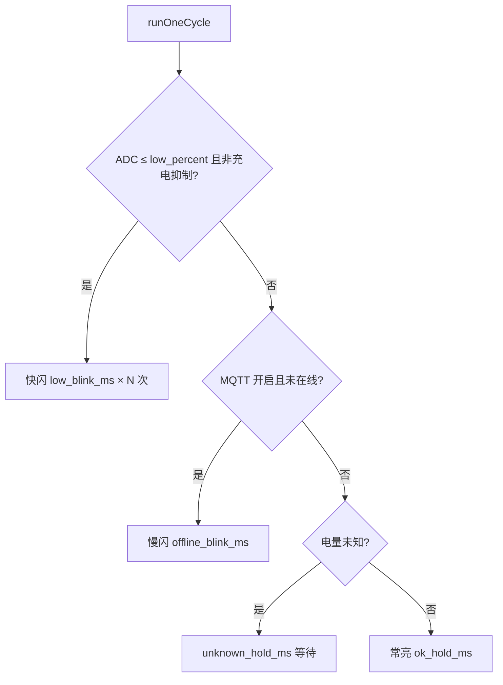

# peripheral / led_ctrl 按键与指示灯

> **代码真源**：[`user/peripheral.lua`](../../user/peripheral.lua) · [`user/led_ctrl.lua`](../../user/led_ctrl.lua) · [`user/key_config.lua`](../../user/key_config.lua)  
> **配置**：`KEY_CONFIG` · `LED_CFG`（[`config.lua`](../../user/config.lua)）  
> **用户说明**：[LED_INDICATORS.md](../LED_INDICATORS.md) · [KEY_GPIO.md](../KEY_GPIO.md)  
> **事件订阅**：[APP_EVENT_BUS.md](APP_EVENT_BUS.md)

---

## 1. 模块分工

| 模块 | 职责 |
|------|------|
| **`key_config`** | 定义 PWR/BOOT/ready 引脚与 `APP_EVENTS` 事件名 |
| **`peripheral`** | 聚合入口：`led_ctrl` + 按键 GPIO + `pir_ctrl.startHw` |
| **`led_ctrl`** | GPIO21 蓝灯状态机；可选 GPIO 红灯（烧录失败等） |

`app.setupGpio` → `peripheral.start({ pwrkeyPin, bootkeyPin, readyPin, ledBluePin, ... })`。

---

## 2. 按键逻辑（`setupLongPressKey`）

| 键 | 默认长按 | 事件（`APP_EVENTS`） | app 订阅行为 |
|----|----------|----------------------|--------------|
| PWR | 3000ms | `GPIO_PWRKEY_SHORT` / `GPIO_PWRKEY_LONG` | 长按关机（USB 宽限期内忽略） |
| BOOT | 2000ms | `GPIO_BOOTKEY_SHORT` / `GPIO_BOOTKEY_LONG` | 长按进入 T3x 烧录模式 |

**防误触**：PWR 默认 `requireReleaseFirst=true`，上电若仍按住则先等释放再计时长按。

**取消长按**：`peripheral.cancelLongPress("pwr")` — USB 插入后 app 可取消进行中的 PWR 长按定时器。

### 2.1 coproc_ready（`setupReadySignal`）

T3x 烧录完成拉高 ready 引脚 → `GPIO_COPROC_READY` → app 退出烧录、恢复 PIR/MQTT。

---

## 3. 蓝灯状态机（`led_ctrl.runOneCycle`）

每轮循环读取 `runtimeSnapshot()`：`battery_percent`、`online_status`、USB/充电态。

| pattern | 条件 | 用户感知 |
|---------|------|----------|
| `low` | ≤`low_percent`（默认 20%）且未充电抑制 | 快闪 ~0.4s |
| `offline` | MQTT 启用且 `online_status≠1` | 慢闪 ~1s |
| `ok` / `charging_ok` | 正常或充电中已联网 | 常亮 |
| `unknown` | 尚无有效 ADC | 等待 |

**充电抑制**：`suppress_low_when_charging=true` 时，USB 插入且 `isCharging()==1` 不因低电快闪（详见 [LED_INDICATORS.md](../LED_INDICATORS.md)）。

### 3.1 开机序列

`LED_CFG.startup`：默认闪 2 次（400ms 亮/灭），再进入主循环。

### 3.2 事件刷新

订阅 `MQTT_CONNECTED`、`MQTT_OFFLINE`、`BATTERY_UPDATE`、`GPIO_USB_DET_CHANGED`、`GPIO_CHG_STATE_CHANGED`，状态变化时 `lastPattern=""` 加速切换灯态。

### 3.3 红灯（可选）

`GPIO_OUT.led_red` 启用时：`peripheral.runLedPattern("blink_red")` — 烧录前置条件失败等场景。

---

## 4. peripheral 对外 API

| 函数 | 说明 |
|------|------|
| `start(cfg)` | 启动 LED + 按键（单次）+ `pir_ctrl.startHw` |
| `cancelLongPress(name)` | 取消 `pwr` / `boot` 长按定时器 |
| `setLed(red, blue)` / `turnOffLed()` | 委托 `led_ctrl` |
| `runLedPattern(pattern)` | `blink_red` / `blink_blue` |
| `getState()` | LED + 按键 + PIR 快照 |

---

## 5. 与 T3x 网络灯（可选）

`LED_CFG.notify_t3x_net_led`：MQTT 联网态变化时经 `host_uart` 发 `+CAT1:MQTT,%d` 驱动 T3x PB17，与 GPIO21 蓝灯独立。

---

## 6. 配置要点

| 配置项 | 位置 | 说明 |
|--------|------|------|
| `KEY_CONFIG.*.longPressMs` | `key_config.lua` | 长短按阈值 |
| `LED_CFG.low_percent` | `config.lua` | 与电量三档 20% 对齐 |
| `LED_CFG.suppress_low_when_charging` | `config.lua` | 充电中不报低电快闪 |
| `BATTERY_CFG.led.*` | `config.lua` | 旧版电量灯参数（`led_ctrl` 部分沿用 `medium_threshold`） |
