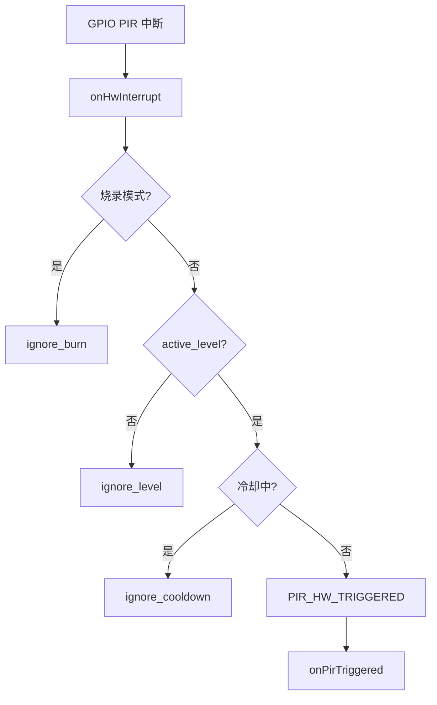
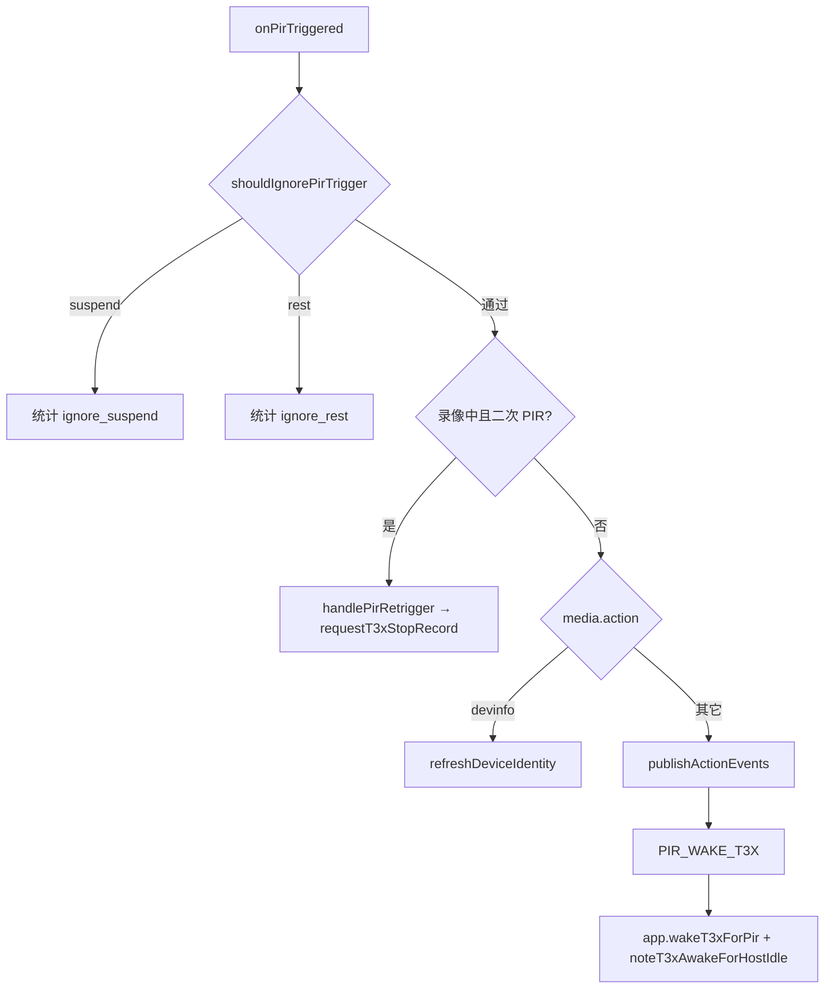

# pir_ctrl PIR 侦测与录像会话

> **代码真源**：[`user/pir_ctrl.lua`](../../user/pir_ctrl.lua) · [`user/app.lua`](../../user/app.lua)（事件桥）  
> **协议**：[PIR_PROTOCOL.md](../PIR_PROTOCOL.md) · [T3X_RECORD_MQTT_FLOW.md](../T3X_RECORD_MQTT_FLOW.md)

---

## 1. 模块职责

| 层级 | 职责 |
|------|------|
| **硬件** | GPIO 中断、冷却、`PIR_HW_TRIGGERED` |
| **业务** | 录像会话、策略、云端启停、PIRSTAT 统计 |
| **桥接** | 发布 `PIR_WAKE_T3X` / `PIR_STOP_RECORDING` → `app` → MQTT / T3x |

---

## 2. 硬件路径

配置：`PIR_CFG`（引脚、冷却 `cooldown_ms`、`high_priority`）。

---

## 3. 业务路径（`onPirTriggered`）

### 3.1 忽略条件（`shouldIgnorePirTrigger`）

| 返回值 | 条件 | 行为 |
|--------|------|------|
| `suspend` | `battery_guard.suspendPir` 或烧录挂起 | 不唤醒 |
| `rest` | `low_power_mode=1` 且非动态侦测 rest | 不唤醒 |
| `nil` | 正常 / 动态 rest 允许 / 高优先级 PIR 请求退出 rest | 继续业务 |

---

## 4. 录像会话（`session`）

| 字段 | 说明 |
|------|------|
| `recording` | 4G 侧会话是否在录 |
| `uploadMode` / `quality` | auto/manual · high/low |
| `startedAt` | 会话开始时间 |
| `timerId` | `maxDurationSec` 超时定时器 |
| `last_stop_reason` | timer / device / cloud / manual / pir_retrigger |

**开始**：`beginVideoSession`（video/both 动作）  
**结束**：`endRecordingSession` → 可选 `PIR_STOP_RECORDING`  
**T3x 侧停止**：`syncStopFromT3x`（`AT+RECORD=0` 上报时）

---

## 5. 策略（`pirRecordPolicy`）

| 字段 | 默认 | 说明 |
|------|------|------|
| `maxDurationSec` | 60 | 超时自动停录 |
| `stopOnSecondPir` | true | 录像中再次 PIR → retrigger 停录 |
| `stopOnCloud` | true | MQTT 2011 可停录 |
| `startOnCloud` | true | MQTT 2012 可启录 |

持久化：`/pir_mqtt_cfg.json`（`APP_PERSIST_CFG.pir_mqtt`）。

---

## 6. 云端接口

| MQTT | pir_ctrl API | 说明 |
|------|--------------|------|
| 2010 配置/查询 | `setMediaConfig` / `getMediaConfig` | action/upload/quality |
| 2011 停录 | `requestStopFromCloud` | `stopOnCloud` 门禁 |
| 2012 启录 | `requestStartFromCloud` | `startOnCloud` 门禁 |

---

## 7. app 事件桥（`buildPirMqttHandlers`）

| 事件 | app 动作 |
|------|----------|
| `PIR_WAKE_T3X` | `onPirMediaAction` → `wakeT3xForPir` |
| `PIR_STOP_RECORDING` | `onPirStopRecording` → MQTT 1011 / T3x 停录 |
| `PIR_REQUEST_T3X_STOP` | `wakeT3xForPir("pir_stop_*")` |
| `PIR_TIMER_EXPIRED` | `publishStopRecording(timer)` |
| `GPIO_PIR_TRIGGERED` | `publishPirToMqtt`（1010） |

---

## 8. AT 对外（`buildAtBody` → `+PIRSTAT:`）

宽表字段：硬件统计 `cnt_*`、会话 `recording`、`has_work` 合成（经 `host_uart` / `host_event`）。

运维清零：`AT+PIRCLR` → `resetCounters`（与 `HOSTEVTCLR` 不同）。

---

## 9. 与电量 / rest 的交互

| 电量档 | PIR 行为 |
|--------|----------|
| >20% | 正常 |
| 5~20% | 正常；唤醒后 30s 内 T31 拒 HOSTIDLE |
| ≤5% | `suspendPir` → 忽略触发 |
| 4G rest（≤5% 或 hybrid ≤10%） | 动态 rest 允许；否则高优先级可 `POWER_EXIT_REST` |

---

**版本**：2026-06-30
