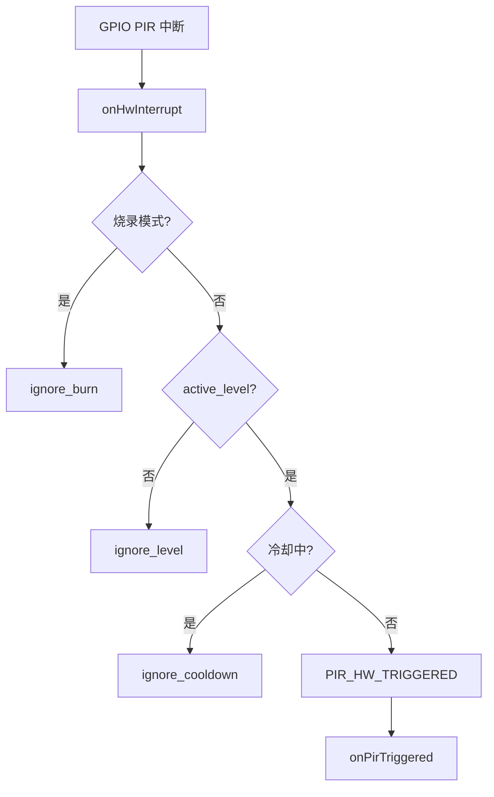
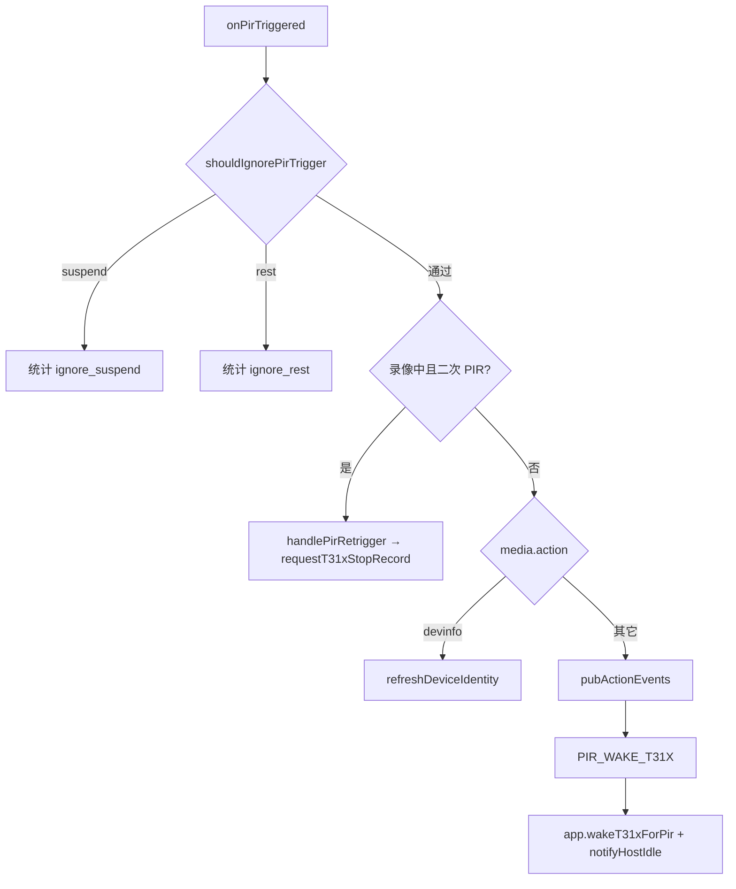

# pir_ctrl PIR 侦测与录像会话

> **代码真源**：[`user/pir_ctrl.lua`](../../user/pir_ctrl.lua) · [`user/pir_app_bridge.lua`](../../user/pir_app_bridge.lua)（PIR→MQTT/T31x 桥，app 经 `bind` 注入 net/t31x）  
> **协议**：[PIR_PROTOCOL.md](../pir/PIR_PROTOCOL.md) · [T31X_RECORD_MQTT_FLOW.md](../pir/T31X_RECORD_MQTT_FLOW.md)

---

## 1. 模块职责

| 层级 | 职责 |
|------|------|
| **硬件** | GPIO 中断、冷却、`PIR_HW_TRIGGERED` |
| **业务** | 录像会话、策略、云端启停、PIRSTAT 统计 |
| **桥接** | 发布 `PIR_WAKE_T31X` / `PIR_STOP_RECORDING` → `app` → MQTT / T31x |

---

## 2. 硬件路径

```mermaid
flowchart TD
    IRQ[GPIO PIR 中断] --> HW[onHwInterrupt]
    HW --> BURN{烧录模式?}
    BURN -->|是| IGN1[ignore_burn]
    BURN -->|否| LVL{active_level?}
    LVL -->|否| IGN2[ignore_level]
    LVL -->|是| CD{冷却中?}
    CD -->|是| IGN3[ignore_cooldown]
    CD -->|否| PUB[PIR_HW_TRIGGERED]
    PUB --> BIZ[onPirTriggered]
```

配置：`PIR_CFG`（引脚、冷却 `cooldown_ms`、`high_priority`）。

---

## 3. 业务路径（`onPirTriggered`）

```mermaid
flowchart TD
    T[onPirTriggered] --> IGN{shouldIgnorePirTrigger}
    IGN -->|suspend| END1[统计 ignore_suspend]
    IGN -->|rest| END2[统计 ignore_rest]
    IGN -->|通过| RET{录像中且二次 PIR?}
    RET -->|是| STOP[handlePirRetrigger → requestT31xStopRecord]
    RET -->|否| ACT{media.action}
    ACT -->|devinfo| DEV[refreshDeviceIdentity]
    ACT -->|其它| PUB[pubActionEvents]
    PUB --> WAKE[PIR_WAKE_T31X]
    WAKE --> APP[app.wakeT31xForPir + notifyHostIdle]
```

### 3.1 忽略条件（`shouldIgnorePirTrigger`）

| 返回值 | 条件 | 行为 |
|--------|------|------|
| `suspend` | `battery_guard.suspendPir` 或烧录挂起 | 不唤醒 |
| `rest` | `low_power_mode=1` 且非动态侦测 rest | 不唤醒 |
| `nil` | 正常 / 动态 rest 允许 / 高优先级 PIR 请求退出 rest | 继续业务 |

---

## 4. 录像会话（`session`）

| 字段 | 说明 |
|------|------|
| `recording` | 4G 侧会话是否在录 |
| `uploadMode` / `quality` | auto/manual · high/low |
| `startedAt` | 会话开始时间 |
| `timerId` | `maxDurationSec` 超时定时器 |
| `last_stop_reason` | timer / device / cloud / manual / pir_retrigger |

**开始**：`beginVideoSession`（video/both 动作）  
**结束**：`endRecordingSession` → 可选 `PIR_STOP_RECORDING`  
**T31x 侧停止**：`syncStopFromT31x`（`AT+RECORD=0` 上报时）

---

## 5. 策略（`pirRecordPolicy`）

| 字段 | 默认 | 说明 |
|------|------|------|
| `maxDurationSec` | 60 | 超时自动停录 |
| `stopOnSecondPir` | true | 录像中再次 PIR → retrigger 停录 |
| `stopOnCloud` | true | MQTT 2011 可停录 |
| `startOnCloud` | true | MQTT 2012 可启录 |

持久化：`/pir_mqtt_cfg.json`（`APP_PERSIST_CFG.pir_mqtt`）。

---

## 6. 云端接口

| MQTT | pir_ctrl API | 说明 |
|------|--------------|------|
| 2010 配置/查询 | `setMediaConfig` / `getMediaConfig` | action/upload/quality |
| 2011 停录 | `requestStopFromCloud` | `stopOnCloud` 门禁 |
| 2012 启录 | `requestStartFromCloud` | `startOnCloud` 门禁 |

---

## 7. app 事件桥（`buildPirMqttHandlers`）

| 事件 | app 动作 |
|------|----------|
| `PIR_WAKE_T31X` | `onPirMediaAction` → `wakeT31xForPir` |
| `PIR_STOP_RECORDING` | `onPirStopRecording` → MQTT 1011 / T31x 停录 |
| `PIR_REQUEST_T31X_STOP` | `wakeT31xForPir("pir_stop_*")` |
| `PIR_TIMER_EXPIRED` | `publishStopRecording(timer)` |
| `GPIO_PIR_TRIGGERED` | `publishPirToMqtt`（1010） |

---

## 8. AT 对外（`getStatSnapshot` → `hif_cmd_pir.buildPirStatBody` → `+PIRSTAT:`）

2026-09-05（架构 H 条）起 `pir_ctrl` 只导出数据快照 `getStatSnapshot()`（布尔/数值/计数表），`+PIRSTAT:` 的 `k=v,k=v` 文本由 AT 层 `hif_cmd_pir.buildPirStatBody` 拼装（经 `bizCall("pirStatSnapshot")` 取数）；线上字段顺序与 `buildStatBody` 时代逐字一致。

宽表字段：硬件统计 `cnt_*`、会话 `recording`、`has_work` 合成（经 `host_uart` / `host_event`）。

运维清零：`AT+PIRCLR` → `resetCounters`（与 `HOSTEVTCLR` 不同）。

---

## 9. 与电量 / rest 的交互

| 电量档 | PIR 行为 |
|--------|----------|
| >20% | 正常 |
| 5~20% | 正常；唤醒后 30s 内 T31 拒 HOSTIDLE |
| ≤5% | `suspendPir` → 忽略触发 |
| 4G rest（≤5% 或 hybrid ≤10%） | 动态 rest 允许；否则高优先级可 `POWER_EXIT_REST` |

---

**版本**：2026-06-30

## 10. 录像态真源与唯一写点（refactor_plan P6b，VERSION 158，2026-09-05）

「T31x 是否在录」有三份表示，P6b 起写入路径唯一：

| 表示 | 位置 | 谁写 |
|---|---|---|
| `state.t31x_rec_active`（影子态，0/1） | `host_uart` state | **只有** `hif_rx_dsl.commitIpcStat` raw 写（以 `cloud.recordingt31x` 回填） |
| `state.host_ipc_cloud_stat.recordingt31x`（云状态 9 键之一，进 1003） | 同上 | `commitIpcStat`（完整 `+IPCSTAT:` 快照）或 `hif_ipc.setRecActive(flag)` → `patchCloud({recordingt31x})` |
| `pir_ctrl.session.recording`（4G 侧会话） | `pir_ctrl` | `pir_ctrl` 自己（`startVideoSession`/`endRecSession`） |

**业务侧一律调 `setRecActive(flag)`**（161 起经 `patchCloud(fields, keepTs=true)`：单键业务补丁**不刷新** `ipc_cloud_stat_ts`，1003 前 `isIpcCloudStatStale` 仍按上次完整 `+IPCSTAT:` 快照计时，不会因录像态翻转而跳过 `AT+IPCSTAT?` 刷新——评审 #3）（`hif_ipc` 定义；子模块经 `C.setRecActive`，外部经 `host_uart.setRecActive`）：`hif_cmd_t31x.uartRecord`（T31x `AT+RECORD=1/0`）、`hif_ipc_power.applyPowerOffSuccess`、`hif_ipc_cloud.reconcileRecord`、`hif_rx_dsl.applyRecordState`（`+RECORD:` 应答）、`mqtt_dl_pir.stopHostRecord`（2011/2010 云停成功）。`_protocol_regression_check` 单一写入点断言：`state.t31x_rec_active =` 只允许 `hif_rx_dsl`/`host_uart` 初值；`patchCloud({recordingt31x…})` 只允许 `hif_ipc`。

**顺带修复的 P0**：`mqtt_dl_pir.stopHostRecord` 成功路径原调 `hif.patchCloud(...)`，而 `host_uart._M` 从未导出 `patchCloud`（只在 ctx 上）→ 每次 2011 成功停录都会 `attempt to call a nil value`，后续 `publishForcedPirStop`（1011 `force=true`）不发。158 起改 `hif.setRecActive(0)`（已导出）。
