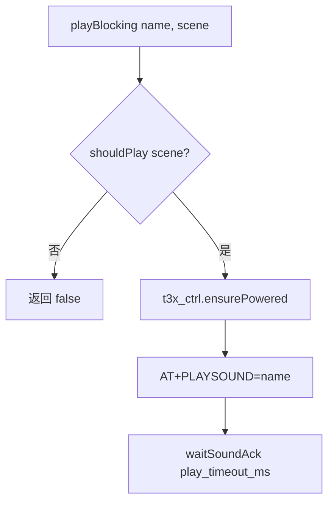

# sound_prompt T3x 语音提示

> **代码真源**：[`user/sound_prompt.lua`](../../user/sound_prompt.lua)  
> **配置**：`SOUND_CFG`（[`config.lua`](../../user/config.lua)）  
> **UART**：`AT+PLAYSOUND={name}` · 应答 `+SOUNDACK` → `onSoundAck`  
> **关联**：[TIME_SYNC_FLOW.md](TIME_SYNC_FLOW.md)（同类 T3x 上电 + UART 命令模式）

---

## 1. 模块职责

经 UART 让 T3x 播放预置音效（`boot` / `shutdown` 等），用于冷启动、用户关机、低电关机等场景。

`MODULE_FLAGS.sound_prompt=false` 或 `SOUND_CFG.enabled=false` 时不播放。

---

## 2. 播放流程（`playBlocking`）



1. `shouldPlay(scene)` — 按场景开关与烧录模式门禁  
2. `t3x_ctrl.ensurePowered("sound_prompt")`  
3. `uart_bridge.sendString("AT+PLAYSOUND=" .. name)`  
4. `host_uart` 解析 `+SOUNDACK` → `onSoundAck` → `SOUND_PROMPT_ACK`

---

## 3. 场景开关（`shouldPlay`）

| scene | 配置键 | 默认 | 调用方 |
|-------|--------|------|--------|
| `boot_cold` | `boot_on_cold_start` | 开 | `onAppStarted` |
| `boot_wake` | `boot_on_wake` | 关 | `onWakeFromLowPower` |
| `shutdown_user` | `shutdown_on_user_off` | 开 | `playShutdownThen("user")` |
| `shutdown_low_power` | `shutdown_on_low_power` | 关 | `app.onEnterLowPower` 提示音 |
| `shutdown_battery` | `shutdown_on_battery_off` | 关 | 低电关机 |

烧录模式（`T3X_BURN_MODE_ACTIVE`）下全部跳过。

---

## 4. 冷启动开机音（`onAppStarted`）

```text
等待 T3x 就绪：
  t3x_ctrl.powerOnWaitReady（HOST_IPC_CFG.boot_sound_wait_ready）
  或 sys.waitUntil(HOST_UART_FIRST_AT, boot_wait_host_ms)
→ playBlocking("boot", "boot_cold")
```

`coldBootPlayed` 保证冷启动只播一次；`bootColdTaskStarted` 防重复 task。

---

## 5. 关机音（`playShutdownThen`）

`app.onPowerOff` 等路径：`playBlocking("shutdown", scene)` 完成后执行 `callback()`（实际 `pm.shutdown`）。

与 `time_sync` 类似，播放前需 T3x 上电；低电/ rest 场景由 `battery_guard` / `t3x_policy` 决定是否允许上电。

---

## 6. 配置（`SOUND_CFG` 摘要）

| 键 | 说明 |
|----|------|
| `enabled` | 总开关 |
| `boot_wait_host_ms` | 等 T3x/首条 AT 超时（默认 120s） |
| `play_timeout_ms` | 等 SOUNDACK 超时（默认 2500ms） |
| `t3x_power_wait_ms` | `ensurePowered` 等待 |
| `boot_on_cold_start` 等 | 各场景布尔开关 |

---

## 7. 对外 API

| 函数 | 说明 |
|------|------|
| `start(opts)` | 可选注入 `t3x` 模块引用 |
| `shouldPlay(scene)` | 场景是否应播放 |
| `playBlocking(name, scene)` | 同步等待播放完成 |
| `onSoundAck(name)` | host_uart 回调 |
| `onAppStarted` | app 启动后冷启动音 |
| `onWakeFromLowPower` | 退出 rest 唤醒音 |
| `playShutdownThen(reason, cb)` | 关机音 + 回调 |
