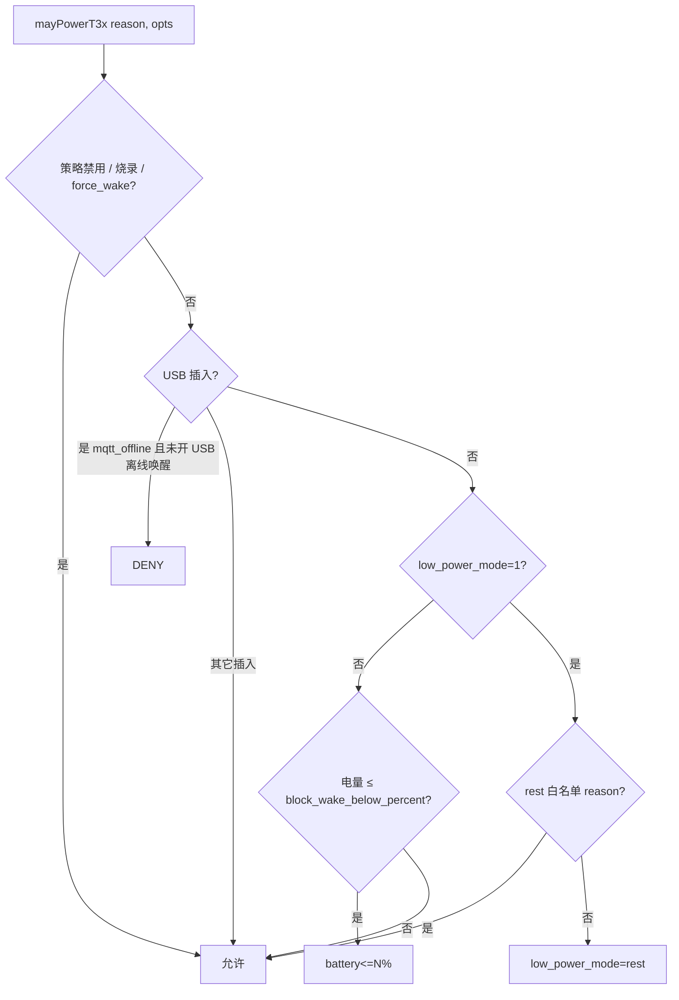

# t3x_policy T3x 唤醒门禁

> **代码真源**：[`lib/t3x_policy.lua`](../../lib/t3x_policy.lua)  
> **配置**：`T3X_POLICY_CFG`（[`config.lua`](../../user/config.lua)）  
> **硬件与休眠**：[T3X_POWER_WAKEUP.md](T3X_POWER_WAKEUP.md) · **对时**：[TIME_SYNC_FLOW.md](TIME_SYNC_FLOW.md)

---

## 1. 模块职责

集中判断 **T31 是否允许上电/脉冲唤醒**，并在通过后分发到 `time_sync` → `host_uart.notify_host` 或 GPIO fallback。

| 入口 | 函数 |
|------|------|
| `app.requestT3xWake` | `requestT3xWake` |
| `t3x_ctrl.bootPowerOn` | `bootPowerOn` |
| `app.onMqttOffline` | `shouldWakeOnMqttOffline` |
| `time_sync.pushBeforeNotify` | `mayPowerT3x("time_sync_notify")` |

`MODULE_FLAGS.t3x_policy=false` 或 `T3X_POLICY_CFG.enabled=false` 时门禁恒通过。

---

## 2. mayPowerT3x 决策树



### 2.1 快速放行

| 条件 | 说明 |
|------|------|
| `policyDisabled()` | 策略关闭 |
| `isBurnActive()` | T3x 烧录模式 |
| `opts.force_wake` | PIR 高优先级等 |
| `passesUsbGate(reason)` | USB 插入（`mqtt_offline` 需 `allow_mqtt_offline_wake_when_usb`） |

### 2.2 rest 白名单（`allowsWakeInRest`）

| reason 模式 | 配置 |
|-------------|------|
| `wled` | `allow_wled_wake_in_rest`（默认 true） |
| `notify_host` / `pir_media` / `exit_low_power` / `pir_stop*` | `allow_pir_wake_in_rest` |
| 同上 + `battery_dynamic_rest` | `allow_pir_wake_in_battery_rest` |

### 2.3 电量门禁

`block_wake_below_percent` 默认读 `T3X_POLICY_CFG`（当前 **5%**），回退 `BATTERY_CFG.guard.pir_suspend_percent`。

拒绝时 `getDenyReason()` 如 `battery<=5%`。

---

## 3. requestT3xWake 分发

```text
mayPowerT3x 通过
  → MODULE_FLAGS.t3x_wakeup + t3x_app?
      是 → time_sync.pushBeforeNotifyAsync(sid, evt)  【优先】
      否 → host_uart.notify_host
      均失败 → t3x_ctrl.wake()（GPIO29 脉冲，taskInit）
  → mqtt_offline 时记录 lastMqttOfflineWakeSec
```

与 [APP_EVENT_BUS.md](APP_EVENT_BUS.md) 一致：`onExitLowPower` **不再**单独 `time_sync.onT3xWake`。

---

## 4. MQTT 离线唤醒（`shouldWakeOnMqttOffline`）

默认 **`block_mqtt_offline_wake=true`**：rest 下直接拒绝（`mqtt_offline+rest`）。

非 rest 时额外检查：

| 检查 | 配置 |
|------|------|
| 冷却 | `mqtt_offline_wake_cooldown_sec`（默认 120s） |
| USB | `block_mqtt_offline_wake_when_usb`（默认 true） |
| 综合 | 最终仍走 `mayPowerT3x("mqtt_offline")` |

---

## 5. 配置（`T3X_POLICY_CFG` 摘要）

| 键 | 默认 | 说明 |
|----|------|------|
| `enabled` | 随 `LOW_POWER_CFG` | 总开关 |
| `block_wake_in_low_power` | true | rest 下非白名单拒绝 |
| `allow_pir_wake_in_rest` | true | PIR 类 reason 可唤醒 |
| `allow_pir_wake_in_battery_rest` | true | 动态电量 rest 允许 PIR |
| `allow_wled_wake_in_rest` | true | 白光灯唤醒 |
| `block_wake_below_percent` | 5 | ≤5% 拒绝（5~20% 中间档允许 PIR） |
| `block_mqtt_offline_wake` | true | rest 下不因 MQTT 断线唤醒 |
| `block_mqtt_offline_wake_when_usb` | true | USB 插入时不离线唤醒 |

---

## 6. 对外 API

| 函数 | 说明 |
|------|------|
| `mayPowerT3x(reason, opts)` | 门禁判定 |
| `requestT3xWake(reason, sid, evt, opts)` | 门禁 + 分发唤醒 |
| `bootPowerOn(t3xModule)` | 冷启动 `powerOn` 门禁 |
| `shouldWakeOnMqttOffline()` | MQTT 断线是否唤醒 |
| `getDenyReason()` | 最近拒绝原因（调试） |
| `isUsbInserted` / `getBatteryPercent` / `isLowPowerMode` | 运行时快照 |

---

## 7. 与 host_event 的边界

| 模块 | 职责 |
|------|------|
| **t3x_policy** | 是否**允许**发起唤醒（上电/notify） |
| **host_event** | T3x **休眠前**是否有未消费业务（见 [HOST_EVENT_PENDING.md](HOST_EVENT_PENDING.md)） |

两者独立：`mayPowerT3x` 通过仍可能被 `t3x_ctrl.shouldBlockSleep`（host_event）推迟 `enterSleep`。
