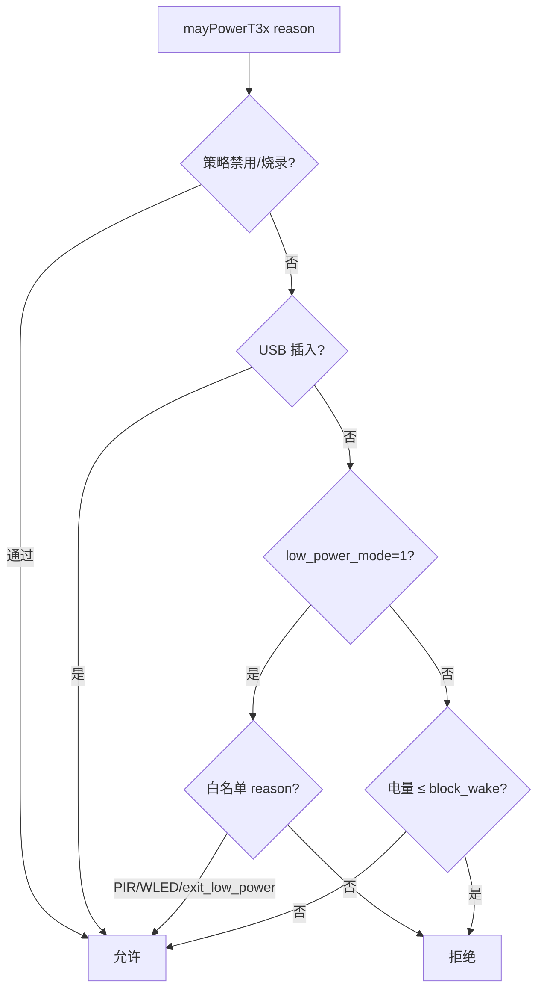

# T3x 供电与唤醒

> **代码真源**：[`user/t3x_ctrl.lua`](../../user/t3x_ctrl.lua) · [`lib/t3x_policy.lua`](../../lib/t3x_policy.lua) · [`user/app.lua`](../../user/app.lua)  
> **策略详述**：[T3X_POLICY_GATE.md](T3X_POLICY_GATE.md) · **待处理业务**：[HOST_EVENT_PENDING.md](HOST_EVENT_PENDING.md)  
> **关联**：[T3X_HOSTEVT_SLEEP.md](../T3X_HOSTEVT_SLEEP.md) · [BOOT_SHUTDOWN_SOUND.md](../BOOT_SHUTDOWN_SOUND.md)

---

## 1. 硬件抽象

| GPIO | 作用 |
|------|------|
| GPIO22 | T31 主电源（`powerOn` / `powerOff`） |
| GPIO29 | MCU INT 唤醒脉冲（`pulseMcuInt`） |
| GPIO26/32 | BOOT / OTA 模式 |

状态：`isPoweredOn` · `power_state`（on/off/sleeping）· `sleep_in_progress`

---

## 2. 唤醒门禁（`t3x_policy.mayPowerT3x`）



白名单 reason：`notify_host` · `pir_media` · `exit_low_power` · `pir_stop*` · `wled` 等。

配置：`T3X_POLICY_CFG.block_wake_below_percent=5`

---

## 3. 唤醒分发（`requestT3xWake`）

```
mayPowerT3x 通过
  → time_sync.pushBeforeNotifyAsync（默认：对时 + notify_host）
  → host_uart.notify_host
       → powerOn（若未上电）
       → pulseMcuInt
  → 失败时 fallbackGpioWake（t3x_ctrl.wake）
```

**注意**：`onExitLowPower` 只调 `requestT3xWake`，不再重复 `onT3xWake`。

---

## 4. 休眠（`t3x_ctrl.enterSleep`）

| 阶段 | 行为 |
|------|------|
| 门禁 | `shouldBlockSleep`（host_event pending） |
| 标记 | `power_state=sleeping` · `sleep_in_progress=true` |
| 关机 | `gracefulPowerOff` → `AT+IPCPOWEROFF` 或直断 GPIO22 |
| 结束 | `sleep_in_progress=false` |

唤醒前：`powerOn` / `wake` / `ensurePowered` 调用 `waitSleepIdle(20s)`，避免与 graceful 关机竞态。

### 4.1 休眠来源

| reason | 调用方 |
|--------|--------|
| `host_idle` | `host_uart.uart_hostidle`（5~20% 电量档） |
| battery rest | `app.onEnterLowPower` → `enterSleep` |
| AT | `AT+LOWPOWER=ENTER` |

---

## 5. 启动上电

```
t3x_ctrl.start()
  → t3x_policy.bootPowerOn
  → mayPowerT3x("boot")
  → powerOn（GPIO22 高）
```

冷启动 + USB 已插：`battery_guard.onUsbInserted({source="boot"})` **跳过** `wake_t3x`，避免双路上电。

---

## 6. 常见唤醒源

| 来源 | reason | 路径 |
|------|--------|------|
| PIR 录像 | `pir_media` | app → requestT3xWake |
| 退出 rest | `exit_low_power` | onExitLowPower |
| USB 插入（非 boot） | `battery_usb` | wake_t3x hook |
| MQTT 下行排队 | pendingHostQueue drain | net_mqtt |
| MQTT 离线（可选） | `mqtt_offline` | 冷却 + 门禁 |
| 云端白光灯 | `wled` | 2004 → setWled |

---

## 7. 调试

- `t3x_policy.getDenyReason()` — 最近一次拒绝原因  
- `t3x_ctrl.getState()` — `powered_on` · `sleep_in_progress` · `last_action`

---

**版本**：2026-06-30
