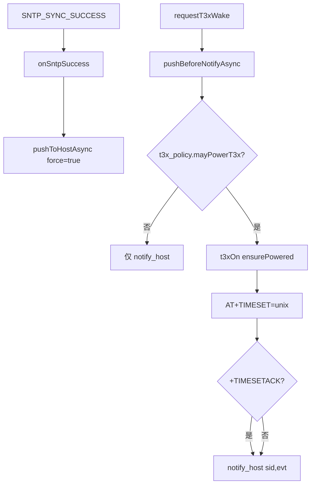

# time_sync Cat.1 → T3x 对时

> **代码真源**：[`user/time_sync.lua`](../../user/time_sync.lua)  
> **配置**：`TIME_SYNC_CFG`（[`config.lua`](../../user/config.lua)）  
> **UART**：`AT+TIMESET` · 应答 `+TIMESETACK` → `onTimesetAck`  
> **唤醒链**：[T3X_POWER_WAKEUP.md](T3X_POWER_WAKEUP.md) · [APP_EVENT_BUS.md](APP_EVENT_BUS.md)

---

## 1. 模块职责

| 路径 | 行为 |
|------|------|
| **SNTP** | Cat.1 对公网 NTP → `os.time()` 有效后推 T3x |
| **唤醒前对时** | `pushBeforeNotify`：先 `AT+TIMESET` 再 `notify_host` |
| **唤醒后对时** | `onT3xWake`（可选，`sync_on_wake`） |

`MODULE_FLAGS.time_sync=false` 或 `TIME_SYNC_CFG.enabled=false` 时全模块短路。

---

## 2. 主流程

---

## 3. `pushToHost(force)`

1. `isTimeValid(t)` — 默认 `t ≥ min_valid_unix`（2024-01-01）
2. 非 `force` 时：`resync_skew_sec`（默认 2s）内跳过重复推送
3. `t3x_ctrl.ensurePowered("time_sync")`
4. `host_boot_wait_ms`（默认 1500ms）等待 T3x 就绪
5. `uart_bridge.sendString("AT+TIMESET=" .. t)`
6. `waitTimesetAck(ack_timeout_ms)` — 监听内部事件 `TIME_SYNC_ACK`
7. 成功则更新 `lastPushedUnix`

`host_uart` 解析 `+TIMESETACK` 后调用 `time_sync.onTimesetAck()` → `sys.publish(TIME_SYNC_ACK)`。

---

## 4. `pushBeforeNotify(sid, evt)`

唤醒 T3x 前的**统一入口**（`t3x_policy.requestT3xWake` 与 `app.requestT3xWake` 均经此路径）：

| 条件 | 行为 |
|------|------|
| `t3x_policy` 拒绝 `time_sync_notify` | 直接返回，不 notify |
| `sync_before_wake=false` | 仅 `notify_host` |
| 时间有效且 `t3xOn()` 成功 | `pushToHost(false)` 后对时 |
| 最后 | `host_uart.notify_host(sid, evt)` |

**注意**：`app.onExitLowPower` **不再**单独调 `time_sync.onT3xWake`，避免与 `requestT3xWake` 重复脉冲。

---

## 5. SNTP 后台任务（`startSntp`）

| 参数 | 默认 | 说明 |
|------|------|------|
| `ok_wait` | 3600000ms | 成功后 1h 再同步 |
| `fail_wait` | 10000ms | 失败后重试间隔 |
| `timeout` | 30000ms | 单次 NTP 超时 |
| `servers` | 阿里云/腾讯/cn.pool | 依次尝试 |

流程：`sntpWaitIp` → `socket.sntp` → `NTP_UPDATE` → 发布 `SNTP_SYNC_SUCCESS` → `onSntpSuccess` → `pushToHostAsync(true)`。

`app.startBackgroundServices` 在 `MODULE_FLAGS.sntp` 时调用 `time_sync.startSntp()`。

---

## 6. 配置（`TIME_SYNC_CFG`）

| 键 | 默认 | 说明 |
|----|------|------|
| `enabled` | true | 总开关 |
| `min_valid_unix` | 1704067200 | 有效时间下限 |
| `sync_on_sntp` | true | SNTP 成功后推 T3x |
| `sync_on_wake` | true | `onT3xWake` 路径 |
| `sync_before_wake` | true | 唤醒前 `pushBeforeNotify` 对时 |
| `host_boot_wait_ms` | 1500 | 发 AT 前等待 |
| `t3x_power_wait_ms` | 800 | `ensurePowered` 等待 |
| `ack_timeout_ms` | 800 | TIMESET 应答超时 |
| `resync_skew_sec` | 2 | 去重窗口 |

---

## 7. 与 IPC 告警

`time_sync_fail` / `time_invalid`：`ipc_alert_contract` 映射 1011；`ipc_supervision` 补丁 `timeSynced=0`（见 [IPC_SUPERVISION_FLOW.md](IPC_SUPERVISION_FLOW.md)）。

---

## 8. 对外 API

| 函数 | 说明 |
|------|------|
| `start(opts)` | 订阅 `SNTP_SYNC_SUCCESS` |
| `startSntp(cfg)` | 启动 SNTP 循环任务 |
| `pushToHost` / `pushToHostAsync` | 主动对时 |
| `pushBeforeNotify` / `pushBeforeNotifyAsync` | 唤醒前对时 + notify |
| `onTimesetAck` | host_uart 回调 |
| `isTimeValid` / `getCat1Unix` | 时间校验与读取 |
