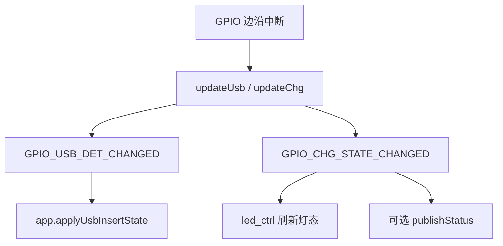

# usb_charge / usb_policy 充电与 USB 策略

> **代码真源**：[`lib/usb_charge.lua`](../../lib/usb_charge.lua) · [`lib/usb_policy.lua`](../../lib/usb_policy.lua)  
> **配置**：`GPIO_IN.usb_det` / `chg_state` · `HOST_USB_CFG`（[`config.lua`](../../user/config.lua)）  
> **用户说明**：[CHARGE_BATTERY.md](../CHARGE_BATTERY.md) · [LED_INDICATORS.md](../LED_INDICATORS.md)  
> **编排**：[APP_EVENT_BUS.md](APP_EVENT_BUS.md) · [BATTERY_GUARD_TIERS.md](BATTERY_GUARD_TIERS.md)

---

## 1. 模块分工

| 模块 | 职责 |
|------|------|
| **`usb_charge`** | GPIO27 `USB_DET` + GPIO17 `CHG_STATE` 中断采样；发布插入/充电事件 |
| **`usb_policy`** | 读 `HOST_USB_CFG`，在 USB 插入时门禁 HOSTIDLE / 4G rest |

`MODULE_FLAGS.charge=false` 时不启动 `usb_charge`；`app` 可退化为 PMD `VBUS` 或 `gpio.VBUS` 轮询。

---

## 2. 硬件引脚

| 信号 | GPIO | 有效电平 | 含义 |
|------|------|----------|------|
| `USB_DET` | 27 | **低** = 插入 | USB 座物理插入 |
| `CHG_STATE` | 17 | **高** = 充电中 | 充电板 STAT（CHG_RED 亮） |

**有效充电态**（`effectiveCharging`）：须 **USB 已插入** 且 `CHG_STATE` 有效，避免 GPIO17 悬空误报。

---

## 3. usb_charge 事件流



### 3.1 USB 插入副作用

- 发布 `GPIO_USB_DET_CHANGED(1)`
- **取消 PWR 长按**：`peripheral.cancelLongPress("pwr")`（防座子/线缆误触关机）
- 刷新充电态并发布 `GPIO_CHG_STATE_CHANGED`

### 3.2 对外 API

| 函数 | 说明 |
|------|------|
| `start()` | 注册 USB_DET / CHG_STATE 中断（单次） |
| `isUsbInserted()` | GPIO27 是否插入 |
| `isCharging()` | 未插入返回 `0`；插入且 CHG 有效返回 `1` |
| `getState()` | `usb_inserted`、`charging`、`mode=irq` |

---

## 4. app 侧 USB 编排（`applyUsbInsertState`）

| 边沿 | 行为 |
|------|------|
| **插入** | `APP_RUNTIME.power_status=1` · `battery_guard.onUsbInserted` · 退出 rest · `notifyT3xUsbHostIdlePolicy(true)` · 取消 PWR 长按 |
| **拔出** | `power_status=0` · `notifyT3xUsbHostIdlePolicy(false)` · `battery_guard.onUsbRemoved`（按电量重评估，高电量不进 rest） |

冷启动 `source=="boot"`：由 `bootPowerOn` 负责 T31 上电，避免与 `exitRest` 重复唤醒（见 [BATTERY_GUARD_TIERS.md](BATTERY_GUARD_TIERS.md)）。

**PMD 回退**：`MODULE_FLAGS.charge` 关闭时，`handlePmdMessage` 用模组充电消息驱动 `applyUsbInsertState`。

---

## 5. usb_policy 策略门禁

读 `HOST_USB_CFG`，仅在 **USB 插入** 且对应开关非 `false` 时生效：

| 函数 | 配置键 | 默认 | 消费者 |
|------|--------|------|--------|
| `blocksHostIdle()` | `block_host_idle_when_usb` | true | `host_uart` HOSTIDLE / LOWPOWER ENTER |
| `blocks4gRest()` | `block_4g_rest_when_usb` | true | `app.onEnterLowPower`、`net_mqtt` 2002 enter |
| `mayEnterRest()` | 上项取反 | — | 辅助判断 |
| `isUsbInserted()` | — | 委托 `usb_charge` 或 `power_status` | `t3x_policy`、`host_uart` |

```text
USB 插入 + block_4g_rest_when_usb
  → app.onEnterLowPower 直接 return
  → MQTT 2002 enter rest 被拒绝
  → battery_guard 跳过低电关机评估（ignore_when_usb_inserted）
```

### 5.1 T3x 串口通知

`HOST_USB_CFG.notify_t3x_usb_state`：`host_uart.push_usb_host_idle_state` 发 `+CAT1:USB,%d`，告知 T3x USB 期间勿 HOSTIDLE（见 [T3X_POWER_WAKEUP.md](T3X_POWER_WAKEUP.md)）。

### 5.2 其它 HOST_USB_CFG

| 键 | 说明 |
|----|------|
| `pwrkey_grace_ms` | USB 插入后忽略 PWR 长按（默认 5000ms） |
| `allow_t3x_usb_reset` | 是否允许 `AT+USBRESET` |
| `block_usb_reset_when_t3x_rest` | T3x rest 时拒绝 USB 复位 |
| `boot_notify_delay_ms` | 冷启动 USB 状态通知延时 |

---

## 6. 与电量 / 灯态的边界

| 维度 | usb_charge | battery_guard | led_ctrl |
|------|------------|---------------|----------|
| 插 USB 低电 | 检测插入 | 暂停关机/rest 评估 | 充电中抑制低电快闪 |
| 数据源 | GPIO27/17 | ADC + USB 标志 | ADC + MQTT + CHG |

保护策略与灯态可不一致（保护更严、灯更友好）。
