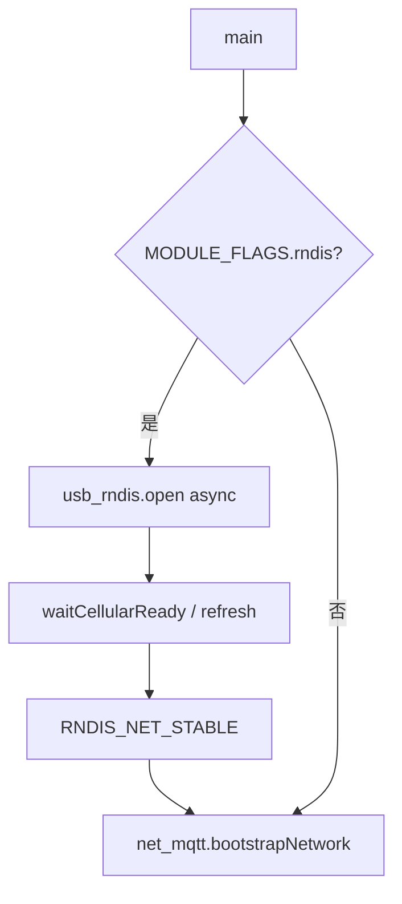

# usb_rndis USB 网卡（RNDIS）

> **代码真源**：[`lib/usb_rndis.lua`](../../lib/usb_rndis.lua)  
> **配置**：`RNDIS_CFG` · `MODULE_FLAGS.rndis`（[`config.lua`](../../user/config.lua) / [`app_config.lua`](../../user/app_config.lua)）  
> **启动**：[`user/main.lua`](../../user/main.lua)  
> **关联**：[USB_CHARGE_POLICY.md](USB_CHARGE_POLICY.md)（USB 插入检测）

---

## 1. 模块职责

将 Air780 配置为 **USB RNDIS 网卡**（`CONF_USB_ETHERNET=3`），供 PC 通过 USB 共享蜂窝网络。

默认 **`MODULE_FLAGS.rndis=false`**，门球量产固件通常不启用；调试/产测场景可打开。

---

## 2. 启动流程（main.lua）

`open()` 内：`flymode` 切换 → `mobile.config(CONF_USB_ETHERNET, 3)` → 等蜂窝 IP → 可选 **refresh**（关开 RNDIS 以稳定枚举）。

---

## 3. 核心操作

| 函数 | 行为 |
|------|------|
| `open()` / `enable()` | 开启 RNDIS + `finishBootOpen` |
| `disable()` / `stop()` | `CONF_USB_ETHERNET=0` + 退出 flymode |
| `switch(opts)` | 关 → 停 → 开（`off_ms` / `on_wait_ms`） |
| `rebind(opts)` | 快速关开重绑 |
| `enableAsync` | taskInit 包装 open/enable |

内部：`rndisOpenCore` / `rndisCloseCore` 均经 **flymode 包裹** 修改 USB 以太网模式，并 `pm.power(pm.USB, true)`。

---

## 4. refresh 逻辑

`refreshAfterCellularIp()`：蜂窝已有 IP 后，关 RNDIS → 等 500ms → 再开，促使 USB 侧重新获取地址。

触发条件（`refreshAllowed`）：

| 条件 | 说明 |
|------|------|
| `RNDIS_CFG.refresh_on_ip` | 非 false |
| `refresh_only_usb` | 默认 true：须 USB 主机插入 |
| 未在 `refreshing` / 未 `ipReadyRefreshed` | 去重 |

`RNDIS_CFG.refresh_on_ip_ready=true` 时订阅每次 `IP_READY`（**易 IP 振荡，仅调试**）。

事件：`RNDIS_REFRESH_BEGIN` / `RNDIS_REFRESH_END` · `RNDIS_NET_STABLE`。

---

## 5. 与低功耗 / 烧录

| 场景 | 行为 |
|------|------|
| T3x 烧录 | `app.shutdownServicesForT3xBurn` → `usbRndis.disable()` |
| 拔 USB 进 rest | `enterRestIfNeededAfterUsbRemove`：**RNDIS 仍开则跳过** 自动进 rest |
| 充电检测 | `usbHostPresent()` 读 `APP_RUNTIME.usb_inserted` 或 `usb_policy` |

---

## 6. 配置（`RNDIS_CFG`）

| 键 | 默认 | 说明 |
|----|------|------|
| `refresh_only_usb` | true | 仅 USB 插入时 refresh |
| `refresh_on_ip_ready` | false | 每个 IP_READY 再 refresh（调试用） |

---

## 7. 状态 API

| 函数 | 说明 |
|------|------|
| `isEnabled()` / `isStarted()` | RNDIS 模式 / 任务是否启动 |
| `isBootStable()` / `waitForNetStable(ms)` | 引导完成门禁 |
| `isRefreshing()` | 是否 refresh 中 |
| `getStatus()` | mode、ip、csq、flymode、last_error 等 |

全局别名：`_G.usbRndis = module`。
