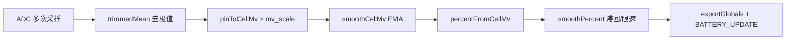

# vbat 电量采样与滤波

> **代码真源**：[`user/vbat.lua`](../../user/vbat.lua) · 配置 [`user/config.lua`](../../user/config.lua) `BATTERY_CFG`  
> **下游**：[BATTERY_GUARD_TIERS.md](BATTERY_GUARD_TIERS.md)（`BATTERY_UPDATE` → `evaluate`）

---

## 1. 模块职责

| 项 | 说明 |
|----|------|
| **输入** | ADC 引脚毫伏（分压后） |
| **输出** | `APP_RUNTIME.battery_percent` / `battery_mv` / `battery_consumption_rate` |
| **事件** | `sys.publish("BATTERY_UPDATE", pct, mv, rate)` |
| **周期** | `sample_interval_ms`（默认 10s） |

`MODULE_FLAGS.battery=false` 时不启动；`battery_guard` 可独立存在并依赖外部注入电量。

---

## 2. 采样链路



### 2.1 引脚 → 电芯毫伏

`resolveMvScale()`：

- 优先 `adc.mv_scale`
- 否则 `divider`：`scale = (r_kohm + rx_kohm) / rx_kohm`
- 再乘 `mv_calibration`（实测校准，默认约 `3812/3608`）

默认分压：1000kΩ / 510kΩ，与 `config.lua` 注释一致。

### 2.2 百分比分段

`percentFromCellMv`：线性映射 `v_min_mv`（3000）~ `v_max_mv`（4200）→ 1~100。

---

## 3. 滤波参数（`BATTERY_CFG.filter`）

| 参数 | 默认 | 作用 |
|------|------|------|
| `sample_count` | 11 | 每次读 ADC 次数 |
| `sample_spacing_ms` | 20 | 采样间隔 |
| `trim_drop` | 2 | 排序后首尾各丢弃个数（trimmed mean） |
| `ema_alpha` | 0.35 | 电芯 mV 指数平滑 |
| `mv_max_step` | 35 | 单次 mV 最大变化（防跳变） |
| `percent_hyst_high_mv` | 4120 | 100% 滞回：低于此值才允许从 100% 回落 |
| `percent_max_step` | 2 | 单次百分比最大变化 |

`BUILD_TAG = "v4-filter"` 用于日志区分固件代数。

---

## 4. smoothCellMv（EMA + 限速）

```text
target = raw × alpha + filtered × (1-alpha)
若 |target - filtered| > mv_max_step → 钳制为 ±mv_max_step
```

首样本直接采纳，无历史时 `filteredMv = rawCellMv`。

---

## 5. smoothPercent（满电滞回 + 限速）

| 场景 | 行为 |
|------|------|
| 当前 stable=100 | 仅当 `cellMv < percent_hyst_high_mv` 才重算，否则保持 100 |
| `rawPct≥100` 且 `cellMv≥v_max` | 钳为 100 |
| 其它 | 对 `stablePercent` 做 `percent_max_step` 限速 |

避免 4200mV 阈值附近百分比来回抖动；与 `battery_guard` 三档阈值（20% / 5%）配合时，稳定采样尤为重要。

---

## 6. 耗电速率

`updateConsumptionRate`：相邻两次有效采样间 `(lastPercent - current) / hours`，仅统计**下降**（放电），保留一位小数。

---

## 7. 对外 API

| 函数 | 说明 |
|------|------|
| `start()` | 启动 `batteryTask`（单次） |
| `getVoltage()` / `getPercent()` / `getConsumptionRate()` | 当前缓存 |
| `getState()` | 含 `filtered_mv`、`stable_percent`、配置快照（调试） |

---

## 8. 与 battery_guard 的边界

| 模块 | 职责 |
|------|------|
| **vbat** | 物理采样 + 滤波 → 数值 |
| **battery_guard** | 三档策略、rest/HOSTIDLE、PIR 挂起、关机、USB 例外 |

`battery_guard.require_valid_sample`：无效采样（0% 等）时可跳过 `evaluate`，避免误触发低电。
