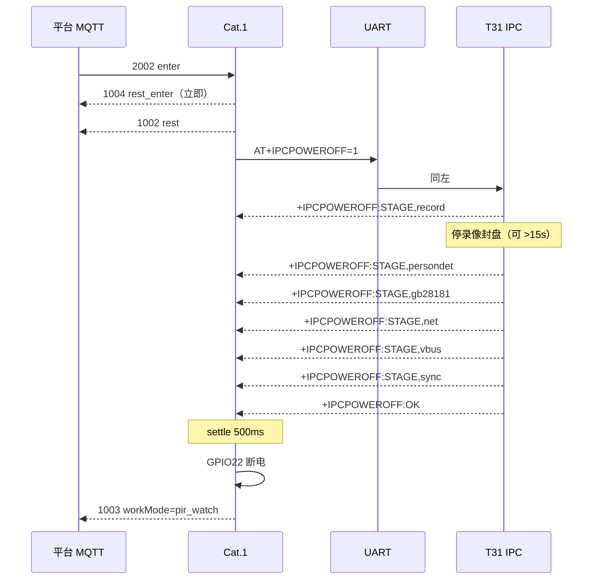

# 2002 进低功耗：先停 IPC，再断 T31 供电

> **样机 IMEI**：`862323084068124`  
> **原则**：平台 `2002 enter` **禁止立刻拉 GPIO22**。必须先经 UART 让 T31 IPC **一级级停干净**（封盘 / 人形 / 国标 / 网卡 / sync），收到 `+IPCPOWEROFF:OK` 后再断电。  
> **之后**：`workMode=pir_watch`，Cat.1 用 PIR 值守；T31 在电时 PIR 业务丢弃。  
> **代码**：Cat.1 `user/net_mqtt.lua` · `user/app.lua` · `user/t31x_ctrl.lua` · `user/host_uart.lua`  
> T31 `app/host/host_at.c`（`ipc_power_off_request` / `ipc_stop_services`）  
> **关联**：[WORK_MODE_PERSON_DETECT_PIR.md](../power/WORK_MODE_PERSON_DETECT_PIR.md) · [MQTT_DOWNLINK.md](MQTT_DOWNLINK.md#4-2002--低功耗--1002) · [UART_AT_COMMANDS.md](UART_AT_COMMANDS.md) · [T31X_LOW_POWER.md](../power/T31X_LOW_POWER.md)

白光灯、开停录与本流程 **无关**。USB 不拦 2002（仍拦 **2004 关机**）。USB **插入边沿**会退出值守、回到人形常电。

---

## 1. 时序总览

```text
平台 MQTT
  │  Publish  /panshi/device/{IMEI}/
  │  {"dataType":"2002","lowPowerMode":"enter","messageId":"..."}
  ▼
Cat.1 net_mqtt.dispatchDl2002
  │  立刻 1004 rest_enter（reply=1, ret=0）  ← 平台不必干等封盘
  │  POWER_ENTER_REST
  ▼
app.onEnterLowPower("mqtt_2002")
  │  workMode = pir_watch
  │  lowPowerMode = rest
  │  1002 rest（reason=mqtt_2002）
  ▼
t31x_ctrl.enterSleep（协程内，skip_pending_work：全天写盘不得否决）
  │
  ▼
host_uart.hostIpcPowerOff
  │  UART →  AT+IPCPOWEROFF=1   （=0 不播关机音）
  ▼
T31 ipc_power_off_thread
  │  ① STAGE,record     停录像 / 封盘（media_sched_record_stop）
  │  ② STAGE,persondet  结束人形会话
  │  ③ STAGE,gb28181    gb28181_dev_exit
  │  ④ STAGE,net        net_link_manager_deinit
  │  ⑤ STAGE,vbus       VBUS_EN 拉低
  │  ⑥ STAGE,sync       sync()
  │  ⑦ +IPCPOWEROFF:OK  ← 到这里才允许断电
  ▼
Cat.1 收到 OK（或最多等 poweroff_timeout_ms=30s）
  │  再 settle 500ms
  ▼
GPIO22 = 0   T31 掉电
  │
  ▼
1003  status：lowPowerMode=rest，workMode=pir_watch，ipcReady=0
PIR GPIO 此后才走业务（T31 在电时 ignore t31_on）
```



**禁止**：未发 `AT+IPCPOWEROFF`、或未等到 `OK`/超时，就把 GPIO22 拉低。

---

## 2. MQTT

### 2.1 下行

主题：`/panshi/device/862323084068124/`

```json
{"dataType":"2002","lowPowerMode":"enter","messageId":"rest-1"}
```

同义：`{"dataType":"2002","action":1}`。串口：`AT+LOWPOWER=ENTER`（`reason=at`，同一套停 IPC 再断电）。

退出值守（唤醒 T31，回到人形常电）：

```json
{"dataType":"2002","lowPowerMode":"exit","messageId":"wake-1"}
```

### 2.2 上行（enter）

| 顺序 | dataType | 主题后缀 | 何时 | 要点 |
|------|----------|----------|------|------|
| 1 | **1004** | `event` | **立刻** | `action=rest_enter` `ret=0` `message=ok` |
| 2 | **1002** | `rest` | 切入 rest 后 | `lowPowerMode=enter` `reason=mqtt_2002` `source=enter` |
| 3 | **1003** | `status` | IPC 停完、断电后 | `lowPowerMode=rest` **`workMode=pir_watch`** `ipcReady=0` |

1004 成功 **不等于** T31 已断电。是否掉电看随后的 **1003**：`workMode=pir_watch` 且 `ipcReady=0`。

上位机「手动测试」项：`2002enter`（超时建议 ≥40s，给封盘留时间）。

---

## 3. UART（Cat.1 → T31）

方向：Cat.1 UART1 → T31。日志：T31 `/tmp/ipc/cat1_uart.log`。

| 方向 | 行 | 含义 |
|------|----|------|
| 4G→T31 | `AT+IPCPOWEROFF=1` | 播 `power_off` 后分级停 |
| 4G→T31 | `AT+IPCPOWEROFF=0` | 不播音，其余相同 |
| T31→4G | `+IPCPOWEROFF:STAGE,record` | 正在停录像 |
| T31→4G | `+IPCPOWEROFF:STAGE,persondet` | 正在结束人形会话 |
| T31→4G | `+IPCPOWEROFF:STAGE,gb28181` | 正在退国标 |
| T31→4G | `+IPCPOWEROFF:STAGE,net` | 正在拆 4G 网卡 |
| T31→4G | `+IPCPOWEROFF:STAGE,vbus` | 正在关 VBUS |
| T31→4G | `+IPCPOWEROFF:STAGE,sync` | 正在 `sync()` |
| T31→4G | `+IPCPOWEROFF:OK` | **全部停完**，允许断电 |
| T31→4G | `+IPCPOWEROFF:BUSY` | 已有关机线程在跑 |
| T31→4G | `+IPCPOWEROFF:NOT_SUPPORTED` | 未编 `WITH_T31X_LOW_POWER` |

STAGE 只表示进度，**不能**当成可以断电。唯有 `OK`（或 Cat.1 侧超时兜底）之后才拉 GPIO。

停录像期间 T31 可能另发 `AT+RECORD=0,reason=poweroff`，Cat.1 按原录像协议处理，与灯控无关。

---

## 4. 两边代码

### 4.1 Cat.1

| 步骤 | 文件 | 行为 |
|------|------|------|
| 解析 2002 | `user/net_mqtt.lua` `dispatchDl2002` | 立刻 1004；USB **不** `usb_block` |
| 切模式 | `user/app.lua` `doEnterLowPowerBody` | `pir_watch` + rest；协程里 `enterSleep` |
| 休眠入口 | `user/t31x_ctrl.lua` `enterSleep` / `gracefulPowerOff` | **先** `hostIpcPowerOff`，**再** `powerOff()` |
| 发 AT / 等 ACK | `user/host_uart.lua` `hostIpcPowerOff` | 等 `+IPCPOWEROFF:OK`；STAGE 只续等 |
| 超时 | `HOST_IPC_CFG.poweroff_timeout_ms` | 默认 **30000**（封盘可 >15s） |
| 断电前静置 | `HOST_IPC_CFG.poweroff_settle_ms` | 默认 **500** |
| PIR | `user/pir_ctrl.lua` | T31 仍在电 → `ignore t31_on`；值守且已断电才唤醒 |

`gracefulPowerOff` **不再**用 `AT+IPCSTATUS?==ready` 作为是否发关机 AT 的门槛（查询失败曾经导致直接断电）。

超时仍未收到 OK：记日志 `ipc_poweroff_done timeout`，然后兜底断电，避免 T31 卡死导致永远不进值守。

### 4.2 T31

| 步骤 | 位置 | 行为 |
|------|------|------|
| 入口 | `host_at.c` `at_cmd_ipcpoweroff` | `AT+IPCPOWEROFF` / `=0` / `=1` |
| 线程 | `ipc_power_off_request` → `ipc_power_off_thread` | 可选播 `power_off` |
| 分级停 | `ipc_stop_services` | 见 §3 STAGE 顺序 |
| 录像 | `cloud_remote_record_stop("poweroff")` | 走 `media_sched` 封盘，再清残留通道 |
| 完成 | `+IPCPOWEROFF:OK` | 日志：`Host module may cut T31x power` |

编译：`WITH_T31X_LOW_POWER=yes`（`build/config.global.mk` 默认 yes）。为 no 时回 `NOT_SUPPORTED`，Cat.1 超时后仍会兜底断电。

---

## 5. 进值守之后（PIR）

T31 掉电后：

1. Cat.1 保持 MQTT（`modem_hibernate=false`）。
2. PIR GPIO 触发 → 唤醒 T31 → 限时录 / 人形确认。
3. 录完或 `HOSTIDLE=1` → 再次走本文件的 `AT+IPCPOWEROFF` → 断电，回到值守。
4. `2002 exit` 或 USB **插入边沿** → `person_detect`，T31 常电，PIR 再静音。

---

## 6. 怎么确认成功

| 检查 | 期望 |
|------|------|
| 1004 | `action=rest_enter` `ret=0`（立刻） |
| T31 `cat1_uart.log` | `AT+IPCPOWEROFF` → 若干 `STAGE,*` → `+IPCPOWEROFF:OK` |
| Cat.1 日志 | `ipc_poweroff_begin` → `ipc_poweroff_done ack` → `power off` |
| 1003 | `lowPowerMode=rest` `workMode=pir_watch` `ipcReady=0` |
| 硬件 | T31 掉电（人形停、全天写盘停） |
| 再 PIR | 应唤醒 T31；此前 T31 在电时 PIR 不应出 1010 `detected` |

失败对照：

| 现象 | 原因 |
|------|------|
| 1004 有、T31 还在跑、无 IPCPOWEROFF | Cat.1 未刷到本流程，或 UART 不通 |
| 有 STAGE,record 后突然掉电 | 旧 Cat.1 把首包 STAGE 当成完成（须用新 `host_uart`） |
| 等 30s 才掉电且无 OK | T31 封盘卡住 / 未编 LOW_POWER；属超时兜底 |
| 1003 仍是 `person_detect` 且 `ipcReady=1` | 没真正进值守 |

刷机：Cat.1 脚本 / OTA；T31 需重编 `host_at.c` 后烧 IPC。只更新 Cat.1 时，旧 T31 仍会在停完后给 `+IPCPOWEROFF:OK`（无 STAGE），Cat.1 仍等 OK 再断电。
