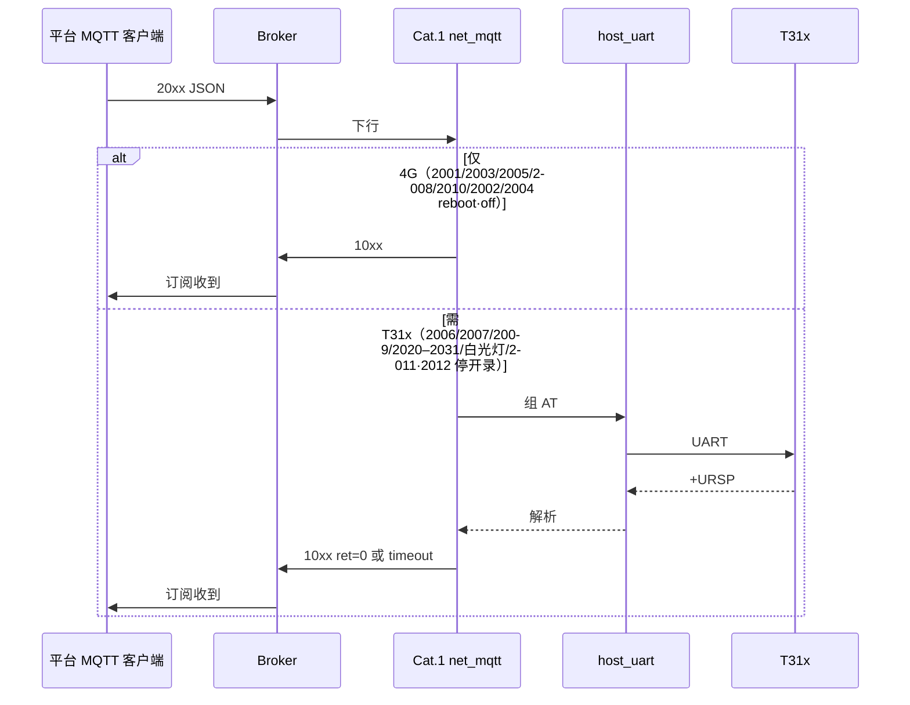

# MQTT 全指令流程与实机测试

> **日期**：2026-08-17  
> **样机**：Air780EHM + T31x，IMEI **`862323084068124`**  
> **现网脚本**：`001.000.008`（1008.`scriptVersion`）· `firmwareVersion=2044.001.008`  
> **协议**：[`MQTT_PROTOCOL.md`](MQTT_PROTOCOL.md) · **命令表**：[`../tools/gui/mqtt/commands.json`](../../tools/gui/mqtt/commands.json)  
> **联调入口**：[`MQTT_CLIENT_E2E_TEST.md`](MQTT_CLIENT_E2E_TEST.md)

---

## 1. 链路

平台客户端下发全部 `20xx`，Cat.1 分发后，**不需要 T31x 的立刻回 10xx**；**需要 T31x 的走 UART AT**，再把结果封成 10xx 上行。

```text
平台 MQTT 客户端  (ClientId = platform-test-xxx，禁止填 IMEI)
        │  Publish  /panshi/device/{IMEI}/
        ▼
     Broker  112.86.146.218:2123
        │  设备订阅 /panshi/device/{IMEI}/#
        ▼
  Cat.1 net_mqtt.lua  DOWNLINK_HANDLERS[dataType]
        │
        ├─ 仅 Cat.1 ──► 立刻 Publish /panshi/app/{IMEI}/…
        │
        └─ 需 T31x ──► host_uart.lua ── UART AT ──► T31x
                              │                         │
                              ◄──── +VENC / +TFCARD / OK ◄┘
                              │
                              ▼
                     Publish 10xx 到 Broker
```



| 角色 | ClientId | 发布 | 订阅 |
|------|----------|------|------|
| Cat.1 | IMEI | `/panshi/app/{IMEI}/…` | `/panshi/device/{IMEI}/#` |
| 平台测试 | `platform-test-*`（勿用 IMEI） | `/panshi/device/{IMEI}/` | `/panshi/app/{IMEI}/#` |

---

## 2. 怎么跑

先停录，再按 `commands.json` 的 safe → extra → danger 全发（danger 里 **重启放最后**）。USB 插着时 rest/关机走拦截，不会把模组弄死。

```bat
python tools/gui/mqtt/mqtt_tools_client.py --run-all
```

单条：

```bat
python tools/gui/mqtt/mqtt_tools_client.py --send 2008
python tools/gui/mqtt/mqtt_tools_client.py --run-safe
python tools/gui/mqtt/mqtt_tools_client.py --run-extra
python tools/gui/mqtt/mqtt_tools_client.py --danger-all
```

**未纳入全量自动**：`2004 action=ota`（会走 FOTA，不是 Cat.1↔T31x UART 联调）。

测 T31x `ret=0` 时请挡住 PIR / 离开镜头。录像中 AT 仍会回 10xx，但常见 `ret=-1 timeout`。

录像文件在 TF 卡：`/mnt/sdcard/media/vi0/YYYYMMDD/ch0_开始_结束.mp4`（正在写为 `.ts.part`）。这是 **T31x 写盘**，和 Cat.1 的 PIR 会话不是同一层：

| 层 | 谁维护 | 平台怎么看 |
|----|--------|------------|
| T31x 全天写盘（`record_mode=1`） | IPC `record_*`，开机就写卡 | 1003/1010 的 **`recordingT31x`**；2011 会发 `AT+RECORDCTRL=0`，`message=t31x_stopped` |
| Cat.1 PIR/2012 会话 | `pir_ctrl.session.recording` | 1010 **`recording`**；2011 回 `ok` 并带 1011 |

旧逻辑只看 PIR 会话，全天正在写卡时 2011 会误报 `not_recording`（001.000.008 已改：先查 `AT+IPCSTAT?` / `AT+RECORD?`）。

---

## 3. 判定

| 现象 | 含义 |
|------|------|
| 超时内收到期望 `dataType` 且 `ret=0`（或无 ret） | 流程通过 |
| 收到 10xx 但 `ret=-1 timeout/query_fail` | **MQTT 与 Cat.1 正常**；T31x UART 忙或未应答 |
| `1004 usb_block` | USB 插入，按设计不进 rest / 不关机 |
| 2001/2003/2005/2008 完全无上行 | Broker / IMEI / ClientId 互踢，属失败 |
| 连跑后半段全部 TIMEOUT | 前面 T31x 长等待拖死 MQTT 回调；等设备 `1001` 后再测 |

---

## 4. 指令对照与实机结果

样机 USB 充电、`ipcReady` 多数为 1；PIR 频繁 `detected/retrigger` 时 T31x 查询/设置会失败。空闲窗口里同一条可以 `ret=0`。

### 4.1 仅 Cat.1（不经过 T31x UART）

| 下行 | 上行 | 流程 | 实机 |
|------|------|------|------|
| 2001 | 1001 wakeup | MQTT 探活（不上电） | **通过** |
| 2003 | 1003 status | 状态（USB/电量/`ipcReady`） | **通过** `ret=0` |
| 2003 `interval=30` | 1003 | 改上报间隔 | **通过** |
| 2005 | 1005 sim | SIM/CSQ | **通过** |
| 2008 | 1008 version | 脚本/底层版本 | **通过** `001.000.008` |
| 2010 `query` | 1010 pir | PIR 策略查询 | **通过** |
| 2010 配置 video/auto | 1004 `pir_cfg` + 1010 | 先应答再异步写盘 | **通过** `pir_cfg ret=0` |
| 2002 `exit` | 1004 `rest_exit` | T31 上电、退出低功耗 | **通过** `ret=0` |
| 2002 `enter` | 1004 `rest_enter` | 先停 IPC 再断 T31，`workMode=pir_watch` | 先 1004，随后 1002；USB 不拦 |
| 2004 `off` | 1004 `off` | USB 插入拦截 | **通过** `ret=-1 usb_block`（未关机） |
| 2004 `reboot` | 1004 `reboot` | 先 1004，约 0.8s 后 `pm.reboot` | **通过**；复位后版本仍为 `001.000.007` |

拔掉 USB 后再发 2002 enter / 2004 off 才会真正休眠或关机。

### 4.2 Cat.1 → UART → T31x

| 下行 | 上行 | UART（Cat.1→T31x） | 实机 |
|------|------|-------------------|------|
| 2006 | 1006 identity | `AT+GBID?` 一类 | **通过** `ret=0`，`gb28181Id` 有值 |
| 2007 | 1007 tfcard | `AT+TFCARD?` | 忙时 `ret=-1`；空闲 **通过** `tfPresent=1` |
| 2004 `wled_query` | 1004 `wled` | `AT+WLED?`（未就绪可用缓存） | **通过** `enable=0` |
| 2004 `wled` `enable=0/1` | 1004 `wled` | `AT+WLED=n` | 先 1004，再异步转发；录像中 UART 吵也不再卡 `wled_forward_fail` |
| 2009 format `reboot=0` | 1009 tfcard_format | `AT+TFFORMAT=1,reboot=0` | **通过** `ret=0`（约 3s，TF ~117GB） |
| 2011 | 1004 `pir_stop` → 1011 | `AT+RECORDCTRL=0,…` | PIR 会话在录：`ret=0 ok`；仅 T31x 全天写盘：`ret=0 t31x_stopped`；两边都未写：`ret=-1 not_recording` |
| 2012 | 1004 `pir_start` → 1012 | `AT+RECORDCTRL=1,…` | **通过** `ret=0`（空闲时） |
| 2020 | 1020 encode | `AT+VENC?` | 忙：`timeout`；空闲可 `ret=0` |
| 2021 | 1021 encode | `AT+VENCSET=…` | 忙：`timeout`（应答仍会回来，偏晚） |
| 2022 | 1022 record | `AT+RECORDTIME?` | 忙：`query_fail` |
| 2023 | 1023 record | `AT+RECORDTIME=` | 忙：`timeout` |
| 2024 | 1024 framerate | `AT+FRAMERATE?` | 忙：`query_fail` |
| 2025 | 1025 framerate | `AT+FRAMERATE=` | **空闲通过** `ret=0 runtimeApply=1` |
| 2026 | 1026 personDetect | `AT+PERSONDET?` | 忙：`query_fail` |
| 2027 `enable=1` | 1027 personDetect | `AT+PERSONDET=` | **空闲通过** `ret=0` |
| 2028 | 1028 mic | `AT+MIC?` | 忙：`query_fail` |
| 2029 | 1029 mic | `AT+MICSET=` | **空闲通过** `ret=0` |
| 2030 | 1030 softPhoto | `AT+SOFTPHOTO?` | 忙：`query_fail` |
| 2031 | 1031 softPhoto | `AT+SOFTPHOTOSET=` | 忙：超时无 1031 或 `timeout` |

---

## 5. 异常与代码侧处理（已烧进 001.000.007）

| 问题 | 处理 |
|------|------|
| 2010 配置写盘堵 MQTT，平台等不到 1010/1004 | 先回 `1004 pir_cfg`，写盘放到 `sys.taskInit` |
| 2002 enter 无即时 1004 | USB 拦：`usb_block`；允许进 rest：先 `1004 rest_enter` |
| USB 调试时 2004 off 真关机，后续无法烧录 | USB 插入回 `usb_block`，不 `pm.shutdown` |
| 2004 reboot 应答未发出就复位 | 先 1004，延迟 0.8s 再重启 |
| 2009 在 T31x 未就绪时丢掉、或空等 120s | 始终异步执行；8s 内无 `TFFORMAT:STARTED` 即回 1009 |
| T31x 上报忙时编码查询被当成 timeout | UART 先等安静再发 AT；设置超时重试一次 |

---

## 6. 建议测试顺序

1. 2008 确认版本。  
2. 2011 停录，等 1003 `recordingT31x=0` 且尽量 `usbRecovery=idle`。  
3. 安全查询：2001/2003/2005/2006/2007/2008/2010q。  
4. T31x 查询：2020/2022/2024/2026/2028/2030、白光灯查询。  
5. T31x 设置：2021/2023/2025/2027/2029/2031。  
6. 2012 开录 → 2011 停录。  
7. USB 在位：2002 enter、2004 off（期望 `usb_block`）。  
8. 2009 格式化（会清卡）。  
9. 最后 2004 reboot；等 `1001` 后再 2008。

挡住 PIR 后再跑第 4–5 步，T31x `ret=0` 才有意义。
