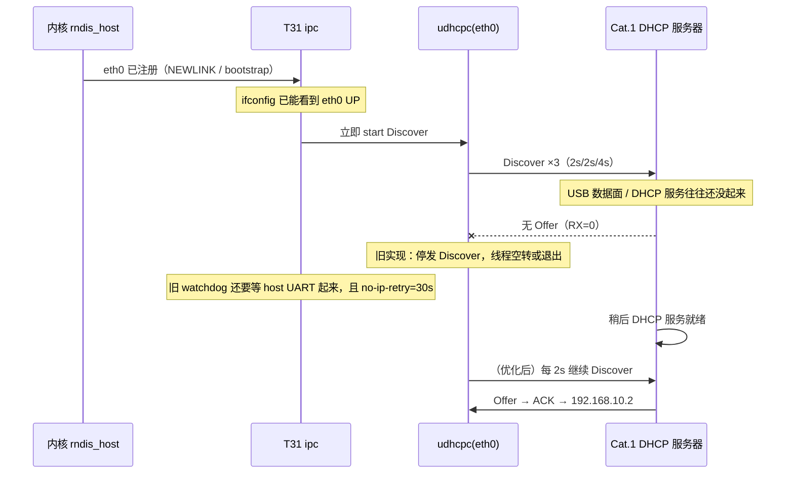

# T31x 重启后 eth0 已出现、IPv4 来得慢

> 场景：门球 **T31 + Cat.1 USB RNDIS**（工程 `WITH_CAT1=yes`，`WITH_ETHERNET=no`）。  
> `eth0` 是 4G 模组的 RNDIS 网口，不是板载 RJ45。  
> 实机（2026-08-21）：重启后网卡很快 `UP RUNNING`，过一阵才有 `inet addr:192.168.10.2`。

相关：IPC 仓 [usb_4g_recovery.md](../../../ipc_device_ini/docs/usb_4g_recovery.md)、[network_interfaces.md](../../../ipc_device_ini/docs/network_interfaces.md)。

---

## 1. 现象

重启后立刻 `ifconfig` 常见：

```text
eth0  UP BROADCAST RUNNING
      HWaddr 28:EC:06:...
      无 inet addr
      RX packets:0   TX packets:4
```

等一段时间（常要十几秒到几十秒）后又变成：

```text
eth0  inet addr:192.168.10.2  Mask:255.255.255.0
      RX/TX 开始累计
```

结论：**网卡注册不慢，慢的是 DHCP Offer。** 不是没插网线。

`syscfg.ini`：

```ini
[network_cfg]
setip_mode=0          ; 0=DHCP（RNDIS 正确），不要改成静态 192.168.1.100
ipaddr=192.168.1.100  ; 仅静态模式占位，自动模式下不生效
```

拿到的 `192.168.10.2` 来自 **Cat.1 模组 DHCP**，与上面占位地址无关。

---

## 2. 时序（为什么 eth0 先于 IP）



分层（与 USB 恢复文档一致）：

| 层 | 含义 | 本次 |
|---|---|---|
| L1 | 内核无 `eth0`/`usb0` | 否，网卡已经在 |
| **L2** | **有网卡、无 IPv4** | **是** |
| L3 | 有 IP 无业务 | 本次不是 |

---

## 3. 旧实现为什么慢

本工程编了 `NET_DHCP_MULTI_INSTANCE` + `NET_LINK_4G_USE_NETLINK` + `NET_LINK_4G_USB_RECOVERY`。

### 3.1 DHCP 客户端只发 3 次 Discover

`utils/dhcp/dhcp_instance.c` 原逻辑：`packet_num >= 3` 就 `break`，之后不再 Discover。  
首轮大约 8 秒打完。此时 Cat.1 还没 Offer → `RX=0 TX≈4`。

单实例路径 `dhcpc.c` 更狠：3 次失败直接 `goto ERROR` 退出线程。

### 3.2 无 IP 重试太晚

`net_link_rtnl.c` watchdog 里 `no-ip-retry` 原先：

1. 先要求 `host_module_is_running()`（Cat.1 UART 工作线程已起来）才巡检；  
2. `build/config.global.mk` 默认 **`NET_LINK_RTNL_NO_IP_RETRY_SEC=30`**。

于是：首轮 Discover 停发 → 等 UART → 再等 30s 才 `net_dhcp_restart`。  
用户体感就是「eth0 早就有了，IP 过半天才来」。

---

## 4. 已做优化（须重编 ipc）

| 改动 | 文件 | 效果 |
|---|---|---|
| 3 次后每 2s 继续 Discover | `utils/dhcp/dhcp_instance.c`、`dhcpc.c` | Cat.1 DHCP 一起来就能马上 Offer，不必等 30s 重启客户端 |
| 有网卡无 IP 不依赖 host UART | `app/network/net_link_rtnl.c` | ipc 起来即可 `no-ip-retry` |
| 无 IP 重试 30s → **3s** | `build/config.global.mk`、`net_link_rtnl.h` | 兜底重启 DHCP 更快 |

不要把 `setip_mode` 改成 1 去写死 `192.168.1.100`：那不是 4G 网段，会和模组冲突。

---

## 5. 板端怎么看

```sh
ifconfig eth0
cat /sys/class/net/eth0/carrier
sed -n '/\[network_cfg\]/,/^\[/p' /system/nfs/syscfg.ini
dmesg | grep -iE 'rndis|eth0|usb 1-1' | tail -20
```

| 观察 | 含义 |
|---|---|
| 无 `inet`，TX 停在 3～4，RX=0 | 旧固件：Discover 已停 |
| 无 `inet`，TX 每隔约 2s 增加 | 新固件：还在 Discover，等模组 |
| `inet 192.168.10.x` | 正常，来自 Cat.1 DHCP |

日志（`network_log=1`）：

```text
[RTNL] bootstrap / RTM_NEWLINK
start embedded dhcp on eth0
[RTNL] no-ip-retry: eth0 still no IPv4   ← 兜底重启
```

---

## 6. 编译与推送

```bash
cd /mnt/d/项目/linfeng/AIR780EHM/ipc_device_ini
rm -f out/utils/dhcp/dhcp_instance.o out/utils/dhcp/dhcpc.o out/app/network/net_link_rtnl.o
./run_t31x.sh -j4
```

```bat
python tools\t31x\t31x_lrz_push.py --local D:\项目\linfeng\AIR780EHM\ipc_device_ini\t31x_ipc --restart --port COM7
```

验证：重启后反复 `ifconfig eth0`，从「有 eth0 无 IP」到 `192.168.10.2` 的间隔应明显短于改前（不再卡在首轮 3 次 Discover + 30s 重试）。
