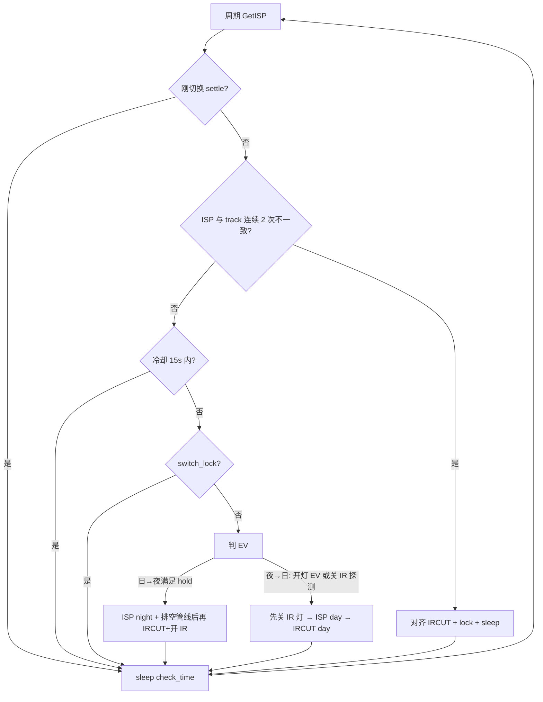
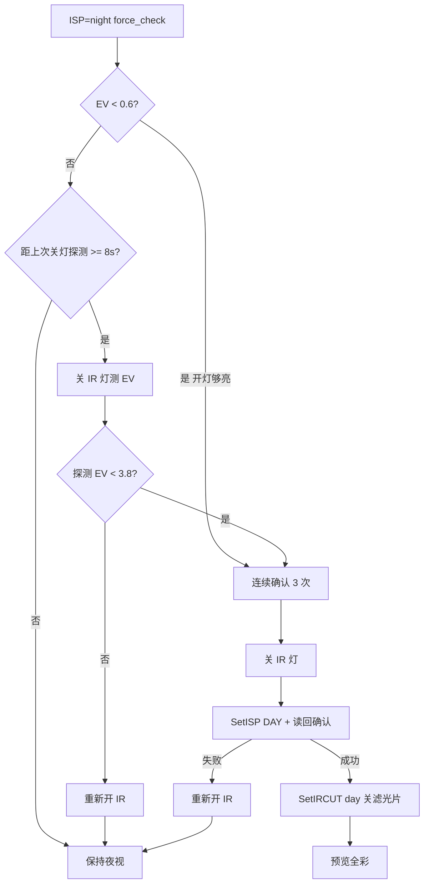

# T31x 软光敏：重复切换、开灯仍黑白、日夜紫闪

> **日期**：2026-08-21  
> **现象**：① 临界亮度 IRCUT/IR 灯来回抖；② 室内开灯后预览仍黑白；③ 日→夜切换先闪品红再进黑白。  
> **结论**：问题都在 T31 `sample_soft_photosensitive_ctrl`，不在 Cat.1 MQTT 2030/2031。  
> **算法参数真源**：IPC 仓 `ipc_device_ini/docs/t31x_soft_photosensitive_day_night.md`  
> **远程设参**：MQTT 2030/2031 → `AT+SOFTPHOTO?` / `AT+SOFTPHOTOSET=`，见 [MQTT_MIC_SOFTPHOTO_REMOTE_FLOW.md](MQTT_MIC_SOFTPHOTO_REMOTE_FLOW.md)

---

## 1. 现象

设备在临界亮度（室内偏暗、黄昏）下 **IRCUT + IR 灯反复开关**：

- 日志成对出现 `SWITCH day->night` / `SWITCH night->day`
- 旧固件特征：`hold=0/2`（锁定期内立刻反向切）
- 间隔大约数秒一轮，不是 MQTT 周期写参

日志落盘：`/tmp/ipc/softphoto.log`（不打串口）。

---

## 2. 根因

切夜视时 `gpio_ircut_set(0)` **同时打开 IR 灯**。红外把画面照亮后，ISP EV 从「很暗」掉到「很亮」，状态机当成天亮，关灯切回白天；白天一关灯又变暗，再切夜视。闭环如下：

```text
白天偏暗  EV≈6.8
    → SWITCH day->night，开 IR 灯
    → EV 被红外拉到 ≈1.4（假白天）
    → SWITCH night->day，关 IR 灯
    → EV 回到 ≈6.9
    → 再切夜视 …
```

旧逻辑有三处把抖动放大：

| 缺口 | 旧行为 | 后果 |
|------|--------|------|
| 锁定期仍允许日→夜 | `switch_lock` 期间若 `EV >= DAY2NIGHT` 立刻 `want_night=1` | 假白天马上弹回夜视，锁定形同虚设 |
| 夜→日确认太弱 | `DAY_RETURN=4.5`（比 `NIGHT2DAY=4.2` 还松）、`DAY_RETURN_COUNT=1` | EV 刚掉过迟滞边沿就切白天 |
| GB 条件过松 | `gb > rec+Δ` **或** `gb > 阈值80` | 夜视 GB 常年 >80，等于只看 EV |
| ISP 滞后强制对齐 | `GetISPRunningMode` 与 track 不一致就 `continue` **不 sleep** | 可能空转猛切 IRCUT |
| 红外占比不可信 | 本板 `ir` 一直是 `0.00/vis` | `!is_ir_light` 挡不住假白天 |

`EV = log2(iso/1000)`。夜视开灯后 `iso≈2629` → `EV≈1.39`；关灯后 `iso` 很大 → `EV≈6.8`。

---

## 3. 修复（2026-08-21）

代码：

| 文件 | 作用 |
|------|------|
| `ipc_device_ini/media_plat/t31x/sample-common.c` | 状态机：冷却、双向锁定、GB 增量、IR 占位、SYNC 去空转 |
| `ipc_device_ini/media_plat/t31x/soft_photosensitive.h` | 默认宏 |
| `ipc_device_ini/build/chips/t31x.mk` | 编译期覆盖 |
| `ipc_device_ini/build/config.global.mk` | 全局默认 |
| `ipc_device_ini/Makefile` | 注入 `SOFTPHOTO_POST_SWITCH_MS` 等 |

### 3.1 现行参数

| 宏 | 现值 | 说明 |
|----|------|------|
| `SOFTPHOTO_EV_DAY2NIGHT` | 5.8 | 日→夜 |
| `SOFTPHOTO_EV_NIGHT2DAY` | 4.2 | 夜→日：进入待确认 |
| `SOFTPHOTO_EV_DAY_RETURN` | **3.8** | 夜→日（关 IR 探测）：必须 **低于** `NIGHT2DAY` |
| `SOFTPHOTO_EV_DAY_RETURN_IR` | **0.6** | 开着 IR 灯时：EV 低于此认定环境光足够（室内开灯） |
| `SOFTPHOTO_IR_PROBE_MS` | **8000** | EV 不够低时，每 8s 关 IR 灯探测真实 EV |
| `SOFTPHOTO_SWITCH_LOCK_CYCLES` | **8** | 锁定周期，**双向保持，禁止反向切** |
| `SOFTPHOTO_DAY_RETURN_COUNT` | **3** | 连续确认才回白天 |
| `SOFTPHOTO_POST_SWITCH_MS` | **15000** | 切换后 15s 冷却，不判 EV |
| `SOFTPHOTO_IRCUT_SETTLE_US` | **200000** | IRCUT 后等待 |
| `SOFTPHOTO_ISP_SETTLE_US` | **400000** | `SetISPRunningMode` 后等标志位 |
| `SOFTPHOTO_ISP_PIPE_DRAIN_US` | **400000** | 日→夜：夜视确认后再排空编码在途彩色帧，再开 IR |
| `SOFTPHOTO_IR_OFF_SETTLE_US` | **150000** | 夜→日：先关 IR 灯再切 ISP 全彩 |
| `SOFTPHOTO_IR_LOSE_COUNT` | **5** | 连续非红外才丢掉 IR 占位 |
| `SOFTPHOTO_SYNC_MISMATCH_NEED` | 2 | ISP/track 连续不一致才强制对齐 |
| `SOFTPHOTO_SETTLE_CYCLES` | 2 | 刚切完跳过强制 SYNC |

### 3.2 状态机要点

1. **冷却**：任意 `SWITCH` 后 15s 只 sleep，不判日夜。  
2. **锁定双向**：锁定期 `goto poll_sleep`，不再允许「锁定期日→夜」。  
3. **切夜后 IR 占位**：`softphoto_apply_night` 开 IR 灯后，先把 `is_ir_light=1`。  
4. **ISP / IRCUT 顺序不是同一套**：日→夜 **先 ISP night → 排空管线 → 再开 IR**；夜→日 **先关 IR 灯 → ISP day → 再关滤光片**。两边都是「先消掉红外+彩色叠在一起」再动另一半。  
5. **夜→日不再看 GB 增量**（开灯后 GB 会下降）。开着 IR 用 `EV < DAY_RETURN_IR`；否则周期性关灯探测。  
6. **SYNC**：连续 2 次不一致才对齐，且 **必须 sleep**，禁止无等待 `continue`。



---

## 4. 编译与推送

在 WSL / 本机 IPC 仓（默认工程 `T31ZX_GC4653_H265_GB28181_P2P`，上传 URL `http://112.86.146.218:7003/admin/api/v1/uploadVideo`）：

```bash
cd /mnt/d/项目/linfeng/AIR780EHM/ipc_device_ini
rm -f out/media_plat/t31x/sample-common.o
./run_t31x.sh -j4
```

确认启动 log 含 `from syscfg.ini`，以及 `syscfg.ini [soft_photosensitive]` 已有 `ev_day2night` / `isp_pipe_drain_us` 等键（缺文件会生成，旧 8 键会回填）。header 宏仅作缺键兜底。

产物：`ipc_device_ini/t31x_ipc`。开灯回全彩那一版 `SIZE=7195748`、`PID=6733`。日→夜先切 ISP 的版本需重编后再推。

COM7 115200，root 空密码，lrz 推到 `/system/nfs/ipc` 并拉起：

```bat
python tools\t31x\t31x_lrz_push.py --local D:\项目\linfeng\AIR780EHM\ipc_device_ini\t31x_ipc --restart --port COM7
```

若 COM 停在 `login:`，先 `root` + 空回车进 `#` 再推。推完核对 `SIZE=` 与本地一致、`PID=` 非空。

防抖第一版实机：`SIZE=7195748`，`PID=4484`。开灯回全彩：同一体积，`PID=6733`。

---

## 5. 板端怎么看

```sh
grep -E 'start day|SWITCH|SYNC force|day-return' /tmp/ipc/softphoto.log
```

| 日志 | 含义 |
|------|------|
| `start day mode \| ... day_return_ir=0.60 cooldown=15000ms` | 新固件已起来（含开灯回全彩阈值） |
| `SWITCH day->night EV=... hold=2/2` | 正常进夜视（hold 用满） |
| `SWITCH night->day EV=... (on-IR)` | 开着 IR 灯、环境光足够，切回全彩 |
| `SWITCH night->day EV=... (IR-off probe)` | 关灯探测后确认是真白天 |
| `SWITCH ... hold=0/2` | **旧逻辑**锁定期反向切，不应再出现 |
| `day-return pending ... need_ev_ir<0.60` | 开着 IR 但还不够亮，保持夜视 |
| `ISP still day after SetNIGHT` | 日→夜 ISP 没切上，**不会**开 IR（避免紫闪） |
| `ISP still night after SetDAY` | 夜→日 ISP 没切上，**不会**拨滤光片（避免一直黑白） |

`debug_mode=1` 时还有限频 `stat ISP=... EV=... gb=... ir=...`。

---

## 6. 实机观察（2026-08-21）

重启前旧程序仍在抖（可忽略）：

```text
SWITCH day->night EV=6.90 hold=0/2
SWITCH night->day EV=1.33 gb=225.0(rec=170.0) ir=0.00
… 成对重复 …
```

新进程启动后（约 10 分钟连续观察）：

```text
start day mode | EV day2night=5.80 night2day=4.20 day_return=3.80 hold=2 lock=8 cooldown=15000ms
SWITCH day->night EV=6.78 hold=2/2
night GB calibrate samples=5 avg=224.0
switch lock released
```

之后 **没有** `SWITCH night->day`。`sw_after=1`（启动后只切了一次夜视）。

稳定后的周期摘要：

```text
stat ISP=night track=night EV=1.39 iso=2629 gb=225.0(rec=224.0) ir=0.00/vis lock=0/0
day-return pending EV=1.39 gb=225.0 ir=ok gb_ok=0 force=1
```

解读：

| 量 | 值 | 说明 |
|----|-----|------|
| EV | 1.39 | 开着 IR 灯的 **假白天**，旧逻辑会在这里回切 |
| `ir` | `0.00/vis`，pending 为 `ir=ok` | 本板红外占比 **失效**，没有 IR-block |
| `gb_ok` | 0 | `225 > 224+15` 不成立，**目前全靠 GB 增量挡住回白天** |

---

## 7. 开灯后仍黑白（夜→日）

### 7.1 现象

室内开灯后画面已经很亮，IR 灯也可能灭了，但 **预览一直黑白**。日志里 `EV` 已经负值（很亮），却迟迟没有 `SWITCH night->day`。

### 7.2 实机数据

开灯后典型一帧：

| 量 | 值 | 说明 |
|----|-----|------|
| EV | **-0.21**（iso≈866） | 已经是真白天，远亮于夜视假白天 EV≈1.39 |
| gb | **128**（夜视校准 rec=224） | 开灯后 GB **下降**，不是上升 |
| `gb_ok` | 0 | 旧条件 `gb > rec+15` 永远不成立 |
| ISP | night | 没切全彩，预览黑白 |

根因：**开着 IR 灯时不能用 GB 增量判白天**。红外补光下的 WB 和可见光开灯后的 WB 方向相反。旧路径被 `gb_ok=0` 挡住，ISP 停在 night。若只拨 IRCUT、ISP 仍 night，滤光片切到白天也还是黑白。

### 7.3 现行流程（`softphoto_apply_day`）

```text
夜视 + IR 灯开着
    │
    ├─ EV < DAY_RETURN_IR(0.6)     → 认定「环境光足够」（室内开灯）
    │
    └─ 否则每 IR_PROBE_MS(8s)
           gpio_irled_set(0) 关灯探测
           EV_probe < DAY_RETURN(3.8) → 真白天
           否则重新开 IR 灯，保持夜视
    │
    ▼ 连续 DAY_RETURN_COUNT(3) 次确认
softphoto_apply_day:
    1. gpio_irled_set(0) 先关 IR 灯（滤光片先不动）
    2. 等 IR_OFF_SETTLE_US
    3. SetISPRunningMode(DAY)，读回必须是 DAY
    4. 确认成功才 SetIRCUT(1)（关滤光片）
    失败则重新开 IR，保持夜视
```



要点：

- **先关 IR 灯，再 ISP 全彩，最后拨滤光片**。先切 ISP 全彩而 IR 灯还亮，会品红闪。
- 只拨滤光片、ISP 仍 night，预览会一直黑白；ISP 失败必须把 IR 灯开回去。
- MQTT 2030/2031 **不改**这条 EV 路径。

---

## 8. 日→夜品红闪（先 IR 后 ISP）

### 8.1 现象

实机录像（2026-08-21 20:49，IPCDev 1280×720 H.265 预览，约 3s）：

1. 室内彩色预览（偏暗、椅子等可见）。
2. 切夜视瞬间 **整帧品红/紫**，大约几十到一两百毫秒。
3. 随后进入稳定 **黑白夜视**。

这是传感器在 **彩色 ISP + 红外进光** 下的典型 AWB 偏色，不是编码或网页播放器问题。

### 8.2 根因

`gpio_ircut_set(0)` 会 **同时** 打开 IRCUT（去掉红外滤光片）并打开 IR 灯。旧日→夜顺序是：

```text
SetIRCUT(0)     ← 滤光片打开 + IR 灯亮，ISP 仍是 DAY（彩色 AWB）
等待 200ms        ← 这 200ms 预览就是品红
SetISP(NIGHT)   ← 才变黑白
```

同文件里 ADC 日夜路径 `adc_light_turn_2_grey` 本来就是 **先 ISP night 再 IRCUT**，软光敏线程写反了。

### 8.3 修复（`softphoto_apply_night`）

```text
softphoto_apply_night:
    1. SetISPRunningMode(NIGHT)     ← 先黑白，IR 滤光片仍在、IR 灯仍关
    2. 等 ISP_SETTLE_US，读回必须是 NIGHT
    3. 再等 ISP_PIPE_DRAIN_US       ← 编码在途彩色帧排空（20fps 约 8 帧）
    4. SetIRCUT(0)                  ← 再开滤光片 + 开 IR 灯
    失败则保持白天，不开 IR
```

`GetISPRunningMode==NIGHT` 只说明指令已接受，**不等于预览已经是黑白**。只等 200ms 就开 IR，在途彩色帧仍会品红。现行合计约 **800ms** 后再开 IR。

### 8.4 两边顺序对照

| 方向 | 正确顺序 | 反了会怎样 |
|------|----------|------------|
| 日→夜 | ISP night → 排空管线 → IRCUT night（开 IR） | 品红/紫闪一下再黑白 |
| 夜→日 | **关 IR 灯** → ISP day → IRCUT day（关滤光片） | 彩色 ISP + IR 灯仍亮 → 品红闪；或只拨滤光片、ISP 仍夜视 → 一直黑白 |

ADC 路径 `adc_light_turn_2_grey` 已是 ISP night 再 IRCUT；`adc_light_turn_2_color` 已是 **IRCUT day 再 ISP day**（先灭 IR）。软光敏夜→日不要再「先 ISP 后 IRCUT」。

---

## 9. 文件与协议对照


| 层级 | 路径 |
|------|------|
| 状态机 | `ipc_device_ini/media_plat/t31x/sample-common.c` → `sample_soft_photosensitive_ctrl` |
| ISP/IRCUT 成对切换 | 同文件 `softphoto_apply_day` / `softphoto_apply_night` |
| IRCUT / IRLED 联动 | `ipc_device_ini/media_plat/t31x/gpio_ctrl_interface.c` → `gpio_ircut_set` |
| 线程启动 | `ipc_device_ini/media_plat/t31x/video_interface.c` |
| MQTT 查/设 8 字段 | Cat.1 `AT+SOFTPHOTO?` / `AT+SOFTPHOTOSET=`；**不参与**本轮 EV 主路径（`night_mode_threshold` 等为遗留） |

远程 2031 改的是 `[soft_photosensitive]` 的 `enable` / `check_count` / `check_time` / `gb_gain_*`。EV 阈值在编译期宏，改完必须重编 `t31x_ipc`。

---

## 10. 桌面录屏分析（2026-08-21 21:19）

录屏约 70s（中途打断，mp4 缺 moov，按 H.264 抢救）。画面里 LiveGBS `IPCDev` 与 Cursor 叠在一起，后半段预览被编辑器挡住，**完整开/关灯切换没全部拍进清晰预览**。能确认的和代码对得上的结论如下。

### 10.1 看得到的

| 时刻 | 预览 | 说明 |
|------|------|------|
| 21:19 起（录屏开头） | IPCDev **全彩**，办公室日光灯亮，1280×720 H.265 **20fps** | 当时已是白天全彩 |
| 20:49 微信录像（上一轮） | 彩 → **整帧品红** → 黑白，约 3s | 日→夜，彩色 ISP 吃到红外 |

### 10.2 日→夜还可能紫

上一版 `softphoto_apply_night` 已改成先 ISP 再 IRCUT，但只等 **200ms**。预览 20fps、编码还有 4～8 帧在途，标志位已经是 NIGHT 时画面仍可能是彩色。IR 灯一开，这些帧就是品红。

处理：ISP 确认后再加 `ISP_PIPE_DRAIN_US=400ms`，合计约 **800ms** 再开 IR。

### 10.3 夜→日也会紫

上一版夜→日为了避免「一直黑白」写成 **先 ISP DAY、IR 灯还亮着**。这和日→夜是同一类错误，只是方向相反：

```text
开灯 → EV 够亮 → SetISP(DAY)   ← IR 灯仍亮、滤光片仍夜视
      → 预览品红
      → SetIRCUT(1) 关灯       ← 才全彩
```

处理：与 ADC `adc_light_turn_2_color` 对齐——**先 `gpio_irled_set(0)`，再 ISP DAY，最后 IRCUT day**。ISP 失败则把 IR 灯开回去。

### 10.4 开灯仍黑白

判决仍用 `EV < 0.6`（开着 IR）或关灯探测，不靠 GB 增量。这次只改执行顺序，不改 EV 阈值。
