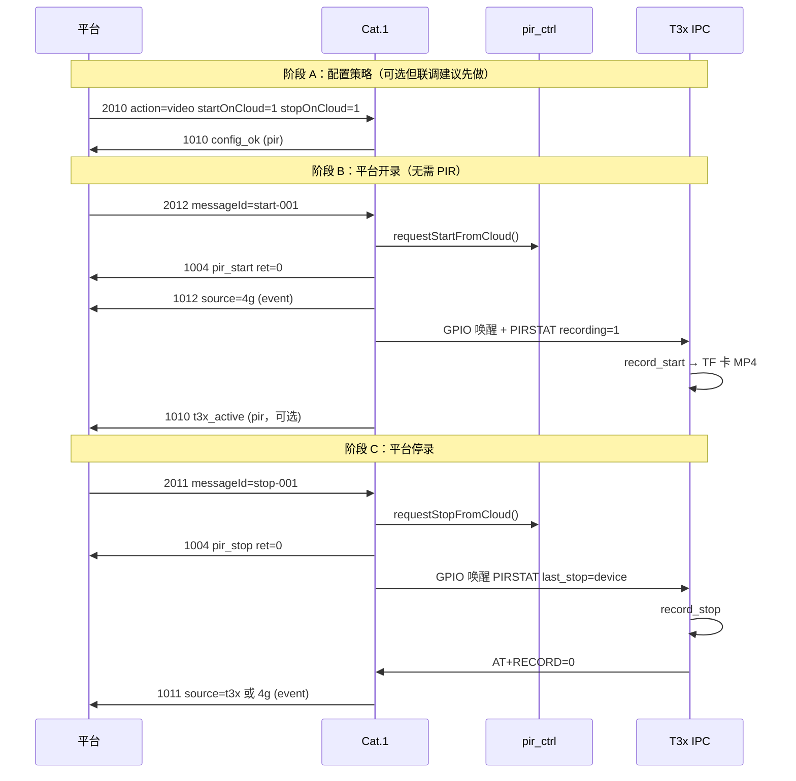

# MQTT 2010 / 2012 / 2011 与 PIR 协作说明与联调实操

> **定位**：说明 **2010 策略**、**2012 平台开录**、**2011 平台停录** 与 **PIR 硬件触发** 的关系；附可照着做的联调步骤。  
> **术语**：实盘在 **TF 卡本地 MP4**，不是云端存片 → [T3X_RECORD_MQTT_FLOW.md §0](T3X_RECORD_MQTT_FLOW.md#0-术语不是云端录像)  
> **专题**：[mqtt_2012_1012_flow.md](mqtt_2012_1012_flow.md) · [mqtt_2011_1011_flow.md](mqtt_2011_1011_flow.md) · [PIR_PROTOCOL.md](/mnt/share/doc/PIR_PROTOCOL.md)

---

## 1. 三个编号各自干什么

| dataType | 方向 | 作用 | 是否立刻开/停录 |
|----------|------|------|-----------------|
| **2010** | 平台 → 设备 | 配置 PIR/录像 **策略**（`action`、最长秒数、`startOnCloud`/`stopOnCloud` 等） | ❌ 只改配置 |
| **2012** | 平台 → 设备 | **平台指令开录**（TF 卡 MP4） | ✅ 受理即开 4G 会话并唤醒 T3x |
| **2011** | 平台 → 设备 | **平台指令停录** | ✅ 受理即停当前会话 |

**2010 示例**（设策略，不录）：

```json
{
  "dataType": "2010",
  "action": "video",
  "stopOnCloud": 1,
  "startOnCloud": 1,
  "videoMaxDurationSec": 90
}
```

**2012 / 2011 示例**（执行开停）：

```json
{"dataType":"2012","messageId":"start-001"}
{"dataType":"2011","messageId":"stop-001"}
```

---

## 2. 2010 字段说明

| 字段 | 必填 | 说明 |
|------|------|------|
| `action` | 否 | `video` 录视频 / `photo` 拍照 / `both` 先拍后录 / `query` 查询当前策略 |
| `uploadMode` | 否 | `auto` / `manual` |
| `quality` | 否 | `high` / `low` |
| `videoMaxDurationSec` | 否 | 单次录像最长秒数，**1～3600**；到时自动停录（`reason=timer`） |
| `stopOnSecondPir` | 否 | 录像中再次 PIR → 停录（`pir_retrigger`），不新开录 |
| `stopOnCloud` | 否 | 是否响应平台 **2011** 停录 |
| `startOnCloud` | 否 | 是否响应平台 **2012** 开录 |

未传字段 **保留设备当前值**（合并更新）。配置成功上行 **1010**（`pir` 主题，`pirStatus=config_ok`）。

查询当前策略：

```json
{"dataType":"2010","action":"query"}
```

---

## 3. 核心结论：可独立，但共用一套会话

### 3.1 两条入口，一条流水线

```text
PIR 硬件边沿              平台 MQTT
      │                       │
      ▼                       ▼
 onPirTriggered()     requestStartFromCloud()  ← 2012
      │                       │
      └──────────┬────────────┘
                 ▼
        publishActionEvents()
        beginVideoSession() + 唤醒 T3x + TF 卡写盘
                 │
                 ▼
        requestStopFromCloud()  ← 2011
        或定时器 / 二次 PIR / T3x AT+RECORD=0
```

- **2012 不需要 PIR**：代码路径注释为「平台令设备开录（**无 PIR 硬件触发**）」。
- **2011 不需要 PIR**：只要当前 `recording=1`，无论录像是 PIR 还是 2012 开的，都能停。
- **PIR 不需要 2012**：硬件触发走 `onPirTriggered()`，与 2012 并行入口。
- **共用**：同一 `pir_ctrl.session`、同一 `videoMaxDurationSec`、同一 T3x 唤醒/停录串口协议。

### 3.2 场景对照

| 场景 | 行为 |
|------|------|
| 只用 PIR | 发 2010 设 `action=video` 等；PIR 触发开录；定时/二次 PIR/2011 停录 |
| 只用平台 | 2010 开权限 → 2012 开录 → 2011 停录；全程可无 PIR |
| PIR 已录时再发 2012 | 拒绝，`1004` `ret=-1`，`message=busy` |
| 录着时发 2011 | 停当前会话 → `1004` + `1011` |
| 录像中再 PIR | `stopOnSecondPir=1` 时停录（`pir_retrigger`），**不会**再开新录 |
| rest / suspend | PIR 被忽略；2012 可能 `suspended`；低功耗见 [T3X_LOW_POWER.md](../780EHM_PJ/doc/T3X_LOW_POWER.md) |

### 3.3 与 2010 的依赖关系

| 指令 | 依赖 2010 的内容 |
|------|------------------|
| **2012** | `startOnCloud=1`；未传字段用当前 `action/uploadMode/quality`；时长用 `videoMaxDurationSec` |
| **2011** | `stopOnCloud=1`；且当前正在录像 |
| **PIR** | 用 2010（或出厂默认）的 `action`、时长、`stopOnSecondPir` 等 |

---

## 4. MQTT 主题与上行类型

IMEI 示例：`862323084068314`（联调时换成实机 15 位 IMEI）。

| 方向 | 主题 | 说明 |
|------|------|------|
| 平台 → Cat.1 | `/panshi/device/{IMEI}/` | 下发 2010 / 2012 / 2011 |
| Cat.1 → 平台 | `/panshi/app/{IMEI}/pir` | **1010**（配置确认、PIR `detected`、`t3x_active`） |
| Cat.1 → 平台 | `/panshi/app/{IMEI}/event` | **1004** 即时应答、**1012** 开录、**1011** 停录 |

载荷 **`dataType` 为字符串**（`"2012"`，不是数字）。

### 4.1 各路径典型上行

| 触发方式 | 典型上行（顺序可能交错） |
|----------|--------------------------|
| 2010 配置成功 | `1010` `pirStatus=config_ok`（`pir`） |
| 2010 query | `1010` `pirStatus=query`（`pir`） |
| PIR 触发开录 | `1010` `detected`（`pir`）→ 可选 `1010` `t3x_active`（`pir`） |
| 2012 开录受理 | `1004` `action=pir_start,ret=0` + `1012`（`event`）→ 可选 `1010` `t3x_active` |
| 2012 拒绝 | `1004` `action=pir_start,ret=-1`（`denied/busy/suspended/…`） |
| 2011 停录受理 | `1004` `action=pir_stop,ret=0` + `1011`（`event`） |
| 2011 拒绝 | `1004` `action=pir_stop,ret=-1`（未在录或 `stopOnCloud=0`） |
| 定时停录 | `1011` `reason=timer`（`event`） |

---

## 5. 端到端时序（平台开录 / 停录）



完整串口与模块分工见 [mqtt_cloud_uart_ipc_record_flow.md](mqtt_cloud_uart_ipc_record_flow.md)。

---

## 6. 联调前置条件

| 项 | 要求 |
|----|------|
| Cat.1 | 已联网 MQTT，`net_mqtt` 已订阅 `/panshi/device/{IMEI}/` |
| T3x | 已上电或可被 4G GPIO 唤醒；TF 卡已插、可写 |
| 平台侧 | **Subscribe** `/panshi/app/{IMEI}/#`（至少 `event` + `pir`） |
| 非 rest | rest 下 PIR 被忽略；平台开录可能失败或需先 **2002 exit** |
| Broker | 与 `syscfg.ini` / 4G `config.lua` 一致（见 [探针 README](../tools/mqtt_backend_probe/README.md)） |

---

## 7. 测试环境准备（实操）

### 7.1 环境变量

```bash
export DEVICE_IMEI=862323084068314    # 换成实机 IMEI
export MQTT_HOST=112.86.146.218       # 与现场 Broker 一致
export MQTT_PORT=2123
export MQTT_USER=fptop1
export MQTT_PASS='your_password'
```

### 7.2 安装探针（可选）

```bash
cd tools/mqtt_backend_probe
npm install
```

### 7.3 先监听上行

**方式 A — Node 探针：**

```bash
cd tools/mqtt_backend_probe
npm run listen
```

**方式 B — mosquitto_sub：**

```bash
mosquitto_sub -h "$MQTT_HOST" -p "$MQTT_PORT" -u "$MQTT_USER" -P "$MQTT_PASS" \
  -t "/panshi/app/${DEVICE_IMEI}/#" -v
```

**方式 C — MQTTX**：订阅 `/panshi/app/{IMEI}/#`，同时可向 `/panshi/device/{IMEI}/` 发布。

### 7.4 下发目标主题

所有下行 JSON **Publish 到**：

```text
/panshi/device/{IMEI}/
```

（末尾可有 `/`，以 Broker 与固件配置为准。）

---

## 8. 测试用例（按顺序执行）

以下 `messageId` 可自定义；平台应用其做请求-应答关联。

### 用例 1：2010 配置 + 查询（不测录像）

**目的**：确认策略写入与 1010 应答。

| 步骤 | 操作 | 期望上行 |
|------|------|----------|
| 1 | 下发 2010 配置 | 见下方 JSON A |
| 2 | 观察 `pir` | `1010`，`pirStatus=config_ok`，`action=video` |
| 3 | 下发 2010 查询 | 见下方 JSON B |
| 4 | 观察 `pir` | `1010`，`pirStatus=query`，含 `recording`、策略字段 |

**JSON A — 配置：**

```json
{
  "dataType": "2010",
  "action": "video",
  "uploadMode": "auto",
  "quality": "high",
  "videoMaxDurationSec": 90,
  "stopOnSecondPir": 1,
  "stopOnCloud": 1,
  "startOnCloud": 1
}
```

**JSON B — 查询：**

```json
{"dataType":"2010","action":"query"}
```

**探针一键：**

```bash
npm run pir-video
```

---

### 用例 2：平台开录 → 停录（不触发 PIR）

**目的**：验证 2012 / 2011 **独立于 PIR**。

| 步骤 | 操作 | 期望上行 | 备注 |
|------|------|----------|------|
| 1 | 用例 1 确保 `startOnCloud=1`、`stopOnCloud=1` | — | |
| 2 | 下发 **2012** | `event`：`1004` `pir_start ret=0` + `1012` | `messageId` 回显 |
| 3 | 等待 3～10s | `pir`：可选 `1010` `t3x_active` | T3x 写盘确认 |
| 4 | 下发 **2011** | `event`：`1004` `pir_stop ret=0` + `1011` | T3x 在写盘时 1011 可能延迟最多约 15s |
| 5 | 查 TF 卡 | 新增 MP4 | 见 §9 |

**JSON：**

```json
{"dataType":"2012","messageId":"start-001"}
{"dataType":"2011","messageId":"stop-001"}
```

**探针一键：**

```bash
npm run platform-record
```

**单条下发：**

```bash
node mqtt_probe.js --publish '{"dataType":"2012","messageId":"start-001"}'
node mqtt_probe.js --publish '{"dataType":"2011","messageId":"stop-001"}'
```

---

### 用例 3：短时长定时停录（测 2010 的 `videoMaxDurationSec`）

**目的**：不发 2011，验证定时器停录。

| 步骤 | 操作 | 期望 |
|------|------|------|
| 1 | 2010 设 `videoMaxDurationSec: 9` | `1010` config_ok |
| 2 | 2012 开录 | `1004` + `1012` |
| 3 | **不要发 2011**，等约 9s | `1011`，`reason=timer` |
| 4 | TF 卡 | 短片约 9s |

```json
{"dataType":"2010","action":"video","stopOnCloud":1,"startOnCloud":1,"videoMaxDurationSec":9}
{"dataType":"2012","messageId":"start-timer-test"}
```

---

### 用例 4：PIR 触发开录（不用 2012）

**目的**：验证 PIR 与平台指令 **并行入口**。

| 步骤 | 操作 | 期望 |
|------|------|------|
| 1 | 2010 设 `action=video` | `1010` config_ok |
| 2 | **物理触发 PIR**（勿发 2012） | `pir`：`1010` `detected` |
| 3 | 等待 | 可选 `t3x_active`；TF 卡有 MP4 |
| 4 | 2011 停录 或等定时 | `1011` |

此路径 **不会出现 1012**（无 2012）；与用例 2 对比即可区分。

---

### 用例 5：混合 — PIR 开录后平台停录

| 步骤 | 操作 | 期望 |
|------|------|------|
| 1 | PIR 触发开录 | `1010` detected |
| 2 | 发 2012 | `1004` `busy`（已在录） |
| 3 | 发 2011 | `1004` + `1011`，`reason=device` |

---

### 用例 6：拒绝路径（负向）

| 步骤 | 配置 | 操作 | 期望 |
|------|------|------|------|
| A | `startOnCloud=0` | 2012 | `1004` `ret=-1`，`message=denied` |
| B | 未在录 | 2011 | `1004` `ret=-1`（无 1011） |
| C | `stopOnCloud=0` | 正在录时 2011 | `1004` `ret=-1` |
| D | 已在录 | 2012 | `1004` `message=busy` |

```json
{"dataType":"2010","startOnCloud":0,"stopOnCloud":1}
{"dataType":"2012","messageId":"deny-test"}
```

恢复联调前记得把 `startOnCloud` 设回 1。

---

## 9. 实盘验收（TF 卡）

T3x 录像路径（主码流 ch0 示例）：

```text
/mnt/sdcard/media/vi0/YYYYMMDD/ch0_YYYYMMDDHHMMSS_YYYYMMDDHHMMSS.mp4
```

示例：

```text
/mnt/sdcard/media/vi0/20260607/ch0_20260607143022_20260607143031.mp4
```

| 检查项 | 方法 |
|--------|------|
| 文件是否生成 | SSH/串口 `ls -lt /mnt/sdcard/media/vi0/$(date +%Y%m%d)/` |
| 时长是否合理 | 与 `videoMaxDurationSec` 或 2011 停录时刻一致 |
| 用例 2 与 4 对比 | 两条路径都应产生 MP4；上行类型不同（1012 vs 仅 1010 detected） |

---

## 10. Cat.1 日志速查

Luat 日志标签（`net_mqtt` / `pir_ctrl`）：

| 日志 | 含义 |
|------|------|
| `downlink_2010_config` | 2010 配置成功 |
| `downlink_2010_query` | 2010 查询 |
| `downlink_2012_msg` / `downlink_2012_start` | 收到 2012 |
| `pub 1012` | 上行开录确认 |
| `downlink_2012_error` | 2012 拒绝 |
| `downlink_2011_msg` / `downlink_2011_stop` | 收到 2011 |
| `pub 1011` | 上行停录 |
| `downlink_2011_error` | 2011 拒绝 |
| `cloud start` | `pir_ctrl` 平台开录受理 |
| `rec session N s` | 已开录像会话，定时 N 秒 |

---

## 11. 常见失败与排查

| 现象 | 可能原因 | 处理 |
|------|----------|------|
| 发 2012 无 1012 | 未 Subscribe `…/event` | 订阅 `/panshi/app/{IMEI}/event` |
| 只有 1004 `ret=-1` | `startOnCloud=0` / 已在录 / suspend | 2010 query；看 `downlink_2012_error` 日志 |
| 2011 无 1011 | 未在录（4G 会话未开） | 先 2012 或 PIR；**全天录时见 §12** |
| 开机在录但 2011 无效 | T31x 全天录，4G `recording=0` | 见 §12；改 `record_mode` 或接受语义 |
| 有 1004 但 1011 很晚 | T3x 正在写盘 | 正常，最多约 15s 兜底 |
| 有 1012 无 MP4 | T3x 未唤醒/无卡/rest | 2001 唤醒；查 TF 卡与 IPC 日志 |
| PIR 无反应 | rest / suspend / 录像中二次 PIR | 2003 查 `lowPowerMode` |
| 主题不对 | 发到错误 IMEI 或未订阅 device 主题 | 核对 15 位 IMEI |

---

## 12. 开机即录像（全天录）时 MQTT 有何反应、如何处理

### 12.0 PIR 误报不写盘（`stop_if_no_person=1`）

当 **`stop_if_no_person=1`**（默认）时，IPC **先等人形再开 MP4**：宽限 `confirm_grace_sec` 内 IVS 无人 → **不创建 MP4**，并向 4G 上报 `AT+RECORD=0,reason=no_person`。  
平台 **2012**（`last=cloud_start`）仍 **立即开录**，不受此延迟影响。

### 12.1 先分清两套「在录」

很多人看到 **T31x 一开机就在写 TF 卡**，会以为 4G 已经处于 PIR/平台录像会话。实际是 **两套状态**：

| 层级 | 谁维护 | 典型条件 | 含义 |
|------|--------|----------|------|
| **T31x 本地写盘** | IPC `record_*` | `record_enable=1` 且 **`record_mode=1`（全天）** | `main.c` 开机即 `record_start_ch()`，**持续写 MP4** |
| **4G PIR 会话** | `pir_ctrl.session.recording` | PIR / **2012** 开录后 | MQTT **1012/1011**、定时器、`stopOnCloud` 都看这层 |

全天录开机时 **一般不会** 向 Cat.1 发 `AT+RECORD=1`（无 PIR 会话标记），故 4G 侧 **`session.recording=0`**、`t3x_rec_active` 常为 0，但 TF 卡上文件仍在增长。

详见 [cat1_pir_mqtt_action_config.md §5](cat1_pir_mqtt_action_config.md#5-本地全天录像-vs-pir-事件录像--如何均衡)。

### 12.2 各 MQTT 指令在「仅全天录、无 4G 会话」时的反应

前提：T31x `record_mode=1` 已在写盘，4G `session.recording=0`。

| 指令 | 4G / MQTT 反应 | T31x / TF 卡 |
|------|----------------|--------------|
| **2010** 配置 | 正常：`1010` `config_ok`；**不改变**是否在写盘 | 仍全天录；仅影响后续 PIR/2012 策略 |
| **2010** `action=query` | `1010` 里 `recording` 多为 **0**（4G 会话） | 与 TF 卡是否在写 **可能不一致** |
| **2012** 开录 | **受理**：`1004` + `1012`；`session.recording=1` | 唤醒后 `ipc_record_start`：**先停当前 MP4，再按 PIR 时长重开**一段会话录 |
| **2011** 停录 | **拒绝**：`1004` `ret=-1`（4G 认为未在录）；**无 1011** | **全天录继续**，TF 卡照写 |
| **PIR** + `action=video/both` | 同 2012：开 4G 会话 + 打断重开 PIR 段 | 同 2012 |
| **PIR** + `action=photo` | 只抓拍，**不打断**全天 MP4 | 全天文件连续 |

PIR/`video` 打断逻辑见 `cat1_module.c` → `ipc_record_start`：`record_is_active_ch` 时先 `record_stop_ch` 再 `record_start_ex_ch`。

### 12.3 「4G 会话在录」时的反应（对比）

若已通过 **2012** 或 PIR 开了 4G 会话（`session.recording=1`）：

| 指令 | 反应 |
|------|------|
| **2012** | `1004` `busy`，无 1012 |
| **2011** | `1004` + `1011`；停 PIR 会话；若原为全天录，会话结束后 T31x **可自动恢复全天录** |
| 定时到 | `1011` `reason=timer` |

### 12.4 产品侧如何处理（推荐）

按产品语义选 **一种主模式**，避免「平台以为没在录、设备其实在全天录」：

#### 场景 A：只要 PIR / 平台事件录（门球默认）

| 项 | 做法 |
|----|------|
| T31x | `record_mode=3`（停止）或 `record_enable=0` — **不要** `record_mode=1` |
| MQTT | 2010 `action=video` + `startOnCloud/stopOnCloud=1` |
| 效果 | 开机不写盘；2012/2011/PIR 与文档 §8 用例一致 |

```ini
[camera0]
record_enable=1
record_mode=3
```

#### 场景 B：本地 7×24 存证 + 事件只抓拍

| 项 | 做法 |
|----|------|
| T31x | `record_mode=1` 全天录 |
| MQTT 2010 | **`action=photo`**（勿用 `video`/`both`） |
| 2012 / PIR video | 会 **打断** 全天文件开限时段 — 一般 **不要** 在这种配置下发 2012 |
| 2011 | 对全天录 **无效**（4G 会话未开时） |

#### 场景 C：全天录 + 仍要用 2012/2011

需接受：

1. **2011 不能停全天录**（当前实现只看 4G 会话）；停全天录要改 **T31x 配置** 或 IPC 本地接口，不是 MQTT 2011。
2. **2012 会打断** 当前全天 MP4 并进入 PIR 限时会话；结束后若仍为 `record_mode=1`，库内 **`storage_mp4_try_resume_all_day_ch`** 可恢复全天录。
3. 平台判态：除 `1010.recording` 外，宜结合 **2006/2007**、GB28181、或 IPC 本地状态；不能单靠 2010 query。

### 12.5 联调验证（全天录开机）

| 步骤 | 操作 | 期望 |
|------|------|------|
| 1 | 确认 `record_mode=1`，开机后 TF 卡在写 | `ls` 见持续增长 MP4 |
| 2 | `2010` query | `1010` `recording=0` 常见 |
| 3 | `2011` | `1004` `ret=-1`，全天录不停 |
| 4 | `2012` | `1004`+`1012`；IPC 日志 `record already running, restart` |
| 5 | `2011` | `1004`+`1011`；PIR 段结束；稍后可能恢复全天录 |
| 6 | 改 `record_mode=3` 重启 | 开机不写盘；§8 用例可正常测 |

---

## 13. 源码索引

| 能力 | 模块 | 函数 |
|------|------|------|
| 2010 下行 | `net_mqtt.lua` | `handleDownlink2010` |
| 2012 下行 | `net_mqtt.lua` | `handleDownlink2012` |
| 2011 下行 | `net_mqtt.lua` | `handleDownlink2011` |
| 平台开录 | `pir_ctrl.lua` | `requestStartFromCloud` |
| 平台停录 | `pir_ctrl.lua` | `requestStopFromCloud` |
| PIR 硬件 | `pir_ctrl.lua` | `onPirTriggered` |
| 会话/定时 | `pir_ctrl.lua` | `beginVideoSession` / `publishStopRecording` |
| T3x 协作 | `app.lua` | `onPirMediaAction` / `onPirStopRecording` |
| TF 卡写盘 | IPC `media_ops.c` | `record_start` / `record_stop` |

4G 真源路径：`/mnt/share/user/net_mqtt.lua`、`pir_ctrl.lua`。

---

## 14. 相关文档

| 文档 | 内容 |
|------|------|
| [mqtt_2012_1012_flow.md](mqtt_2012_1012_flow.md) | 2012 → 1012 专题 |
| [mqtt_2011_1011_flow.md](mqtt_2011_1011_flow.md) | 2011 → 1011 专题 |
| [mqtt_cloud_uart_ipc_record_flow.md](mqtt_cloud_uart_ipc_record_flow.md) | MQTT → 串口 → IPC 全流程 |
| [mqtt_backend_integration.md](mqtt_backend_integration.md) | 后台联调总览与探针 |
| [cat1_pir_mqtt_action_config.md](cat1_pir_mqtt_action_config.md) | 全天录 vs PIR action 分工 |
| [MQTT_862323084068314.md](MQTT_862323084068314.md) | 本机 IMEI 速查表 |

---

## 修订记录

| 日期 | 说明 |
|------|------|
| 2026-06-07 | 初版：2010/2012/2011 与 PIR 关系分析 + 联调用例 |
| 2026-06-07 | §12：开机全天录与 MQTT 指令反应及处理 |
