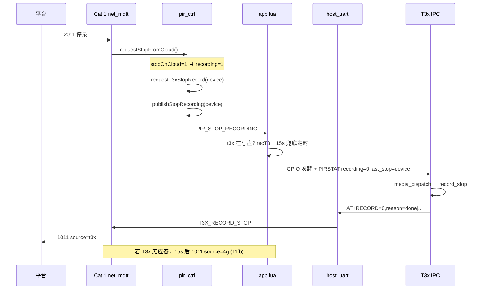

# MQTT 2011 停录 → 1011 上行（4G ↔ T3x 协作）

> **下行**：`{"dataType":"2011"}` → `/panshi/device/{IMEI}/`  
> **上行**：`dataType=1011` → `/panshi/app/{IMEI}/event`  
> **关联**：[mqtt_2012_1012_flow.md](mqtt_2012_1012_flow.md)（对称开录）· [mqtt_2010_2012_2011_pir_flow.md](mqtt_2010_2012_2011_pir_flow.md)（与 PIR 关系 + 联调实操）· [T3X_RECORD_MQTT_FLOW.md](T3X_RECORD_MQTT_FLOW.md) · [PIR_PROTOCOL.md](/mnt/share/doc/PIR_PROTOCOL.md)

**说明**：2011 是平台 **停录指令**，停的是 **TF 卡本地 MP4 写盘**（T3x），**不是**停止「云端录像」。详见 [T3X_RECORD_MQTT_FLOW.md §0](T3X_RECORD_MQTT_FLOW.md#0-术语不是云端录像)。

---

## 1. 谁处理 2011？

| 侧 | 是否解析 MQTT 2011 | 职责 |
|----|-------------------|------|
| **Cat.1（4G）** | ✅ `net_mqtt.handleDownlink2011` | 结束 4G 录像会话、唤醒 T3x、上报 1011 |
| **T3x（IPC）** | ❌ | 被唤醒后读 `PIRSTAT`/`HOSTEVT`，执行停录，串口 `AT+RECORD=0` |

受理或拒绝后设备会 **立即** 回 **1004**（`reply=1`, `action=pir_stop`）；停录完成另发 **1011**。均需 Subscribe **`/panshi/app/{IMEI}/event`**。

---

## 2. 端到端流程



---

## 3. 4G 侧步骤（代码）

1. **`handleDownlink2011`** → `pir_ctrl.requestStopFromCloud()`
2. **拒绝**（**1004** `ret=-1`，日志 `d11x`）：
   - `not_recording`：当前 **未录像**
   - `stop_on_cloud_denied`：**`stopOnCloud=0`**
3. **受理**：
   - `requestT3xStopRecord("device")` → 发布 `PIR_REQUEST_T3X_STOP`，`last_stop=device`
   - `publishStopRecording("device")` → `recording=0`，发布 `PIR_STOP_RECORDING`
4. **`app.onPirStopRecording`**：
   - T3x **未**在写盘（`getT3xRecActive()!=1`）→ 立即 **1011**，`source=4g`，`reason=device`
   - T3x **在**写盘 → 打 `recT3`，**暂不**发 1011，等 `AT+RECORD=0` → **1011** `source=t3x`
   - **兜底**：`PIR_RECORD_CFG.stop_mqtt_fallback_ms`（默认 15s）后仍无 1011 → 4G 补发 `source=4g`（日志 `11fb`）
5. **`wakeT3xForPir("pir_stop")`** → T3x 读 `PIRSTAT`：`recording=0,last_stop=device`

---

## 4. T3x 侧步骤（代码）

唤醒后 `media_dispatch_wake_event`（`media_ops.c`）：

1. `AT+HOSTEVT?` 或 `AT+PIRSTAT?` 读 `recording`、`last_stop`
2. `recording=1` → 二次 PIR 停录路径
3. **`recording=0` 且 `last_stop!=none` 且通道在录** → `invoke_record_stop(last_stop)`  
   - 云端 2011 对应 `last_stop=device`
4. 停录完成 → `record_notify` → **`AT+RECORD=0,reason=*`** 到 Cat.1
5. Cat.1 `host_uart` → `publishT3xRecordStop` → **1011** `source=t3x`

IPC **不**订阅 MQTT；停录完全靠 **串口状态 + GPIO 唤醒**。

---

## 5. 1011 字段说明

```json
{
  "deviceNo": "862323084068314",
  "dataType": "1011",
  "reason": "device",
  "source": "4g",
  "uploadMode": "auto",
  "quality": "high",
  "time": "2026-06-12 12:00:00"
}
```

| 字段 | 含义 |
|------|------|
| `reason` | `device`=2011；`timer`=时长到；`done`/`time_sync` 等=T3x 原样 |
| `source` | `4g`=4G 会话结束；`t3x`=T3x `AT+RECORD=0`（**同一会话只一条 1011**，先发布者生效） |

---

## 6. 联调前置条件

| 项 | 要求 |
|----|------|
| 2010 | `recordPolicy.stopOnCloud=1` |
| 状态 | 已有一次 PIR 录像会话（`recording=1`） |
| 订阅 | `/panshi/app/{IMEI}/event`（**不是**根主题） |
| T3x | 低功耗时需能被 4G 唤醒；串口 `PIRSTAT`/`HOSTEVT` 正常 |

---

## 7. 日志速查

| 日志 | 侧 | 含义 |
|------|-----|------|
| `d11m` / `d11s` | 4G | 收到 2011 |
| `d11x rec=0 cloud=1` | 4G | 拒绝：未录像或 stopOnCloud=0 |
| `req t3x stop device` | 4G | 已请求 T3x 停录 |
| `recT3 device` | 4G | 等 T3x 上报 1011 |
| `recE` + `pub 1011` | 4G | T3x `AT+RECORD=0` → 1011 |
| `11fb device` | 4G | 超时兜底 1011 `source=4g` |
| `Luat stop via last_stop=device` | T3x | 收到平台 2011 停录意图，停 TF 卡 MP4 |
| `AT+RECORD=0` | T3x→4G | 停录完成通知 |

---

## 8. 源码索引

| 能力 | 4G | T3x |
|------|-----|-----|
| 2011 入口 | `user/net_mqtt.lua` `handleDownlink2011` | — |
| 停录策略 | `user/pir_ctrl.lua` `requestStopFromCloud` | — |
| 1011 发布 | `user/net_mqtt.lua` `publishPirRecordStop` | — |
| 唤醒/兜底 | `user/app.lua` `onPirStopRecording` | — |
| PIRSTAT | `user/host_uart.lua` `buildAtBody` | — |
| 读策略停录 | — | `app/cat1/media_ops.c` `media_dispatch_wake_event` |
| 串口上报 | — | `app/cat1/record_notify.c` |
| 4G 解析 RECORD | `user/host_uart.lua` `uart_record_notify` | — |

4G Lua 副本：`docs/4g_lua/user/`（烧录到 `/mnt/share/user/`）。

---

## 修订

| 日期 | 说明 |
|------|------|
| 2026-06-12 | 初版：2011/1011 分工、时序、兜底 1011、日志表 |
| 2026-06-12 | `requestStopFromCloud` 始终 `requestT3xStopRecord`；`stop_mqtt_fallback_ms` |
