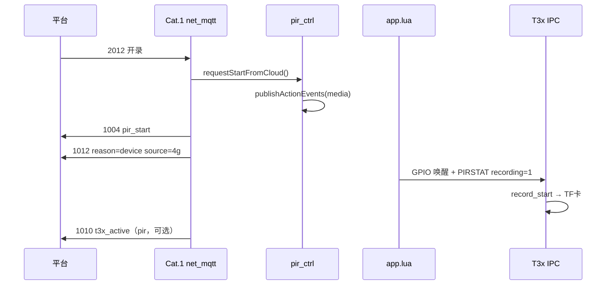

# MQTT 2012 开录 → 1012 上行（4G ↔ T3x 协作）

> **下行**：`{"dataType":"2012"}` → `/panshi/device/{IMEI}/`  
> **上行**：`dataType=1012` → `/panshi/app/{IMEI}/event`  
> **对称停录**：[mqtt_2011_1011_flow.md](mqtt_2011_1011_flow.md) · [mqtt_2010_2012_2011_pir_flow.md](mqtt_2010_2012_2011_pir_flow.md) · [PIR_PROTOCOL.md](/mnt/share/doc/PIR_PROTOCOL.md)

**说明**：2012 是平台 **开录指令**，开的是 **TF 卡本地 MP4**（T3x 写 `/mnt/sdcard/media/...`），**不是**「云端录像」。详见 [T3X_RECORD_MQTT_FLOW.md §0](T3X_RECORD_MQTT_FLOW.md#0-术语不是云端录像)。

---

## 1. 编号与主题

| 下行 | 上行 | 主题 | 说明 |
|------|------|------|------|
| **2012** | **1012** | `event` | 平台 2012 开录受理（TF 卡写盘；与 **2011↔1011** 个位对齐） |
| — | **1010** | `pir` | PIR 检测 / T3x 写盘 `t3x_active`（非 2012 的直接应答） |

受理或拒绝后 **立即 1004** `action=pir_start`；另发 **1012**。Subscribe **`/panshi/app/{IMEI}/event`**。

---

## 2. 谁处理 2012？

| 侧 | 是否解析 MQTT 2012 | 职责 |
|----|-------------------|------|
| **Cat.1（4G）** | ✅ `net_mqtt.handleDownlink2012` | 开 4G 录像会话、唤醒 T3x、上报 **1012** |
| **T3x（IPC）** | ❌ | 被唤醒后读 `PIRSTAT`，按 `action` 在 TF 卡开录 |

---

## 3. 端到端流程



---

## 4. 4G 侧步骤（代码）

1. **`handleDownlink2012`** → `pir_ctrl.requestStartFromCloud(opts)`
2. **拒绝**（无 1012，日志 `downlink_2012_error`）：`startOnCloud=0`、suspend、已在录、`devinfo`
3. **受理**：`publishControlReply(pir_start)` + **`publishPirRecordStart`** → **1012** on `event`
4. T3x 写盘后：现有路径发 **1010** `t3x_active` on `pir`

---

## 5. 1012 字段说明

```json
{
  "deviceNo": "862323084068314",
  "dataType": "1012",
  "reason": "device",
  "source": "4g",
  "action": "video",
  "uploadMode": "auto",
  "quality": "high",
  "recording": 1,
  "time": "2026-06-12 12:00:00"
}
```

| 字段 | 含义 |
|------|------|
| `reason` | `device` = 平台 **2012** 开录 |
| `source` | `4g` = 4G 调度会话已开（**非**视频已上云） |
| `recording` | `1` |

---

## 6. 下行 JSON

```json
{"dataType":"2012","messageId":"start-001"}
```

2010 启用：`startOnCloud=1`（`AT+PIRSTAT?` 见 `start_cloud=1`）。

---

## 7. 日志速查

| 日志 | 含义 |
|------|------|
| `downlink_2012_msg` / `downlink_2012_start` | 收到 2012 |
| `pub 1012` | 上行开录确认 |
| `downlink_2012_error` | 拒绝（denied/busy/suspended） |

---

## 8. 源码索引

| 能力 | 4G |
|------|-----|
| 2012 入口 | `net_mqtt.lua` `handleDownlink2012` |
| 开录策略 | `pir_ctrl.lua` `requestStartFromCloud` |
| 1012 发布 | `net_mqtt.lua` `publishPirRecordStart` |

---

## 修订

| 日期 | 说明 |
|------|------|
| 2026-06-07 | 编号 **2012↔1012**（原 2013↔1013）；与 **2011↔1011** 停录对称 |
