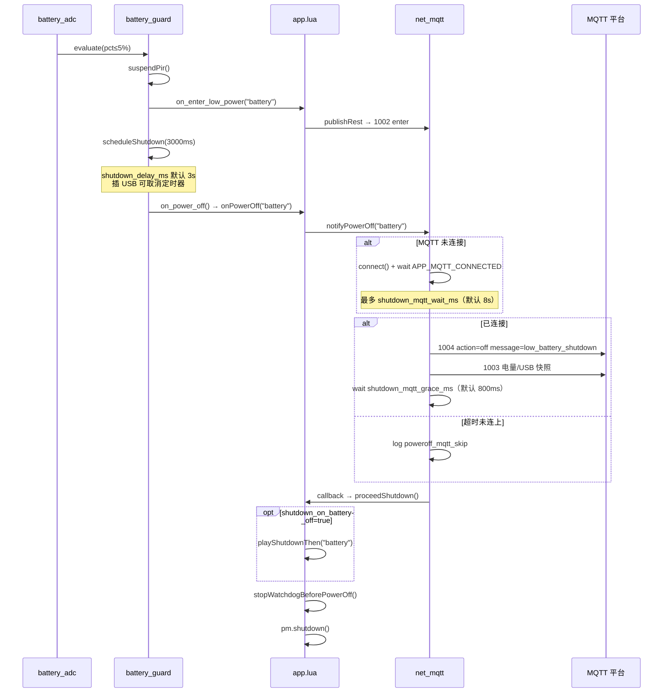

# MQTT 低电量关机与状态上报流程

Cat.1 在 **电量 ≤5% 且未插 USB** 时排程整机关机。2026-06 起：**关机前先尽量连上 MQTT，上报 1004 + 1003，再执行关机音与 `pm.shutdown()`**。

相关背景：[LOW_BATTERY_AND_LOW_POWER.md](./LOW_BATTERY_AND_LOW_POWER.md)、[BOOT_SHUTDOWN_SOUND.md](./BOOT_SHUTDOWN_SOUND.md)。

---

## 1. 电量分档（未插 USB，`battery` 策略默认）

| 电量 | 行为 |
|------|------|
| >20% | 常电；拒绝 HOSTIDLE |
| 5%～20% | T31 可 HOSTIDLE；4G 仍 normal；PIR 唤醒后 30s 内拒 HOSTIDLE |
| ≤5% | 挂起 PIR + 4G rest（1002）+ 延时关机（默认 3s） |

`hybrid` 策略另含 ≤`t3x_rest_percent` 进 4G rest。配置真源：`user/config.lua` → `BATTERY_CFG.guard`。模块逻辑见 [LUA_MODULES.md](LUA_MODULES.md)。

---

## 2. 低电量关机端到端时序



---

## 3. 与其他关机路径对比

| 触发源 | `reason` | 关机前 MQTT | 1004 说明 |
|--------|----------|-------------|-----------|
| 电量 ≤5% | `battery` | **1004 off + 1003** | `message=low_battery_shutdown` |
| PWRKEY 长按 | `user` | 1004 off + 1003 | `message=user_shutdown` |
| MQTT **2004** `off` | `mqtt` | 仅 **1003**（2004 已回 1004） | 不重复发 off |
| AT+POWEROFF | `user` | 1004 off + 1003 | 同 user |

云端 **2004 off** 流程不变：先 `publishControlReply("off")` → 再 `DEVICE_POWER_OFF_REQUEST` → `onPowerOff("mqtt")`。

---

## 4. MQTT 上行报文

Topic 前缀：`/panshi/app/{deviceNo}/`

### 4.1 1004 — 关机通知（`event`）

低电量关机示例：

```json
{
  "deviceNo": "862323084068124",
  "dataType": "1004",
  "reply": 1,
  "messageId": "",
  "action": "off",
  "ret": 0,
  "message": "low_battery_shutdown",
  "time": "2026-06-28 11:36:25"
}
```

| `message` 值 | 含义 |
|--------------|------|
| `low_battery_shutdown` | 电量 ≤5% 自动关机 |
| `user_shutdown` | 用户/AT 关机 |
| `ok` | 云端 2004 已受理（仅 2004 路径） |

### 4.2 1003 — 关机前最终状态（`status`）

紧接 1004 后上报，含当前电量、USB、充电等（跳过 IPC 慢查询）：

```json
{
  "deviceNo": "862323084068124",
  "dataType": "1003",
  "usbInserted": 0,
  "charging": 0,
  "remainPower": "4",
  "batteryMv": "3550",
  "lowPowerMode": "rest",
  "interval": 30,
  "time": "2026-06-28 11:36:25"
}
```

### 4.3 1002 — 进 rest（关机前已发）

电量 ≤5% 时会先 `enterBatteryRest()` → `onEnterLowPower("battery")`，通常已发过：

```json
{
  "dataType": "1002",
  "lowPowerMode": "enter",
  "reason": "battery",
  "source": "enter"
}
```

---

## 5. 代码模块

| 模块 | 路径 | 职责 |
|------|------|------|
| 电量评估 | `user/battery_guard.lua` | `evaluate()` → `scheduleShutdown()` |
| 关机入口 | `user/app.lua` | `onPowerOff()` → `notifyPowerOff()` |
| MQTT 上报 | `user/net_mqtt.lua` | `notifyPowerOff()` |
| 配置 | `user/config.lua` | `BATTERY_CFG.guard.*` |

### 5.1 `notifyPowerOff(reason, callback)`

```lua
-- 1. 未连接则 mqttClient:connect() + waitUntil("APP_MQTT_CONNECTED", waitMs)
-- 2. reason ~= "mqtt" 时 publishControlReply("off", 0, msg, {})
-- 3. publishStatus({ skip_ipc_stat_refresh = true })
-- 4. sys.wait(graceMs)
-- 5. callback() → 关机音 → pm.shutdown()
```

### 5.2 `onPowerOff` 安全逻辑

- 低电关机路径：执行 `pm.shutdown()` 前再次检查 `battery_guard.isUsbInserted()`，**插 USB 则取消关机**（`power_off_cancel_usb`）。
- 关机前调用 `stopWatchdogBeforePowerOff()`，避免看门狗模块未定义导致 Lua VM 崩溃。

---

## 6. 配置项

`BATTERY_CFG.guard`（`/mnt/share/user/config.lua`）：

| 键 | 默认 | 说明 |
|----|------|------|
| `shutdown_percent` | 5 | ≤此值排程关机 |
| `shutdown_delay_ms` | 3000 | 进 rest 后多久触发 `on_power_off` |
| `shutdown_mqtt_wait_ms` | 8000 | 关机前等待 MQTT 连接上限 |
| `shutdown_mqtt_grace_ms` | 800 | 1004/1003 发出后留空 |
| `ignore_when_usb_inserted` | true | 插 USB 时不评估低电关机 |

提示音（可选）：

| 键 | 默认 | 说明 |
|----|------|------|
| `SOUND_CFG.shutdown_on_battery_off` | false | ≤5% 自动关机是否播关机音 |

---

## 7. `charging` 与 `usbInserted`（1003 字段）

1003 中两字段来源不同，**2026-06 起软件联动**：

| 字段 | GPIO | 规则 |
|------|------|------|
| `usbInserted` | GPIO27 `USB_DET` | 低=已插 |
| `charging` | GPIO17 `CHG_STATE` | **须 USB 已插且 GPIO17 有效** |

实现：`lib/usb_charge.lua` → `effectiveCharging()` = `readUsbInserted() and readCharging()`。

未插 USB 时 GPIO17 悬空/上拉不再误报 `charging=1`。

---

## 8. 联调日志

| 标签 | 关键字 | 含义 |
|------|--------|------|
| `battery_guard` | evaluate / scheduleShutdown | 电量判定 |
| `app_main` | `power_off battery` | 进入关机 |
| `net_mqtt` | `poweroff_mqtt_wait` | 等待 MQTT |
| `net_mqtt` | `poweroff_mqtt_sent` | 已发 1004+1003 |
| `net_mqtt` | `poweroff_mqtt_skip` | MQTT 未连上，仍继续关机 |
| `net_mqtt` | `publish_1004_control` | 1004 详情 |
| `net_mqtt` | `publish_1003_status` | 1003 详情 |
| `app_main` | `power_off_cancel_usb` | 等 MQTT 期间插 USB，取消关机 |
| `usb_charge` | USB_DET / CHG_STATE | GPIO 原始状态 |

### 8.1 典型失败场景

**MQTT socket connect ret=-1**：设备仍会 `poweroff_mqtt_wait` 重试最多 8s；失败则 `poweroff_mqtt_skip` 后照常关机，**不会无限阻塞**。

---

## 9. 平台侧建议

1. 收到 `1004` `message=low_battery_shutdown` 后标记设备 **即将离线**，勿再下发需长时执行的 200x。
2. 结合同批 **1003** 的 `remainPower` / `batteryMv` 做低电告警。
3. 若仅收到 **1002 enter reason=battery** 而无 1004，可能是 MQTT 未连上即关机，查 broker 可达性与 `poweroff_mqtt_skip` 日志。

---

## 10. 相关文档

- [mqtt_tfcard_format_flow.md](./mqtt_tfcard_format_flow.md) — TF 卡格式化 2009/1009
- [LOW_BATTERY_AND_LOW_POWER.md](./LOW_BATTERY_AND_LOW_POWER.md) — 低电与 rest 策略
- [MQTT_862323084068314.md](./MQTT_862323084068314.md) — 1003/1004 字段说明
- [BOOT_SHUTDOWN_SOUND.md](./BOOT_SHUTDOWN_SOUND.md) — 关机提示音策略
