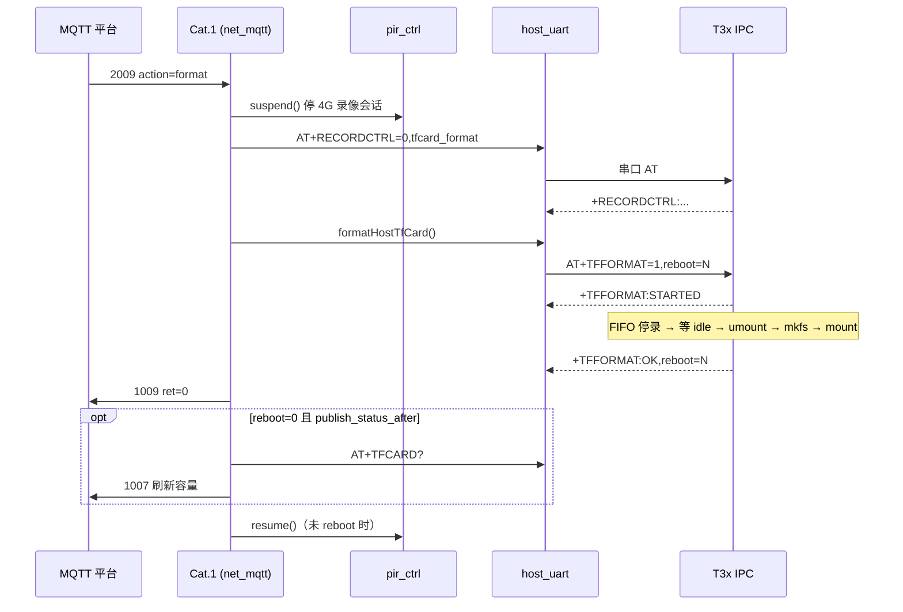

# MQTT TF 卡远程格式化流程（2009 / 1009）

平台通过 MQTT 下发 **2009** 格式化指令，Cat.1 经 UART 转发至 T3x IPC，完成 **停录 → umount → mkfs → mount → 可选重启** 后上报 **1009**。

相关查询仍用 **2007 → 1007**（TF 卡容量/在位状态）。

---

## 1. 端到端时序



---

## 2. MQTT 协议

### 2.1 下行 2009 — 格式化

Topic：`/panshi/device/{deviceNo}/`

```json
{
  "deviceNo": "862323084068314",
  "dataType": "2009",
  "action": "format",
  "messageId": "fmt-20260623-001",
  "reboot": 0
}
```

| 字段 | 说明 |
|------|------|
| `action` | 固定 `"format"` |
| `messageId` | 可选，原样回传 1009 |
| `reboot` | `0` 不重启（默认）；`1` 格式化成功后 T3x 重启。未传时用 `HOST_TFCARD_FORMAT_CFG.reboot_after` |

### 2.2 上行 1009 — 格式化结果

Topic：`/panshi/app/{deviceNo}/`

成功：

```json
{
  "deviceNo": "862323084068314",
  "dataType": "1009",
  "ret": 0,
  "message": "ok",
  "reboot": 0,
  "messageId": "fmt-20260623-001",
  "time": "2026-06-23 14:30:00"
}
```

失败示例：

```json
{
  "dataType": "1009",
  "ret": -1,
  "message": "timeout",
  "messageId": "fmt-20260623-001"
}
```

| `message` 常见值 | 含义 |
|------------------|------|
| `ok` | 格式化完成 |
| `disabled` | `HOST_TFCARD_FORMAT_CFG.enabled=false` |
| `busy` | 已有格式化任务 |
| `timeout` | 等待 T3x 应答超时（默认 120s） |
| `no_uart` / `t3x_unavailable` | T3x 未唤醒或串口不可用 |
| `not_recording` 等 | T3x 侧错误码字符串（见 §4.3） |

---

## 3. Cat.1 侧实现

| 模块 | 文件 | 职责 |
|------|------|------|
| MQTT | `net_mqtt.lua` | `handleDownlink2009` → `runTfCardFormat` → `publishTfFormatResult` |
| UART | `host_uart.lua` | `formatHostTfCard()`、`try_tfformat_line()` |
| 配置 | `config.lua` | `HOST_TFCARD_FORMAT_CFG` |
| PIR | `pir_ctrl.lua` | 格式化前 `suspend()`，完成后 `resume()`（未 reboot） |

### 3.1 格式化前停录（Cat.1）

1. **`pir_ctrl.suspend()`**：清除 4G 侧 PIR 录像会话，避免格式化期间再触发。
2. **`recordCtrlStop({ reason = "tfcard_format" })`**：`AT+RECORDCTRL=0,tfcard_format`，通知 T3x 停录。
3. 等待 `pre_format_wait_ms`（默认 500ms）后下发 `AT+TFFORMAT`。

### 3.2 UART AT 交互

| 方向 | 内容 |
|------|------|
| Cat.1 → T3x | `AT+TFFORMAT=1,reboot=0` |
| T3x → Cat.1 | `+TFFORMAT:STARTED`（已接受，后台执行） |
| T3x → Cat.1 | `+TFFORMAT:OK,reboot=0` 或 `+TFFORMAT:ERROR,ret=...` |
| 查询 busy | `AT+TFFORMAT?` → `+TFFORMAT:busy=0|1` |

### 3.3 配置项 `HOST_TFCARD_FORMAT_CFG`

```lua
_G.HOST_TFCARD_FORMAT_CFG = {
    enabled = true,
    format_timeout_ms = 120000,
    record_stop_timeout_ms = 15000,
    pre_format_wait_ms = 500,
    reboot_after = false,
    publish_status_after = true,
    host_boot_wait_ms = 1500,
    t3x_power_wait_ms = 800,
}
```

---

## 4. T3x IPC 侧实现

| 模块 | 文件 | 职责 |
|------|------|------|
| AT 命令 | `app/host/host_at.c` | `AT+TFFORMAT=` / `AT+TFFORMAT?`，后台线程执行 |
| 格式化流程 | `app/host/ipc_tf_format.c` | 停录、umount、mkfs、mount、可选 reboot |
| FIFO | `utils/fifo_cmd/fifo_cmd.c` | `format_sd[:reboot=1]` 本地等价入口 |

### 4.1 T3x 格式化步骤

1. **FIFO 停录**（写入 `/tmp/ipc_cmd`）  
   `rec_stop_all` → `sched_stop_all` → `manual_stop_all` → `rec_stop`
2. **直连停录**：对各通道 `record_stop_ch()`，必要时 `record_stop()`
3. **等待 idle**：最多 15s（`TF_FMT_STOP_WAIT_MS`）
4. **sync + sleep(1)**
5. **umount**：FIFO `umount` + `mmc_sd_umount()`，最多 3 次重试
6. **mkfs**：`mmc_sd_format()`（vfat）
7. **mount**：`mmc_sd_mount()` + FIFO `mount`
8. **可选 reboot**：`reboot(RB_AUTO_REBOOT)`

### 4.2 FIFO 本地触发（调试）

```bash
echo "format_sd" > /tmp/ipc_cmd
# 或格式化后重启
echo "format_sd:reboot=1" > /tmp/ipc_cmd
```

### 4.3 T3x 错误码 `ret`

| ret | 含义 |
|-----|------|
| `0` | 成功 |
| `-1` | 停录超时，录像线程仍在运行 |
| `-2` | umount 失败 |
| `-3` | mkfs 失败 |
| `-4` | mount 失败 |
| `100` | 已有格式化任务（busy） |
| `invalid` / `busy` / `thread` | AT 参数或线程错误 |

---

## 5. 日志关键字（联调）

| 层级 | 关键字 |
|------|--------|
| MQTT | `downlink_2009`、`downlink_2009_recordctrl`、`publish_1009_tfcard_format` |
| UART | `tfformat_tx`、`tfformat_started`、`tfformat_ok`、`tfformat_fail` |
| T3x | `TFFORMAT start`、`fifo stop submitted`、`umount ok`、`mkfs ok`、`mount ok`、`TFFORMAT done` |

---

## 6. 与 2007 的关系

- **2007**：只读查询 TF 在位、总容量、已用、剩余（`AT+TFCARD?` → 1007）。
- **2009**：破坏性写操作；成功后若 `publish_status_after=true` 且未 reboot，会自动再发一次 **1007** 刷新容量。

---

## 7. 注意事项

1. 格式化会 **清空 TF 卡全部数据**，平台侧应二次确认或权限控制。
2. T3x 休眠时 2009 会入队 `pendingHostQueue` 并唤醒 T3x，与 2006/2007 相同。
3. `reboot=1` 时 Cat.1 不会 `pir_ctrl.resume()`，需等设备重启后恢复正常。
4. 停录采用 **FIFO + record_api 双保险**，与 [media_fifo_flow.md](./media_fifo_flow.md) 中录像控制一致。
