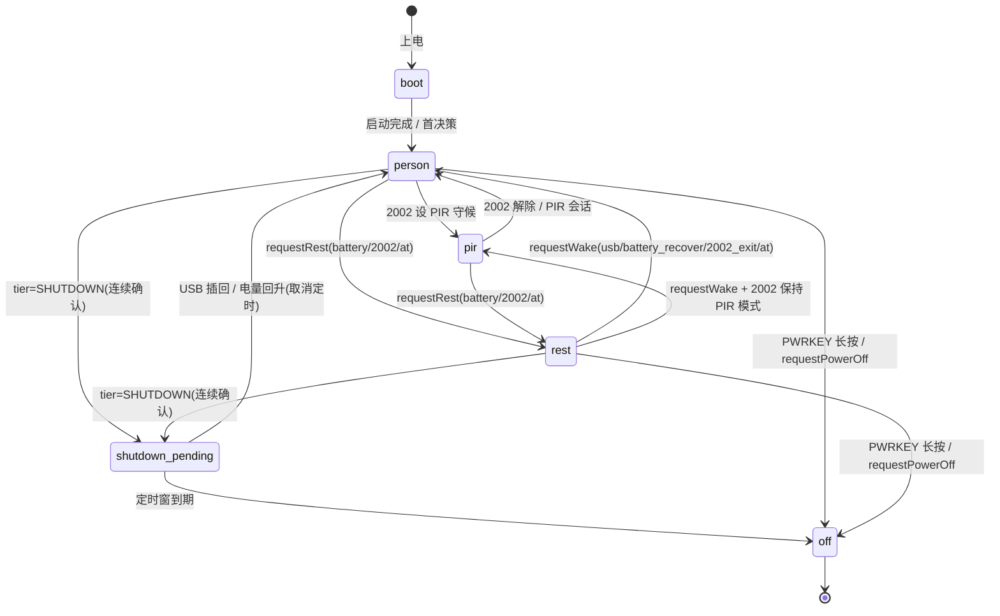

# ARCHITECTURE_REVIEW_POWER_PSM — 电源/低功耗架构评审与电源状态机(PSM)设计稿

> **关联**：[PWR_BUDGET.md](../power/PWR_BUDGET.md) 📌（测量场景/电流档真源）· [LOW_BATTERY_AND_LOW_POWER.md](../power/LOW_BATTERY_AND_LOW_POWER.md) · [LOW_POWER_ENTER_STRATEGY.md](../power/LOW_POWER_ENTER_STRATEGY.md) · [CHARGE_BATTERY.md](../power/CHARGE_BATTERY.md) · [T31X_BATTERY_USB_T31X_OSCILLATION.md](../power/T31X_BATTERY_USB_T31X_OSCILLATION.md)
> **代码真源**：`user/app.lua` · `user/battery_guard.lua` · `user/mqtt_dl_dev.lua` · `lib/runtime_power.lua` · `user/events.lua` · `user/features.lua`
> **性质**：评审快照 + 设计稿。R1 主案 + R2–R4 备选。**R1 已于 2026-09-05 按方案 A 落地（VERSION 157，refactor_plan P6a）**——`runtime_power.requestRest/requestNormal/canRest/bindPowerGates`，实现见 [modules/LOW_POWER_WAKEUP.md §2b](../modules/LOW_POWER_WAKEUP.md)；`work.mode` 二态仍按 §4.8 留 R1v2。以下设计稿保留为落地依据；与 [ARCHITECTURE_REVIEW_20260903.md](ARCHITECTURE_REVIEW_20260903.md)（四主题裁决）互补，本文只聚焦 **power/rest 运行态**。
> **纪律**：一次只动一个变量。每阶段改动前后在 [PWR_BUDGET.md §5](../power/PWR_BUDGET.md) 记录实测。

---

## 1. 摘要（TL;DR）

1. 本固件模块化/文档纪律成熟，power 域运行态却是**唯一的结构性债集中点**：rest 位存在**两个事实来源并行**（`runtime_power.power.rest` 与 `battery_guard.rest_by_battery`），叠加 `work.mode`/USB 多轴布尔，是 rest 抖动、振荡类 bug 的**精确根因**（见 §2.2）。
2. rest **命令**（`POWER_ENTER_REST/EXIT_REST`）与**生效**（`POWER_ENTERED/EXITED_REST`）事件混用，且"已生效"事件无订阅者、由执行者手动广播（app.lua:127/200）——状态**靠查不靠推**，时序审计靠人肉。
3. 主案 **R1**：引入最小电源状态机 PSM，收敛"进入/退出/关断"到单一归属（方案 A，扩展 `lib/runtime_power.lua`，**不新增模块**），状态集与 [PWR_BUDGET §2](../power/PWR_BUDGET.md) S0–S4 一一映射，作为其电流档的实现态。

---

## 2. 代码级评审：power/rest 运行态现状

### 2.1 现状事实表（带定位）

| # | 事实 | 位置 |
|---|---|---|
| F1 | rest 位写入口之一：`rntmPwr.setLowPowerMode(true/false)` | app.lua:120 / app.lua:179 |
| F2 | 下行 2002（`REST_SPEC`）发 `POWER_ENTER_REST`/`POWER_EXIT_REST` 事件 | mqtt_dl_dev.lua:97-100 |
| F3 | app 订阅上述事件 → `onPwrEnterRest/onPwrExitRest` | app.lua EVNT_HNDL:771-772 |
| F4 | "已生效"事件由 **app 自行**在动作完成后发布：`POWER_ENTERED_REST` / `POWER_EXITED_REST`；**注释明示当前无订阅者**（扩展点） | app.lua:126-127 / app.lua:199-200 |
| F5 | rest 位写入口之二：电池路径经 **hooks 回调注入**（`onEnterLowPower/onExitLowPower/onPowerOff`），不经过事件 | battery_guard.lua:153-155 / :165-167 / :214-215 |
| F6 | battery_guard 维护**独立事实**：`guard.rest_by_battery`、`guard.pir_suspended`、`dynamic_rest`、`rest_enter_ts/exit_ts` | battery_guard.lua:147-172, 254-270, 373-388 |
| F7 | tier 判定收口在 battery_guard：`getBatteryTier`/`syncTier`→`rntmPwr.setBatteryTier` | battery_guard.lua:93-110 |
| F8 | rest 状态**读取方**（读 `isLowPowerMode()`）：net_mqtt:612、mqtt_uplink:135、mqtt_conn:236、host_event:106、t31x_policy:66/93、pir_ctrl:672、app:315/579/883/967 | 各模块 |
| F9 | USB 处理在 battery_guard（`isUsbInserted()` 优先、`onUsbIns/onUsbRemoved`），以及 `HOST_USB_CFG.block_4g_rest_when_usb` 门禁 | battery_guard.lua:281-336 · features.lua:52-66 |
| F10 | 进入 rest 的判定策略分散：动态 rest（`dynDetectOn()`）、HOSTIDLE、2002、AT | battery_guard.lua:170-183 · features.lua:34-49 |

### 2.2 根因 1：rest 双事实来源 + 多轴布尔积

rest 语义由多轴组合而成，**没有一个轴是权威**：

- 轴 A：`runtime_power.power.rest`（app:120/179 直写，2002/AT/命令路径）
- 轴 B：`battery_guard.rest_by_battery`（电池路径独立维护，F6）
- 轴 C：`work.mode ∈ {person_detect, pir_watch}`（runtime_power:14-15）
- 轴 D：`power.status`（USB 插入/拔出）
- 轴 E：`battery.tier / dynamic_rest`

A 与 B 必须靠 app hooks 的调用顺序保持一致；`battery_guard` 还自带一套 `rest_enter_ts/exit_ts` 时间戳副本（F6）。任何一路漏同步 → 读方看到不一致（如 `isLowPowerMode()==0` 但 T31x 已断电、或反向）→ 振荡/卡状态。这正是 [T31X_BATTERY_USB_T31X_OSCILLATION.md](../power/T31X_BATTERY_USB_T31X_OSCILLATION.md) 的机制级解释。

### 2.3 根因 2：命令/生效事件混用、生效无权威广播

| 事件 | 语义 | 谁发 | 谁收 |
|---|---|---|---|
| `POWER_ENTER_REST` | **请求**（命令） | mqtt_dl_dev:98（2002）、其余入口 | app:771 |
| `POWER_EXIT_REST` | **请求**（命令） | mqtt_dl_dev:99 | app:772 |
| `POWER_ENTERED_REST` | **已生效** | **app 自发布** :127 | **无订阅者** |
| `POWER_EXITED_REST` | **已生效** | **app 自发布** :200 | **无订阅者** |

问题：生效事件由"执行者=app"自己发，而非由状态翻转的**权威处**发；其余模块只能轮询 `isLowPowerMode()`（F8）。若未来某模块需要"rest 生效后立刻做 X"，它无处订阅，只能猜时序。

### 2.4 缺陷清单（评审结论）

| 编号 | 缺陷 | 定位 | 级别 |
|---|---|---|---|
| a | rest 双事实来源（A/B 轴并行） | F5/F6 vs F1 | P0（结构根因） |
| b | 生效无权威广播（靠查不靠推） | F4、§2.3 | P1 |
| c | 读路径收口、写路径未收口：`_G.APP_RUNTIME = rt` 同一表双通道 | runtime_power.lua:37 | P1 |
| d | 事件总线"半总线"：app 订阅 40 事件，但模块间直 `require` 并存，耦合密度收敛在 app 单点 | events.lua:8-49 · app.lua | P2（现状取舍合理，勿拆） |
| e | 动态加载与打包器静态扫描冲突：`__LUATOOLS_SCAN_ANCHOR__` 挂名 hack，新增模块两处登记 | main.lua:89-122 · config.lua:15 注释 | P2 |

---

## 3. 建议总表 R1–R4

| # | 建议 | 收益 | 成本/风险 | 目标文件 | 状态 |
|---|---|---|---|---|---|
| **R1** | **电源状态机 PSM**：收敛 rest/关断三轴布尔积为单一 `state`，transition 唯一入口 | 消振荡根因、时序可审计、与 PWR_BUDGET 档位直连 | 中（涉及 app/battery_guard/runtime_power 联动） | runtime_power.lua 扩展（方案 A） | 本稿 §4 设计，待拍板 |
| **R2** | 运行态写路径归一：禁直改 `_G.APP_RUNTIME.*`，全走 runtime_power API | 收口名副其实 | 低（纯重构，回归清单位于 §5.2） | 各写点 | 待拍板 |
| **R3** | 模块登记表取代手写挂名（config 片段清单即登记表） | 消除 module-not-found 流程坑 | 低 | config.lua / loader | 待拍板 |
| **R4** | 三端契约对齐：固件 mqtt_* 与 ota/http/video/patch_server 同一契约源 | 联调/版本错位下降 | 中 | server 文档 | 关联 SERVER_CODE_AUDIT_20260904 |

---

## 4. R1 电源状态机（PSM）设计稿

### 4.1 目标与边界

- **目标**：把 §2.2 的 A/B/C/E 布尔积中**与电源/关断相关的部分**收敛为单一 `state`；rest 位 `isLowPowerMode()` 语义对 F8 全部读方**保持不变**（防止回归面）。
- **边界（本版不做）**：
  1. `work.mode`（person_detect/pir_watch）二态**暂不**并入状态机——它是产品工作模式而非纯电源档，且涉及"仅 2002 断 T31x 用 PIR"产品语义；R1 只要求 PSM 能把 PIR 触发作为唤醒源传递。留 R1v2。
  2. 不改 T31x 断电/三级唤醒链内部实现。
  3. 不改 `usb_charge` 的 GPIO 层。
- **取舍**：方案 A（扩展 runtime_power，不新增模块）。理由：脚本区 342KB/512KB 有预算压力，而 runtime_power 已是读收口 + rest 位写点，天然是状态归属处。

### 4.2 状态集合与 PWR_BUDGET 映射

| PSM state | 语义 | PWR_BUDGET 测量场景 | 关联现状（读兼容） |
|---|---|---|---|
| `boot` | 上电引导至首决策完成 | —（瞬态） | — |
| `person` | 常电人形检测：T31x 供电、录像/检测可用 | **S0 常电工作** | `work.mode=person_detect`、`rest=0` |
| `pir` | PIR 守候：T31x 断电待触发（2002 断 T31x 用 PIR 的产品模式） | **S1 PIR 守候** | `work.mode=pir_watch`、`rest=0` |
| `rest` | 低功耗保持：T31x 断、4G MQTT 长连 + 30s stat（`LOW_POWER_CFG.rest_mqtt_interval_sec`）、10s vbat | **S2 REST** | `rest=1`（读方语义不变） |
| `shutdown_pending` | guard 关机定时窗（默认 3s，USB 插回可取消） | S3 低电末档 → S4 | `guard.shutdown_timer ~= nil` |
| `off` | 关机执行/断电（终态，重启回 `boot`） | **S4 关机** | `pm.shutdown()` / PWRKEY |

> **USB 不是状态，是抑制约束（inhibitor）**：`power.status=1` 时禁止进入 `rest`、在 `rest` 中插入则强制回 `person`（沿用 `HOST_USB_CFG.block_4g_rest_when_usb` 语义，battery_guard.lua:281-336 迁移到 transition guard）。
> **guard tier 不是状态，是守卫条件**：15/10/5 档动作保留在 battery_guard（策略引擎），通过 PSM 的 request API 落地：suspendPir → 状态内策略；rest_by_battery → `requestRest("battery")`；SHUTDOWN → `requestShutdown()`。PWR_BUDGET S3 测量场景不变（在 `rest`/`person` 下低档位）。

### 4.3 状态图



> **核对项（落地前确认，未改码）**：① rest 态下 PIR 触发是否直接 `requestWake`（当前 app 的 PIR 处理在 rest 下的具体行为）；② boot 是否可能直接进 `rest`（`boot_no_usb` 场景）。

### 4.4 Transition 请求与守卫

| request | 触发源（现状 → PSM 后） | guard | entry/exit 动作归属 |
|---|---|---|---|
| `requestRest(reason)` | mqtt_dl_dev:98（2002）改直调 · battery_guard:154 hooks.onEnterLowPower 改直调 · AT 入口 | `state ∈ {person,pir}`；`power.status≠1`；非 rest | **保留 app 现有 onEnterLowPower 业务体**（cut T31x、MQTT 间隔、通知），由状态机 entry 触发 |
| `requestWake(reason)` | mqtt_dl_dev:99（2002 exit）· battery_guard:166 hooks.onExitLowPower（battery_recover/usb_insert）· USB 插入 · AT | 无（`rest`→`person`/`pir`） | 保留 app onExitLowPower 业务体，由状态机 exit 触发 |
| `requestShutdown(reason)` | battery_guard:214 hooks.onPowerOff 改直调 · DEVICE_POWER_OFF_REQUEST | 见 §4.2 tier 条件 | 进 `shutdown_pending`，3s 窗内 USB/回升可撤销（保留 battery_guard:205-237 逻辑） |

关键：**`POWER_ENTERED_REST`/`POWER_EXITED_REST` 改由状态机在 state 翻转处唯一发布**（修复根因 2）；app 不再自发布（F4），改订阅执行后置逻辑。

### 4.5 API 形状（方案 A，指引性，非最终实现）

```lua
-- lib/runtime_power.lua 扩展
rt.power.state = "boot"                -- 单一事实（取代 rest 位 + 时间戳副本）
local TRANS = {                        -- state × request → state / 拒绝
    person = { rest = "rest", shutdown = "shutdown_pending" },
    pir    = { rest = "rest", shutdown = "shutdown_pending" },
    rest   = { wake = "person", shutdown = "shutdown_pending" },
    ...
}
function requestRest(reason) ... end
function requestWake(reason)  ... end
function requestShutdown(reason) ... end
function state() return rt.power.state end
-- 兼容层（读方零改动）：
function isLowPowerMode() return rt.power.state == "rest" end
-- 弃用：setLowPowerMode/setPowerStatus 直写改走 request*；迁移完成前保留但标 deprecated
```

### 4.6 现状 → PSM 迁移映射（落地清单）

| 现状符号 | 位置 | PSM 后 |
|---|---|---|
| `rntmPwr.setLowPowerMode(true/false)` | app.lua:120/179 | 删除；改由各触发源直接 `requestRest/reason`（app 只留 entry/exit 动作实现与日志） |
| `POWER_ENTER_REST/EXIT_REST` 事件 | app.lua:771-772 订阅 · mqtt_dl_dev:98-99 | 事件**保留为兼容透传**？否——直调 request*；事件仅作生效通知保留（若需外部 trace） |
| `sys.publish(POWER_ENTERED/EXITED_REST)` | app.lua:127/200 | 移到状态机翻转处唯一发布 |
| `guard.rest_by_battery` | battery_guard.lua:149-171 | 删除；`state==rest` 即事实（日志/诊断经 `rt.power.state` 读） |
| `guard.rest_enter_ts/exit_ts` | battery_guard.lua:151/162 | 由状态机 entry/exit 记 `rt.power.rest_ts` 单份 |
| `hooks.onEnterLowPower/onExitLowPower/onPowerOff` | battery_guard.lua 153-167/214 | battery_guard 改调 `requestRest/requestWake/requestShutdown`；业务动作仍回 app 回调（注入链不变，少一层位写） |
| `guard.shutdown_timer` + 3s 窗 | battery_guard.lua:205-237 | 归入 `shutdown_pending` 态的窗定时器（语义不变） |
| `isBatDynRest()`/`dynamic_rest` | battery_guard.lua:170-172 · runtime_power | 保留（策略输入），不参与 state 判定；仅作为 battery_guard 内部决策 |
| USB 插/拔 → rest 关系 | battery_guard.lua:281-336 | 上提为 guard：`power.status` 变化时对 state 的 requestWake/禁止进入 |
| F8 全部 `isLowPowerMode()` 读方 | 见 §2.1 F8 | **零改动**（兼容层保证） |

### 4.7 回归清单（防回归读点 = F8 + 下行流）

验证矩阵（每项前后各在 PWR_BUDGET §5 记录）：USB 拔插 × {正常、rest、低电}；2002 enter/exit；电量 15/10/5/关机；PIR 触发（rest 内行为，见核对项①）；1003 上报中 `lowPowerMode` 字段（mqtt_conn:236）；FOTA/2004；看门狗。

### 4.8 范围外（留 R1v2 / 不引入）

- `work.mode` 二态并入状态机（R1v2 候选）
- T31x 唤醒三级链重构
- 深度休眠档（`modem_hibernate`/eDRX）——该档落地时应作为 `rest` 的子档扩展（衔接 [PWR_BUDGET §6.2](../power/PWR_BUDGET.md)），PSM 状态表已留扩展位

---

## 5. R2–R4 简述与验收

### 5.1 R2：运行态写路径归一
`runtime_power.lua:37` 双通道的写点清单方法：`grep -rn "_G.APP_RUNTIME" user lib`，凡非 runtime_power 文件的**写入**改走 API；对外暴露只读代理或注释约定。验收：除 runtime_power 外无 `APP_RUNTIME.xxx = ` 直写。风险低，建议在 R1 前完成（R1 会依赖干净的写面）。

### 5.2 R3：模块登记表
config.lua:15 注释与 main.lua:89-122 挂名块的二处登记是历史摩擦。方案：在 config 片段 `flags.lua`/`MODULE_FLAGS` 侧维护 `module → flag` 登记表（LUA_MODULES.md 同源），挂名块由表生成/注释指引，避免手写漂移。

### 5.3 R4：三端契约
固件 `mqtt_*`（1001-1004/1011、2001-2004）与 ota/http/video/patch_server 的字段对齐、报文版本化，作为 SERVER_CODE_AUDIT_20260904 的后续执行项；产出单侧契约文档。

---

## 6. 建议实施顺序（每步一个变量，实测对照）

| Phase | 动作 | 前置 | 验收 |
|---|---|---|---|
| 0 | [PWR_BUDGET](../power/PWR_BUDGET.md) §5 首测（S2 基线为必测） | 实机 + 电流采样 | S2 avg 入账 |
| 1 | R2 写路径归一（纯重构） | Phase 0 | 回归矩阵过；脚本体积无回退 |
| 2 | R1 PSM 落地（本稿 §4，先核对 §4.3 两项） | Phase 1 | 全回归 + S2 复测对比 Phase 0 |
| 3 | R3 登记表 · R4 契约（互不依赖，可并行） | 任意 | 独立验收 |

> 若 Phase 2 前 PWR_BUDGET 实测表明 S2 已远超预算线且优先省电，则先评估 [PWR_BUDGET §6](../power/PWR_BUDGET.md) 的上报窗口化/4G 档位（作为独立变量），PSM 照常落地不影响该测量。

---

## 修订

| 日期 | 说明 |
|---|---|
| 2026-09-04 | 首版：power/rest 代码级评审（双事实来源根因）+ R1 PSM 设计稿 + R2–R4 备选 + 实施顺序（衔接 PWR_BUDGET） |
