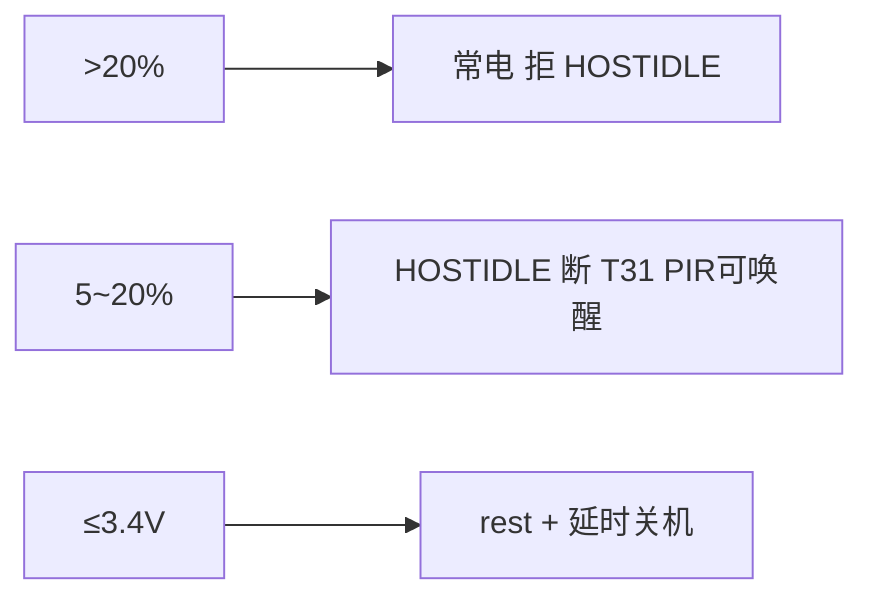

# 配置说明（命名规范与索引）

> **硬件/编排**：[`../user/config.lua`](../../user/config.lua)（require `features`/`cellular`/`t31x_burn`/`gpio_cfg`/`led_pir`/`battery`/`host`/`net`/`flags`/`events`）  
> **开关**：`MODULE_FLAGS` → [`../user/flags.lua`](../../user/flags.lua) · **特性**：`FEATURE_CFG` → [`../user/features.lua`](../../user/features.lua)  
> **事件**：`APP_EVENTS` → [`../user/events.lua`](../../user/events.lua) · **引脚/按键**：`GPIO_IN`/`GPIO_OUT`/`KEY_CONFIG` → [`../user/gpio_cfg.lua`](../../user/gpio_cfg.lua)  
> **PIR 媒体**：[`../user/pir_ctrl.lua`](../../user/pir_ctrl.lua)  
> **T31x 协处理器**：[`../user/t31x_ctrl.lua`](../../user/t31x_ctrl.lua)  
> **加载**：`main.lua` → `config`（编排 → 各片段）

## 配置键总索引（键 → 注册片段 → 消费模块）

> 回答「这个 `X_CFG` 在哪定义、谁在读」。表由护栏脚本从代码生成并校验漂移（`run_all_checks` 第 7 项），
> 改配置片段后运行 `python tools/debug/_config_key_check.py --write-doc` 刷新。

<!-- CFG_KEY_INDEX:BEGIN -->
| 配置键 | 注册片段 | 消费模块（注册文件以外） |
|--------|----------|--------------------------|
| `APP_META` | `user/features.lua` | `user/app.lua`、`user/hif_cmd.lua`、`user/host_uart.lua`、`user/net_mqtt.lua` |
| `APP_RUNTIME_DEFAULTS` | `user/features.lua` | `lib/runtime_power.lua` |
| `APP_STACK` | `user/features.lua` | `user/app.lua` |
| `FEATURE_CFG` | `user/features.lua` | `user/battery_guard.lua`、`user/flags.lua`、`user/hif_cmd.lua`、`user/host_event.lua`、`user/main.lua` |
| `HOST_EVT_CFG` | `user/features.lua` | `user/hif_cmd.lua`、`user/host_event.lua` |
| `HOST_USB_CFG` | `user/features.lua` | `user/app.lua`、`user/host_uart.lua`、`user/t31x_ctrl.lua`、`lib/usb_charge.lua`、`lib/usb_rndis.lua` |
| `LOW_POWER_CFG` | `user/features.lua` | `user/battery.lua`、`user/hif_cmd.lua`、`user/host.lua`、`user/mqtt_uplink.lua` |
| `LOW_POWER_WAKEUP_CFG` | `user/features.lua` | `user/lp_wakeup.lua` |
| `RNDIS_CFG` | `user/features.lua` | `lib/usb_rndis.lua` |
| `CELLULAR_CFG` | `user/cellular.lua` | `lib/cell_boot.lua` |
| `t31x_BURN_CFG` | `user/t31x_burn.lua` | `user/t31x_burn_ctrl.lua` |
| `GPIO_IN` | `user/gpio_cfg.lua` | `user/app.lua`、`user/led_pir.lua`、`lib/usb_charge.lua` |
| `GPIO_OUT` | `user/gpio_cfg.lua` | `user/app.lua`、`user/t31x_ctrl.lua`、`lib/led_ctrl.lua` |
| `KEY_CONFIG` | `user/gpio_cfg.lua` | `user/peripheral.lua` |
| `APP_PERSIST_CFG` | `user/led_pir.lua` | `user/mqtt_uplink.lua`、`user/pir_ctrl.lua` |
| `LED_CFG` | `user/led_pir.lua` | `user/host_uart.lua`、`lib/led_ctrl.lua` |
| `PIR_CFG` | `user/led_pir.lua` | `user/app.lua`、`user/pir_ctrl.lua` |
| `PIR_COOLDOWN_MS` | `user/led_pir.lua` | （片内引用） |
| `PIR_RECORD_CFG` | `user/led_pir.lua` | `user/app.lua` |
| `WLED_CFG` | `user/led_pir.lua` | `user/hif_cmd_wled.lua` |
| `BATTERY_CFG` | `user/battery.lua` | `user/mqtt_uplink.lua`、`user/net_mqtt.lua`、`user/t31x_policy.lua`、`user/vbat.lua`、`lib/led_ctrl.lua` |
| `BATTERY_GUARD_CFG` | `user/battery.lua` | `user/battery_guard.lua` |
| `LOW_POWER_ENTER_STRATEGY` | `user/battery.lua` | `user/battery_guard.lua` |
| `t31x_POLICY_CFG` | `user/battery.lua` | `user/t31x_policy.lua` |
| `HOST_ENCODE_CFG` | `user/host.lua` | `user/hif_ipc.lua`、`user/hif_ipc_encode.lua`、`user/mqtt_hproto.lua` |
| `HOST_IDENTITY_CFG` | `user/host.lua` | `user/hif_cmd_link.lua`、`user/hif_ipc.lua`、`user/mqtt_dl_dev.lua` |
| `HOST_IPC_CFG` | `user/host.lua` | `user/hif_ipc_cloud.lua`、`user/hif_ipc_power.lua`、`user/hif_ipc_rec.lua`、`user/sound_prompt.lua`、`user/t31x_ctrl.lua` |
| `HOST_PROTO_TMO` | `user/host.lua` | `user/hif_ipc_cloud.lua`、`user/hif_ipc_hostq.lua`、`user/hif_ipc_power.lua`、`user/host_uart.lua`、`user/mqtt_dl_pir.lua`、`user/net_mqtt.lua`、`user/sound_prompt.lua`、`user/time_sync.lua` |
| `HOST_RECORD_CFG` | `user/host.lua` | `user/hif_ipc_hostq.lua`、`user/mqtt_dl_pir.lua` |
| `HOST_TFCARD_CFG` | `user/host.lua` | `user/hif_ipc.lua`、`user/mqtt_dl_tf.lua` |
| `HOST_TFCARD_FORMAT_CFG` | `user/host.lua` | `user/hif_ipc_tffmt.lua`、`user/mqtt_dl_pir.lua`、`user/mqtt_dl_tf.lua` |
| `HOST_WAKE_CFG` | `user/host.lua` | `user/app.lua`、`user/host_uart.lua`、`user/mqtt_downlink.lua`、`user/t31x_ctrl.lua`、`user/t31x_notify.lua`、`user/t31x_policy.lua` |
| `SOUND_CFG` | `user/host.lua` | `user/sound_prompt.lua`、`user/t31x_ctrl.lua` |
| `TIME_SYNC_CFG` | `user/host.lua` | `user/app.lua`、`user/hif_cmd.lua`、`user/hif_ipc.lua`、`user/t31x_ctrl.lua`、`user/time_sync.lua` |
| `FOTA_CFG` | `user/net.lua` | `user/fota_svc.lua`、`user/mqtt_dl_ctrl.lua` |
| `MQTT_CFG` | `user/net.lua` | `user/mqtt_conn.lua`、`user/net_mqtt.lua` |
| `UART_CFG` | `user/net.lua` | `lib/uart_bridge.lua` |
| `WDT_CFG` | `user/net.lua` | `user/app.lua`、`lib/watchdog.lua` |
| `MODULE_FLAGS` | `user/flags.lua` | `user/hif_cmd.lua`、`user/host_event.lua`、`user/t31x_notify.lua`、`lib/module_loader.lua` |
| `APP_EVENTS` | `user/events.lua` | `user/app.lua`、`user/fota_svc.lua`、`user/host_uart.lua`、`user/mqtt_dispatch.lua`、`user/mqtt_dl_ctrl.lua`、`user/mqtt_dl_dev.lua`、`user/mqtt_uplink.lua`、`user/net_mqtt.lua`、`user/peripheral.lua`、`user/pir_ctrl.lua`、`user/time_sync.lua`、`user/vbat.lua`、`lib/led_ctrl.lua`、`lib/runtime_power.lua`、`lib/usb_charge.lua` |

> 共 40 键 / 10 片段；由 `python tools/debug/_config_key_check.py --write-doc` 生成，手改会被护栏判漂移。消费形态含 `cfgm.get("KEY")` / `_G.KEY` / 裸 `KEY`。
<!-- CFG_KEY_INDEX:END -->

## 命名约定

| 类别 | 规则 | 示例 |
|------|------|------|
| Lua 文件 | `snake_case` | `uart_bridge.lua`（lib）、`host_uart.lua`（T31x 串口业务）、`t31x_ctrl.lua`、`pir_ctrl.lua` |
| 配置表 | `*_CFG` | `GPIO_IN`、`MQTT_CFG` |
| 运行时 | `APP_RUNTIME` | `battery_percent`、`online_status` |
| 表内字段 | `snake_case` | `init_level`、`trigger_mode` |

---

## Air780 GPIO 编号对照（`user/gpio_cfg.lua`）

> **`pin` 列 = 4G GPIO 号**（非模组物理 Pin）。完整表见 [T31X_CAT1_GPIO.md §1.1](../hardware/T31X_CAT1_GPIO.md#11-780ehm_pj-固件-gpio-对照configlua-真源)。  
> **易混**：4G **GPIO26** = 模组 **Pin25** `CAN_TXD`（`T31x_BOOT`）；模组 **Pin26** = `PWM4`。

| 方向 | `config` 键 | 4G GPIO | 模组 Pin | 丝印 | 原理图网络 |
|------|-------------|-----------|----------|------|------------|
| IN | `pwr_key` | 46 | 7 | PWRKEY | K1 |
| IN | `boot_key` | 28 | 78 | GPIO28 | 烧录键 |
| IN | `coproc_ready` | 29 | 30 | GPIO29 | 协处理器就绪 |
| IN | `usb_det` | 27 | 16 | GPIO27 | USB_DET |
| IN | `chg_state` | 17 | 100 | GPIO17 | CHG_STATE |
| IN | `pir_det` | 30 | 31 | GPIO30 | PIR_MCU_DET |
| IN | `misc_pullup` | 7 | 7 | — | 预留 |
| OUT | `led_red` | 20 | 102 | GPIO20 | **本板未用**（`enabled=false`） |
| OUT | `bat_stat_led` | 21 | 107 | GPIO21 | **LED2 蓝灯**（`led_ctrl` single_blue） |
| OUT | `t31x_pwr_wake` | 22 | 19 | GPIO22 | CPU_PWR_EN |
| OUT | `t31x_boot` | **26** | **25** | **CAN_TXD** | **T31x_BOOT** |
| OUT | `t31x_ota` | 32 | 33 | GPIO32 | USB_DEBUG_EN |
| OUT | `t31x_mcu_int` | 29 | 30 | GPIO29 | MCU_INT_CPU |

烧录三根输出：**GPIO26 + GPIO32 + GPIO22** → [T31X_BURN_MODE.md](../hardware/T31X_BURN_MODE.md)

---

## GPIO_IN（输入）

每个信号一项，**按注释分组**写在 `user/gpio_cfg.lua` 中。

| 字段 | 类型 | 说明 |
|------|------|------|
| `pin` | number | **4G GPIO 号**（见上文对照表；≠ 模组物理 Pin） |
| `net_name` | string | 原理图网络名 |
| `pull` | string | `pullup` / `pulldown` |
| `trigger_mode` | string | `rising` / `falling` / `both` |
| `debounce_ms` | number | 防抖(ms) |
| `active_level` | 0/1 | 有效电平（插入/触发/按下） |

| 键 | 4G GPIO | 默认 `active_level` | 模组 Pin | 说明 |
|----|-----------|---------------------|----------|------|
| `pwr_key` | **46**（`gpio.PWR_KEY`） | **0** | 7 PWRKEY | 按下为低 |
| `boot_key` | 28 | **0** | 78 GPIO28 | 长按烧录 |
| `coproc_ready` | 29 | **1** | 30 GPIO29 | 下拉，就绪为高 |
| `usb_det` | 27 | **0** | 16 GPIO27 | USB 插入为低 |
| `chg_state` | 17 | **1** | 100 GPIO17 | 充电中为高 |
| `pir_det` | 30 | **1** | 31 GPIO30 | PIR 触发为高 |
| `misc_pullup` | 7 | 1 | 7 | 预留 |

初始化由 `lib/gpio_util.lua` → `setupInputEntry()` 完成（非 `init_level` 驱动）。

---

## GPIO_OUT（输出）

| 字段 | 类型 | 说明 |
|------|------|------|
| `pin` | number | **4G GPIO 号**（见上文对照表；≠ 模组物理 Pin） |
| `net_name` | string | 原理图网络名 |
| `init_level` | 0/1 | **上电** `gpio.setup` 电平（通常 **0**=灭/断电） |
| `on_level` | 0/1 | 逻辑「开」（通常 **1**=亮/供电） |

| 键 | 4G GPIO | `init_level` | `on_level` | 模组 Pin | 模块 |
|----|-----------|--------------|------------|----------|------|
| `led_red` | 20 | **0** | **1** | 102 | **未用**（`enabled=false`） |
| `bat_stat_led` | 21 | **1** | **0** | 107 | `led_ctrl` 单蓝灯 |
| `t31x_boot` | **26** | **0** | **1** | **25** `CAN_TXD` | `t31x_ctrl` → `T31x_BOOT` |
| `t31x_ota` | 32 | **0** | **1** | 33 | `t31x_ctrl` → `USB_DEBUG_EN` |
| `t31x_pwr_wake` | 22 | **0** | **1** | 19 | `t31x_ctrl` → `CPU_PWR_EN` |
| `t31x_mcu_int` | 29 | 1 | 0 | 30 | `t31x_ctrl` → `MCU_INT_CPU` 脉冲 |

**`USB_DEBUG_EN`（GPIO32）运行时电平**：上电/正常运行 **低**；GPIO28 长按进 T31x 烧录 **高**；`exitBootMode` 后 **低**；`AT+USBRESET` 为 **高约 300ms 再低**（见 [T31X_CAT1_GPIO §1.2](../hardware/T31X_CAT1_GPIO.md#12-usb_debug_engpio32电平)）。

修改 LED/协处理器默认亮灭：**只改 `init_level` / `on_level`**，无需改业务代码。

---

## PIR / 电池 / 连接

- `PIR_CFG`：由 `GPIO_IN.pir_det` 自动带出中断参数 + `PIR_COOLDOWN_MS.frequent`
- `BATTERY_CFG`：ADC 采样、模组灯、电量保护（真源 [`user/battery.lua`](../../user/battery.lua)）；行为见 [LOW_BATTERY_AND_LOW_POWER.md](../power/LOW_BATTERY_AND_LOW_POWER.md)
- `t31x_BURN_CFG.min_battery_percent`：烧录前最低电量（默认 20%，与 `guard` 无关）
- `MODULE_FLAGS.battery_guard`：[`flags.lua`](../../user/flags.lua)，`false` 可关闭电量保护

### `BATTERY_CFG` 字段一览

| 分组 | 字段 | 默认 | 说明 |
|------|------|------|------|
| **adc** | `channel` | `1` | BAT_ADC / ADC1 |
| | `mv_scale` | `3326/1131` | 引脚 mV × scale = 电芯 mV |
| | `divider` | 1000K+510K | `mv_scale` 为 nil 时自动计算 |
| | `mv_calibration` | `3812/3608` | 板级实测校准系数（见 §10） |
| **filter** | `sample_count` | `11` | 每周期 ADC 子采样次数 |
| | `sample_spacing_ms` | `20` | 子采样间隔（ms） |
| | `trim_drop` | `2` | 排序后去掉首尾各 N 个再均值 |
| | `ema_alpha` | `0.35` | 电芯 mV 指数平滑（0～1） |
| | `mv_max_step` | `35` | 每周期 mV 最大变化（限幅） |
| | `percent_hyst_high_mv` | `4120` | 已为 100% 时，低于此 mV 才降百分比 |
| | `percent_max_step` | `2` | 每周期百分比最大变化 |
| **cell** | `v_max_mv` / `v_min_mv` | 4200 / 3000 | 映射 100% / 1% |
| | `sample_interval_ms` | 10000 | `vbat` 采样周期 |
| | `mqtt_report_interval_sec` | 60 | MQTT 1003 `remainPower` 周期 |
| **led** | `high_threshold` | 70 | &gt;70% 蓝常亮（详见 [LED_INDICATORS.md](../hardware/LED_INDICATORS.md)） |
| | `medium_threshold` | 20 | 20～70% 蓝闪；≤20% 红闪 |
| | `high_hold` / `medium_*` / `low_*` | 见 config | `led_ctrl.lua 时序 |
| **guard** | `enabled` | true | 总开关（另受 `MODULE_FLAGS.battery_guard`） |
| | `ignore_when_usb_inserted` | true | **GPIO27 插入**时跳过阈值评估；插入时恢复 PIR / 取消关机 |
| | `host_idle_below_percent` | 20 | 电量 ≤20% 允许 T31 `HOSTIDLE`（4G 仍 normal） |
| | `host_idle_min_awake_sec` | 30 | 中间档：PIR 唤醒后至少常电 30s 再允许 HOSTIDLE |
| | `shutdown_mv` | 3400 | **电芯 ≤3.4V** 关机（优先于百分比；连续 2 次采样） |
| | `shutdown_recover_mv` | 3500 | >3.5V 才取消已排程关机 |
| | `shutdown_percent` | 5 | 无有效 mV 时回退：≤5% 关机 |
| | `shutdown_delay_ms` | 3000 | 关机前等待；插 USB 可取消 |
| | `t31x_rest_percent` | 10 | **仅 hybrid 策略**：≤10% 进 4G rest |
| | `recover_rest_percent` | 10 | **仅 hybrid 策略**：退出 rest 阈值 |
| | `pir_suspend_percent` | 5 | **仅 hybrid 策略**：挂起 PIR |
| | `require_valid_sample` | true | 电量 `--` 时不执行 guard |

兼容：`_G.BATTERY_GUARD_CFG` 指向 `BATTERY_CFG.guard`（旧代码/文档可继续用此名）。

完整模块逻辑见 [LUA_MODULES.md](LUA_MODULES.md) §3.5。

### 未插 USB 时的电量动作（`battery` 策略，默认）

`hybrid` 策略另含 ≤`t31x_rest_percent` 进 4G rest，见 `LOW_POWER_ENTER_STRATEGY`。

插 **USB_DET（GPIO27）** 后：`battery_guard` 跳过阈值；在 rest 时 `onExitLowPower` 唤醒 T31（冷启动由 `bootPowerOn` 单独上电）。

### `SOUND_CFG` 提示音（`user/host.lua`）

| 字段 | 默认 | 说明 |
|------|------|------|
| `enabled` | true | 总开关（`MODULE_FLAGS.sound_prompt`） |
| `boot_on_cold_start` | true | 收到 T31x **首条 AT** 后发 `AT+PLAYSOUND=boot` |
| `boot_on_wake` | **false** | 低功耗/PIR 唤醒 **不播** 开机音 |
| `shutdown_on_user_off` | true | PWRKEY / MQTT / AT 关机前播 `shutdown` |
| `shutdown_on_low_power` | false | 业务休眠前不播 |
| `shutdown_on_battery_off` | false | 5% 自动关机不播 |
| `boot_wait_host_ms` | 120000 | 等 T31x 首条 AT 超时（毫秒）；超时跳过开机音，**不会无限等待** |
| `play_timeout_ms` | 2500 | 等 `+SOUNDACK` 超时 |
| `t31x_power_wait_ms` | 800 | 发 PLAYSOUND 前若 T31x 未上电则 `powerOn` 后等待 |

冷启动开机音流程（首条 AT、超时、防重复）见 [BOOT_SHUTDOWN_SOUND.md](../pir/BOOT_SHUTDOWN_SOUND.md) §7.3。

实现：`user/sound_prompt.lua`（4G）、`t3x_linux/audio_prompt.c`（T31x 桩）。见 [BOOT_SHUTDOWN_SOUND.md](../pir/BOOT_SHUTDOWN_SOUND.md)。

### `TIME_SYNC_CFG` 时间同步（`user/host.lua`）

| 字段 | 默认 | 说明 |
|------|------|------|
| `enabled` | true | 总开关（`MODULE_FLAGS.time_sync`） |
| `min_valid_unix` | 1704067200 | 低于此视为未同步（防 1970） |
| `sync_on_sntp` | true | SNTP 成功后 `AT+TIMESET` |
| `sync_before_wake` | true | GPIO 唤醒前先设时 |
| `host_boot_wait_ms` | 1500 | T31x 上电后等 UART 就绪 |

见 [TIME_SYNC.md](TIME_SYNC.md)。

### `HOST_IDENTITY_CFG` 设备标识（`user/host.lua`）

Cat.1 IMEI + T31x GB28181 ID；MQTT **2006**→**1006**。见 [MQTT_PROTOCOL.md](../mqtt/MQTT_PROTOCOL.md) §4.6。

| 字段 | 默认 | 说明 |
|------|------|------|
| `enabled` | true | 总开关 |
| `auto_publish_on_ready` | true | T31x 首条 AT 且 MQTT 在线后自动上报 1006 |
| `auto_publish_delay_ms` | 500 | 自动上报前额外等待 |
| `query_timeout_ms` | 3000 | `AT+GB28181?` 等待超时 |
| `host_boot_wait_ms` | 1500 | T31x 上电后等 UART 就绪 |
| `t31x_power_wait_ms` | 800 | 查询前 `powerOn` 后等待 |
| `publish_on_ipcinfo_query` | false | T31x 发 `AT+IPCINFO?` 后是否额外 MQTT 1006 |

T31x 侧在 `client.ini` 配置 `gb28181_id=`。

### `HOST_TFCARD_CFG` TF/SD 卡（`user/host.lua`）

| 字段 | 默认 | 说明 |
|------|------|------|
| `enabled` | true | 总开关 |
| `query_timeout_ms` | 3000 | `AT+TFCARD?` 等待超时 |
| `host_boot_wait_ms` | 1500 | T31x 上电后等 UART 就绪 |
| `t31x_power_wait_ms` | 800 | 查询前 `powerOn` 后等待 |

T31x 挂载点：`client.ini` → `tf_mount_path`（默认 `/mnt/sd`）。见 [MQTT_PROTOCOL.md](../mqtt/MQTT_PROTOCOL.md) §4.7。

### `HOST_USB_CFG` USB 与低功耗互斥（`user/features.lua`）

USB 插入（GPIO27 / VBUS）时：4G **不进 rest**、拒绝 T31x `AT+HOSTIDLE=1` / `AT+LOWPOWER=ENTER`，并串口通知 T31x 勿发休眠 AT。拔出后通知 T31x 可恢复 `HOSTIDLE` 轮询。见 [T31X_USB_HOSTIDLE.md](../power/T31X_USB_HOSTIDLE.md)。

| 字段 | 默认 | 说明 |
|------|------|------|
| `block_host_idle_when_usb` | true | T31x 发 `AT+HOSTIDLE=1` → 4G 回 `+HOSTIDLE:USB` |
| `block_4g_rest_when_usb` | true | `onEnterLowPower`、MQTT 2002、`AT+LOWPOWER=ENTER` 在 USB=1 时忽略 |
| `notify_t31x_usb_state` | true | 拔插、开机延迟、T31x 首条 AT 后推送 `+CAT1:USB,0/1` |
| `t31x_usb_ursp` | `+CAT1:USB,%d` | URSP 模板 |
| `boot_notify_delay_ms` | 1500 | 冷启动后补发 USB 态（等 UART/T31x 就绪） |

实现：`user/app.lua`（`applyUsbPower` / `notifyUsbIdle`）、`user/host_uart.lua`（`pushUsbIdle` / `uart_hostidle` / `uart_lowpower`）、`user/net_mqtt.lua`（2002 拦截）。

### `HOST_IPC_CFG` T31x 电源（`user/host.lua`）

实现：`t31x_ctrl.lua`、`user/host_uart.lua`（`queryHostIpcStatus` / `hostIpcPowerOff` / `waitHostIpcReady`）。见 [UART_AT_COMMANDS.md](../mqtt/UART_AT_COMMANDS.md) §3.4。

| 字段 | 默认 | 说明 |
|------|------|------|
| `enabled` | true | 总开关；false 时回退首条 AT / 直接 GPIO 断电 |
| `graceful_poweroff` | true | `t31x_ctrl.enterSleep` 前先 `AT+IPCPOWEROFF` |
| `poweroff_play_sound` | true | true→`=1` 播音，false→`=0` |
| `poweroff_timeout_ms` | 30000 | 等待 `+IPCPOWEROFF:OK`（封盘可 >15s） |
| `status_query_timeout_ms` | 2000 | 单次 `AT+IPCSTATUS?` 超时（无应答视为 idle） |
| `ready_wait_timeout_ms` | 120000 | 上电后轮询 ready 总超时 |
| `ready_poll_ms` | 1000 | ready 轮询间隔 |
| `boot_sound_wait_ready` | true | 冷启动开机音等 `+IPCSTATUS:ready` |
| `uart_recovery.*` | 见下 | **USB 已插**且连续 `ipc_status_no_response` 时 powerOff→powerOn→脉冲 |

`uart_recovery` 子表（`host_uart.lua`）：

| 字段 | 默认 | 说明 |
|------|------|------|
| `enabled` | true | 看门狗开关 |
| `miss_threshold` | 5 | 连续无应答次数后触发恢复 |
| `max_attempts` | 3 | 单次上电周期最多恢复次数 |
| `cooldown_sec` | 30 | 两次恢复最小间隔 |
| `power_off_ms` | 500 | 断电保持 |
| `power_on_wait_ms` | 800 | 上电后等待再脉冲 |

日志：`uart_recovery_sched` → `uart_recovery_cycle`；耗尽 `uart_recovery_exhausted`。

### `t31x_POLICY_CFG` T31x 门禁（`user/battery.lua`，v1.2）

实现：`user/t31x_policy.lua`。见 [LOW_BATTERY_AND_LOW_POWER.md](../power/LOW_BATTERY_AND_LOW_POWER.md) §5。

| 字段 | 默认 | 说明 |
|------|------|------|
| `enabled` | true | 总开关（`MODULE_FLAGS.t31x_policy`） |
| `block_wake_in_low_power` | true | `low_power_mode=rest` 时禁止非强制唤醒 |
| `block_mqtt_offline_wake` | true | rest 下 MQTT 离线不硬唤醒 T31x |
| `block_wake_below_percent` | 15 | 未插 USB 且电量 ≤ 此值禁止上电/唤醒 |

`force_wake`（退出低功耗、USB 恢复等）可绕过 rest/低电限制；**插 USB、烧录** 始终允许。

### `LED_CFG` 指示灯（`user/led_pir.lua`，GPIO21 单蓝灯）

见 [LED_INDICATORS.md](../hardware/LED_INDICATORS.md) 用户识别卡。

| 字段 | 默认 | 说明 |
|------|------|------|
| `startup.blinks` | 2 | 开机闪 2 下 |
| `low_percent` | 20 | ≤20% 快闪 |
| `offline_blink_ms` | 1000 | 未联网慢闪周期 |
| `ok_hold_ms` | 5000 | 正常常亮 |
| `check_network` | true | 是否判 MQTT 离线 |
| `suppress_low_when_charging` | true | USB+充电中跳过低电快闪 |
| `notify_t31x_net_led` | false | 可选通知 T31x PB17 |

- `UART_CFG`（`lib/uart_bridge` 唯一数据源）：

| 字段 | 默认值 | 说明 |
|------|--------|------|
| `id` | `1` | UART 口（接 T31x） |
| `baud` | `115200` | 波特率，8N1 |
| `line_protocol` | `true` | 按 `\r\n` 拆行 |
| `rx_line_max` | `4096` | 行缓冲上限 |

- `MQTT_CFG` / `WDT_CFG` / `FOTA_CFG` / `UART_CFG`：见 `user/net.lua`  
  - **`MQTT_CFG.debug_uplink`**：`false` 量产（默认）；`true` 联调时打印 `mqtt_dl` / `mqtt_ul` 上下行明细，见 [MQTT_862323084068314.md](../mqtt/MQTT_862323084068314.md) §1.1、§6.2  
  - **合宙 IoT OTA `product_key`**：真源 [`main.lua`](../../user/main.lua) 的 `PRODUCT_KEY`（当前 `ThOoUoR77b9EOwNp25mUj6VS2Lce0d5x`）；`user/fota_svc.lua` 读 `_G.PRODUCT_KEY`；MQTT 2004 可省略该字段  
  - **自建 OTA 拉包 URL**：只在 `user/net.lua` 的 `FOTA_URL_*` / `FOTA_CFG.servers` 维护；用 `FOTA_CFG.server`（`panshi`/`legacy`）切换；其它 lua 经 `resolveFotaSelfUrl()` 读取，见 [modules/FOTA_SVC_FLOW.md](../modules/FOTA_SVC_FLOW.md) §3  
  - **自建 OTA 服务器**：MQTT 2004 可带 `url` 覆盖；不带且 `server_mode=self` 时设备自动填入当前解析地址（见 [OTA_SERVER.md](../../ota_server/docs/OTA_SERVER.md)、[MQTT_DOWNLINK.md](../mqtt/MQTT_DOWNLINK.md) §6.6）；服务端见 [`ota_server/README.md`](../../ota_server/README.md)
- **`config.mk` 与 `user/features.lua` 宏对照**（`config.mk` 仅覆盖部分；其余仅在 `features.lua` 顶部 `local *_ENABLE`）：

| 宏 | `config.mk` | `features.lua` / `net.lua` | 说明 |
|----|-------------|--------------|------|
| `RNDIS_ENABLE` | `?= 1` | `local RNDIS_ENABLE = 1` | → `FEATURE_CFG.rndis`；关 RNDIS 可移 `usb_rndis.lua` 至 `archive/slim/lib/` |
| `USB_REENUM_ENABLE` | `?= 1` | `local USB_REENUM_ENABLE = 1` | → `FEATURE_CFG.usb_reenum` |
| `FOTA_SERVER` | `iot` / `custom` | `FOTA_CFG.server_mode` | `self` 用 `FOTA_CFG.server` 选端点；合宙 IoT 需 `main.lua` `PRODUCT_KEY`；2004 也可带 `url`。**注意默认不一致**：`config.mk` 默认 `iot`，`user/net.lua` 默认 `server_mode = "self"`，且 `config.mk` 宏不会自动写入 lua——以 `net.lua` 为运行真源 |
| `LOW_POWER_ENABLE` | — | `local LOW_POWER_ENABLE = 1` | → `FEATURE_CFG.low_power` → `MODULE_FLAGS.low_power` |
| `HOST_EVT_ENABLE` | — | `local HOST_EVT_ENABLE = 1` | → `FEATURE_CFG.host_evt` → PIRSTAT.has_work |
| `LOW_POWER_WAKEUP_MODE` | — | `LOW_POWER_WAKEUP_CFG.mode` | `"mqtt"` / `"tcp"`，见 [CAT1_LOWPWR_MQTT_TCP_STRATEGY.md](../power/CAT1_LOWPWR_MQTT_TCP_STRATEGY.md) |

---

## 相关文档

[README.md](../README.md) · [CODE_DOC_AUDIT.md](CODE_DOC_AUDIT.md) · [LED_INDICATORS.md](../hardware/LED_INDICATORS.md) · [CHARGE_BATTERY.md](../power/CHARGE_BATTERY.md) · [LOW_BATTERY_AND_LOW_POWER.md](../power/LOW_BATTERY_AND_LOW_POWER.md) · [T31X_CAT1_GPIO.md](../hardware/T31X_CAT1_GPIO.md)
