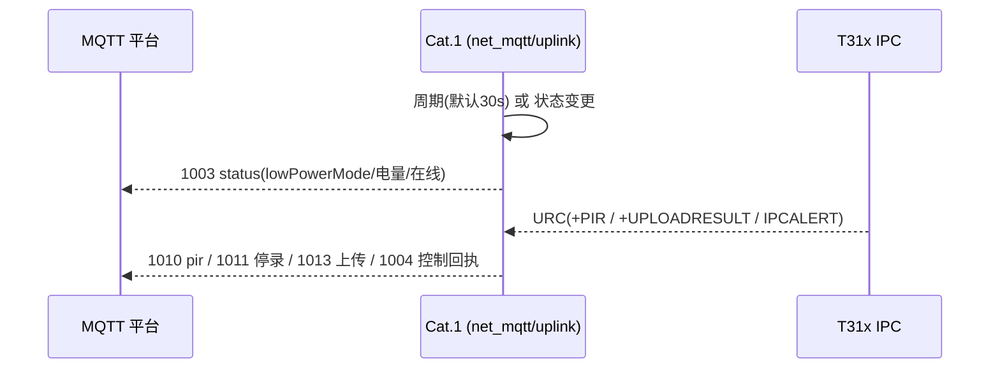
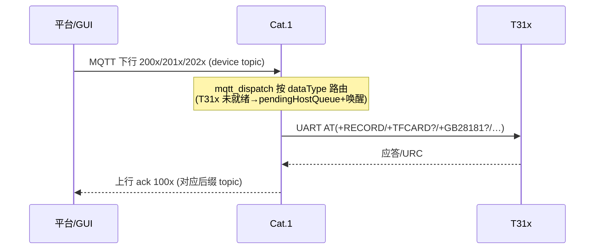
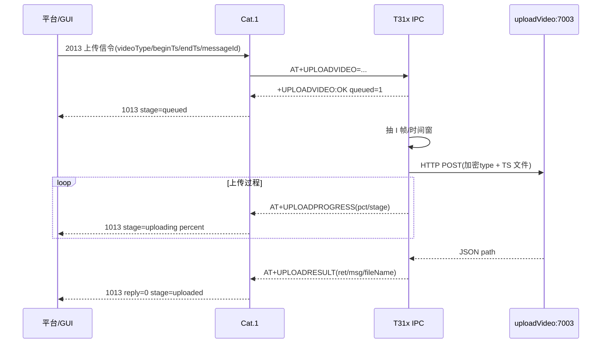

# 780EHM_PJ 系统架构与设计

> **定位**：系统级架构文档（总览视图）。回答三件事——**有哪些子系统 / 核心模块干什么 / 数据怎么流**。
> 代码细节与协议字段请按文末 [参考文档](#11-参考文档地图) 索引追查（`doc/` 内 127 份 md 是各层真源）。
> 文档版本跟踪：`user/main.lua` `VERSION` / `BUILD_TAG`；生成日期见仓库 git。

---

## 1. 系统总览

780EHM_PJ 是一套**电池供电的 4G 可视化门球/摄像头**产品方案：

- **感知与执行**：PIR 人体感应（硬件 GPIO 中断）、低功耗策略、按键/LED 提示音
- **视频能力**：T31x Linux IPC（摄像头 / 编码 / TF 卡录像 / GB28181 / 本地抽片），由 4G 模组供电与门控
- **联网**：Air780EHM（Cat.1 4G 模组，LuatOS/Lua）承载蜂窝入网、MQTT 信令、FOTA；并借 USB RNDIS 把蜂窝网络共享给 T31x
- **云端**：MQTT 信令平台 + 自建 OTA（差分包升级）+ 报警/回放视频上传 + 本地/产线工具链

```
                          ┌────────────────────────────── 云 / 后台 ──────────────────────────────┐
                          │                                                                       │
   MQTT 信令            panshi MQTT Broker                    自建 OTA 服务器                    视频上传服务
 /panshi/device/{IMEI}/ ──► (112.86.146.218:2123)  ◄── 2004 触发 ── ota_server(43.136.55.143)    ┌─────────────┐
 /panshi/app/{IMEI}/#  ◄── ──►│  └─ 固件 FOTA/状态/事件          SpringBoot+MySQL+Nginx            │ uploadVideo │
                          │       ▲                                        ▲                      │  :7003      │
                          │       │ MQTT 200x/100x            HTTP GET 差分包(dl<file>)           │ Python 现网  │
   ┌───────────┐  MQTT   │  ┌──────────────┐   HTTP 2004 ota    ┌──────────┐                     │ / Java 替换  │
   │ T31x IPC  │◄─UART──►│  │  Air780EHM   │◄──────────────────►│  Nginx   │                    │  (兼容南京)  │
   │ Linux 摄像头│  AT/URC │  │ Cat.1 LuatOS │    /admin/api      └──────────┘                     └──────┬──────┘
   │ TF 录像/抽片│◄─GPIO──►│  │  4G 模组     │                     /api/site/firmware_upgrade            │
   └─────┬─────┘ 电源/唤醒│  └──────────────┘                          ▲                              │
         │               │        │                                    │                              │
         │ eth0          │    USB RNDIS(共享蜂窝网)                    │                              │
         │ (192.168.10.2)│        │                                    │                              │
         └─── 经 4G 数据面直接 HTTP POST 视频 ──────────────────────────┴──► uploadVideo:7003 ────────┘
                           （T31x 先试现网 7003/80，回退南京 112.86.146.218:7003）
```

> 一句话数据流：
> **控制面**：云 ─MQTT→ Cat.1 ─UART AT→ T31x 执行，回复逆向逐级回 ack；
> **视频面**：MQTT 只传信令（2013/1013），**文件由 T31x 经 4G 数据面直接 HTTP POST** 到 uploadVideo；
> **升级面**：云 MQTT 2004 通知 → Cat.1 `libfota2` 发起 HTTP GET 差分包。

---

## 2. 部署拓扑与节点清单

| 节点 | 位置/地址 | 技术栈 | 职责 |
|------|-----------|--------|------|
| **设备（门球）** | 现场 | Air780EHM（Cat.1）+ T31x（Linux IPC） | 感知、录像、信令、上传、OTA |
| **MQTT Broker** | `112.86.146.218:2123`（panshi） | MQTT | 设备 ↔ 平台信令中转，上行 `/panshi/app/{IMEI}/…`、下行 `/panshi/device/{IMEI}/` |
| **自建 OTA** | `43.136.55.143`（腾讯云） | Java 17 + Spring Boot + MySQL 8 + Nginx + Docker Compose | 差分包按源版本匹配、设备台账、2004 触发、Web 管理台 |
| **uploadVideo** | `43.136.55.143:7003`（及 80 反代） | Python(现网) / Java 替换件 | 接收 T31x 直传 TS，分类落盘，列表/下载；兼容南京 `112.86.146.218:7003` |
| **平台/GUI 后台** | 检测上位机 | Python `mqtt_tools_gui` / Java 回放闭环 | 联调、状态巡检、下发指令、观看视频 |
| **产线/本地工具** | Windows 开发机 | Luatools v3 / `tools/` GUI / `量产/` 包 | 打包、烧录、差分、验收 |

现网地址（实机文档 `doc/mqtt/MQTT_862323084068314.md`、`http_server/HOW_IT_RUNS.md`）：
- 腾讯云 OTA + uploadVideo：`43.136.55.143`
- 南京后台（MQTT + 兼容 uploadVideo）：`112.86.146.218`

---

## 3. 端-云通信矩阵

| 链路 | 协议 | 方向 | 端口/主题 | 载荷 |
|------|------|------|-----------|------|
| 状态/事件上报 | MQTT | 设备→云 | `/panshi/app/{IMEI}/status|event|rest|wakeup|sim|identity|tfcard|version|tfcard_format|pir|encode|record|framerate|personDetect|mic|softPhoto` | JSON `dataType=100x/101x/102x` |
| 控制/查询下发 | MQTT | 云→设备 | `/panshi/device/{IMEI}/` | JSON `dataType=200x/201x/202x` |
| FOTA 检查/下载 | HTTP GET | 设备→云 | OTA `…/firmware_upgrade` | 响应 200=差分包 / ≥300=无升级 |
| 视频文件上传 | HTTP POST | T31x→云 | `/admin/api/v1/uploadVideo` | multipart：`type`(AES-256-ECB)+`file`(TS) |
| 视频列表/下载 | HTTP GET | 后台→云 | `/admin/api/v1/videos`、`/apps/video/…` | JSON |
| T31x↔Cat.1 控制 | UART AT | 双向 | 板内串口 | `AT+RECORD`/`AT+PIRSTAT?`/`AT+UPLOADVIDEO`/URC… |
| T31x↔Cat.1 唤醒 | GPIO 低脉冲 | Cat.1→T31x | GPIO29→PB27 | `AT+HOSTEVT?` 取 `sid,evt` |

---

## 4. 设备端固件架构（双芯片 + Lua 分层）

### 4.1 硬件协作：三通道模型

| 通道 | 载体 | 方向 | 内容 |
|------|------|------|------|
| **控制面** | UART（AT 命令 + URC 上报） | 双向 | 版本握手、MQTT/TCP 通道下发(`AT+MQTTCFG`/`AT+SERVCREATE`)、录像、上传、编码、查询 |
| **唤醒面** | GPIO 低脉冲 → PB27 中断 | 4G→T31x | 事件通知（PIR/云控/MQTT 离线），T31x 回读 `HOSTEVT?` |
| **数据面** | USB RNDIS（eth0） | 双向 | Cat.1 模组 DHCP+NAT 共享蜂窝网，T31x 直接 HTTP/RTSP 出公网 |

**电源门控**：`t31x_ctrl` 控制 T31x 供电；低电量/USB/`2002 enter` 时优雅断电（`enterSleep` → `waitSleepIdle`），省电期间仅 Cat.1 + MQTT 保持在线。

### 4.2 Lua 运行分层（Air780EHM 侧）

```
 user/main.lua  ── 入口：VERSION 校验、PRODUCT_KEY、__LUATOOLS_SCAN_ANCHOR__ 扫描锚点
      │ require "config"（user/config.lua 分段装载全局配置表 _G.*_CFG）
      │ loader = module_loader / cfgm = config_manager        （lib 框架层）
      ▼
 app.lua  ── 编排中心：依赖注入 + APP_EVENTS 事件订阅 + 生命周期(start/stop)
      ├─ sys.run() 主循环（LuatOS 事件/协程调度）
      ├─ 底层：uart_bridge(串口唯一入口) · gpio_util · watchdog · sys/sysplus
      ├─ 网络：cellular/cell_boot(拨号) → usb_rndis → net_mqtt(信令) / net_tcp(专有 TCP 唤醒通道)
      ├─ host_uart 族（T31x AT 侧）：host_uart · hif_at · hif_cmd(+usb/link/pir/t31x/wled) · hif_rx(+dsl/media) · hif_ipc(+rec/hostq/cloud/power/tffmt/encode)
      ├─ MQTT 族：mqtt_conn · mqtt_dispatch · mqtt_uplink(+pir/upload) · mqtt_downlink(+dl_ctrl/dev/tf/upload) · mqtt_hproto(2020–2031)
      ├─ 业务：pir_ctrl(+led_pir) · t31x_ctrl · t31x_policy · host_event · t31x_notify · ipc_supv · battery(+vbat/battery_guard) · fota_svc · time_sync · sound_prompt · peripheral · lp_wakeup · runtime_power
      └─ 配置：config.lua / gpio_cfg / flags(ModuleFlags) / features / events(APP_EVENTS) / device_id
```

**启动顺序**（与 `doc/overview/CALL_GRAPH.md` 一致，简化）：

```
main.lua
 ├─ [1] VERSION/版本全局函数
 ├─ [2] config → module_loader → 扫描锚点
 ├─ [3] usb_vuart.start / cell_boot.start / usb_rndis.open（RNDIS_ENABLE=1 时；`CELLULAR_CFG` 来自 config 片段 user/cellular.lua）
 ├─ [4] net_mqtt.bootstrapNet() → app.start(peripheral, net_mqtt, t31x_ctrl)
 │        └─ setupEventHandlers / battery_guard / watchdog / uart_bridge / t31x_ctrl / sound_prompt / time_sync / vbat / usb_charge / bootMqtt / setupFota / heartbeat
 └─ [5] sys.run()   ← LuatOS 事件主循环（协程、sys.timer、消息总线）
```

### 4.3 双处理器内部分工（谁做什么）

| 侧 | 做 | 不做 |
|----|----|------|
| **T31x（IPC）** | 采集/编码/录像/TF 管理、抽片、HTTP 直传视频、GB28181、按需上报 URC | 不读 PIR GPIO、不维护冷却/计数、不维护 MQTT 会话 |
| **Air780EHM（Cat.1）** | 蜂窝/MQTT、PIR 中断与策略、统计、电源/低功耗门禁、AT 服务端、FOTA | 不做大文件/媒体流业务 |

配置约定：T31x 关心的参数由 T31x 侧 `client.ini`/`syscfg.ini` 持有，需覆盖时经 `AT+MQTTCFG`/`AT+GETCFG` 推给 Cat.1 落地到 `_G.MQTT_CFG` 等全局表。

---

## 5. 核心模块职责

### 5.1 固件侧 user/（业务 + 协议编排）

| 模块 | 职责 |
|------|------|
| `main.lua` | 入口、版本/OTA 版本换算、蜂窝/RNDIS 引导、`app.start` |
| `config.lua` + `gpio_cfg/flags/features/events` | 单点配置真源：GPIO、`*_CFG`、`MODULE_FLAGS`、`APP_EVENTS`（事件总线常量） |
| `app.lua` | 编排中心：依赖注入、事件订阅、低功耗进出、USB 边沿、PIR→MQTT 桥、烧录态 |
| `net_mqtt.lua` + `mqtt_conn/dispatch/uplink/downlink/dl_*` | MQTT 会话、下行 200x 分发（按 dataType + action）、上行 100x 组装 |
| `mqtt_hproto.lua` | 2020–2031（encode/recordTime/framerate/personDetect/mic/softPhoto）经 UART query/set 协议表 |
| `host_uart.lua` + `hif_*` | T31x UART AT 服务端：命令表、URC 分发、IPC 状态机、云链路 |
| `pir_ctrl.lua` | PIR 硬件中断 → 冷却 → 录像会话 → MQTT 2010–2012/计数（PIRSTAT） |
| `t31x_ctrl.lua` | T31x 供电 GPIO、IPC 优雅断电/ready 轮询、休眠 |
| `t31x_policy.lua` | 供电/唤醒门禁：`mayPowerT31x`、`reqT31xWake`（合并低电量/USB/云控条件） |
| `host_event.lua`/`t31x_notify.lua`/`ipc_supv.lua` | HOSTEVT 待处理汇总、事件通知桥、IPCALERT 监督 → 1004/1011 |
| `battery_guard.lua`/`vbat.lua` | 电量三档保护 / ADC 采样 EMA 滤波（`BATTERY_UPDATE`） |
| `fota_svc.lua` | 2004 OTA 编排（`iot`/`custom` 双模式，custom 走 `libfota2` HTTP） |
| `time_sync.lua` / `sound_prompt.lua` / `peripheral.lua` / `led_pir.lua` | SNTP+`AT+TIMESET`、提示音、按键/LED/PIR 外设聚合 |
| `net_tcp.lua` / `lp_wakeup.lua` | 专有 TCP 唤醒通道（`LOW_POWER_WAKEUP_CFG.mode=tcp`）/ 唤醒通道生命周期 |

### 5.2 固件侧 lib/（可复用底层与策略）

| 模块 | 职责 |
|------|------|
| `module_loader.lua` | 安全 require 缓存 + `MODULE_FLAGS` 门控 + `start/stopAll` 生命周期登记 |
| `config_manager.lua` | 配置访问：`get/num/bool/event/merge`（白名单合并防污染） |
| `uart_bridge.lua` / `gpio_util.lua` / `led_ctrl.lua` | 串口唯一入口 / GPIO 中断与输出 / LED 驱动 |
| `cell_boot.lua` / `usb_rndis.lua` / `usb_charge.lua` / `usb_vuart.lua` | SIM/APN 拨号、RNDIS 网卡、USB/充电 GPIO、USB 虚拟串口 |
| `runtime_power.lua` | 工作模式(常电/PIR 值守/rest) 访问收口（mqtt/tcp 唤醒通道见 §5.1 `lp_wakeup.lua`） |
| `device_id.lua` / `watchdog.lua` / `utils.lua` | IMEI 身份 / 硬件 WDT / 日志与工具函数 |
| `libfota2.lua` / `sys.lua` | OTA 客户端 / LuatOS sys 扩展引用 |

### 5.3 服务端模块

| 子系统 | 关键构成 | 职责 |
|--------|----------|------|
| **ota_server/**（Spring Boot） | `com.luat.ota`：DeviceService / FirmwareRegistryService / 设备·固件·IPC Admin / MySQL `luat_ota` | 差分包上传与 manifest 匹配（`sourceVersion`）、`devices.target_version` 优先级、MQTT 2004 `action=ota&url=`、管理台 `admin.html`、Nginx HTTPS |
| **uploadVideo**（Python 现网 / Java 替换双实现） | `app.py`(ThreadingHTTPServer) / `video-upload.jar`(SpringBoot3) | `POST /admin/api/v1/uploadVideo`：解密 `type`(AES-ECB)→`dynamic/` 或 `playback/` 落盘；列表/下载供回放 GUI |
| **MQTT Broker** | panshi | 主题路由（设备维度隔离 topic） |

> 注：`patch_server/` 为 ota_server 早期快照/备份（Java 文件子集 + 文档），现网以 `ota_server` 为准；`http_server/` 为 uploadVideo **现网部署快照**（python_project + java_project），`video_upload_server/` 是仍在演进的新 Python 版。

---

## 6. 核心数据流

### 6.1 状态上报（周期性 + 事件）


- 上行 `dataType` 编号与下行**个位对齐**（2003→1003、2013→1013…），`deviceNo`=IMEI。
- rest 期间 conack 不发 1001；判在线以 **1003.lowPowerMode** 为准。

### 6.2 云端控制下发（通用闭环：下行 → AT → 执行 → 逐级 ack）


例：`2007`(查 TF) → `AT+TFCARD?` → `1007`(`.../tfcard`)；`2013` 上传 → `AT+UPLOADVIDEO` → `1013`(`.../event`)；`2002 enter/exit` 断/上电 T31 → `1002`(`.../rest`)。

### 6.3 PIR 人形触发 → 录像（省电值守态）

```text
PIR 硬件(GPIO30) 中断
 → pir_ctrl：冷却过滤 → 更新计数 cnt_*(供 AT+PIRSTAT?)
 → 请求唤醒 T31x（t31x_policy 门禁：低电量/USB/烧录检查）
 → GPIO 低脉冲 → T31x 上电/唤醒 → AT+HOSTEVT? 查 evt → AT+PIRSTAT? 查统计
 → T31x 本地录像（TF 卡 .part 封装）→ 按 uploadMode 决定是否触发上传/上报
```
- 工作模式：开机人形常电（person_detect）；仅 MQTT `2002 enter`（或 AT）才断 T31x 进入 PIR 值守（pir_watch）。
- 录像会话与二次触发见 `doc/PIR_CTRL_FLOW.md`、`doc/power/WORK_MODE_PERSON_DETECT_PIR.md`。

### 6.4 视频上传（回放/人形抽片）


> MQTT **不传文件**；同任务闭环共用 2013 的 `messageId`。详见 `doc/mqtt/MQTT_CLIP_UPLOAD_CLOSED_LOOP.md`。

### 6.5 OTA / FOTA 升级

```text
运维/管理台
  └─ 上传量产包 → Luatools 差分 → 配置 manifest(源版本→差分包) / devices.target_version
        │
        ▼
Web/API 触发 → ota_server 发布 MQTT 2004 {action:ota,url:…/firmware_upgrade,version}
        │                                             ▲
        ▼                                             │ HTTP GET(imei/firmware_name/version/project_key)
 Cat.1 net_mqtt 收到 2004 ──► fota_svc ──► libfota2.request(url) ──► Nginx/SpringBoot 匹配 sourceVersion
        │                                                 │
        └── 下载差分包成功 → 升级 → 回 MQTT 1004(进度/结果) ──┘
```
版本号双轨：脚本版 `001.000.154` ↔ IoT 版 `内核号.001.154`（`2034.001.154`），服务器统一 IoT 格式。详见 `ota_server/docs/OTA_FLOW.md`。

### 6.6 低功耗 / USB / 唤醒（Cat.1 自身状态机）

| 事件 | 行为 |
|------|------|
| 低电量 / `2002 enter` | `runtime_power.setLowPowerMode` → `t31x_ctrl.enterSleep`（T31x 断电）→ 保持 MQTT → `1002` |
| `2002 exit` / PIR / USB 插入 | 唤醒 T31x、`person_detect` 模式、`1002/1003` 上报 |
| MQTT 唤醒通道 | rest 期间 Broker 通知由 4G 模组自己收（mqtt）；可选 TCP 长连（`mode=tcp`） |
| 烧录态 | GPIO28 长按 → `t31x_burn` 预置 → T31x 下次上电进烧录模式 |

---

## 7. 消息协议约定（速查）

**MQTT**（真源 `doc/mqtt/MQTT_PROTOCOL.md`）：
- 下行主题 `/panshi/device/{IMEI}/`；上行 `/panshi/app/{IMEI}/{suffix}`，载荷 UTF-8 JSON、`dataType` 为字符串。
- 编号体系：下行 `2001–2009/2010–2013/2020–2031` ↔ 上行 `1001–1009/1010–1013/1020–1031`，覆盖：探活/功耗/状态/控制(OTA·电源)/SIM/标识/TF 卡(查询·格式化)/版本/PIR 策略/停录/开录/上传信令/编码/录像时长/帧率/人形/麦克风/软光敏。

**UART AT**（真源 `doc/mqtt/UART_AT_COMMANDS.md`）：`AT`/`ATI` 握手、`AT+RECORD`/`AT+STOPRECORD`、`AT+TFCARD?`/`AT+TFFORMAT`、`AT+GB28181?`、`AT+HOSTEVT?`/`HOSTEVTCLR`、`AT+PIRSTAT?`/`PIRCLR`、`AT+MQTTCFG`/`AT+SERVCREATE`、`AT+UPLOADVIDEO`/`UPLOADPROGRESS`/`UPLOADRESULT`、URC（`+PIR`/`IPCALERT`/`+WLED`…）。

**GPIO 信号**：PIR→GPIO30 中断；唤醒低脉冲 GPIO29→T31x PB27；T31x 供电、充电/USB VBUS、烧录引脚 GPIO28；详见 `doc/hardware/T31X_CAT1_GPIO.md` §1.1 全表。

---

## 8. 配置与特性开关

| 层 | 文件 | 内容 |
|----|------|------|
| 构建宏 | `config.mk`（打包期） | `RNDIS_ENABLE` / `FOTA_SERVER` / `USB_REENUM_ENABLE` |
| 运行配置 | `user/config.lua`（真源） | 引脚 `GPIO_IN/GPIO_OUT`、`MQTT_CFG`、`PIR_CFG`、`BATTERY_CFG`、`FOTA_CFG`、`HOST_WAKE_CFG`、`LOW_POWER_*_CFG` |
| 模块裁剪 | `MODULE_FLAGS`（`flags.lua`/config 合成） | 由 `module_loader.enabled/opt` 门控：`low_power/mqtt/uart/charge/fota/rndis/sound_prompt/time_sync/watchdog…` |
| 事件总线 | `APP_EVENTS`（`events.lua`） | 跨模块解耦订阅（电源进出 rest、BATTERY_UPDATE、PIR 动作、HOSTEVT…） |
| T31x 侧 | `client.ini`/`syscfg.ini`（IPC 工程） | 联网/通道/检测参数（RNDIS DHCP、ipc 配置），经 AT 与 Cat.1 对齐 |

脚本区上限约 512KB（量产实测约 342KB），动态模块须登记 `main.lua` 扫描锚点，否则 Luatools 漏打包。

---

## 9. 工具链与产线发布

| 环节 | 工具 | 说明 |
|------|------|------|
| 打包 | `package_project.bat` / `pack.ps1` | 产出 `780EHM_PJ_YYYYMMDD.zip`（user/lib/doc/luatos.json） |
| 构建/烧录 | Luatools v3（`luatos.json`） | SOC core（`LuatOS-SoC_V2034_Air780EHM_*.soc`）+ 脚本，烧录/差分 |
| 产线量产 | `tools/pack_mass_prod.py` + `量产/`、`20260818_量产/` | 生成 `{日期}_量产/`（binpkg/soc/bin 固件 + 烧录工具），供产线刷机验收 |
| 烧录调试 | `tools/gui/`（Cat.1 烧录 / 流程检测 / MQTT 测试三 GUI） | `flash-script` 免 BOOT 烧录；MQTT 联调含全部 dataType 自动测试 |
| T31x 部署 | `tools/t31x/` | 把编译好的 ipc 经 COM 推送到 T31 |
| 回归 | `tools/debug/_protocol_regression_check.py` | host_uart / net_mqtt 协议静态回归 |
| 差分 | Luatools「差分工具」 | 旧 bin + 新 bin → dfota 差分包（OTA 用，按源版本匹配） |

---

## 10. 仓库目录地图

| 路径 | 内容 |
|------|------|
| `user/` | Air780EHM Lua 入口/业务/协议模块（58 lua） |
| `lib/` | 框架/底层/策略库（15 lua） |
| `doc/` | 协议、硬件、配置、架构分析（127 md，含本文） |
| `config/` `project/` `config.mk` `luatos.json` | Luatools 工程与构建配置 |
| `firmware/` `build/` `dist/` `量产/` `20260818_量产/` | SOC core / 编译产物 / 发布与量产包 |
| `resource/` | 参考脚本/资源 |
| `tools/` | GUI、打包、烧录、调试、回归脚本 |
| `scripts/` | 辅助脚本 |
| `ota_server/` | 自建 OTA（Java/MySQL/Nginx/Docker + 文档） |
| `http_server/` | uploadVideo 现网快照（Python + Java 替换） |
| `video_upload_server/` | uploadVideo 新版 Python（演进中） |
| `patch_server/` | ota_server 早期快照/备份 |
| `datasheet/` `ps01masch260318.pdf` | 硬件资料 |
| `t31x_ipc` | T31x IPC 工程/交付文件（独立于本仓固件） |
| `log/` `_temp_*.log` | 联调日志 |

---

## 11. 参考文档地图

| 主题 | 文档 |
|------|------|
| 协议总览 | `doc/mqtt/MQTT_PROTOCOL.md`、`doc/mqtt/UART_AT_COMMANDS.md`、`doc/t31x/T31X_CAT1_AT_COMMAND_SPEC.md` |
| 协作框架 | `doc/t31x/T31X_4G_FRAMEWORK.md`、`doc/t31x/T31X_4G_AT_INTERACTION.md`、`doc/t31x/T31X_IPC_4G_INTERACTION.md` |
| 固件模块 | `doc/overview/LUA_MODULES.md`、`doc/overview/CAT1_MODULE_FRAMEWORK.md`、`doc/overview/CALL_GRAPH.md`、`doc/modules/README.md` |
| 视频上传 | `doc/mqtt/MQTT_2013_1013_UPLOAD_VIDEO.md`、`doc/mqtt/MQTT_CLIP_UPLOAD_CLOSED_LOOP.md`、`video_upload_server/README.md` |
| OTA | `ota_server/docs/OTA_SERVER.md`、`OTA_FLOW.md`、`OTA_PROTOCOL.md`、`OTA_CONSOLE_UPGRADE.md` |
| 低功耗/PIR/电源 | `doc/power/WORK_MODE_PERSON_DETECT_PIR.md`、`doc/PIR_CTRL_FLOW.md`、`doc/power/LOW_BATTERY_AND_LOW_POWER.md`、`doc/power/CAT1_LOWPWR_MQTT_TCP_STRATEGY.md` |
| 硬件/GPIO | `doc/hardware/T31X_CAT1_GPIO.md`、`doc/overview/CONFIG.md`、`doc/hardware/KEY_GPIO.md`、`doc/hardware/LED_INDICATORS.md` |
| 工具链 | `tools/README.md`、`doc/release/CAT1_FLASH_FLOW.md`、`doc/release/CAT1_FLASH_TOOL.md` |
