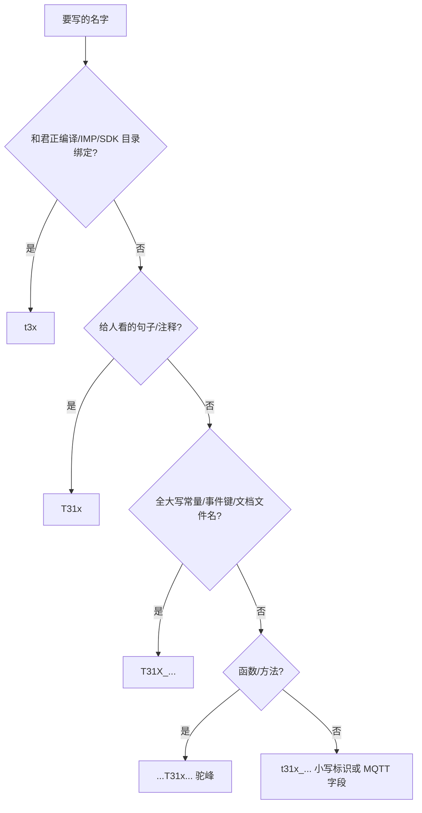

# t3x / t31x / T31x / T31X 命名说明

> 本文约定 **4G 门球（Air780EHM）+ 协处理器 IPC** 工程中的写法，避免把「芯片/编译平台」和「产品系列」混用。
> 代码真源：`../user/config.lua`（编排）、`../user/events.lua`（`APP_EVENTS`）、`../user/gpio_cfg.lua`（GPIO 键 / `net_name`）；IPC 编译：`ipc_device_gb28181` 的 `build/config.mk`。

---

## 1. 为什么要分多套名字？

| 概念 | 一句话 |
|------|--------|
| **t3x** | 具体 **芯片 / SoC / 编译平台 token**（IPC 侧源码树、工具链、Makefile 用） |
| **t31x** | **系列标识**（4G 侧程序标识符 / 协议字段 / Lua 模块名） |
| **T31x** | 同一系列的 **人话称呼**（文档正文、日志文案） |
| **T31X** | 同一系列的 **常量 / 事件键 / 大写文档文件名** |

4G 模组侧业务（PIR、MQTT、供电门禁）面向的是「协处理器系列产品」，标识统一走 **t31x/T31x/T31X**，不绑死某一型芯片；  
IPC 固件、交叉编译、IMP 媒体库则必须落到 **t3x 平台** 目录/目标。

---

## 2. 四种写法速查

| 写法 | 类型 | 含义 | 典型场景 |
|------|------|------|----------|
| **t3x** | 全小写 | **芯片 / 平台标识** | `PLATFORM=t3x`、`media_plat/t3x/`、`toolchain/t3x/`、`t3x_linux/` |
| **t31x** | 全小写 | **系列标识**（代码、协议、MQTT 字段） | `t31x_ctrl.lua`、`t31x_boot`、`source=t31x`、`t31x_active` |
| **T31x** | 首字母大写 | **系列称呼**（给人看） | 文档、注释、日志：「T31x 被唤醒」「T31x 写盘」 |
| **T31X** | 全大写 | **常量 / 事件键 / 大写文档名** | `T31X_SNAPSHOT_DONE`、`T31X_RECORD_MQTT_FLOW.md` |

**记忆口诀：**

- 谈 **芯片怎么编、IPC 源码在哪个平台树** → `t3x`
- 谈 **4G 怎么控它、怎么上报它** → `t31x` / `T31x` / `T31X`（见下表细分）
- **函数名 / 方法名**里系列用驼峰嵌 **`T31x`**（x 小写）：`reqT31xWake()`（不是 `reqT3xWake`，也不是 `reqT31XWake`）

---

## 3. 分项说明

### 3.1 `t3x` — 芯片与编译平台

只用于 **与 SoC / 工具链 / IPC 平台目录** 强绑定的场景：

| 类别 | 示例 |
|------|------|
| Makefile 平台 | `PLATFORM = t3x` |
| IPC 源码目录 | `media_plat/t3x/` |
| 工具链路径 | `toolchain/t3x/mips-gcc540-...` |
| 编译宏（IPC 侧） | `-DIPC_PLATFORM_T3X`（含义：该 IPC 运行于 t3x 平台） |
| IPC 侧运行时 API | `t3x_runtime_start()`（芯片实现） |
| IPC 代码路径 | `t3x_linux/api.c`、`t3x_linux/uart_host_cmd.c` |

> 注：IPC 侧媒体目录名以各 IPC 工程为准，本文不做跨仓断言——配套 `ipc_device_gb28181` 使用 `media_plat/t3x/`，而 `ipc_device_ini` 的部分文档使用 `media_plat/t31x/`；上述示例仅表示「IPC 平台 token 不与 4G 系列标识混写」。

**不要**把 `t3x` 用于 4G 业务侧：Lua 模块名、GPIO 键、MQTT 字段一律用 `t31x`（如 MQTT JSON 应写 `source=t31x`，**不是** `source=t3x`）。

### 3.2 `t31x` — 系列（程序标识符 / 协议字段）

全小写，用于 **Lua 模块名、变量、配置键、GPIO 键、MQTT 字符串**（大小写敏感）：

| 类别 | 示例 |
|------|------|
| Lua 模块文件 | `user/t31x_ctrl.lua`、`lib/t31x_policy.lua`、`lib/t31x_notify.lua` |
| `require` | `require "t31x_ctrl"` |
| 功能开关 | `MODULE_FLAGS.t31x_app`、`MODULE_FLAGS.t31x_wakeup` |
| GPIO 配置键 | `GPIO_OUT.t31x_boot`、`t31x_pwr_wake`、`t31x_mcu_int`、`t31x_ota` |
| GPIO `net_name` | `"t31x_BOOT"`、`"t31x_PWR_WAKE"`（小写系列前缀 + 大写下划线后缀） |
| 全局配置表 | `_G.t31x_BURN_CFG`、`_G.t31x_POLICY_CFG` |
| 状态变量 | `state.t31x_rec_active`、`state.t31x_burn_active` |
| MQTT 字段 | `"source": "t31x"`、`pirStatus=t31x_active` |
| snake_case 局部函数 | `notify_t31x_*()`、`wake_t31x()` |

### 3.3 `T31x` — 系列（文档与注释）

首字母 **T** 大写、**x** 小写，用于 **中文/英文正文、日志文案、注释** 里指代协处理器产品：

```text
4G 唤醒 T31x 后，T31x 经 AT+RECORD=1 确认写盘。
```

适用于：产品说明、联调手册、测试步骤、给非芯片同事的通俗描述。

### 3.4 `T31X` — 常量、事件键、大写文档名

**整段大写**（含 `X`），用于 **C/Lua 常量、事件键、Markdown 文件名**：

| 类别 | 示例 |
|------|------|
| 事件键（`APP_EVENTS` key） | `T31X_SNAPSHOT_DONE`、`PIR_REQUEST_T31X_STOP`、`T31X_RECORD_STOP` |
| 事件键引用 | `E.T31X_SNAPSHOT_DONE`（`events.lua` 中键全大写、**字符串值小写**，如 `"t31x_snapshot_done"`） |
| C 头文件守卫 | `T3X_JPEG_SNAPSHOT_H`（IPC 侧，用平台名） |
| 文档文件名 | `T31X_RECORD_MQTT_FLOW.md`、`T31X_BURN_MODE.md`、`T31X_NAMING.md` |

> 事件键示例以 `user/events.lua` 为准；文档正文指代系列时用 **T31x**（§3.3），勿混入常量域。

---

## 4. 函数命名（驼峰嵌 `T31x`）

系列相关的 **4G 侧函数 / 方法名** 使用驼峰嵌 **`T31x`**（x 小写），不用 `T31X`，也不用 `T31xx`：

| 函数（真实代码） | 说明 |
|------|------|
| `reqT31xWake(reason, sid, evt, opts)` | 4G 请求唤醒协处理器（`app.lua` / `t31x_policy`） |
| `onT31xRecStop(...)` | T31x `AT+RECORD=0` 同步停录回调 |
| `notify_t31x_usb_state`（配置键） | USB 插入时是否通知 T31x |

IPC 侧运行在 t3x 芯片上的运行时 API 可保留平台前缀 `t3x_runtime_*`（芯片实现），与 4G 侧系列 API 区分。

---

## 5. 端到端对照示例

### 5.1 PIR 抓拍完成

```text
T31x 固件（IPC 侧源码树 t3x 平台）写 SD
  → 串口 AT+SNAPSHOT=/mnt/sdcard/snap/xxx.jpg
  → host_uart 发布事件键 T31X_SNAPSHOT_DONE（events.lua，值 "t31x_snapshot_done"）
  → app.lua 订阅处理（E.T31X_SNAPSHOT_DONE）
  → MQTT 1010 pirStatus=snapshot_saved
```

### 5.2 录像状态 MQTT（实测字段，见 `user/mqtt_ul_pir.lua` / `hif_cmd_t31x.lua`）

| 阶段 | 代码侧事件键 | 云端 JSON |
|------|--------|-----------|
| T31x 开始写盘 | `T31X_RECORD_ACTIVE` | 1010：`pirStatus=t31x_active` |
| T31x 停录 | `T31X_RECORD_STOP` | 1011：`source=t31x` |
| 4G 定时停 | `PIR_REQUEST_T31X_STOP` | 1011：`source=4g` |

### 5.3 编译 vs 烧录

```bash
# IPC：芯片平台 t3x（工程块名含型号，属 §7 豁免）
source build/envsetup.sh T31xX_GC4023_H265_RECORD_P2P t3x

# 4G：烧录 Luat 工程（系列逻辑在 t31x_ctrl / t31x_policy / t31x_notify）
# 目录：/mnt/share/user/
```

---

## 6. 如何选择？（决策简图）



---

## 7. 与硬件丝印、旧工程名的关系

以下 **不属于** 上表四套规则，单独保留：

| 名称 | 性质 | 说明 |
|------|------|------|
| `T31x_BOOT` | 原理图网络名 / 丝印 | 硬件文档可保留；Luat GPIO `net_name` 串为 `"t31x_BOOT"`（§3.2），与丝印尾段呼应 |
| `T31xZX_GC4653_*` / `T31xX_GC4023_*` | IPC **项目**名 | `config.mk` 工程块，非系列 API |
| `T31x` 单独出现 | 旧口语 | 文档中应改为 **T31x**（系列）或 **t3x**（平台），避免歧义 |

---

## 8. 常见错误对照

| 错误写法 | 问题 | 应改为 |
|----------|------|--------|
| `PLATFORM=t31x`、`media_plat/t31x/` | 编译平台错用系列名 | `PLATFORM=t3x`、`media_plat/t3x/` |
| `source=t3x` / MQTT 字段写平台 token | 平台 token 混入系列协议字段 | `source=t31x` / `t31x_active` |
| `t3x_ctrl.lua`、`t3x_policy.lua` | 4G 业务模块旧称误用平台名，正式名用芯片名 | `t31x_ctrl.lua`、`t31x_policy.lua` |
| `reqT3xWake` / `requestT31XWake` | 函数把平台 token / 全大写放进函数名 | `reqT31xWake`（驼峰嵌 T31x） |
| `T31x_SNAPSHOT_DONE`（事件键 x 小写） | 常量/事件键应全大写 | `T31X_SNAPSHOT_DONE` |
| `net_name = "T31X_BOOT"` | 与代码实际 `net_name` 不一致 | `net_name = "t31x_BOOT"` |
| 文档写「t31x 摄像头」指整个产品 | 读者误以为是芯片/平台 | **T31x 摄像头** |

---

## 9. 本仓库关键路径

| 路径 | 命名域 |
|------|--------|
| `/mnt/share/user/` | 4G Lua，`t31x_*` 模块 + `T31X_*` 事件键 |
| `/mnt/share/lib/t31x_policy.lua`、`t31x_notify.lua` | 系列门禁 / 唤醒 |
| `/mnt/share/doc/T31X_*.md` | 系列文档（大写文件名） |
| `ipc_device_gb28181/media_plat/t3x/` | **芯片**媒体平台 |
| `ipc_device_gb28181/app/cat1/` | IPC↔4G 桥接；运行时可有 `t3x_runtime_*` |

---

## 10. 相关文档

| 文档 | 内容 |
|------|------|
| [T31X_RECORD_MQTT_FLOW.md](../pir/T31X_RECORD_MQTT_FLOW.md) | 录像 MQTT 时序（含 `source=t31x`） |
| [T31X_HOSTEVT_PROTOCOL.md](../t31x/T31X_HOSTEVT_PROTOCOL.md) | GPIO 唤醒脉冲 |
| [T31X_BURN_MODE.md](../hardware/T31X_BURN_MODE.md) | 烧录模式与 `t31x_BURN_CFG` |
| [CONFIG.md](CONFIG.md) | `t31x_boot` 等 GPIO 对照 |
| [PROJECT_DOC.md](PROJECT_DOC.md) | 4G 模块职责与事件表 |

---

**版本**：2026-09-04 修订（修正 t3x/t31x 混淆、示例对齐 `gpio_cfg.lua`/`events.lua`/`mqtt_ul_pir.lua` 实测）。**维护**：命名或事件表变更时请同步更新本文与 `events.lua`。
