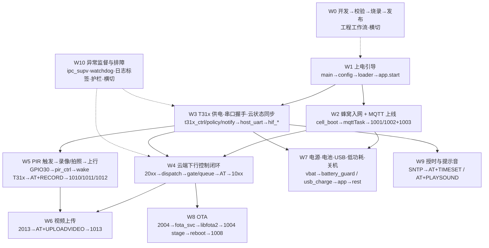
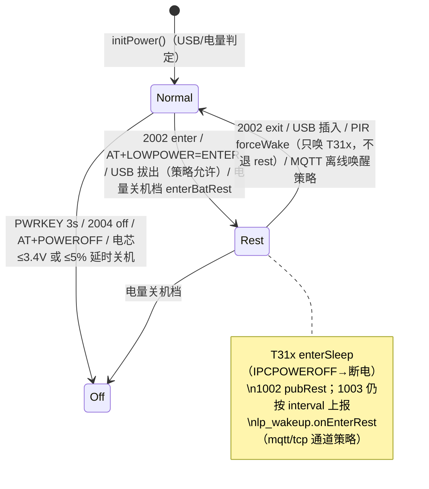

# 技术工作流总图（按设备生命周期理顺功能逻辑）

> **定位**：L1 导航/汇编层（与 `manual/` 同层，无真源权）。把 `doc/` 130+ 篇主题文档与 74 个 Lua 模块，
> **按设备从上电到关机的技术工作流**串成一条线：每个工作流回答「谁触发 → 代码走到哪 → 发了什么协议/事件 → 在哪个门禁上会被拦 → 在哪观测 → 真源在哪」。
> **冲突判据**：代码 > 主题真源 > 本图。模块/函数名以 [`CAT1_API_NAMING`](CAT1_API_NAMING.md)、[`LUA_MODULES`](LUA_MODULES.md) 为准；本页只做定位，不复制协议正文。
> **配套**：任务视角看 [`manual/`](../manual/README.md)（改什么去哪卷）；本页是**运行时视角**（设备正在做什么、下一步会发生什么）。
> 2026-09-04 立档，对齐 `VERSION 001.000.155`。

---

## 0. 一张图：设备生命周期与工作流编号



### 0.1 读法

| 列 | 含义 |
|----|------|
| **步骤** | 运行时顺序；`模块.函数` 为真名（`CAT1_API_NAMING`），`→` 表示同步调用，`⇢` 表示经事件/协程异步到达 |
| **协议/事件** | `APP_EVENTS.*`（[`user/events.lua`](../../user/events.lua)）、`SYS_EVT.*`（host_uart 内部）、MQTT `dataType`、UART `AT+…` |
| **门禁/决策点** | 会让这一步「不发生」的判断；排障先看这里 |
| **观测点** | 日志标签（`mkLogFns` 前缀，见 [`CAT1_LOG_TAGS`](CAT1_LOG_TAGS.md)）/ 可发的 AT / 可收的 MQTT |
| **真源** | 细节去哪读；🟢 现行真源，🔗 专题流程 |

### 0.2 工作流 × 模块矩阵（谁参与哪条线）

| 模块（真源 `user/` `lib/`） | W1 | W2 | W3 | W4 | W5 | W6 | W7 | W8 | W9 | W10 |
|------|----|----|----|----|----|----|----|----|----|-----|
| `main` / `config` + 10 片段 / `module_loader` / `config_manager` | ● | | | | | | | | | ● |
| `app`（编排中心） | ● | ● | ● | ● | ● | | ● | ● | ● | ● |
| `cell_boot` / `device_id` / `usb_rndis` / `usb_vuart` | ● | ● | | | | | ● | | | |
| `net_mqtt` + `mqtt_conn`/`mqtt_uplink`/`mqtt_ul_*` | | ● | | ● | ● | ● | ● | ● | | ● |
| `mqtt_dispatch` / `mqtt_downlink` / `mqtt_dl_*` / `mqtt_hproto` | | | | ● | ● | ● | ● | ● | | |
| `t31x_ctrl` / `t31x_policy` / `t31x_notify` | | | ● | ● | ● | ● | ● | | ● | |
| `uart_bridge` / `host_uart` + `hif_at`/`hif_cmd*`/`hif_rx*`/`hif_ipc*` | | | ● | ● | ● | ● | ● | | ● | ● |
| `host_event` / `lp_wakeup` / `net_tcp` | | | ● | | ● | | ● | | | |
| `pir_ctrl` / `peripheral` / `led_ctrl` / `gpio_util` | ● | | | | ● | | ● | | | |
| `vbat` / `battery_guard` / `usb_charge` / `runtime_power` | ● | ● | ● | | ● | | ● | | | |
| `fota_svc` / `libfota2` | | | | ● | | | | ● | | |
| `time_sync` / `sound_prompt` | | | ● | | | | ● | | ● | |
| `ipc_supv` / `watchdog` / `utils` / `svc`（跨域桥） | | | ● | | | | | | | ● |

---

## W1 上电引导与模块装配

**触发**：模组上电 / `rtos.reboot()` / OTA 后重启。**目标**：配置就位、可选模块按 `MODULE_FLAGS` 装配、进入 `sys.run()`。

| # | 步骤 | 代码 | 协议/事件 | 说明 |
|---|------|------|-----------|------|
| 1 | 版本与全局元信息 | `main.lua` `VERSION`/`PRODUCT_KEY`/`PROJECT`，`validateBuildVersion`/`resolveIotOtaVersion` 挂 `_G` | — | 1008 `scriptVersion` 与 OTA 版本双轨的唯一来源 |
| 2 | 配置装配 | `require "config"` → 按依赖顺序 require 10 片段 → `_G.X_CFG` | — | 顺序固定 `features` 最先；键索引见 [`CONFIG.md`「配置键总索引」](CONFIG.md) |
| 3 | 模块裁剪 | `module_loader.enabled(flag)` / `load(name)` 读 `MODULE_FLAGS` | — | `false` 只是不启动，不省 Flash |
| 4 | 可选前置 | `usb_vuart.start()`；`[cellular] cell_boot.start()`；`[rndis] usb_rndis.open → net_mqtt.bootstrapNet()`；`[mqtt] net_mqtt.bootstrapNet()` | — | RNDIS 开会 flymode，后续 MQTT 须等 `isBootStable` |
| 5 | 编排中心启动 | `app.start(peripheral, net_mqtt, t31x_ctrl)` | — | 顺序见下表；`started` 幂等 |
| 6 | 进入调度 | `sys.run()` | — | 之后全部由事件/协程驱动 |

**`app.start` 内部顺序（真源 `user/app.lua start()`）**

| # | 动作 | 条件 | 备注 |
|---|------|------|------|
| 1 | `deviceId.setImei`；`hostEvt.bindMqttPending`；`lpWake.bindNetTcp`；`t31xNotify.registerProviders{pushBeforeNotify, ntfHost, wakeHost, ensPowOn}` | 始终 | 先把跨模块 provider 接好，避免后续 nil |
| 2 | `setupEvents()`（订阅 `EVNT_HNDL` 表，内含 `pirCtrl.start()`） | 始终 | 事件总线接线点，见 [`APP_EVENT_BUS`](../modules/APP_EVENT_BUS.md) |
| 3 | `batteryGuard.start(hooks)` | `battery_guard` | hooks：`onEnterLowPower`/`onExitLowPower`/`onPowerOff`/`wakeT31x`/… |
| 4 | `setupWdt()` | `watchdog` | 模组级 WDT，`WDT_CFG` |
| 5 | `setupUart()`：`uart_bridge.start` + `host_uart.start` | `uart_bridge` | 串口唯一入口；T31x AT 业务就位 |
| 6 | `initPower()` → `schedBootUsb()` | 始终 | **可能直接进 rest**；早于 T31x/GPIO |
| 7 | `t31xModule.start()` | 有 t31x | GPIO 初始化，不等于上电（上电由门禁决定，见 W3） |
| 8 | `sound_prompt.start` + `onAppStarted()`；`time_sync.start` | 各 flag | 开机音等首条 AT，见 W9 |
| 9 | `setupGpio()` → `peripheral.start()`（按键/LED/`pir_ctrl.startHw`） | `gpio` | 按键 `both` 边沿依赖 `gpio_util` 兼容读（155 修复） |
| 10 | `setupPmd()`；`startBgSvc()`（`vbat`/`usb_charge`/`mobile_info`） | 各 flag | 电量采样开始，见 W7 |
| 11 | `setupRndis()`；`netModule.bootstrapNet()`（幂等）；`bootMqtt()` | `rndis`/`mqtt` | `bootMqtt` 协程等 RNDIS stable + `net_ready` 后 `startMqtt()`，见 W2 |
| 12 | `setupFota()`；`startHeartbeat()` | `fota`/始终 | FOTA 订阅 `DEVICE_OTA_REQUEST`；心跳 10s |

**门禁/决策点**：`MODULE_FLAGS.*`（[`flags.lua`](../../user/flags.lua)）· `FEATURE_CFG.*`（宏级）· `APP_STACK.mqtt == "net_mqtt"`（`startMqtt` 前置）· `state.t31x_burn_active`（烧录中不起 MQTT）。
**观测点**：`app_main` 标签 `app_start`/`app_started`/`mqtt_start`；`config_manager.get` 未注册键一次性 `log.warn`。
**真源**：🟢 [`CALL_GRAPH §1`](CALL_GRAPH.md) · 🟢 [`CODE_LAYERING_ARCHITECTURE`](CODE_LAYERING_ARCHITECTURE.md) · 🟢 [`CAT1_MODULE_FRAMEWORK`](CAT1_MODULE_FRAMEWORK.md)（loader/cfgm/require 环 §2.4） · 🟢 [`CONFIG.md`](CONFIG.md) · 🔗 [`LIB_RUNTIME_UTILS`](../modules/LIB_RUNTIME_UTILS.md)。
**典型故障**：模块「未打包 module not found」→ `main.lua __LUATOOLS_SCAN_ANCHOR__` 漏挂名；配置改了没生效 → 键名大小写/片段路径（`_config_key_check`）。

---

## W2 蜂窝入网与 MQTT 上线

**触发**：W1 第 11 步。**目标**：SIM/APN 就位 → IP → MQTT connect → 首包上行 → 周期 1003。

| # | 步骤 | 代码 | 协议/事件 | 说明 |
|---|------|------|-----------|------|
| 1 | SIM/APN 探测与运营商映射 | `cell_boot.start` → `applyApnForSim` → `detectOperator`/`resolveOperator` | — | `CELLULAR_CFG`；`runtime_power.setCellular` 存快照 |
| 2 | 等网 | `cell_boot.waitForNetwork`；`utils.localIp()`/`waitLocalIp` | `IP_READY` / `net_ready` | RNDIS 开时先 `usb_rndis.waitForNetStable` |
| 3 | 起 MQTT 任务 | `app.bootMqtt` ⇢ `startMqtt` → `net_mqtt.start` → `mqttTask` | — | `mqttTaskStarted` 防双启 |
| 4 | 建连 | `mqtt_conn.normMqttCfg` → `mqtt.create/auth/autoreconn` → connect → conack → `subDown` | `MQTT_CONNECTED` | `MQTT_CFG`（`user/net.lua`）：`autoreconn_ms`/`min_connect_interval_sec`/`ip_lose_cooldown_sec`/`ip_ready_settle_ms` |
| 5 | 首包 | `mqtt_uplink.pubConnect`：rest 中 → `pubRest`(1002)+`pubStatus`(1003)；常电 → `pubWakeup`(1001) | 1001 / 1002+1003 | 区分「唤醒上线」与「休眠中重连」 |
| 6 | 身份/版本补报 | `mqtt_dl_dev.setupIdAutoPub`（T31x 首条 AT 且在线后 1006）；`pubVersion`(1008) 按需 | 1006 / 1008 | `HOST_IDENTITY_CFG.auto_publish_on_ready` |
| 7 | 周期状态 | `mqtt_uplink.startStatReporter` → `pubStatus`(1003)，间隔 `getStatInterval()`（2003 可改） | 1003 | 1003 内含电量/USB/无线/云状态 9 键（`ipc_supv` 合并，见 W3） |
| 8 | 断网/回网 | `bindIpHandlers`：`IP_LOSE` → 关 autoreconn + cooldown；`IP_READY` → settle 后 `tryMqttConn` | `IP_LOSE`/`IP_READY` | `stop()` 会退订（155） |

**门禁/决策点**：`loader.enabled("mqtt")` · `APP_STACK.mqtt` · 烧录态 · `sameMqttCfg`（2003 热更新只比 host/port/ssl/user/pass/client_id）· `ip_lose_until` 冷却。
**观测点**：`net_mqtt` 标签 `mqtt_ip_lose_cooldown`/连接日志；平台侧 1001/1002/1003 序列；`AT+GETCFG` 回 MQTT 快照。
**真源**：🟢 [`MQTT_PROTOCOL`](../mqtt/MQTT_PROTOCOL.md)（Topic/字段） · 🔗 [`CELLULAR_BOOTSTRAP`](../modules/CELLULAR_BOOTSTRAP.md) · 🔗 [`MQTT_1003_STATUS_PATTERN`](../mqtt/MQTT_1003_STATUS_PATTERN.md) · 🔗 [`MQTT_HOST_CONFIG_MODES`](../mqtt/MQTT_HOST_CONFIG_MODES.md) · 🔗 [`USB_RNDIS_FLOW`](../modules/USB_RNDIS_FLOW.md) · 🔗 [`T31X_ETH0_DHCP_SLOW_BOOT`](../mqtt/T31X_ETH0_DHCP_SLOW_BOOT.md)。
**典型故障**：不上线 → 先看 W7 是否在 rest（1002 序列）再看 SIM（2005→1005）；上线即掉 → RNDIS flymode 竞态（`isBootStable`）。

---

## W3 T31x 供电、串口握手与云状态同步

**触发**：W1 第 7 步之后任何「需要 T31x」的动作（PIR、下行查询、授时、开机音）。**目标**：T31x 按门禁上电 → 首条 AT → `+IPCSTATUS:ready` → 云状态（9 键）进入 1003。

| # | 步骤 | 代码 | 协议/事件 | 说明 |
|---|------|------|-----------|------|
| 1 | 是否允许上电/唤醒 | `t31x_policy.mayPowerT31x(reason, opts)`：`policyOff`/`isBurnActive`/`passUsbGate`/`opts.forceWake` 任一 → 放行；否则 `passLpGate and passBatGate` | — | **所有上电请求的总门禁**；`t31x_POLICY_CFG`（`battery.lua`） |
| 2 | 上电 | `t31x_ctrl.ensPowOn(tag, opts)` → `powerOn`（`GPIO_OUT.t31x_pwr_wake`）→ 等 `t31xPowerWaitMs` | — | `ensNormalPwrOn` 保证非 BOOT/OTA 电平 |
| 3 | 唤醒通知（已上电、在休眠） | `t31x_notify.wakeHost(sid, evt)`：`ntfViaTimeSync`（先 `AT+TIMESET` 再 HOSTEVT）→ `ntfViaHostUart`（`host_uart.ntfHost`）→ 兜底 `gpioWakeFb`（`t31x_ctrl.pulseMcuInt`） | UART 推送 / GPIO29 脉冲 | 三级链，`MODULE_FLAGS.t31x_wakeup` 须为真 |
| 4 | 首条 AT | `uart_bridge` 行协议 → `host_uart.onUartLine` → `onFirstHostAt` | `HOST_UART_FIRST_AT` | 触发：开机音、身份自动上报、hostQueue 排水（`mqtt_dispatch.hookHostDrain`）、USB 态补推 |
| 5 | AT 分发 | `hif_at.compile` 表 → `hif_cmd*` handler（GETCFG/PIRSTAT/HOSTEVT/RECORD/IPCSTATUS/IPCSTAT/TFCARD/…）| `AT+…` → `+TAG:… OK` | 应答格式 `rspFmt`/`rspBody`（已含 OK 尾） |
| 6 | 就绪与云状态 | T31x `AT+IPCSTATUS=ready` / 4G `AT+IPCSTATUS?`；`hif_ipc_cloud.qryIpcCloudStat` → `AT+IPCSTAT?` → `+IPCSTAT:` → `commitIpcStat(snap, true)` | `SYS_EVT.IPCSTATUS_ACK` / `IPCSTAT_ACK` | 局部补丁 `patchCloud` 只改 state 不发 ACK（155）；`CLOUD_STAT_KEYS` 9 键单源 |
| 7 | 合并进 1003 | `ipc_supv.refCloudStat` / `mergeHostCache` → `mqtt_uplink.pubStatus` | 1003 `ipcReady/recordingt31x/tfPresent/…` | `refCloudStat1003(timeout, force)` 带缓存 |
| 8 | 休眠门禁（T31x 侧问 4G） | `AT+HOSTIDLE?/=1` → `hif_cmd.checkHostIdleGate` → `usbBlockHost`/`battery_guard.shouldHostSleep`/`host_event.hasPendingWork` | `+HOSTIDLE:OK/USB/BUSY/…` | 155 修复双 OK；`HOST_USB_CFG.block_host_idle_when_usb` |
| 9 | 待办事件汇总 | `AT+HOSTEVT?` → `hif_cmd_pir.bldPirWake` + `host_event.summarize`（wake/pir/record/mqtt 四位） | `+HOSTEVT:has_event=…` | `HOST_EVT_CFG.types_mask`；`MODULE_FLAGS.host_evt`（155 接入） |
| 10 | 断电 | `t31x_ctrl.enterSleep(opts)` → `gracePowOff`（`AT+IPCPOWEROFF` 等 `+IPCPOWEROFF:OK`）→ `powerOff` | `SYS_EVT.IPCPOWEROFF_*` | `HOST_IPC_CFG.graceful_poweroff/poweroff_timeout_ms` |

**门禁/决策点**：W3-1 总门禁 · `HOST_IPC_CFG.enabled` · `uartAcquire` 串口事务锁（`hostQuery/hostSet/TFFORMAT` 共用；start/stop 复位）· `state.host_at_ready`（`waitBoot`）· `waitHostIdle`（quiet，`skipQuiet` 可跳）。
**观测点**：`t31x_ctrl` 标签；`host_uart`/`hif_*` 日志（`uart_recovery_*`、`ipcpoweroff_rx`）；`AT+GETCFG`、`AT+IPCSTAT?`、`AT+HOSTIDLE?`；1003 的 `ipcReady`。
**真源**：🟢 [`T31X_4G_FRAMEWORK`](../t31x/T31X_4G_FRAMEWORK.md) · 🟢 [`UART_AT_COMMANDS`](../mqtt/UART_AT_COMMANDS.md) · 🟢 [`T31X_CAT1_AT_COMMAND_SPEC`](../t31x/T31X_CAT1_AT_COMMAND_SPEC.md) · 🔗 [`T31X_POLICY_GATE`](../modules/T31X_POLICY_GATE.md) · 🔗 [`T31X_POWER_WAKEUP`](../modules/T31X_POWER_WAKEUP.md) · 🔗 [`HOST_UART_AT_DISPATCH`](../modules/HOST_UART_AT_DISPATCH.md) · 🔗 [`HOST_EVENT_PENDING`](../modules/HOST_EVENT_PENDING.md) · 🔗 [`T31X_HOSTEVT_PROTOCOL`](../t31x/T31X_HOSTEVT_PROTOCOL.md) / [`T31X_HOSTEVT_SLEEP`](../t31x/T31X_HOSTEVT_SLEEP.md) · 🔗 [`IPC_SUPERVISION_FLOW`](../modules/IPC_SUPERVISION_FLOW.md)。
**典型故障**：T31x 不上电 → 打印 `mayPowerT31x` 的 reason 走到哪个门（USB 未插 + 低电/rest）；AT 无应答 → `uart_recovery` 计数与 `hif_ipc_power` 恢复链；1003 `ipcReady` 恒 0 → W3-6 是否收到真实 `+IPCSTAT:`。

---

## W4 云端下行控制闭环（通用）

**触发**：平台向设备下行 topic 发 `dataType=20xx`。**目标**：分发 → 需要 T31x 的先过门/入队 → 执行 → 逐级 `10xx` 应答。

| # | 步骤 | 代码 | 协议/事件 | 说明 |
|---|------|------|-----------|------|
| 1 | 收包解码 | `mqtt_dispatch.onServerMsg` → `dispatchDl(topic, payload)`：`json.decode` 失败记日志返回 | `MQTT_SERVER_DATA` | `MQTT_CFG.debug_uplink=true` 打印明细 |
| 2 | 查表 | `mqtt_downlink.bind` 装配 `handlers[DT.DL_*]`；2020–2031 由 `mqtt_hproto.register` 挂上 | — | dataType 常量表在 `net_mqtt.lua` `DT` |
| 3 | 需 T31x 的门 | `wrapHostDl(dlType, handler, isQuery)`：`needT31x[dlType] and not hostReady()` → 查询立刻回 `t31x_not_ready`，设置类 `gateDl` → `deferHostDl` 入 `hostQueue` + `t31xNotify.wakeHost` | `host_dl_pending` 日志 | 队列在首条 AT 后 `drainHostQueue` 排水（W3-4） |
| 4 | 执行 | 设备类：`mqtt_dl_dev`（2001/2002/2003/2005/2006/2008）· 控制类：`mqtt_dl_ctrl`（2004 reboot/off/ota）· TF：`mqtt_dl_tf`（2007/2009）· PIR：`mqtt_dl_pir`（2010/2011/2012）· 上传：`mqtt_dl_upload`（2013）· 主机参数：`mqtt_hproto`（2020–2031 → `hif_ipc_encode/hostq/…`） | `AT+…` | 2002 → `POWER_ENTER/EXIT_REST` 交给 W7；2004 ota → W8 |
| 5 | 应答 | `pubReply` / `pubCtrlReply` / 各 `pub*`：`reply=1,messageId,ret,message` | 10xx（个位对齐） | `dlMsgId` 兼容 `messageId`/`msgId` |

**门禁/决策点**：`hostReady()`（首条 AT 已到）· `HOST_DL_NEEDS_t31x` 表 · `usbBlocks4g`（2002 enter / 2004 off 在 USB 插入时忽略）· `mayPowerT31x`（入队唤醒仍受 W3-1）。
**观测点**：`net_mqtt` 标签 `downlink_*`/`host_dl_pending`/`host_dl_drain`；平台收到的 10xx `ret/message`。
**真源**：🟢 [`MQTT_DOWNLINK`](../mqtt/MQTT_DOWNLINK.md)（20xx 字段 + 10xx 样例） · 🔗 [`NET_MQTT_DOWNLINK_DISPATCH`](../modules/NET_MQTT_DOWNLINK_DISPATCH.md) · 🔗 [`MQTT_CLOUD_REMOTE_CTRL_FLOW`](../mqtt/MQTT_CLOUD_REMOTE_CTRL_FLOW.md) · 🔗 [`T31X_MQTT_PARAM_HOT_APPLY`](../mqtt/T31X_MQTT_PARAM_HOT_APPLY.md) · 🔗 [`REMOTE_ENCODE_CONFIG`](../mqtt/REMOTE_ENCODE_CONFIG.md) · 🔗 [`MQTT_ALL_CMD_FLOW_TEST`](../mqtt/MQTT_ALL_CMD_FLOW_TEST.md)。
**典型故障**：下行无应答 → 是否 `unknown dataType`/JSON 错；应答 `t31x_not_ready` → W3；`usb_block` → 拔 USB 或改 `HOST_USB_CFG`。

---

## W5 PIR 触发 → 录像/拍照 → 上行

**触发**：GPIO30 上升沿（`PIR_CFG` 由 `GPIO_IN.pir_det` 带出）。**目标**：冷却过滤 → 决定媒体动作 → 唤醒 T31x → 录像会话 → 1010/1012/1011。

| # | 步骤 | 代码 | 协议/事件 | 说明 |
|---|------|------|-----------|------|
| 1 | 硬件中断 | `pir_ctrl.startHw` → `gpio_util.setupInput`（`trigger_mode`/`debounce_ms`）→ `onHwInterrupt` | `PIR_HW_TRIGGERED` | 冷却 `PIR_CFG.cooldown_ms`（`PIR_COOLDOWN_MS.frequent=3000`） |
| 2 | 业务判定 | `pir_ctrl.onPirTriggered`：`pirBlockReason`（挂起/低电/烧录）→ 录像中且 `stopOnSecondPir` → `handlePirRetrigger`；否则 `publishGpioPir("detected")` | `GPIO_PIR_TRIGGERED` ⇢ `app.onGpioPir` → 1010 `detected` | 统计 `cnt_biz_detected` 等进 `AT+PIRSTAT` |
| 3 | 媒体动作 | `pubActionEvents(media)`：photo/video/both；video → `startVideoSession` + 定时器 | `PIR_WAKE_T31X` | 2010 `setMediaConfig`/`setRecordPolicy` 决定 action/uploadMode/quality |
| 4 | 唤醒 T31x | `app.onPirMediaAction` → `maybePubWakeup(uploadMode)`（auto → 1001）→ `wakeT31xFor("pir_media")` → `t31x_policy.reqT31xWake` | 1001（可选）/ UART 推送 | `PIR_CFG.high_priority ~= false` → `forceWake` 绕过电量/rest 门 |
| 5 | T31x 录像回链 | T31x `AT+RECORD=1` → `hif_cmd_t31x.uartRecord` → `T31X_RECORD_ACTIVE` ⇢ `pubRecActive`(1010 `t31x_active`)；`AT+RECORD=0,reason=…` → `T31X_RECORD_STOP` ⇢ `pubT31xStop`(1011 `source=t31x`) + `pir_ctrl.syncStopT31x` | 1010 / 1011 | `STOP_STAT_KEY` 统计（DEVICE/CLOUD 同键有意） |
| 6 | 4G 侧停录 | 定时器 `app.onPirTimer` → `pir_ctrl.pubStopRec(TIMER)`；二次 PIR / 云 2011 `reqStopCloud` / 低电 `suspend` | `PIR_STOP_RECORDING` ⇢ `app.onPirStop` → `pubPirStop`(1011 `source=4g`) | `preferT31x` 时先等 T31x 回链，超时 `schedMqttStopFb` 兜底；会话去重 `markStopPublished` |
| 7 | 云端开录 | 2012 → `mqtt_dl_pir.dlPirStart` → `pir_ctrl.reqStartCloud` → 1012 | 1012 | 与 2011 对称 |
| 8 | 值守态收尾 | `app.schedPirSleep` → 无录像则 `t31x_ctrl.enterSleep{reason="pir_watch_idle"}` | — | 仅 `runtime_power.isPirWatch()` |

**门禁/决策点**：冷却 · `pirBlockReason`（`suspend`/烧录）· `stopOnSecondPir`/`stopOnCloud`/`startOnCloud`（2010 下发，`false` 有效）· `high_priority` forceWake · `PIR_RECORD_CFG.stop_mqtt_fallback_ms`。
**观测点**：`pirc` 标签 `trigger_detected`/`trigger_ignored <reason>`/`已启动 30 cooldown N`；`AT+PIRSTAT?`；平台 1010→1012/1011 序列。
**真源**：🟢 [`PIR_PROTOCOL`](../pir/PIR_PROTOCOL.md) · 🔗 [`PIR_CTRL_FLOW`](../modules/PIR_CTRL_FLOW.md) · 🔗 [`mqtt_2010_2012_2011_pir_flow`](../pir/mqtt_2010_2012_2011_pir_flow.md) · 🔗 [`T31X_RECORD_MQTT_FLOW`](../pir/T31X_RECORD_MQTT_FLOW.md) · 🔗 [`MQTT_2011_T31X_STOP_EXPLAINED`](../pir/MQTT_2011_T31X_STOP_EXPLAINED.md) · 🔗 [`PIR_TRIGGER_INTERVAL`](../pir/PIR_TRIGGER_INTERVAL.md) / [`PIR_COOLDOWN_AND_COUNT`](../pir/PIR_COOLDOWN_AND_COUNT.md) · 🔗 [`PIR_HARDWARE`](../hardware/PIR_HARDWARE.md)。
**典型故障**：触发不录 → `trigger_ignored` 原因 / `AT+PIRSTAT?` 的 `cnt_hw_ignore_cooldown`；多录/双 1011 → `markStopPublished` 与 `preferT31x` 逻辑；T31x 未醒 → W3-1 门禁。

---

## W6 视频上传（2013 → 1013）

**触发**：平台 2013（回放/人形抽片）或 T31x 主动 `AT+UPLOADNEED=`。**目标**：T31x 上传 → 4G 逐级 1013。

| # | 步骤 | 代码 | 协议/事件 | 说明 |
|---|------|------|-----------|------|
| 1 | 下行 | 2013 → `wrapHostDl` → `mqtt_dl_upload.dlUploadVideo`：`resolveUploadWindow`/`normVideoType`/`clampMaxSec` | 2013 | 需 T31x（入队唤醒） |
| 2 | 受理应答 | `mqtt_ul_upload.pubUploadReply` | 1013 `reply=1` | `stage` 字段尚未实现（audit §18.3） |
| 3 | 下发 T31x | `hif_ipc_hostq.requestUploadVideo` → `AT+UPLOADVIDEO=…` → `SYS_EVT.UPLOADVIDEO_SET` | `AT+UPLOADVIDEO` | `skipQuiet=true`；`TMO.upload` |
| 4 | 结果回链 | T31x `AT+UPLOADRESULT=` → `hif_cmd_t31x` → `pubUploadDone`（1013 终态） | 1013 | 服务端见 `video_upload_server/` |
| 5 | 人形主动上传 | T31x `AT+UPLOADNEED=` → `pubUploadNeed`（30s 防抖） | 1013 `need=1` | 字段/防抖策略差距登记 §18.3 |

**真源**：🟢 [`MQTT_DOWNLINK §10`](../mqtt/MQTT_DOWNLINK.md) · 🟢 [`VIDEO_UPLOAD_SERVER`](../mqtt/VIDEO_UPLOAD_SERVER.md) · 🔗 [`MQTT_2013_1013_UPLOAD_VIDEO`](../mqtt/MQTT_2013_1013_UPLOAD_VIDEO.md) · 🔗 [`MQTT_CLIP_UPLOAD_CLOSED_LOOP`](../mqtt/MQTT_CLIP_UPLOAD_CLOSED_LOOP.md) / [`CLIP_UPLOAD_CLOSED_LOOP_TEST`](../mqtt/CLIP_UPLOAD_CLOSED_LOOP_TEST.md) / [`MQTT_CLIP_UPLOAD_DETECT_PLAYBACK`](../mqtt/MQTT_CLIP_UPLOAD_DETECT_PLAYBACK.md) · 🔗 [`MQTT_1013_BACKEND_GUIDE`](../mqtt/MQTT_1013_BACKEND_GUIDE.md)。

---

## W7 电源 · 电池 · USB · 低功耗 · 关机（Cat.1 自身状态机）

**触发**：`vbat` 周期采样、GPIO27 USB 插拔、2002/`AT+LOWPOWER`、PWRKEY 长按、电量档位。**目标**：常电 ↔ rest 切换对称；USB 在位永不进 rest；只在关机档关机。



| # | 步骤 | 代码 | 协议/事件 | 说明 |
|---|------|------|-----------|------|
| 1 | 电量采样 | `vbat.batteryTask`：ADC（pcall，155）→ `trimMean`/EMA/限幅 → `runtime_power.setBattery` | `BATTERY_UPDATE` | `BATTERY_CFG.adc/filter/cell`；见 [`VBAT_FILTER`](../modules/VBAT_FILTER.md) |
| 2 | 档位 | `battery_guard.onBatUpd` → `evaluate` → `getBatteryTier`：**仅 `NORMAL` / `SHUTDOWN`**（默认 `LOW_POWER_ENTER_STRATEGY="battery"`） | — | `shutdown_mv=3400`（连续 2 次）/ `shutdown_percent=5`；USB 插入 `ignore_when_usb_inserted` 跳过 |
| 3 | 关机档 | `enterBatRest` → 排程 `pm.shutdown`（`shutdown_delay_ms`，插 USB 可取消 `cancelShutdownTimer`） | 1002 + hooks.onPowerOff | 提示音 `shutdown_on_battery_off=false` |
| 4 | USB 插拔 | `usb_charge`（GPIO27/GPIO17）→ `GPIO_USB_DET_CHANGED` ⇢ `app.applyUsbPower` → `runtime_power.setPowerStatus` → 拔：`battery_guard.onUsbRemove`/`onEnterLowPower`；插：`onUsbIns` → `onExitLowPower` + `reqT31xWake("battery_usb", forceWake)` | `GPIO_VBUS_CHANGED`；1003 `usb` 字段 | `notifyUsbIdle` 经 `+CAT1:USB,0/1` 告知 T31x |
| 5 | 进 rest | `app.onEnterLowPower(reason)`：`usbBlocks4g` 拦 → `runtime_power.setLowPowerMode(true)` → `t31x_ctrl.enterSleep` → `net_mqtt.pubRest`(1002) → `lp_wakeup.onEnterRest` | 1002；`POWER_ENTERED_REST` | `LOW_POWER_WAKEUP_CFG.mode=mqtt/tcp` 决定通道 |
| 6 | 出 rest | `app.onExitLowPower(reason)` → `setLowPowerMode(false)` → `t31x_policy.bootPowerOn`/`reqT31xWake` → `pubWakeup`(1001) → `lp_wakeup.onExitRest` | 1001；`POWER_EXITED_REST` | 2002 exit / USB 插入 |
| 7 | rest 中的 T31x 唤醒 | `t31x_policy.shdWakeOffline`（MQTT 离线唤醒：`block_mqtt_offline_wake`/cooldown/USB）· PIR `forceWake` | — | 唤醒 T31x ≠ 退出 4G rest |
| 8 | T31x 侧休眠协商 | `AT+HOSTIDLE=1` → W3-8 门；`AT+LOWPOWER=ENTER` → `hif_cmd` → `POWER_ENTER_REST` | `+HOSTIDLE:…` | `HOST_USB_CFG.block_4g_rest_when_usb` |
| 9 | 关机 | PWRKEY 长按 `app.onPwrKeyLong` / 2004 off `onPwrOffMqtt` / `AT+POWEROFF` → `sound_prompt.playShutdownThen` → `pm.shutdown()` | `DEVICE_POWER_OFF_REQUEST` | USB 宽限期内忽略长按（`cancelPwrKeyLongPress`） |
| 10 | 烧录模式（特殊电源态） | BOOTKEY 2s → `onBootKeyLong` → 电量≥`t31x_BURN_CFG.min_battery_percent` → 关 MQTT/PIR/UART → `t31x_ctrl.entBootMode`（GPIO26+32+22） | `GPIO_BOOTKEY_LONG` | `t31x_policy.setBurnActive` 让所有门禁放行 |

**门禁/决策点**：`usbBlocks4g`/`blocksHostIdle`（[`USB_CHARGE_POLICY`](../modules/USB_CHARGE_POLICY.md)）· `ignore_when_usb_inserted` · `LOW_POWER_ENTER_STRATEGY`（`hybrid` 才启用 `t31x_rest_percent` 等档位，默认 `battery` 不用）· `block_mqtt_offline_wake*` · `PIR_CFG.high_priority`。
**观测点**：`battery_guard`/`app_main` 标签 `usb_state`/`pir_watch_idle_sleep`；1002/1001 序列与 1003 `remainPower/usb`；`AT+GETCFG`。
**真源**：🟢 [`LOW_BATTERY_AND_LOW_POWER`](../power/LOW_BATTERY_AND_LOW_POWER.md) · 🟢 [`PWR_BUDGET`](../power/PWR_BUDGET.md) · 🟢 [`WORK_MODE_PERSON_DETECT_PIR`](../power/WORK_MODE_PERSON_DETECT_PIR.md) · 🔗 [`BATTERY_GUARD_TIERS`](../modules/BATTERY_GUARD_TIERS.md) · 🔗 [`LOW_POWER_WAKEUP`](../modules/LOW_POWER_WAKEUP.md) · 🔗 [`LOW_POWER_ENTER_STRATEGY`](../power/LOW_POWER_ENTER_STRATEGY.md) · 🔗 [`T31X_USB_HOSTIDLE`](../power/T31X_USB_HOSTIDLE.md) · 🔗 [`POWER_USB_BATTERY_T31X_LOGIC`](../power/POWER_USB_BATTERY_T31X_LOGIC.md) · 🔗 [`CAT1_LOWPWR_MQTT_TCP_STRATEGY`](../power/CAT1_LOWPWR_MQTT_TCP_STRATEGY.md) · 🔗 [`T31X_BURN_MODE`](../hardware/T31X_BURN_MODE.md) · 📋 [`ARCHITECTURE_REVIEW_POWER_PSM`](ARCHITECTURE_REVIEW_POWER_PSM.md)（状态机设计稿）。
**典型故障**：耗电快 → 是否卡在 Normal（USB 检测脚/`usbBlocks4g`）；误关机 → `shutdown_mv` 连续采样与 ADC 校准；不进 rest → RNDIS 开、USB 在位、烧录态。

---

## W8 OTA 升级

| # | 步骤 | 代码 | 协议/事件 | 说明 |
|---|------|------|-----------|------|
| 1 | 下行 | 2004 `action=ota` → `mqtt_dl_ctrl.runOta`：`otaUrl`（显式 url > `channel=iot` 不填 > `server_mode=self/custom` 自建）→ `otaVerOk`（`validateBuildVersion`） | 2004 → 1004 `ota_accepted`/`invalid_version_format` | 155 起尊重 `channel=iot` |
| 2 | 触发服务 | `pubAppEvent("DEVICE_OTA_REQUEST")` ⇢ `fota_svc.autoOta` → `buildReqOpts`（`useSelfServer` 同判据）→ `validIotCfg` | `DEVICE_OTA_REQUEST` | `FOTA_CFG`（`user/net.lua`）：`server_mode/servers/default_url/timeout` |
| 3 | 拉包 | `libfota2.request(cb, req)`（自建 `###` full_url 或合宙 `product_key+version+imei`） | HTTP | 进度经 `pubStatus` hook → `mqtt_uplink.pubOtaStatus`（1004 `stage`） |
| 4 | 完成 | 成功 → `rtos.reboot()`；失败 → 1004 `stage=failed`，自建失败可回退 | 1004 | 重启后 W1 → W2 → 2008/1008 校验 `scriptVersion` |

**真源**：🔗 [`FOTA_SVC_FLOW`](../modules/FOTA_SVC_FLOW.md) · 🟢 [`MQTT_DOWNLINK §6.3/§6.6`](../mqtt/MQTT_DOWNLINK.md) · 外部 [`ota_server/docs/OTA_FLOW.md`](../../ota_server/docs/OTA_FLOW.md) / [`OTA_PROTOCOL.md`](../../ota_server/docs/OTA_PROTOCOL.md) · 版本双轨 [`SYSTEM_ARCHITECTURE §6.5`](SYSTEM_ARCHITECTURE.md)。

---

## W9 授时与提示音（辅助）

| 线 | 步骤 | 代码 | 协议 | 真源 |
|----|------|------|------|------|
| 授时 | SNTP 成功 → `time_sync.onSntpSuccess` → `pushToHost` → `AT+TIMESET`；T31x 唤醒前 `pushBeforeNotify`（`sync_before_wake`）；T31x 问 `AT+TIME` | `AT+TIMESET` / `+TIMESET` ack | 🔗 [`TIME_SYNC_FLOW`](../modules/TIME_SYNC_FLOW.md) · [`TIME_SYNC`](TIME_SYNC.md) |
| 提示音 | 冷启动等首条 AT（`boot_wait_host_ms`）→ `AT+PLAYSOUND=boot`；关机前 `playShutdownThen` → `AT+PLAYSOUND=shutdown` 等 `+SOUNDACK` | `AT+PLAYSOUND` | 🔗 [`SOUND_PROMPT_FLOW`](../modules/SOUND_PROMPT_FLOW.md) · [`BOOT_SHUTDOWN_SOUND`](../pir/BOOT_SHUTDOWN_SOUND.md) |
| 指示灯 | `led_ctrl`：开机序列 → 电量/联网灯效（`LED_CFG`/`BATTERY_CFG.led`） | GPIO21 | 🔗 [`PERIPHERAL_LED_FLOW`](../modules/PERIPHERAL_LED_FLOW.md) · [`LED_INDICATORS`](../hardware/LED_INDICATORS.md) |

---

## W10 异常监督与排障（横切）

| 机制 | 代码 | 何时起作用 | 真源 |
|------|------|-----------|------|
| IPC 告警对账 | `ipc_supv.pubAlert(alertCode)`；`hif_ipc_cloud.reconcileRecord` 与 4G 会话对账 | T31x `AT+IPCALERT=` / 云状态与本地不一致 | 🟢 [`T31X_IPC_ALERT_CONTRACT`](../t31x/T31X_IPC_ALERT_CONTRACT.md) · [`T31X_IPC_ALERT_CODE_INDEX`](../t31x/T31X_IPC_ALERT_CODE_INDEX.md) · [`T31X_IPC_CAT1_SUPERVISION`](../t31x/T31X_IPC_CAT1_SUPERVISION.md) · [`T31X_IPC_EXCEPTION_MQTT_UPLINK`](../t31x/T31X_IPC_EXCEPTION_MQTT_UPLINK.md) |
| 串口无应答恢复 | `hif_ipc_power` `uart_recovery`（`miss_threshold`/`max_attempts`/`cooldown_sec`）| USB 已插且连续 `ipc_status_no_response` | [`CONFIG.md HOST_IPC_CFG`](CONFIG.md) |
| USB 重枚举 | `AT+USBRESET` → `hif_cmd_usb` → `usb_rndis.rebind`（BOOT 保护 / REST 门） | T31x eth0 异常 | 🔗 [`USB_RNDIS_FLOW`](../modules/USB_RNDIS_FLOW.md) · [`T31X_ETH0_DHCP_SLOW_BOOT`](../mqtt/T31X_ETH0_DHCP_SLOW_BOOT.md) |
| 模组看门狗 | `watchdog`（`WDT_CFG.timeout_ms/feed_interval_ms`） | 主循环卡死 | [`LIB_RUNTIME_UTILS`](../modules/LIB_RUNTIME_UTILS.md) |
| 日志 | 标签 `app_main`/`net_mqtt`/`pirc`/`t31x_ctrl`/`battery_guard`/`time_sync` + `host_uart`/`hif_*`；`MQTT_CFG.debug_uplink` | 全程 | 🟢 [`CAT1_LOG_TAGS`](CAT1_LOG_TAGS.md) |
| 静态护栏 | `tools/debug/run_all_checks.py` 9 项 | 提交前 | [`MANUAL_V7 §5–§6`](../manual/MANUAL_V7_TOOLCHAIN.md) |

**排障入口顺序（建议）**：① 平台 1003 最近一条（`ipcReady/usb/remainPower/lowpower`）定位处于 W7 哪个态 → ② 若涉 T31x 看 W3 门禁与 `AT+IPCSTAT?` → ③ 若涉下行看 W4 应答 `ret/message` → ④ PIR 看 `AT+PIRSTAT?` 计数 → ⑤ 实机日志按标签过滤（[`CAT1_LOG_TAGS`](CAT1_LOG_TAGS.md)）。

---

## W0 开发 → 校验 → 烧录 → 发布（工程工作流）

```text
改 user/lib ──► luac -p 语法 ──► run_all_checks.py（9 项静态护栏）──► 有行为改动升 VERSION（_doc_version_check 联动 10 处文档）
     │                                                                         │
     └── 改 doc ──► doc_registry_check + _doc_md_link_check（须在非 Windows 跑过一次）       │
                                                                               ▼
                         cat1_flash.py flash-script（单台）/ pack_mass_prod.py（量产）──► 2008/1008 验 scriptVersion ──► 实机回归清单
```

| 阶段 | 做什么 | 真源 |
|------|--------|------|
| 改码 | 命名/分层/事件约定；bind 头用 `_gen_bind_header --emit` | [`MANUAL_V2`](../manual/MANUAL_V2_LUA_API.md) · [`CAT1_API_NAMING`](CAT1_API_NAMING.md) · [`CODE_LAYERING_ARCHITECTURE`](CODE_LAYERING_ARCHITECTURE.md) |
| 校验 | `python tools/debug/run_all_checks.py`；配置改动 `--write-doc` 刷键索引 | [`MANUAL_V7 §5–§6`](../manual/MANUAL_V7_TOOLCHAIN.md) |
| 烧录 | `tools/gui/flash/cat1_flash.py flash-script`（免 BOOT）；T31x 侧 `tools/t31x/` | 🟢 [`CAT1_FLASH_FLOW`](../release/CAT1_FLASH_FLOW.md) · [`CAT1_FLASH_TOOL`](../release/CAT1_FLASH_TOOL.md) · [`T31X_BURN_MODE`](../hardware/T31X_BURN_MODE.md) |
| 联调 | MQTT GUI（`tools/gui/mqtt`）跑 20xx 全命令 | [`MQTT_ALL_CMD_FLOW_TEST`](../mqtt/MQTT_ALL_CMD_FLOW_TEST.md) · [`MQTT_CLIENT_E2E_TEST`](../mqtt/MQTT_CLIENT_E2E_TEST.md) |
| 发布 | `pack_mass_prod.py` → `.soc/.binpkg`；发布说明；OTA 上架 | [`RELEASE_v1.2`](../release/RELEASE_v1.2.md) · [`MANUAL_V7 §8`](../manual/MANUAL_V7_TOOLCHAIN.md) |
| 回归 | 实机清单 | [`USER_LIB_OPTIMIZATION_NEXT §6`](USER_LIB_OPTIMIZATION_NEXT.md) · [`PR_MERGE_REGRESSION`](../modules/PR_MERGE_REGRESSION.md) |

---

## 附：维护约定

- 本页**只加链接与定位，不展开协议正文**；新增功能先写主题真源，再在对应 W 表加一行。
- 步骤表里的 `模块.函数` 改名时跑 `python tools/sync_doc_naming.py --dry-run` 检查本页。
- 与 [`SYSTEM_ARCHITECTURE §6 核心数据流`](SYSTEM_ARCHITECTURE.md) 的关系：§6 讲「数据怎么流」（架构视角），本页讲「代码按什么顺序执行、在哪被拦」（运行时视角）；两者引用同一组真源。
