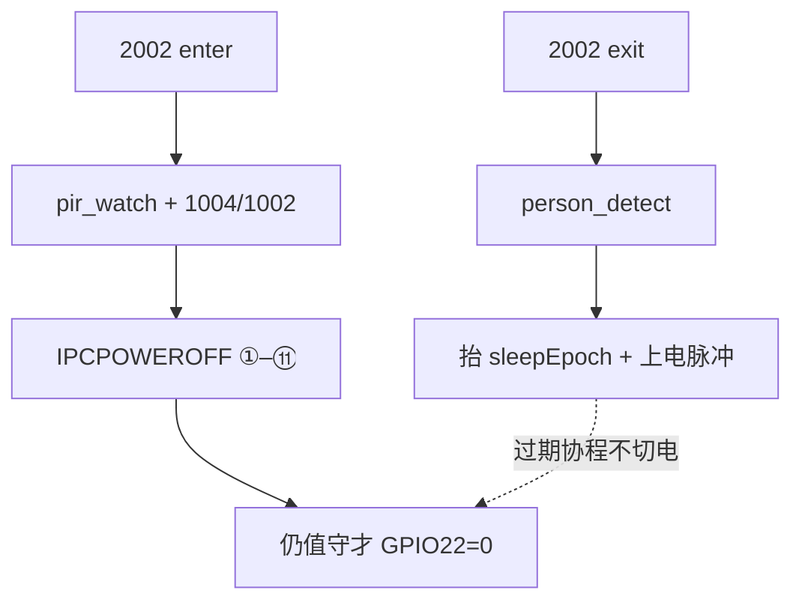

# T31 上电 / 断电：两条路径

> **Cat.1**：`user/t31x_ctrl.lua` · `user/app.lua` · `user/pir_app_bridge.lua` · `user/hif_cmd.lua`（HOSTIDLE）  
> **T31**：`app/host/host_at.c` · `app/common/ipc_graceful_shutdown.c`  
> **关联**：[WORK_MODE_PERSON_DETECT_PIR](WORK_MODE_PERSON_DETECT_PIR.md) · [MQTT_2002_IPCPOWEROFF_T31_FLOW](../mqtt/MQTT_2002_IPCPOWEROFF_T31_FLOW.md) · [T31X_HOSTEVT_SLEEP](../t31x/T31X_HOSTEVT_SLEEP.md)

工作模式只有两种，和「T31 在不在电」必须对齐：


| 模式                        | 谁检         | T31       | PIR                                 |
| ------------------------- | ---------- | --------- | ----------------------------------- |
| `person_detect`（默认）       | T31 人形 IVS | **必须在电**  | 丢掉（`trigger_ignored person_detect`） |
| `pir_watch`（仅 2002 enter） | Cat.1 PIR  | **值守时断电** | 触发后短暂上电，忙完再走关机流程断电                  |


---


## 路径 A：后台 MQTT 2002 开关 T31

后台只发开关，不走 PIR。1004 **立刻回**（不要为封盘把超时拉到 40–100s）。真正断电在协程里。

```text
2002 enter（关 T31 / 进值守）
  立刻 1004 rest_enter
  workMode=pir_watch，lowpwr=1
  1002 rest
  enterSleep（异步，用户指令不拦写盘）
    → AT+IPCPOWEROFF=1（可播关机音）
    → T31 分级停（见下）
    → +IPCPOWEROFF:OK 或超时
    → 仍是 pir_watch 才 GPIO22=0

2002 exit（开 T31 / 回人形）
  立刻 1004 rest_exit
  workMode=person_detect，lowpwr=0
  作废进行中的 enterSleep（不得再 GPIO 拉低）
  ensNormalPwrOn + 唤醒脉冲
  若 T31 已经回了 OK（服务已停、GPIO 还在），短循环上电把服务拉回
```

164 起：上电 / 退出 rest 抬 `sleepEpoch`；过期关机协程打 `sleep_aborted` / `sleep_skip_gpio`，不再误切电。  
165：2002 enter 关机进行中若 T31 再发 HOSTIDLE，不再开第二路 `enterSleep`（否则抬 epoch，第一路 OK 后会误 `sleep_aborted_cycle` 先断再上）。短循环上电 **只**在 2002 exit / 退出值守时。




---


## 路径 B：PIR 触发开 T31，忙完再关

只在 `pir_watch` **且 T31 已断电** 时 PIR 才干活。人形常电时 T31 **不发** `AT+HOSTIDLE=1`。

```text
PIR GPIO
  → trigger_detected
  → 上电 T31 + 录像 / 抽片
  → 录完 或 HOSTIDLE=1（T31 空闲轮询，4G 仅 pir_watch 放行）
  → enterSleep(reason=pir_watch_idle | host_idle)
  → 同一套 AT+IPCPOWEROFF 分级停（空闲不播关机音，=0）
  → GPIO22=0，回到值守
```


---


## T31 分级停（两条路径共用）

`ipc_graceful_shutdown("poweroff")` 按级做，空闲可跳过；单级超时继续下一级。  
上行箭头是业务链，编号是 UART 日志 `+IPCPOWEROFF:STAGE,*`（与函数一一对应）：

```text
录像 → 抽片上传 → 报警 → 人形 → P2P → GB28181 → 网卡 → umount TF → VBUS → sync
  │  ① STAGE,record     停录像 / 封盘          media_sched_record_stop（未在录可跳过 12s 等待）
  │  ② STAGE,clip       抽片上传退出            clip_upload_exit
  │  ③ STAGE,alarm      报警服务退出            event_alarm_service_exit
  │  ④ STAGE,persondet  结束人形会话            person_detect_pir_session_end
  │  ⑤ STAGE,p2p        停 P2P 回放 / 取消下载  p2p_play_stop
  │  ⑥ STAGE,gb28181    退国标                  gb28181_dev_exit（未编则无）
  │  ⑦ STAGE,net        拆 4G 网卡              net_link_manager_deinit（Host UART 留下回 OK）
  │  ⑧ STAGE,umount     卸载 TF                 tf_card_umount_all
  │  ⑨ STAGE,vbus       VBUS_EN 拉低            GpioVbusEnSet(0)（有则做）
  │  ⑩ STAGE,sync       落盘                    sync()
  │  ⑪ +IPCPOWEROFF:OK  ← 到这里才允许断电
```

Cat.1 等到 OK（或 `poweroff_timeout_ms`，当前 90s）再决定是否拉 GPIO。  
`ipc_poweroff_done timeout` = 没等到 OK，**仍可能硬断电**。

T31 重入：已有关机线程在跑 → **不回 BUSY**，等第一线程回 OK；上一轮已经停完、进程还在 → 复位后再走一轮（或立刻 OK），避免二次值守死等。

---


## 对不齐时怎么读日志


| 日志                                          | 含义                                     |
| ------------------------------------------- | -------------------------------------- |
| `ipc_poweroff_done timeout` + `power off 0` | 没优雅停完就切电                               |
| `heartbeat lowpwr=0` 且 T31 已断               | 软件是人形，硬件没电 → **两边都不检**                 |
| `trigger_ignored person_detect`             | PIR 已跳，业务丢掉                            |
| `sleep_aborted` / `sleep_skip_gpio`         | 164：退出 rest 作废了这次断电                    |
| `sleep_already` / 无第二路 `join_session`     | 165：关机进行中 HOSTIDLE 被丢掉，不会短循环上电         |
| `+IPCPOWEROFF:BUSY`                         | 旧 T31 关机重入；164 起 Cat.1 会接着等 OK，不再当立刻失败 |


恢复：要值守再发 **2002 enter**（心跳 `lowpwr=1`）；要人形发 **2002 exit**（163+ 防上电误进烧录）。

---


## 怎么确认


| 路径         | 期望                                                                         |
| ---------- | -------------------------------------------------------------------------- |
| A enter    | 立刻 1004 → ①–⑩ STAGE → OK → `power off`；1003 `pir_watch` `ipcReady=0`       |
| A 立刻 exit  | 日志 `sleep_aborted` / `sleep_skip_gpio`；心跳 `lowpwr=0`；T31 **有电**（或短循环后服务起来） |
| B PIR      | `trigger_detected` → 上电录像 → 空闲 `AT+IPCPOWEROFF=0` → 再走 ①–⑪ → 断电            |
| 旧 T31 BUSY | Cat.1 `join_busy` 后仍等到 OK，或 90s 超时兜底                                       |


刷机：Cat.1 脚本 **001.000.166**；T31 需重编 `host_at.c` + `ipc_graceful_shutdown.c` 后烧 IPC。只刷 Cat.1 时，旧 T31 仍可能回 BUSY，164 会接着等 OK。