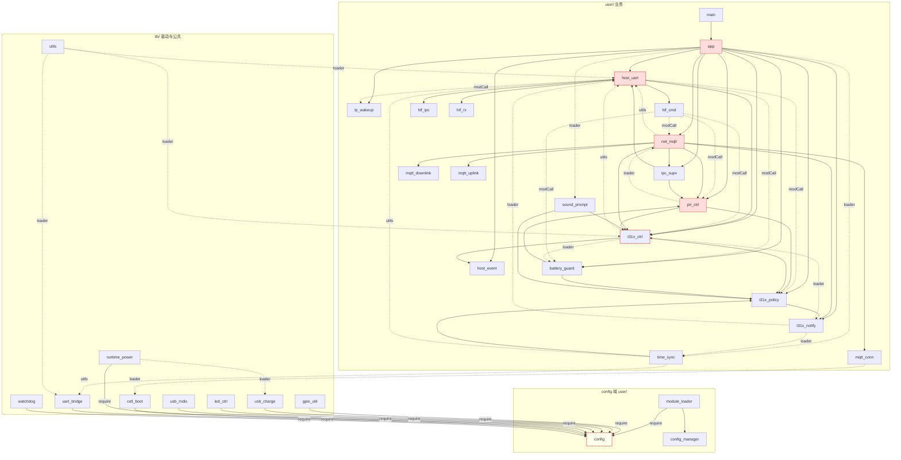

# 780EHM_PJ 架构体检报告（2026-09-04，VERSION 001.000.155）

> **性质**：只读体检，未修改任何运行代码。所有结论基于对 `user/`（58 文件）、`lib/`（15 文件）、`tools/debug/`、`doc/` 的静态分析：依赖图由脚本从 `require` / `loader.load|opt` / `modCall` / `bind` / `utils.hostUart|uartBridge` 五种形态抽取（Tarjan 求强连通分量），魔法数字、错误风格、状态写入点、文档覆盖由 `rg` 统计。
> **与既有账本的关系**：不重复 `doc/overview/USER_LIB_CODE_AUDIT_20260904.md`（逐行级 bug 审计，已闭环 R1–R14）与 `ARCHITECTURE_REVIEW_20260903.md`（四主题裁决）；本报告聚焦**结构层**——依赖方向、状态归属、协议契约、护栏边界——并给出重构排序。
> **位置说明**：按要求落在 `docs/architecture_audit.md`；仓库文档体系的唯一入口是 `doc/README.md`（登记护栏只扫 `doc/`），若要纳入体系需迁至 `doc/overview/` 并登记。

---

## 1. 项目结构概览

### 1.1 顶层目录职责

| 目录 / 文件 | 职责 | 备注 |
|---|---|---|
| `user/` (58 `.lua`, ~13.6k 行) | 业务与协议编排：入口 `main.lua`、编排中心 `app.lua`、10 个 config 片段、MQTT 族 `net_mqtt`+`mqtt_*`、T31x AT 族 `host_uart`+`hif_*`、PIR/电源/T31x 门禁/授时/OTA | 扁平单层；文件名 ≤24 字节（LuatOS 限制）驱动了 `hif_`/`dl_`/`ul_` 缩写 |
| `lib/` (15 `.lua`, ~2.6k 行) | 驱动与公共库：`uart_bridge`、`gpio_util`、`usb_*`、`cell_boot`、`led_ctrl`、`runtime_power`、`config_manager`、`module_loader`、`utils`、`watchdog`、`sys`(LuatOS fork)、`libfota2` | 名义上「不得 require user/」，实际 9 个 lib 直接 `require "config"`（见 §2.3） |
| `doc/` (146 md) | 三视角文档体系：`overview/`(架构+治理) / `manual/`(任务手册) / 主题目录 `mqtt` `t31x` `power` `pir` `hardware` `modules` `release` / `_audit`(留档) / `archive`(迁移 stub) | 唯一入口 `doc/README.md`；登记/互链/版本/键索引 4 条文档护栏 |
| `tools/debug/` | 9 项静态护栏（`run_all_checks.py`）+ 30 余个实机调试/一次性脚本 | 护栏全部为正则/启发式，无 Lua 词法分析 |
| `tools/gui/` `tools/t31x/` | 烧录 GUI、MQTT 联调 GUI（Python + Java 双实现）、T31x 推包 | Java 版与 Python 版功能重叠 |
| `ota_server/` `http_server/` `patch_server/` `video_upload_server/` | 云侧服务（独立工程，各自 README） | 与固件仅协议耦合 |
| `firmware/` `量产/` `archive/` | 产物与历史归档（`.gitignore` 大部分忽略） | — |
| `luatos.json` `config.mk` `VERSION` | 构建描述：内核 `.soc`、功能宏、工程包版本 | `luatos.json` 的 `core` 与实测内核不一致（§5.3） |

### 1.2 核心模块清单（按职责域）

| 域 | 模块 | 行数 | 角色 |
|---|---|---|---|
| 引导/编排 | `main`, `app`(973), `config`+10 片段, `module_loader`, `config_manager` | — | `app` 为编排中心（事件订阅、低功耗、USB/PIR 联动，冻结不拆） |
| 云端 MQTT | `net_mqtt`(665), `mqtt_conn`, `mqtt_dispatch`, `mqtt_uplink`(537)+`mqtt_ul_pir/upload`, `mqtt_downlink`+`mqtt_dl_ctrl/dev/pir/tf/upload`, `mqtt_hproto` | ~2.6k | 12 文件，`bind(ctx)` 注入 |
| T31x 串口 AT | `uart_bridge`, `host_uart`(699), `hif_at`, `hif_cmd`+5 子, `hif_rx`+`dsl`(550)+`media`, `hif_ipc`+6 子 | ~4.3k | 18 文件；`ctx` 表 70 键 |
| T31x 电源 | `t31x_ctrl`, `t31x_policy`, `t31x_notify`, `host_event`, `ipc_supv` | ~1.1k | 门禁 + 三级唤醒链 + 告警对账 |
| PIR/外设 | `pir_ctrl`(728), `peripheral`, `led_ctrl`, `gpio_util`, `sound_prompt` | ~1.5k | 硬件中断→会话→上行 |
| 电源/电池 | `vbat`, `battery_guard`, `usb_charge`, `usb_rndis`, `usb_vuart`, `runtime_power`, `lp_wakeup` | ~1.5k | 运行态经 `runtime_power` 访问器 |
| 网络/其它 | `cell_boot`, `device_id`, `time_sync`, `fota_svc`, `libfota2`, `watchdog`, `net_tcp`(桩), `utils` | ~1.4k | — |

---

## 2. 模块依赖关系

### 2.1 依赖图（核心 30 模块；实线 `require`/`bind`，虚线 `loader`/`modCall`/`utils` 懒加载）



### 2.2 循环依赖

**硬环（`require`/`bind`）：0 个。** 这是 069–154 优化 loop 的成果——所有跨族引用都被改成懒加载或注入。

**软环（含 `loader` / `modCall` / `utils.hostUart` 懒加载）：1 个巨型强连通分量，27 个模块**：

```
battery_guard cell_boot hif_cmd hif_cmd_link hif_cmd_pir hif_cmd_t31x hif_cmd_usb hif_cmd_wled
hif_ipc hif_ipc_cloud hif_ipc_rec hif_rx hif_rx_dsl host_uart ipc_supv mqtt_conn mqtt_downlink
mqtt_hproto net_mqtt pir_ctrl sound_prompt t31x_ctrl t31x_notify t31x_policy time_sync usb_rndis utils
```

代表性环路（每条都是运行期真实调用路径）：

| 环 | 边形态 | 含义 |
|---|---|---|
| `pir_ctrl → net_mqtt → pir_ctrl` | `loader` / `require` | PIR 会话要发 1010，MQTT 下行 2010/2011 要改 PIR 策略 |
| `host_uart → t31x_ctrl ⇢ host_uart` | `require` / `utils.hostUart` | AT 业务要控 T31x 电源，电源模块要问串口是否就绪 |
| `t31x_policy → t31x_notify ⇢ t31x_ctrl → t31x_policy` | `require` / `loader` / `require` | 门禁、唤醒、电源三件套互相调用 |
| `host_uart ⇢ battery_guard → pir_ctrl ⇢ net_mqtt → ipc_supv → host_uart` | `modCall` / `require` / `loader` / `require` / `require` | 五跳跨四个域 |
| `utils ⇢ host_uart / t31x_ctrl`（lib 反向懒加载 user） | `loader` | `utils` 名为工具库，实为跨域桥 |

**为什么它能跑**：`module_loader.load` 带缓存 + 所有环边至少一条是运行期（函数体内）而非模块加载期，所以不会重入栈溢出。**为什么它是问题**：任何模块的启动/销毁顺序都不能从依赖图推出，只能靠 `app.start` 手写顺序（`doc/overview/CALL_GRAPH.md §1.1`，16 步）和 bind 顺序护栏维持；换一个 `require` 位置就可能把软环变硬环（`CAT1_MODULE_FRAMEWORK §2.4` 记录的 `config_manager→utils→module_loader→config_manager` 栈溢出即一例）。

### 2.3 反向依赖（lib → user）

`doc/overview/CALL_GRAPH.md §2` 写「`lib/*` 不得 `require user/*`」，实际 **11 条反向边**：

| lib 模块 | → user | 形态 | 评价 |
|---|---|---|---|
| `module_loader` `gpio_util` `usb_charge` `led_ctrl` `usb_rndis` `cell_boot` `runtime_power` `uart_bridge` `watchdog` | `config` | `require` | 9 个 lib 在**模块加载期**依赖 user 层的配置编排；`config` 物理上在 `user/` 但语义是「平台配置」——分层规则与目录不一致 |
| `utils` | `host_uart`, `t31x_ctrl` | `loader` | `utils.hostUart()` / `t31xOn()` 是 lib 为 user 业务提供的懒加载桥，把 lib 变成了业务感知层 |

结论：**目录分层（`lib/` vs `user/`）与依赖分层（L0–L4，`CODE_LAYERING_ARCHITECTURE.md`）不重合**。`config` 与 `runtime_power`/`config_manager`/`module_loader` 实际构成 L0「平台配置层」，应与驱动层区分。

### 2.4 扇入/扇出

| 指标 | Top | 含义 |
|---|---|---|
| 扇出 | `main` 39（含 Luatools 扫描锚点 26 个假 require）· `app` 22 · `host_uart` 16 · `net_mqtt` 16 | `app` 是唯一知道所有域的模块 |
| 扇入 | `config_manager` 35 · `config` 23 · `module_loader` 16 · `runtime_power` 15 · `t31x_ctrl` 14 · `utils` 13 | `t31x_ctrl` 被 14 个模块直接依赖，是隐性核心；`utils` 13 扇入 + 反向懒加载 = 全局耦合点 |

---

## 3. 架构问题清单（按严重度）

### A1 · 严重 · ACK 事件无请求关联，多处「抢答」类 bug 的共同根因

- **文件**：`user/host_uart.lua:55-70`（`SYS_EVT` 20 个 `*_ACK`）、`user/hif_ipc.lua:100-116`（`sendAt` → `sys.waitUntil(ackEvent)`）、`user/hif_rx_dsl.lua`（各 `try*` → `sys.publish(SYS_EVT.X_ACK, snap)`）、`user/hif_ipc_tffmt.lua:83-116`（`TFFORMAT_ACK`）
- **问题**：请求-应答配对完全靠「同名事件 + 时间上恰好在等」。任何同名 URC、主动上报、局部补丁都能把等待方唤醒。155 修的 R2（`patchCloud` 抢答 `IPCSTAT_ACK`）、R3（畸形 `+RECORD:` 误清）、评审指出的「迟到 `+TFFORMAT:STARTED` 被下一轮消费」、`parseIpcStat` 仅 1 个 `k=v` 即整体替换 9 键并 notify，都是同一结构缺陷的不同切面。
- **影响**：串口事务锁只能保证「同时只有一个请求在飞」，不能保证「收到的应答属于我」；每加一种 URC 都可能引入新的抢答。
- **建议方向**：`sendAt` 生成单调递增 `txnId` 写入 `state.uart_txn_seq`，RX 侧解析出的快照附带当前 `txnId`，`waitUntil` 后校验；或改为 per-request 事件名 `X_ACK_<seq>`。改动集中在 `hif_ipc.sendAt`/`hif_rx_dsl` 各 `try*`，不动协议。

### A2 · 严重 · 双重互斥（事务锁 + 12 个 busy 键）职责重叠、准入不一致

- **文件**：`user/host_uart.lua:202-245`（`uartAcquire/uartRelease`）、`user/hif_ipc_cloud.lua:37-42`（`HU_BUSY_KEYS` 11 键）、`user/hif_ipc.lua:134-165`（`hostQuery` 只看 `opts.busyKey`）、`user/hif_ipc_tffmt.lua:148`
- **问题**：事务锁保证串行，busy 键做「同类不重入 + 1003 让路」。但 `hostQuery` 准入只检查**自己**的 busy 键，不检查 `tfcard_format_busy`/`ipc_poweroff_busy` 等**破坏性会话**——格式化/断电期间 2007 `AT+TFCARD?` 仍可拿锁发出。R4 首版「早释放锁」正是被这两套机制的边界误导。
- **影响**：并发语义靠阅读 11 个键的取值点才能理解；新增一类 AT 要同时决定「要不要进 `HU_BUSY_KEYS`」和「要不要在 `hostQuery` 准入检查」。
- **建议方向**：把 busy 键收敛成两类显式状态：`uart_session`（破坏性会话：格式化/断电/恢复，`hostQuery/hostSet` 一律等待或 fallback）与 per-query 重入保护；`isCloudBusy` 只读前者。

### A3 · 严重 · 电源与录像状态各有 3–8 个写入点，无单一状态机

- **文件**：低功耗态 `setLowPowerMode` 写点：`lib/runtime_power.lua`(3) `user/app.lua`(4) `user/battery_guard.lua`(3)；录像态写点：`pir_ctrl.session.recording`、`host_uart.state.t31x_rec_active`、`state.host_ipc_cloud_stat.recordingt31x` 分布在 `hif_cmd_t31x` `hif_ipc_cloud` `hif_ipc` `hif_ipc_power` `hif_rx_dsl` `mqtt_dl_pir` `pir_ctrl` 8 文件 13 处
- **问题**：`doc/overview/ARCHITECTURE_REVIEW_POWER_PSM.md` 已有 PSM 设计稿但未落地；`hif_ipc.setRecActive` 注释自称「单一写入点」，实际 `commitIpcStat`、`applyPowerOffSuccess`、`reconcileRecord` 各自直写。USB 插拔、2002、电量档位、PIR forceWake 四条路径对同一状态的转移条件散在 `app.onEnter/ExitLowPower`、`battery_guard.evaluate`、`t31x_policy.mayPowerT31x`。
- **影响**：`T31X_BATTERY_USB_T31X_OSCILLATION.md` 记录的震荡环虽在默认策略下拆掉，但「hybrid 策略」的 6 个档位字段仍活在配置里，状态机随时可被一个配置开关复活。
- **建议方向**：落地 PSM 稿的 R1 主案——`runtime_power` 持有状态 + 转移表，`app`/`battery_guard`/`t31x_policy` 只发「事件」不直写状态；录像态以 `hif_ipc.setRecActive` 为唯一入口并加护栏禁其它文件写 `t31x_rec_active`。

### A4 · 高 · `bind(ctx)` 注入表 70 键，是隐式全局而非接口

- **文件**：`user/host_uart.lua:420-500`（`ctx` 70 键）、`tools/debug/bind_header_specs.json`（11 子模块各自 `c/h` 清单）、`user/net_mqtt.lua:255-290`（`ctx` ~35 键）
- **问题**：子模块能用什么、装配顺序谁先谁后，全靠 `bind_header_specs.json` 与 `_protocol_regression_check` 守。历史上 107/108 两轮「拆文件裸调用 nil 必崩」就是 ctx 漂移。ctx 键既有函数、又有可变 `state` 表、又有常量 `SYS_EVT`，无粒度区分。
- **影响**：新增子模块的成本 = 改主文件 ctx + 改 JSON 规格 + 记住 bind 顺序；护栏只能保证「头部声明 ⊆ ctx」，不能保证运行期 `C.xxx` 已赋值（`C.M` 延迟挂载模式）。
- **建议方向**：把 ctx 拆成 3 个只读命名空间 `ctx.const`（`SYS_EVT`/`TIMEOUT`）、`ctx.io`（`sendString`/`rspFmt`/锁）、`ctx.state`（唯一可变表），子模块按需解构；`bind_header_specs.json` 由 `--emit-all` 生成而非手维护。

### A5 · 高 · `modCall("module", "fn")` 字符串耦合绕过所有静态保证

- **文件**：`user/host_uart.lua`、`user/hif_cmd.lua`（13 处 `modCall` 指向 5 个域）、`user/hif_ipc.lua`、`user/t31x_ctrl.lua`；护栏 `tools/debug/_ref_name_check.py`
- **问题**：`modCall` 让 `hif_cmd` 反向调用 `net_mqtt`/`pir_ctrl`/`battery_guard`——AT 层直接驱动业务层，依赖方向从图上消失（§2.1 虚线）。`_ref_name_check` 只验模块名与函数名存在，不验签名。
- **影响**：改一个导出函数的参数顺序，`luac -p` 与 9 项护栏全绿，实机才崩。
- **建议方向**：`modCall` 只允许指向「服务接口表」（如 `host_uart` 已有的 `_M.EVT`/`hostq` 导出），并在 `_ref_name_check` 加参数个数校验（读目标 `function name(a, b)` 形参数与调用实参数比对）。

### A6 · 高 · `config` 与 lib 的分层倒置（§2.3）+ `require` 环红线依赖人记

- **文件**：`user/config.lua` 及 9 个 lib 的 `require "config"`；`lib/utils.lua:192-199`（`hostUart/uartBridge/t31xOn` 反向懒加载）；红线记录 `doc/overview/CAT1_MODULE_FRAMEWORK.md §2.4`
- **问题**：「config 片段/config_manager 禁 require utils 系 lib」只写在文档和 `.cursor/rules`，无护栏；`config_manager.bool` 与 `utils.parseBoolDef` 因此被迫双实现（audit §14 P2-1）。
- **影响**：下一个把 `utils` 引进 config 片段的人只有在真机上看到栈溢出才知道。
- **建议方向**：新护栏 `_layer_check.py`：读依赖图，规则表 `lib/* ↛ user/*（config 除外）`、`config 片段/config_manager ↛ utils|module_loader`；`utils` 的三个懒加载桥迁到 `user/` 新建 `svc_locator.lua`（或并入 `app` 注入），让 `lib/` 真正业务无感。

### A7 · 中 · `app.lua` 973 行编排中心承担 6 个域的联动逻辑

- **文件**：`user/app.lua`（USB 电源 `applyUsbPower` 系、低功耗 `onEnter/ExitLowPower`、PIR 8 个 handler、烧录模式 `setBurnMode`、MQTT 引导 `bootMqtt`、`EVNT_HNDL` 30 项订阅表）
- **问题**：项目约定「冻结不拆」（`USER_LIB_OPTIMIZATION_NEXT §2`），但它是 §2.2 软环的枢纽和 §3 A3 状态写入的主场。
- **影响**：任何域的行为改动都要读 `app.lua`；PR 冲突集中。
- **建议方向**：不拆文件也可以拆职责——把 `applyUsbPower`/`onEnterLowPower`/`onExitLowPower` 迁入 PSM（A3），`app` 只留订阅表与装配顺序。

### A8 · 中 · 协议契约（MQTT/AT）散落，1013 等上行已落后文档

- **文件**：`user/mqtt_ul_upload.lua:66-137`（无 `stage`/`fileName`/`videoType`）、`user/hif_at.lua`（无 `AT+UPLOADPROGRESS`）、`user/mqtt_dl_ctrl.lua` CTRL 表（无 `hostevt_poll`）、真源 `doc/mqtt/MQTT_DOWNLINK.md §10b`、`doc/mqtt/UART_AT_COMMANDS.md`
- **问题**：dataType 常量在 `net_mqtt.lua DT`，JSON 字段拼接散在各 `pub*`（`string.format` 手拼 + `escJson`），无 schema；文档写了、代码未实现的字段无护栏可查。
- **影响**：平台联调靠人工对照；`MQTT_DOWNLINK.md` 与代码已有 4 处已知偏差（audit §18.3）。
- **建议方向**：为每个 10xx 上行建字段表（Lua 表驱动 `fields = {...}`），`_protocol_regression_check` 对照 `MQTT_DOWNLINK.md` 中的 JSON 样例键集做 ⊆ 校验。

### A9 · 中 · 构建/打包描述与实测内核不一致

- **文件**：`luatos.json:13`（`core = LuatOS-SoC_V2034_Air780EHM_116.soc`）vs `doc/release/CAT1_FLASH_FLOW.md:14`（V2044/V2050）、`doc/mqtt/MQTT_231_CLOSED_LOOP_20260902.md:5`（实机 `firmwareVersion=2050.001.149`）、`doc/overview/SYSTEM_ARCHITECTURE.md:255`（`2034.001.155`）
- **问题**：三处内核号（2034/2044/2050）并存；量产走 `cat1_flash.py flash-script`（只刷脚本区），`luatos.json` 的 `core` 实际不参与量产但仍是 Luatools 打开工程的依据。
- **影响**：新人按 `luatos.json` 用 Luatools 打完整包会得到与量产不同的内核。
- **建议方向**：在 `doc/release/RELEASE_v1.2.md` 或 `README` 明确「当前量产内核 = V20xx，`luatos.json` 仅供 Luatools 调试」，并让 `_doc_version_check` 顺带校验内核号口径。

### A10 · 中 · 静态护栏全部为正则/启发式，无 Lua 词法层

- **文件**：`tools/debug/_ref_name_check.py`、`_config_key_check.py`、`_gpio_opts_check.py`、`_protocol_regression_check.py`、`_gen_bind_header.py`
- **问题**：字符串剥离、块注释、单双引号、别名调用都是各脚本各自实现（本轮评审即抓出 3 条漏报）；无单元测试，护栏自身正确性只靠注入样本手测。
- **影响**：护栏越多，「假绿」面越大；维护者会把 ALL PASS 当成安全网。
- **建议方向**：抽一个 `tools/debug/_luatok.py`（最小 Lua 词法器：字符串/注释/标识符/调用），所有护栏基于 token 流；为护栏加 `tests/` 注入用例（本轮的 5 类 gpio 样本、字符串伪消费样本可直接固化）。

### A11 · 低 · `net_tcp` 桩、`hybrid` 策略、`pmd_runtime` 等半接线特性

- **文件**：`user/net_tcp.lua`（空壳）、`user/battery.lua:58-72`（hybrid 6 字段零决策引用）、`user/app.lua:356-361`（`pmd_runtime` 默认关）、`user/lp_wakeup.lua:52`（`getModemHibernate` 恒 false）
- **问题**：配置存在 → 用户以为可调；代码存在 → 维护者以为在用。
- **影响**：CONFIG.md 需要不断加「仅 hybrid」「占位」注脚。
- **建议方向**：产品决策二选一：删配置+桩，或建 `EXPERIMENTAL_FLAGS` 单独分组并在 `_config_key_check` 标记。

---

## 4. 逻辑问题清单

### 4.1 状态机混乱

| 位置 | 现象 |
|---|---|
| `user/app.lua` `onEnterLowPower`/`onExitLowPower` + `user/battery_guard.lua` `enterBatRest` + `user/mqtt_dl_dev.lua` `dlRest` + `user/hif_cmd.lua` LOWPOWER | 进/出 rest 有 4 个入口，各自决定要不要 `pubRest`/`enterSleep`/`notifyUsbIdle`，对称性靠人工核对（`WORK_MODE_PERSON_DETECT_PIR.md` 是唯一对照表） |
| `user/pir_ctrl.lua` `session.recording` vs `user/host_uart.lua` `state.t31x_rec_active` vs `cloud.recordingt31x` | 三份录像态，`reconcileRecord`（`hif_ipc_cloud.lua:270`）负责对账，但对账本身依赖可能陈旧的 `host_record` 缓存（评审 N2） |
| `user/t31x_policy.lua` `mayPowerT31x` 的 `opts.forceWake` | PIR `high_priority` 默认走 forceWake，绕过电量/rest 全部门禁；「门禁」实际只对非 PIR 路径生效 |
| `user/hif_ipc_tffmt.lua` / `hif_ipc_power.lua` 破坏性会话 | 会话态（格式化中/断电中）只是 busy 布尔，没有「进入/退出」事件，其它模块无法订阅 |

### 4.2 错误处理不一致

| 风格 | 计数 | 代表 |
|---|---|---|
| `return false, "reason"` | 41 | `hif_ipc_tffmt.formatPrecheck`、`fota_svc` |
| `return nil, …` | 17 | `hif_ipc_hostq` 各 prep |
| `error("reason")` + 上层 `normalizeLuaErr` 取 `: ` 后缀 | 7 | `hif_ipc_tffmt.runFormatSession`（`"uart_busy"`/`"no_started"`/`"timeout"`）——用异常传业务码，再用字符串切分还原 |
| `pcall` 包裹 | 51 | 平台 API 有的裹有的不裹：`vbat` 155 前 `adc.*` 裸调、`app.lua:240` `pm.shutdown()` 裸调、`t31x_ctrl:278` `pm.hibernate()` 裸调 |
| 静默回退 | — | `config_manager.get` 未注册键回空表（155 前零日志）；`hostQuery` acquire 失败走 `queryFallback` 无日志 |

三种返回约定并存意味着调用方必须逐个函数看实现才知道怎么判失败；`error()` 传业务码尤其脆弱（`normalizeLuaErr` 对含 `: ` 的错误消息会截错）。

### 4.3 重复逻辑

| 逻辑 | 位置 | 备注 |
|---|---|---|
| `logPowerOffRx` | `user/hif_ipc_power.lua:77` 与 `user/hif_rx_dsl.lua:494` | 签名都不同（`(tag, line)` vs `(line)`） |
| 布尔解析 | `lib/config_manager.bool` 与 `lib/utils.parseBoolDef` | 因 require 环被迫双实现（audit §14），注释互链 |
| `optTable` | `lib/utils.optTable` 与 `user/mqtt_ul_pir.lua` 自建 | — |
| TF `present` 0/1 归一 | `utils.to01`（dsl/cloud）vs `hif_cmd_t31x.lua:188` 手写 `(tonumber…)==1` | 边界（`"1"`/`true`）处理可能分叉 |
| IPC 就绪判定 | `ipcReadyFrom` vs `defaultCloudSkeleton` 内联 `life=="ready"` | 两套规则 |
| IPCSTATUS 写云态 | `hif_cmd_t31x.uartIpcStatusNtf`（AT 主动）与 `hif_rx_dsl.tryIpcStatus`（URC） | 改一处漏一处 |
| 超时常量表 | 17 个模块各自 `local TIMEOUT = {…}` / `TMO` | 同一语义（`hostIdle`/`acquire`/`boot`）在 `hif_ipc`(2000)、`hif_ipc_power`(8000/2000)、`hif_ipc_tffmt`(2000/8000) 各写一份，R4 首版即误用了错误的那份 |
| MQTT 联调 GUI | `tools/gui/mqtt/`（Python）与 `tools/gui/mqtt-java/` | 两套实现同一测试面 |

### 4.4 硬编码 / 魔法数字

| 位置 | 值 | 问题 |
|---|---|---|
| `user/app.lua:404,407` | `waitForNetStable(300000)`、`waitUntil("net_ready", 300000)` | 5 分钟等网上限写死两处 |
| `lib/cell_boot.lua:292,343,363` | `500/5000/800` | 拨号节拍字面量 |
| `lib/usb_rndis.lua:130`、`lib/led_ctrl.lua:206,208`、`user/fota_svc.lua:135,215`、`user/battery_guard.lua:356` | `1500/500/2000/1000/500` | 各 1 处，无名字 |
| `lib/sys.lua:87,393` | `SIM_IND 120000`、软狗 `20000` | 平台 fork 内常量，与 `WDT_CFG` 并存两套看门狗（`ARCHITECTURE_REVIEW §双看门狗` 已标注） |
| `user/net.lua:36-37` | `http://112.86.146.219:18080`、`http://43.136.55.143` | 自建 OTA 服务器 IP 硬编码在配置片段，无环境区分 |
| `user/main.lua:10` | `PRODUCT_KEY` 明文 | 合宙 IoT 项目密钥入库（公开仓库风险；`CONFIG.md` 亦复制了该值） |
| `user/hif_ipc_cloud.lua:37-42` | `HU_BUSY_KEYS` 11 个字符串 | 与各模块 `state.xxx_busy = true` 写点无绑定，加一个 busy 键要记得来这里登记 |

---

## 5. 文档缺口

### 5.1 无专题文档的模块

`doc/modules/` 20 篇专题覆盖 70/73 模块；仅 `user/led_pir.lua`、`user/net.lua`、`user/t31x_burn.lua` 三个 config 片段没有专题（但在 `LUA_MODULES.md` 与 `CONFIG.md` 键索引中有登记）——**模块级覆盖基本完整**。真正缺的是**横切主题**：

| 缺口 | 现状 |
|---|---|
| 串口事务/ACK 并发模型 | 无文档描述 `uartAcquire` + busy 键 + `waitUntil` 三者关系（本报告 A1/A2 是首次成文），`HOST_UART_AT_DISPATCH.md` 只讲分发表 |
| 错误码/返回约定 | 无「`false,reason` / `nil,err` / `error()`」使用指南；1004/1009 的 `message` 词表（`uart_busy`、`t31x_unavailable`、`no_started`…）散在代码 |
| 内核/固件版本矩阵 | 2034/2044/2050 哪个是量产、哪个能跑 155 脚本，无一页说清（A9） |

### 5.2 文档与代码不一致（本轮体检新发现，未在 audit §18 登记）

| 文档 | 不一致点 |
|---|---|
| `.cursor/rules/air780ehm-source.mdc:10,13` | 仍写 `hu_at`/`hu_cmd`/`hu_ipc`/`hu_cmd_*`，代码已是 `hif_*`；此规则 `alwaysApply: true`，持续误导 AI 代理 |
| `doc/overview/CALL_GRAPH.md §2` | 「`lib/*` 不得 `require user/*`」与 11 条实际反向边矛盾（§2.3） |
| `doc/overview/CALL_GRAPH.md §1.1` 第 16 步 | 写「`startHeartbeat()`（10s）」，代码为 `APP_META.heartbeat_log_interval_ms` 默认 60000（`user/app.lua:861`），下限 `TIMEOUT.heartbeatMin` |
| `doc/overview/CODE_LAYERING_ARCHITECTURE.md` L0–L4 | `config` 归 user/L3，但被 9 个 lib 加载期依赖；分层图与真实依赖不符 |
| `doc/mqtt/MQTT_DOWNLINK.md §10b` / CTRL `hostevt_poll` / 2011 即时 1004 | 4 处与代码偏差（audit §18.3 已登记，待产品定） |
| `doc/overview/CONFIG.md` `BATTERY_CFG.guard` | 6 个 hybrid 字段标「仅 hybrid」，但 hybrid 状态机代码不存在 |
| `README.md` 目录表 | 列 `firmware/`（大部分 `.gitignore` 忽略，克隆后为空）与 `http_server/` 等 4 个服务目录，未说明哪些是独立工程/需单独部署 |

### 5.3 README / 构建说明是否过时

| 项 | 状态 |
|---|---|
| `README.md` 架构一览、模块清单、VERSION | 155 已对齐（`_doc_version_check` 守护）|
| `README.md` 打包段 | 写 `package_project.bat` / `pack.ps1` → `780EHM_PJ_YYYYMMDD.zip`（工程包），**未提**量产真源 `tools/pack_mass_prod.py` 与 `cat1_flash.py flash-script`；新人会按 zip 走 Luatools |
| `luatos.json` | `luatools.version 3.3.4`、`build.time 2026-06-02`、`core V2034` 三项均为 6 月快照，与 9 月实测 V2050 不符（A9） |
| `config.mk` | 已随本轮纠正片段路径；但 `FOTA_SERVER ?= iot` 默认与 `net.lua server_mode="self"` 相反，宏对照表有值无生效路径 |
| `doc/release/RELEASE_v1.2.md` | 版本 v1.2 对应脚本 `001.000.147` 时代，未更新到 155 |

---

## 6. 重构优先级

排序原则：**收益 = 消除的一类 bug 面 × 触达频率；风险 = 改动是否触及协程时序/协议字节/量产 Flash**。零行为改动且有护栏可验的排前面；需要实机窗口的排后面；需要产品/云端决策的最后。

| 序 | 项 | 收益 | 风险 | 理由 |
|---|---|---|---|---|
| 1 | **护栏 token 化 + 护栏单测**（A10） | 高：所有后续重构的安全网 | 极低：只改 `tools/` | 本轮评审 4/4 模型都抓到护栏漏报；不先把网织密，后面每一刀都在裸奔 |
| 2 | **分层护栏 `_layer_check.py` + `utils` 反向桥迁出 lib**（A6） | 高：把 §2.4 红线从「人记」变「机器拦」，`lib/` 回归纯驱动 | 低：迁 3 个函数到 `user/`，调用方 `utils.hostUart()` 改一个前缀，全静态可查 | 零协议、零时序改动 |
| 3 | **超时常量单源**（4.3 末行） | 中高：R4 首版误用 `hostIdleMs` 当 acquire 预算即此病 | 低：17 个 `TIMEOUT` 表并成 `host_uart` ctx.const 一处，数值不变 | 零行为；`_module_tree` 基线刷新即可 |
| 4 | **busy 键收敛为 `uart_session` + per-query 重入**（A2） | 高：格式化/断电期间准入语义唯一 | 中：改 `hostQuery/hostSet` 准入与 `isCloudBusy`，需实机验 2007/2009/2002 组合 | 是 A1 的前置：先把「谁在用串口」说清，再给应答配 ID |
| 5 | **ACK 请求关联 ID**（A1） | 高：根除抢答类 bug | 中：动 `sendAt` 与 20 个 `try*` 发布点，协议字节不变，但 waitUntil 语义变 | 需一轮完整 AT 回归（`MQTT_ALL_CMD_FLOW_TEST`） |
| 6 | **错误返回约定统一 + 1004/1009 message 词表**（4.2、5.1） | 中：联调可查表；去掉 `error()` 传业务码 | 低中：逐函数改返回形态，平台侧 `message` 字符串不变 | 与 A8 一起做，顺带补文档 |
| 7 | **PSM 落地：低功耗态单写点 + 录像态单入口**（A3、A7） | 高：消灭 4 入口/13 写点 | **高**：触及 USB/2002/电量/PIR 四条路径的时序，是 `T31X_BATTERY_USB_T31X_OSCILLATION` 的重灾区 | 已有设计稿（`ARCHITECTURE_REVIEW_POWER_PSM.md`），但必须有真机窗口 + `PWR_BUDGET` 前后对比，故排在护栏与并发模型之后 |
| 8 | **ctx 三命名空间 + 规格自动生成**（A4） | 中：新子模块成本降一半 | 中：11 个 bind 头全改，纯机械但量大 | 可与 5 合并做（都动 `hif_*` 头部） |
| 9 | **协议字段表驱动 + 文档 ⊆ 校验**（A8） | 中：1013 等偏差机器可见 | 低（代码）/ 需云端配合（补 `stage`/`UPLOADPROGRESS`） | 代码侧可先做「文档键集 ⊆ 代码字段表」护栏，实现补齐等联调窗口 |
| 10 | **`modCall` 签名校验**（A5） | 中 | 低 | 纯护栏增强；若 8 做完，`modCall` 数量会自然下降 |
| 11 | **构建口径统一**（A9、5.3） | 中：新人不走错内核 | 极低：只改文档 + `luatos.json` 注释 | 需先确认量产内核号（V2050?）——产品/产线定 |
| 12 | **半接线特性清理**（A11） | 低中 | 低（删）/ 高（实现 hybrid） | 纯产品决策；建议默认「删」，hybrid 若要保留则先写状态机再留配置 |

**不建议现在动**：拆 `app.lua` 文件（约定冻结，且 7 完成后它自然瘦身）；重命名 `hif_*`/`mqtt_*` 家族（24 字节限制下已是最优，改名只增 diff）；把 `module()` 风格改成 `local M = {}`（LuatOS 生态与 `.cursor/rules/lua-luatos.mdc` 明确禁止）。

---

## 附：复现本报告数据的命令

```bash
python3 /tmp/deps.py                      # 依赖图/环/反向依赖（脚本见本报告生成会话；建议固化为 tools/debug/_dep_graph.py）
rg -n "setLowPowerMode\(|setWorkMode\(" user lib | cut -d: -f1 | sort | uniq -c
rg -n "t31x_rec_active\s*=|session\.recording\s*=|recordingt31x\s*=" user | cut -d: -f1 | sort | uniq -c
rg -n "local TIMEOUT\s*=|local TMO\s*=" user lib | cut -d: -f1
rg -c 'return false, "' user lib | awk -F: '{s+=$2} END{print s}'
python3 tools/debug/run_all_checks.py     # 9 项护栏（本报告生成时 ALL PASS）
```

---

## 附二：P0–P10 后复检 A–I 条处置（2026-09-05）

| 条 | 问题 | 处置 | 护栏 |
|---|---|---|---|
| A | AT 层（host_uart/hif_*）经 `modCall` 反向驱动业务层 25 处，软环 22 模块 | `app.buildBizProviders`（22 键）经 `host_uart.start{biz}` 注入，AT 层统一 `ctx.bizCall`；AT→业务边 15→0，软环 22→16，`modCall` 46→19（余下均指基础设施） | `_layer_check` R4 基线 0；`_ref_name_check` 规则 F |
| B | 破坏性会话 vs 断电/休眠仲裁 | `t31x_ctrl.blockSleep` 纳入 `uart_session`；`hostIpcPowerOff` 有界等待他会话（VERSION 161） | — |
| C | `host_uart.state` 语义键多写点（16 处） | `setHostIpcStatus/setHostAtReady/setHostTfCard/setHostCloudStat` 单写点 | `SINGLE_WRITERS` +4 |
| D | `setRecActive` 顺带刷新 `ipc_cloud_stat_ts` 导致 1003 跳查 | `commitIpcStat(keepTs)`（VERSION 161） | — |
| E | app 在 PSM 外编排"先改态再副作用" | `runtime_power.bindPowerHooks{onEnterRest,onExitRest}`，副作用在 `requestRest/requestNormal` 内触发 | — |
| F | host_uart / net_mqtt 两族同义常量各写一份 | config 片段 `host.lua` `_G.HOST_PROTO_TMO`（2500 / 22000） | `_config_key_check` 索引 40 键 |
| G | 上行 JSON 无真机黄金样本 | `MQTT_CFG.golden_tap` → `MQTT_GOLDEN` 日志 → `_uplink_golden_capture.py` → `tests/fixtures/uplink_golden/`；**真机采样待执行** | `_uplink_schema_check` 有样本即比对 |
| H | `pir_ctrl.buildStatBody` 在业务层拼 AT 文本 | `pir_ctrl.getStatSnapshot()` 出数据，`hif_cmd_pir.buildPirStatBody` 拼文本（字段顺序逐字一致） | — |
| I | lib 含 T31x 语义（`utils.waitT31xAck`）；vendor 脚本无标注 | 改名 `waitEventUntil`；`sys.lua`/`libfota2.lua` 标 vendor 层 + sha256 锁（Luatools 只扫 lib/，不能物理挪目录） | `_layer_check` R5 |

除 B/D（VERSION 161）外均为零行为改动；A 的唯一差异是被 `MODULE_FLAGS` 裁剪的模块从"被 `loader.load` 强行加载再调用"变为 no-op。`run_all_checks` 13 项 ALL PASS。

**Agent 可读摘要**：仓库根 [`AGENTS.md`](../AGENTS.md) 将本节 A–I、P0–P10、冻结项与提交门槛整理为 ADR 表。
