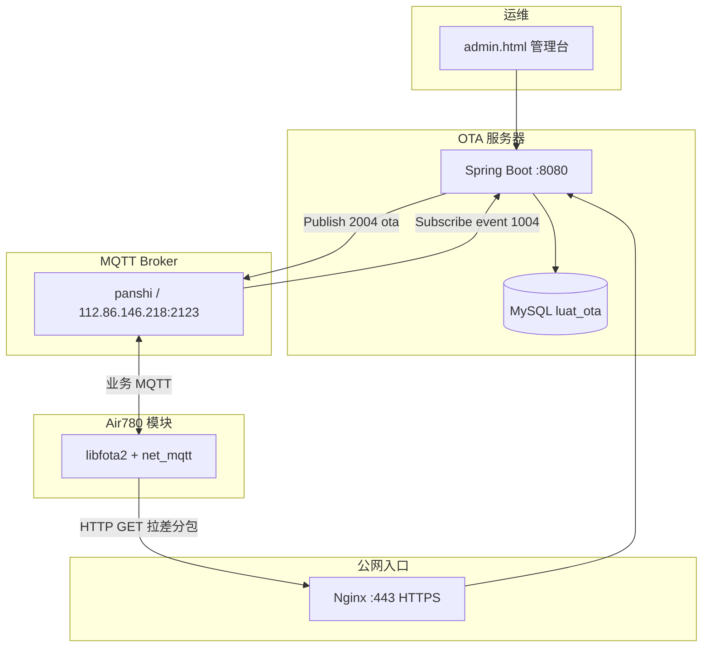

# LuatOS 自建 OTA 服务器

面向 **780EHM_PJ**（Air780EHM + panshi MQTT）的远程固件升级服务端。

> 固件侧对接见 [`doc/OTA_SERVER.md`](../doc/OTA_SERVER.md)；**完整流程**见 [`doc/OTA_FLOW.md`](../doc/OTA_FLOW.md)；协议见 [`doc/OTA_PROTOCOL.md`](../doc/OTA_PROTOCOL.md)。

基于合宙 **libfota2** HTTP 协议，提供：

- 差分包（dfota）按**源版本**匹配下发
- **MySQL** 设备台账与 OTA 任务跟踪
- **MQTT 2004** 远程触发升级（与现有 MQTT 平台联动）
- **Nginx HTTPS** 公网接入

---

## 目录

1. [这是什么](#1-这是什么)
2. [整体架构](#2-整体架构)
3. [核心概念（必读）](#3-核心概念必读)
4. [与 780EHM_PJ 固件的关系](#4-与-780ehm_pj-固件的关系)
5. [部署前准备](#5-部署前准备)
6. [部署方式一：Docker 全栈（推荐生产）](#6-部署方式一docker-全栈推荐生产)
7. [部署方式二：本地开发调试](#7-部署方式二本地开发调试)
8. [制作并配置差分包](#8-制作并配置差分包)
9. [升级完整流程](#9-升级完整流程)
10. [管理台使用](#10-管理台使用)
11. [MQTT 联动说明](#11-mqtt-联动说明)
12. [Nginx HTTPS](#12-nginx-https)
13. [配置项说明](#13-配置项说明)
14. [API 参考](#14-api-参考)
15. [数据库表说明](#15-数据库表说明)
16. [故障排查](#16-故障排查)
17. [目录结构](#17-目录结构)
18. [外部参考](#18-外部参考)

---

## 1. 这是什么

合宙模块远程升级（FOTA）有两种常见做法：

| 方式 | 说明 |
|------|------|
| 合宙 IoT 平台 | 官方云，配置 `PRODUCT_KEY` 即可 |
| **自建 HTTP 服务器（本项目）** | 自己托管差分包，完全可控 |

本服务器实现的是第二种。模块里的 `libfota2` 用 **HTTP GET** 向服务器询问是否有新版本：

- **有升级**：服务器返回 **HTTP 200**，响应体为 `.bin` 差分包二进制
- **无升级**：服务器返回 **HTTP 状态码 ≥ 300**（默认 404）

在此基础上，本项目还增加了：

- 通过 **MQTT 2004** 远程「通知设备去升级」（与 780EHM_PJ 现有下行协议一致）
- **MySQL** 记录每台设备的版本与升级任务状态
- **Web 管理台** 上传固件、触发升级、查看日志

---

## 2. 整体架构



**三条关键链路：**

| 链路 | 协议 | 作用 |
|------|------|------|
| 管理 → 服务器 | HTTP + `X-Admin-Token` | 上传固件、查设备、触发 OTA |
| 服务器 → 设备 | MQTT `2004 action=ota` | 通知模块开始升级 |
| 设备 → 服务器 | HTTP GET | 下载差分包 |

---

## 3. 核心概念（必读）

### 3.1 版本号格式

780EHM_PJ 存在两种版本表示，**服务器侧统一使用 IoT 格式**：

| 位置 | 格式 | 示例 |
|------|------|------|
| `user/main.lua` 中 `VERSION` | 脚本版 `XXX.YYY.ZZZ` | `001.000.002` |
| libfota2 / OTA 请求 / 本服务器 | IoT 版 `内核号.XXX.ZZZ` | `2034.001.002` |

对应关系：`2034` 为 LuatOS 内核号（Air780 常见为 2034），后两段来自脚本 `VERSION`。

> **注意**：`main.lua` 里请保持脚本版 `001.000.002`，不要直接写 `2034.001.002`，否则 Luatools 打包会出错。详见 `user/main.lua` 注释。

### 3.2 差分包（dfota）不是全量包

Luat 远程升级使用 **差分包**：

- 必须知道设备**当前版本**（源版本）
- 用 Luatools「差分工具」从「旧量产 bin + 新量产 bin」生成
- **源版本不同，差分包也不同**

因此服务器不能只有一个 `update.bin` 完事，必须配置 **manifest**，按 `sourceVersion` 精确匹配。

### 3.3 libfota2 请求参数

设备发起 OTA 检查时，libfota2 会自动在 URL 后追加（自建服务器模式）：

| 参数 | 来源 | 示例 |
|------|------|------|
| `imei` | 模块 IMEI | `862323084068124` |
| `firmware_name` | `PROJECT_LuatOS-SoC_BSP` | `PANSHI_CAT1_LuatOS-SoC_Air780EHM` |
| `version` | 当前 IoT 版本 | `2034.001.002` |
| `project_key` | 合宙 key（自建可忽略） | — |

### 3.4 目标版本优先级

服务器决定给设备下发哪个版本时，优先级如下：

```
MySQL devices.target_version
    ↓ 无
manifest.json → deviceTargets[imei]
    ↓ 无
application.yml → luat.ota.latest-version
```

---

## 4. 与 780EHM_PJ 固件的关系

**固件 lua 不要改。** 现有 `lib/fota.lua` 已兼容：MQTT 2004 载荷里带 `url` 就走自建 HTTP，不带则走合宙 IoT。

详见 [`doc/OTA_SERVER.md`](../doc/OTA_SERVER.md)。

### 4.1 当前固件默认行为

| 配置 | 位置 | 当前值 |
|------|------|--------|
| OTA 模式 | `user/config.lua` → `FOTA_CFG.server_mode` | `"iot"`（合宙云） |
| MQTT Broker | `user/config.lua` → `MQTT_CFG` | `112.86.146.218:2123` |
| 项目名 | `user/main.lua` → `PROJECT` | `PANSHI_CAT1` |

### 4.2 切换到自建 OTA 的两种方式

**方式 A：MQTT 平台下发（推荐，本服务器自动完成）**

管理台或 API 触发后，服务器向 `/panshi/device/{IMEI}/` 发布：

```json
{
  "dataType": "2004",
  "action": "ota",
  "url": "https://你的域名/api/site/firmware_upgrade?",
  "version": "2034.001.003",
  "timeout": 300000,
  "full_url": 0,
  "messageId": "ota-srv-xxxx"
}
```

固件收到后走现有 `lib/fota.lua` → `libfota2.request`，无需改 `FOTA_CFG.server_mode`。

**方式 B：MQTT 平台手动 Publish**

在 MQTT 平台向 `/panshi/device/{IMEI}/` 手动 Publish 上述 JSON（见 [doc/MQTT_DOWNLINK.md](../doc/MQTT_DOWNLINK.md) §6.6），效果相同。

> `AT+OTA` 未带 url 时仍走合宙 IoT；自建 OTA 请用方式 A/B 通过 MQTT 下发带 `url` 的 2004。

### 4.3 设备上行（服务器会订阅）

升级过程中设备向 `/panshi/app/{IMEI}/event` 上报 `1004`：

| 阶段 | 关键字段 | 含义 |
|------|----------|------|
| 受理 | `reply:1, message:"ota_accepted"` | 设备已接受 OTA 指令 |
| 进行中 | `stage:"starting"` 等 | 正在检查/下载 |
| 成功 | `stage:"success"` | 下载完成，约 1s 后重启 |
| 失败 | `ret:-1` 或 `stage:"failed"` | 升级失败 |

服务器订阅这些消息，更新 MySQL 中的 `ota_tasks` 与 `devices.ota_status`。

---

## 5. 部署前准备

### 5.1 环境要求

| 组件 | 版本要求 |
|------|----------|
| JDK | 17+ |
| Maven | 3.8+（构建用） |
| Docker + Compose | 可选，生产推荐 |
| MySQL | 8.0 |
| Luatools | ≥ 2.1.89（制作差分包） |

### 5.2 网络要求

| 要求 | 说明 |
|------|------|
| OTA 服务器 **公网可达** | 模块通过蜂窝网 HTTP 拉包，内网 IP 仅适合同一局域网测试 |
| MQTT Broker 可达 | OTA 服务器需能连接 `MQTT_CFG` 中的 Broker |
| 域名 + HTTPS | 生产强烈建议；`luat.mqtt.ota-public-base-url` 必须与对外 URL 一致 |

### 5.3 部署前检查清单

- [ ] 已用 Luatools 制作好 dfota 差分包（源版本 → 目标版本）
- [ ] 差分包已放入 `firmware/`，`manifest.json` 已填写
- [ ] 已准备 HTTPS 证书（或测试用自签证书）
- [ ] 已确定公网域名（如 `ota.yourcompany.com`）
- [ ] 已修改默认 `admin-token`、MySQL 密码
- [ ] `LUAT_MQTT_OTA_PUBLIC_BASE_URL` 与 Nginx 对外 HTTPS 地址一致

---

## 6. 部署方式一：Docker 全栈（推荐生产）

包含 **MySQL + OTA Server + Nginx** 三个容器。

### 6.1 步骤

**① 准备差分包**

```bash
# 将 Luatools 生成的差分包复制到：
ota_server/firmware/dfota_001002_to_001003.bin

# 编辑 manifest（源版本必须与设备当前版本一致）
ota_server/firmware/manifest.json
```

**② 准备 HTTPS 证书**

```bash
# 测试自签（生产请用正式证书，见 deploy/nginx/README.md）
openssl req -x509 -nodes -days 365 -newkey rsa:2048 \
  -keyout deploy/nginx/certs/privkey.pem \
  -out deploy/nginx/certs/fullchain.pem \
  -subj "/CN=ota.yourcompany.com"
```

**③ 修改配置**

| 文件 | 改什么 |
|------|--------|
| `deploy/nginx/ota.conf` | 将 `ota.example.com` 改为你的域名 |
| `docker-compose.yml` | `LUAT_OTA_ADMIN_TOKEN`、MQTT 密码、`LUAT_MQTT_OTA_PUBLIC_BASE_URL` |

`LUAT_MQTT_OTA_PUBLIC_BASE_URL` 示例：

```yaml
LUAT_MQTT_OTA_PUBLIC_BASE_URL: "https://ota.yourcompany.com"
```

**④ 构建并启动**

```bash
cd ota_server
mvn -DskipTests package
docker compose up -d --build
```

**⑤ 验证**

```bash
# 健康检查
curl -k https://ota.yourcompany.com/health
# 应返回: ok

# 模拟设备 OTA 检查（版本低于 manifest 中 target 时应返回 200 + bin）
curl -k -v "https://ota.yourcompany.com/luat/update?imei=862323084068124&firmware_name=PANSHI_CAT1_LuatOS-SoC_Air780EHM&version=2034.001.002"
```

**⑥ 打开管理台**

浏览器访问：`https://ota.yourcompany.com/admin.html`

- Admin Token 填 `docker-compose.yml` 中的 `LUAT_OTA_ADMIN_TOKEN`
- 点击「刷新全部」确认 MQTT 已连接

### 6.2 容器与端口

| 容器 | 对外端口 | 说明 |
|------|----------|------|
| nginx | 80, 443 | HTTPS 入口，转发到 ota-server |
| ota-server | 无（内部 8080） | Spring Boot 应用 |
| mysql | 3306 | 数据库 `luat_ota` |

---

## 7. 部署方式二：本地开发调试

适合在没有公网的环境验证 HTTP OTA 逻辑。

### 7.1 启动 MySQL

```bash
# 可用 Docker 只起 MySQL
docker run -d --name luat-ota-mysql -p 3306:3306 \
  -e MYSQL_ROOT_PASSWORD=root123 \
  -e MYSQL_DATABASE=luat_ota \
  -e MYSQL_USER=luat \
  -e MYSQL_PASSWORD=luat123 \
  mysql:8.0

# 初始化表（首次）
mysql -h127.0.0.1 -uluat -pluat123 luat_ota < deploy/sql/schema.sql
```

### 7.2 修改本地配置

`src/main/resources/application.yml`：

```yaml
luat:
  mqtt:
    enabled: false    # 本地可先关 MQTT，只测 HTTP OTA
  ota:
    admin-token: "dev-ota-token-change-me"
```

### 7.3 启动服务

```bash
mvn spring-boot:run
```

管理台：`http://127.0.0.1:8080/admin.html`

### 7.4 本地测试 OTA 接口

```bash
# 需要升级（200 + 二进制）
curl -v "http://127.0.0.1:8080/luat/update?imei=862323084068124&firmware_name=PANSHI_CAT1_LuatOS-SoC_Air780EHM&version=2034.001.002"

# 已是最新（404）
curl -v "http://127.0.0.1:8080/luat/update?imei=862323084068124&version=2034.001.003"
```

> 本地测试时，模块仍需要能访问该 URL。若模块不在同一网络，请用内网穿透（ngrok 等）或将 `ota-public-base-url` 设为穿透地址。

---

## 8. 制作并配置差分包

### 8.1 Luatools 制作流程

1. 在 Luatools 生成**旧版本**和**新版本**的 SOC 量产 bin
2. 打开 Luatools → **差分工具**（需 ≥ 2.1.89）
3. 选择旧 bin + 新 bin，生成 dfota 差分包
4. 将差分包复制到 `ota_server/firmware/`

示例命名：`dfota_001002_to_001003.bin`（便于识别源→目标）

### 8.2 配置 manifest.json

```json
{
  "releases": [
    {
      "id": "001002-to-001003",
      "firmwareName": "PANSHI_CAT1_LuatOS-SoC_Air780EHM",
      "sourceVersion": "2034.001.002",
      "targetVersion": "2034.001.003",
      "file": "dfota_001002_to_001003.bin",
      "enabled": true,
      "comment": "001.000.002 升级到 001.000.003"
    }
  ],
  "deviceTargets": {
    "862323084068124": "2034.001.003"
  }
}
```

| 字段 | 说明 |
|------|------|
| `sourceVersion` | **必须与设备当前 IoT 版本完全一致**，否则匹配不到差分包 |
| `targetVersion` | 升级目标版本 |
| `file` | `firmware/` 目录下的文件名 |
| `firmwareName` | 留空或 `*` 表示不限；否则须与 libfota2 上报一致 |
| `deviceTargets` | 可选，按 IMEI 指定目标版本（灰度） |

### 8.3 也可通过管理台上传

管理台 →「上传差分包」→ 填写源/目标版本 → 自动写入 `firmware/` 并更新 manifest。

---

## 9. 升级完整流程

以下是一次 **MQTT 触发 → 下载 → 重启** 的完整时序：

```
1. 运维在管理台填写 IMEI + 目标版本，点击「下发 OTA」
       │
2. OTA 服务器 ──MQTT Publish──► /panshi/device/862323084068124/
   载荷: { dataType:"2004", action:"ota", url:"https://...", version:"2034.001.003" }
       │
3. 设备 net_mqtt 收到 2004 ──► lib/fota.lua ──► libfota2.request
       │
4. 设备 ──MQTT Publish──► /panshi/app/862323084068124/event
   载荷: { dataType:"1004", reply:1, message:"ota_accepted" }
       │
5. libfota2 HTTP GET ──► https://域名/api/site/firmware_upgrade?imei=...&version=2034.001.002&...
       │
6. OTA 服务器查 manifest：sourceVersion=2034.001.002 匹配 → 返回 200 + dfota bin
       │
7. 设备下载完成 ──MQTT──► { dataType:"1004", stage:"success" }
       │
8. 约 1 秒后设备重启，运行新版本
       │
9. OTA 服务器更新 MySQL：devices.current_version、ota_tasks.status=SUCCESS
```

---

## 10. 管理台使用

地址：`https://你的域名/admin.html`（本地：`http://127.0.0.1:8080/admin.html`）

### 10.1 首次使用

1. 在顶部输入 **Admin Token**（与 `luat.ota.admin-token` 一致）
2. 点击 **刷新全部**
3. 确认「MQTT 桥接」中 `connected: true`（若已启用 MQTT）

### 10.2 常用操作

| 操作 | 步骤 |
|------|------|
| 上传差分包 | 选择 `.bin` → 填源/目标版本 → 上传 |
| 单台升级 | 「MQTT 触发 OTA」→ 填 IMEI、目标版本 → 下发 |
| 批量升级 | 同上，点「批量升级落后设备」（升级所有 current < target 的设备） |
| 查看进度 | 「OTA 任务」表格 + 「设备表」中的 ota_status |
| 查看 HTTP 日志 | 「最近 HTTP OTA 检查日志」 |

---

## 11. MQTT 联动说明

### 11.1 Topic 约定（与 780EHM_PJ 一致）

| 方向 | Topic | 说明 |
|------|-------|------|
| 服务器 → 设备 | `/panshi/device/{IMEI}/` | 下发控制，含 OTA |
| 设备 → 服务器 | `/panshi/app/{IMEI}/event` | 上行事件，含 OTA 进度 |

### 11.2 服务器 MQTT 配置

```yaml
luat:
  mqtt:
    enabled: true
    host: "112.86.146.218"
    port: 2123
    ssl: false
    username: "fptop1"
    password: "你的密码"
    client-id: "ota-server-bridge"
    subscribe-topics:
      - "/panshi/app/+/event"
    downlink-topic-template: "/panshi/device/{imei}/"
    ota-public-base-url: "https://ota.yourcompany.com"
    ota-path: "/api/site/firmware_upgrade?"
    ota-timeout-ms: 300000
```

> **关键**：`ota-public-base-url` 必须是设备能访问的 **公网 HTTPS 地址**，且与 Nginx 配置一致。MQTT 下发的 `url` 字段会使用该地址。

### 11.3 API 触发 OTA

```bash
# 指定 IMEI 列表
curl -X POST "https://ota.yourcompany.com/admin/api/ota/trigger" \
  -H "X-Admin-Token: 你的Token" \
  -H "Content-Type: application/json" \
  -d '{"imeis":["862323084068124"],"targetVersion":"2034.001.003"}'

# 批量：升级所有版本落后的设备
curl -X POST "https://ota.yourcompany.com/admin/api/ota/trigger/outdated" \
  -H "X-Admin-Token: 你的Token" \
  -H "Content-Type: application/json" \
  -d '{"targetVersion":"2034.001.003"}'
```

---

## 12. Nginx HTTPS

详细步骤见 **[deploy/nginx/README.md](deploy/nginx/README.md)**。

要点：

1. 证书文件：`deploy/nginx/certs/fullchain.pem` + `privkey.pem`
2. 修改 `deploy/nginx/ota.conf` 中的 `server_name`
3. Nginx 对外 HTTPS，内部转发到 `ota-server:8080`（HTTP）
4. 模块发起的是 `https://域名/...`，Nginx 终结 TLS 后以 HTTP 转给 Spring Boot

---

## 13. 配置项说明

### 13.1 OTA 核心配置（`luat.ota`）

| 配置项 | 默认值 | 说明 |
|--------|--------|------|
| `firmware-dir` | `./firmware` | 差分包目录 |
| `latest-version` | `2034.001.003` | 无 manifest 匹配时的兜底目标版本 |
| `no-update-status` | `404` | 无需升级时返回的 HTTP 状态码（须 ≥ 300） |
| `admin-token` | — | 管理 API / 管理台鉴权 Token |
| `allowed-imeis` | `[]` | 非空时仅允许列表内 IMEI 升级（灰度） |
| `audit-log-file` | `./logs/ota-audit.jsonl` | HTTP OTA 检查审计日志 |

### 13.2 MQTT 配置（`luat.mqtt`）

| 配置项 | 说明 |
|--------|------|
| `enabled` | `true` 启用 MQTT 桥接；本地调试可 `false` |
| `ota-public-base-url` | **设备拉包的公网基址**，如 `https://ota.yourcompany.com` |
| `ota-path` | 拼在基址后的路径，默认 `/api/site/firmware_upgrade?` |

### 13.3 Docker 环境变量

| 环境变量 | 对应配置 |
|----------|----------|
| `SPRING_DATASOURCE_URL` | MySQL 连接串 |
| `SPRING_DATASOURCE_USERNAME` / `PASSWORD` | 数据库账号 |
| `LUAT_OTA_ADMIN_TOKEN` | 管理 Token |
| `LUAT_OTA_LATEST_VERSION` | 最新版本 |
| `LUAT_MQTT_ENABLED` | 是否启用 MQTT |
| `LUAT_MQTT_HOST` / `PORT` / `USERNAME` / `PASSWORD` | MQTT Broker |
| `LUAT_MQTT_OTA_PUBLIC_BASE_URL` | 设备 OTA 拉包公网地址 |

---

## 14. API 参考

### 14.1 设备 OTA 接口（模块访问，无需 Token）

| 方法 | 路径 | 说明 |
|------|------|------|
| GET | `/api/site/firmware_upgrade` | 与合宙 IoT 路径兼容，libfota2 推荐 |
| GET | `/luat/update` | 社区文档常用路径 |
| GET | `/firmware/{filename}` | 直链下载（MQTT 下发 `full_url:1` 时用） |
| GET | `/health` | 健康检查，返回 `ok` |

### 14.2 管理接口（Header: `X-Admin-Token`）

| 方法 | 路径 | 说明 |
|------|------|------|
| GET | `/admin/api/status` | 服务概览 |
| GET | `/admin/api/manifest` | 读取 manifest |
| PUT | `/admin/api/manifest` | 保存 manifest |
| POST | `/admin/api/firmware/upload` | 上传差分包（multipart） |
| GET | `/admin/api/firmware` | 列出 `.bin` 文件 |
| GET | `/admin/api/devices` | 设备列表 |
| POST | `/admin/api/devices` | 新增/更新设备 |
| DELETE | `/admin/api/devices/{imei}` | 删除设备 |
| POST | `/admin/api/ota/trigger` | MQTT 触发 OTA |
| POST | `/admin/api/ota/trigger/outdated` | 批量升级落后设备 |
| GET | `/admin/api/ota/tasks` | OTA 任务列表 |
| GET | `/admin/api/mqtt/status` | MQTT 连接状态 |
| GET | `/admin/api/logs?limit=100` | HTTP OTA 检查日志 |

---

## 15. 数据库表说明

完整 DDL：`deploy/sql/schema.sql`

### devices（设备台账）

| 字段 | 说明 |
|------|------|
| `imei` | 主键标识，唯一 |
| `current_version` | 当前版本（HTTP 检查 / MQTT 1004 更新） |
| `target_version` | 计划升级到的版本 |
| `firmware_name` | 如 `PANSHI_CAT1_LuatOS-SoC_Air780EHM` |
| `ota_status` | `IDLE` / `PENDING` / `IN_PROGRESS` / `SUCCESS` / `FAILED` |
| `ota_enabled` | 是否允许升级 |
| `last_ota_check_at` | 最后一次 HTTP OTA 检查时间 |

设备**无需手动录入**，首次 OTA 检查或 MQTT 上报时自动创建。

### ota_tasks（MQTT 触发任务）

| 字段 | 说明 |
|------|------|
| `message_id` | 与 MQTT 2004 下发的 `messageId` 对应 |
| `imei` | 目标设备 |
| `target_version` | 目标版本 |
| `status` | `PENDING` → `PUBLISHED` → `ACCEPTED` → `IN_PROGRESS` → `SUCCESS` / `FAILED` |
| `last_stage` | 最近一次 1004 的 `stage` 字段 |

---

## 16. 故障排查

### 设备收不到 OTA 指令

| 检查项 | 方法 |
|--------|------|
| MQTT 是否连接 | 管理台「MQTT 桥接」→ `connected: true` |
| Broker 地址是否正确 | 对照 `user/config.lua` 中 `MQTT_CFG` |
| IMEI 是否正确 | 15 位，与模块实际 IMEI 一致 |
| 设备是否在线 | 设备需连上 MQTT 才能收 2004 |

### 设备收到指令但下载失败

| 现象 | 可能原因 | 处理 |
|------|----------|------|
| HTTP 404 | manifest 中无匹配的 `sourceVersion` | 检查设备当前版本，重新制作对应差分包 |
| HTTP 403 | IMEI 不在 `allowed-imeis` 白名单 | 清空或加入白名单 |
| 连接超时 | `ota-public-base-url` 不可达 | 确认公网域名、防火墙、Nginx 正常 |
| 下载后升级失败 | 差分包与设备当前固件不匹配 | 用正确源版本重新差分 |

### 管理台 401 / 503

| 状态码 | 原因 |
|--------|------|
| 401 | `X-Admin-Token` 与配置不一致 |
| 503 | `admin-token` 未配置（为空） |

### 查看日志

```bash
# Docker 应用日志
docker compose logs -f ota-server

# HTTP OTA 审计
cat logs/ota-audit.jsonl

# MySQL 任务状态
docker compose exec mysql mysql -uluat -pluat123 luat_ota \
  -e "SELECT imei,status,last_stage,target_version FROM ota_tasks ORDER BY id DESC LIMIT 10;"
```

---

## 17. 目录结构

```
ota_server/
├── README.md                 ← 本文档
├── pom.xml
├── docker-compose.yml        ← MySQL + OTA + Nginx 编排
├── Dockerfile
├── firmware/
│   ├── manifest.json         ← 差分包清单（必配）
│   └── *.bin                 ← 差分包（不提交 git）
├── logs/                     ← 审计日志
├── deploy/
│   ├── sql/schema.sql        ← MySQL 建表
│   └── nginx/
│       ├── ota.conf          ← Nginx 配置
│       ├── README.md         ← HTTPS 部署说明
│       └── certs/            ← 证书目录
└── src/main/
    ├── java/com/luat/ota/    ← Java 源码
    └── resources/
        ├── application.yml   ← 主配置
        └── static/admin.html ← Web 管理台
```

---

## 18. 外部参考

| 资料 | 链接 |
|------|------|
| 合宙第三方 OTA 官方文档 | https://docs.openluat.com/air780e/luatos/app/base/fotathird/ |
| libfota2 API | https://wiki.luatos.org/api/libs/libfota2.html |
| 780EHM_PJ MQTT 下行 OTA | [doc/MQTT_DOWNLINK.md](../doc/MQTT_DOWNLINK.md) §6.3 / §6.6 |
| 780EHM_PJ MQTT 协议总览 | [doc/MQTT_PROTOCOL.md](../doc/MQTT_PROTOCOL.md) |
