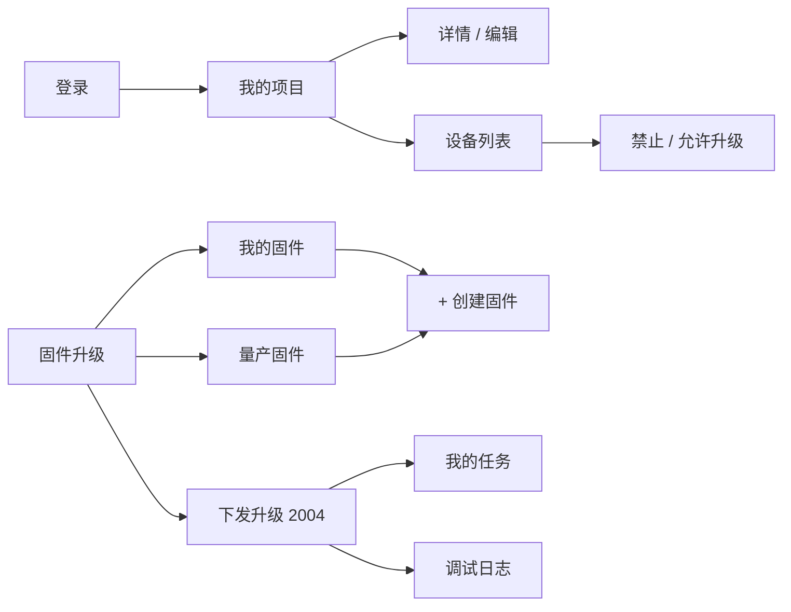

# 4G OTA 管理台

生产：http://43.136.55.143/admin.html  
本地：`http://127.0.0.1:8080/admin.html`

页面打开后自动带入管理令牌并登录。Token 也可写在环境变量 `LUAT_OTA_ADMIN_TOKEN`。

默认项目：**4G 标准模块**，Key=`ThOoUoR77b9EOwNp25mUj6VS2Lce0d5x`（与固件 `PRODUCT_KEY` 一致）。

在页面上如何上传包、点「下发 OTA」见 [OTA_CONSOLE_UPGRADE.md](OTA_CONSOLE_UPGRADE.md)。

---

## 1. 菜单

| 菜单 | 作用 |
|------|------|
| 我的项目 | 项目列表、新建、详情、编辑、删除 |
| 我的设备 | 按项目 / IMEI 查看设备，允许或禁止升级 |
| 固件升级 → 我的固件 | 固件列表、允许升级、指定设备、**+ 创建固件** |
| 固件升级 → 量产固件 | 选择本地量产 `.bin` 上传到当前项目 |
| 固件升级 → 下发升级 | MQTT 2004 通知设备拉包 |
| 我的任务 | 升级任务状态与分页 |
| 调试日志 | 每次 HTTP 检查的决策 |
| 闭环测试 | 模拟设备走完整升级 |



---

## 2. 项目

| 按钮 | 行为 |
|------|------|
| 查看/点击复制 | 复制项目 Key |
| 详情 | 名称、描述、Key、设备数、固件数 |
| 编辑 | 改名称、描述、是否隐藏；Key 不可改 |
| 设备列表 | 进入该项目设备 |
| 固件列表 | 进入该项目固件 |
| 删除 | 删除项目及其固件 |

新建项目时 Key 可留空（服务器生成 32 位），或手填现网 `PRODUCT_KEY`。

---

## 3. 固件

点「选择本地量产文件」加载 `量产/` 下的脚本 `.bin`（不要选 `.soc` / `.binpkg`）。文件名会自动识别固件名和版本，可手改。必须勾选「升级全部设备」或填写指定 IMEI，否则不会匹配到设备。

仅改脚本上传量产包；升内核必须做差分，且 `.soc` 分区后缀相同。版本号规则与循环保护见 [OTA_FOTA.md](OTA_FOTA.md)。

设备拉包：

```text
http://主机/api/site/firmware_upgrade?imei=&project_key=&firmware_name=&version=
```

| HTTP | 含义 |
|------|------|
| 200 + bin | 有匹配差分包 |
| ≥300 | 无需升级或已最新 |
| 25 | IMEI 已属其他项目 |
| 26 | 项目 Key 无效 |
| 27 | 固件名无效 |

IMEI 首次带 `project_key` 请求会自动归属该项目。循环升级时，到设备列表解除「禁止升级」。

---

## 4. 设备

列：IMEI、设备名、版本 `(core)`、固件名、允许/禁止、Debug、最近访问、查看/设置/删除。禁止列会显示循环保护原因。解除禁止前请确认差分包已修正。

`PUT /admin/api/devices/{imei}/ota-enabled` 禁止或允许升级。  
`PUT /admin/api/devices/{imei}/debug` 开关调试。  
`POST /admin/api/devices/batch` 批量操作：`unban` / `delete` / `debug_on` / `transfer` / `create`，body 为 `{action, imeis, projectKey?}`。IMEI 可一行一个。

点「指定设备」打开 IMEI 列表：可搜索、勾选删除、添加（一行一个或上传文本）。  
`GET/POST/DELETE /admin/api/firmware-packages/{id}/devices` 查询、追加、删除指定 IMEI（POST 不会覆盖已有列表）。

设备列表「操作」：勾选后可解除禁止、批量转移、批量删除、批量 DEBUG、导出 CSV。

---

## 5. 任务

| 列 | 来源 |
|----|------|
| 创建人 | `triggerSource`：管理员 / 批量任务 |
| IMEI | 下发目标 |
| 创建 / 开始 / 结束 | `createdAt` / `completedAt` |
| 状态 | 待下发 / 已下发 / 已受理 / 进行中 / 成功 / 失败 / 超时 |
| 备注 | 目标版本 + 最近 stage |
| 错误信息 | `errorMessage` |

接口：`GET /admin/api/ota/tasks?imei=&status=&page=&size=`。

---

## 6. 固件升级（MQTT）

管理台填写 IMEI 与目标版本后下发：

```json
{
  "dataType": "2004",
  "action": "ota",
  "url": "http://43.136.55.143/api/site/firmware_upgrade?",
  "version": "2044.001.010",
  "messageId": "ota-srv-..."
}
```

设备收到后按 `url` 拉包，用 MQTT 1004 回传进度。固件 lua 无需修改：2004 带 `url` 即走本服务。

**在页面上怎么点**：见 [OTA_CONSOLE_UPGRADE.md](OTA_CONSOLE_UPGRADE.md)。真机打包见 [OTA_REAL_DEVICE.md](OTA_REAL_DEVICE.md)。模拟闭环见 [OTA_CLOSED_LOOP.md](OTA_CLOSED_LOOP.md)。
