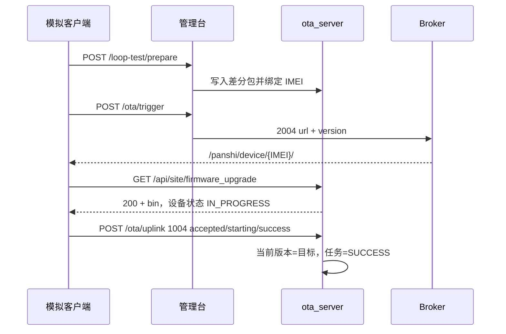

# 4G OTA 闭环测试

验证「准备差分包 → 通知设备 → HTTP 拉包 → 上报进度 → 台账落库」是否完整可用。不依赖真机。

管理台操作见 [OTA_ADMIN.md](OTA_ADMIN.md)。协议字段见 [OTA_PROTOCOL.md](OTA_PROTOCOL.md)。

---

## 1. 闭环路径



| 模式 | 步骤 | 适用 |
|------|------|------|
| **http** | 准备包 → GET 拉包 → 上报 1004 | 不依赖本机连 Broker |
| **mqtt** | 订阅 2004 → 拉包 → 按 messageId 回 1004 | 验证控制面下发 |

默认模拟 IMEI：`862323084068999`（与现场真机隔离）。

---

## 2. 管理台

生产：http://43.136.55.143/admin.html（Token 已预填，打开即登录）

1. 打开 **闭环测试**
2. （可选）点 **选择本地量产文件**，加载 `量产/` 下的 `.bin`
3. 点 **HTTP 全流程**
4. 输出 `ok: true`，设备当前版本变为目标版本
5. **我的任务** 为成功；**调试日志** 有 `UPGRADE`

本机图形工具：`python tools/ota_test_gui.py` 或双击 `tools/ota_test_gui.bat`。默认连接 `http://43.136.55.143`，可浏览量产目录、上传并跑 HTTP / MQTT 全流程。

---

## 3. 命令行

```bash
cd ota_server
python tools/sim_luat_client.py --mode http
python tools/sim_luat_client.py --mode mqtt
```

默认打 `http://43.136.55.143`。环境变量：`OTA_BASE`、`OTA_ADMIN_TOKEN`、`MQTT_HOST` / `MQTT_PORT` / `MQTT_USER` / `MQTT_PASS`。

成功时最后一行：`PASS`。

---

## 4. 接口

| 能力 | 接口 |
|------|------|
| 准备模拟包 | `POST /admin/api/loop-test/prepare` |
| 查闭环状态 | `GET /admin/api/loop-test/status?imei=` |
| 模拟 1004 上行 | `POST /admin/api/ota/uplink` |
| HTTP 200 拉包 | `devices.ota_status = IN_PROGRESS` |

拉包 URL：

```text
GET /api/site/firmware_upgrade?imei=862323084068999&project_key=ThOoUoR77b9EOwNp25mUj6VS2Lce0d5x&firmware_name=PANSHI_CAT1_LuatOS-SoC_Air780EHM&version=2044.001.002
```

---

## 5. 判定标准

| 检查 | 通过标准 |
|------|----------|
| HTTP 拉包 | 源版本匹配时 **200**，`X-Ota-Target-Version` = 目标版本，body 有字节 |
| 已最新 | 再用目标版本拉一次 → **≥300** |
| 设备 | `current_version` 变为目标，`ota_status=SUCCESS` |
| 任务 | `status=SUCCESS`，有开始/结束时间 |
| MQTT | 订阅 `/panshi/device/{IMEI}/` 后收到 `2004 action=ota` 且带 `url` |

---

## 6. 实测记录（2026-08-17）

环境：腾讯云 `http://43.136.55.143`，Token `ota-7f3a9c2e4b18d6a0e5c1`，MQTT `tcp://112.86.146.218:2123` 已连接。

| 项 | 结果 |
|----|------|
| `GET /health` | `ok` |
| MQTT 状态 | `connected=true` |
| 管理台登录 / 项目列表 | 正常，4 台设备 |
| HTTP 闭环 | **PASS** |
| MQTT 闭环 | **PASS** |
| 已最新再拉包 | HTTP **404**（无需升级） |

HTTP 闭环摘录：

| 字段 | 值 |
|------|----|
| IMEI | `862323084068999` |
| 拉包 | 200，60 字节，目标 `2044.001.010` |
| 下发 | `ota-srv-526a48b5`，`PUBLISHED` |
| 设备 | `currentVersion=2044.001.010`，`otaStatus=SUCCESS` |
| 任务 | `SUCCESS`，`lastStage=success` |

MQTT 闭环摘录：

| 字段 | 值 |
|------|----|
| 收到 2004 | `url=http://43.136.55.143/api/site/firmware_upgrade?`，`version=2044.001.010` |
| messageId | `ota-srv-2051759b` |
| 拉包 | 200，目标 `2044.001.010` |
| 任务 | `SUCCESS` |

结论：**控制面下发、数据面拉包、进度回传、任务落库均正常。**

2026-08-17 对照模组 FOTA 文档补强后再测：HTTP 闭环 **PASS**；200 带 `Content-Length`；`Range` 返回 **206**；已最新返回 404。规则见 [OTA_FOTA.md](OTA_FOTA.md)。

---

## 7. 实测记录（2026-08-18）

环境同上。本次把 **模拟客户端** 和 **样机 Cat.1** 都跑通。

### 7.1 模拟客户端（IMEI `862323084068999`）

| 项 | 结果 |
|----|------|
| HTTP 闭环 `sim_luat_client.py --mode http` | **PASS**，拉包 200 / 60 字节 / 目标 `2044.001.010`，任务 `ota-srv-ad87e084` SUCCESS |
| MQTT 闭环 `--mode mqtt` | **PASS**，收到 2004 带 `url=http://43.136.55.143/api/site/firmware_upgrade?`，任务 `ota-srv-00df681e` SUCCESS |

### 7.2 样机 Cat.1（IMEI `862323084068124`）

同日稍后用仓库真实脚本打 FOTA 包并云端下发，已升到 `001.000.019` / `2044.001.019`。完整步骤与记录见 [OTA_REAL_DEVICE.md](OTA_REAL_DEVICE.md)。

| 阶段 | 结果 |
|------|------|
| 控制面（上午，`ota-srv-c48a23bd`） | 2004 受理；库无源 `2044.001.018` 的包 → 1004 `recv_error` `ret=4`，未重启 |
| 数据面（凌晨，`ota-srv-b38fc606`） | 上传源 `2044.001.018` → 目标 `2044.001.019` 脚本包（id=3，仅绑样机）→ GET **200** → 拉包重启 |
| 重启后 1008 | `scriptVersion=001.000.019`，`firmwareVersion=2044.001.019` |

不要把模拟用的 60 字节 dummy 绑到真机。不要用 USB 把目标版本直接烧进模组来代替云端升级。

脚本：`python tools/debug/_test_cat1_ota_e2e.py`（会再发 2004）  
模拟：`python ota_server/tools/sim_luat_client.py --mode http` / `--mode mqtt`

