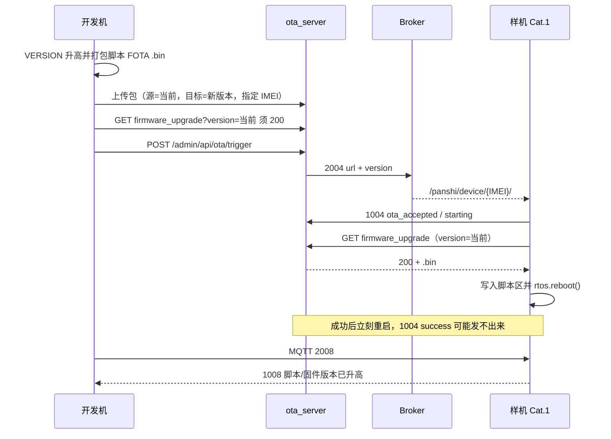

# 真机云端脚本升级

用仓库里当前的 `user/` + `lib/` 打 **脚本 FOTA `.bin`**，上传到本服务器，对样机 MQTT **2004** 下发，由模组 HTTP 拉包并重启。不走模拟客户端，也不用 USB 把目标版本直接烧进模组。

模拟闭环见 [OTA_CLOSED_LOOP.md](OTA_CLOSED_LOOP.md)。对接约定见 [OTA_CHANNELS.md](OTA_CHANNELS.md)。版本匹配见 [OTA_FOTA.md](OTA_FOTA.md)。

---

## 1. 边界

| 做 | 不做 |
|----|------|
| 只改脚本：打脚本升级 `.bin` | 把 `dist/script.bin`（USB LuaDB）当 FOTA 包上传 |
| 源版本 = 设备当前 `firmwareVersion` | 绑模拟 IMEI `862323084068999` 的 dummy 包到真机 |
| 目标版本 `C` 段必须高于当前 | USB `flash-script` 把目标版本直接烧进模组（那就不是云端升级） |
| 2004 带本服务 `url`，`full_url=0` | 用 `2044.001.999` 之类假版本去 GET 探测（会污染台账 `currentVersion`） |

现网样机：

| 项 | 值 |
|----|----|
| IMEI | `862323084068124` |
| 固件名 | `PANSHI_CAT1_LuatOS-SoC_Air780EHM` |
| 项目 Key | `ThOoUoR77b9EOwNp25mUj6VS2Lce0d5x`（与 `PRODUCT_KEY` 一致） |
| OTA | http://43.136.55.143 |
| 管理台 | http://43.136.55.143/admin.html |
| Token | `ota-7f3a9c2e4b18d6a0e5c1` |
| MQTT | `112.86.146.218:2123`，用户/密码与现网业务相同 |

脚本 `A.B.C` 与平台版本 `core.A.C`：`001.000.019` ↔ `2044.001.019`。允许升级当且仅当 `A` 相同且 `C` 升高（或 `A` 升高）。规则见 [OTA_FOTA.md](OTA_FOTA.md)。

---

## 2. 流程



---

## 3. 打脚本 FOTA 包

USB 用的 LuaDB `script.bin` **不能**直接给模组 FOTA。远程升级文件是 92 字节头 + 压缩脚本区，文件头 magic 与量产 `.soc` 里 `info.json` 的 `fota.magic_num` 相同（Air780EHM 为 `eac37218`）。

### 3.1 用烧录工具（推荐）

双击 [`../../tools/cat1_flash_gui.bat`](../../tools/cat1_flash_gui.bat) 或 [`../../tools/gui/02_Cat1烧录.bat`](../../tools/gui/02_Cat1烧录.bat)，右侧 **量产升级固件**：

1. 看 **当前代码**（脚本版 → 平台版）
2. **新版本** 填写或点 **升一版**
3. **写入代码版本** 只改 `user/main.lua` 的 `VERSION`
4. **生成量产固件** 写出必须的三个文件并复制到量产目录：
   - `PANSHI_CAT1_<平台版>_LuatOS-SoC_Air780EHM.bin`（远程升级，上传本服务器）
   - `PANSHI_CAT1_<脚本版>_LuatOS-SoC_V2044_Air780EHM_8.soc`（USB 量产）
   - 同名 `.binpkg`（底层，沿用 V2044 模板）

命令行等价：

```bat
python tools/cat1_flash.py set-version --version 001.000.019
python tools/cat1_flash.py pack-prod
python tools/cat1_flash.py pack-prod --bump
```

需要 `luatos-cli.exe`：放到 `_temp/luatos-cli/`，或设置 `CAT1_LUATOS_CLI`。说明见 [CAT1_FLASH_TOOL.md](../../doc/CAT1_FLASH_TOOL.md) §8。

### 3.2 手工步骤

```bat
python tools/cat1_flash.py pack
```

得到 `dist/script.bin`。再把量产 `.soc` 换上这份脚本，然后：

```bat
luatos-cli fota build --new dist\PANSHI_CAT1_001.000.019_LuatOS-SoC_V2044_Air780EHM_8.soc --script-only -o dist\PANSHI_CAT1_2044.001.019_LuatOS-SoC_Air780EHM.bin
```

LuaDB 须低于脚本区 **512KB**。源码打包即可，不必先 luac。

检查产物：文件头 4 字节应为 `18 72 c3 ea`，与量产目录下 `PANSHI_CAT1_2044.001.00x_LuatOS-SoC_Air780EHM.bin` 相同。

---

## 4. 上传并验包

只绑样机 IMEI，`sourceVersion` 必须等于设备 **当前** `firmwareVersion`。

```bat
curl.exe -sS -H "X-Admin-Token: ota-7f3a9c2e4b18d6a0e5c1" ^
  -F "file=@dist\PANSHI_CAT1_2044.001.019_LuatOS-SoC_Air780EHM.bin;type=application/octet-stream" ^
  -F "firmwareName=PANSHI_CAT1_LuatOS-SoC_Air780EHM" ^
  -F "version=2044.001.019" ^
  -F "sourceVersion=2044.001.018" ^
  -F "coreVersion=2044" ^
  -F "projectId=1" ^
  -F "allowUpgrade=true" ^
  -F "upgradeAll=false" ^
  -F "imeis=862323084068124" ^
  -F "remark=repo user+lib script FOTA 001.000.019" ^
  http://43.136.55.143/admin/api/firmware-packages/upload
```

也可用管理台 **固件升级 → 我的固件 / 量产固件**：选这个 `.bin`，源版本、目标版本、指定 IMEI 同上。

验包（用设备当前版本，不要用目标版本、不要用 `.001.999`）：

```text
GET http://43.136.55.143/api/site/firmware_upgrade?imei=862323084068124&project_key=ThOoUoR77b9EOwNp25mUj6VS2Lce0d5x&firmware_name=PANSHI_CAT1_LuatOS-SoC_Air780EHM&version=2044.001.018
```

通过：HTTP **200**，`X-Ota-Target-Version` = 目标版本，body 长度与 `.bin` 一致、magic 为 `1872c3ea`。  
失败：404 表示源版本/IMEI/固件名未匹配；设备被禁止升级时也不会给包。到 **我的设备** 打开「允许升级」会清零循环计数。

---

## 5. 下发与确认

管理台逐步点击见 [OTA_CONSOLE_UPGRADE.md](OTA_CONSOLE_UPGRADE.md)。摘要：

1. MQTT 发 **2008**，确认设备在线，记下 `scriptVersion` / `firmwareVersion`。
2. **固件升级 ▾** → **下发升级**，填 IMEI 与目标版本，点 **下发 OTA**；或：

```text
POST /admin/api/ota/trigger
{"imeis":["862323084068124"],"targetVersion":"2044.001.019"}
```

3. 设备应回 **1004** `ota_accepted`，随后 `stage=starting`。
4. 调试日志出现该 IMEI 的 `UPGRADE`（蜂窝出口 IP，不是本机验包 IP）。
5. 模组拉包成功后会立刻 `rtos.reboot()`，**1004 `success` 经常发不出来**。以重启后再发 **2008** 的 **1008** 为准：

| 字段 | 升级前（例） | 升级后（例） |
|------|----------------|----------------|
| `scriptVersion` | `001.000.018` | `001.000.019` |
| `firmwareVersion` | `2044.001.018` | `2044.001.019` |

任务台账：若只有 `starting`、没有 `success`，以 1008 版本升高为准；需要把任务标成成功时，可用管理台任务状态或 `POST /admin/api/ota/uplink` 补一条 1004 `stage=success`（仅对齐台账，不代替真机确认）。

本机监听脚本：`python _temp/real_ota_019.py`（会再发一次 2004，无匹配包时会失败）。只听结果、不再下发：`python _temp/wait_ota_1004.py`。

---

## 6. 管理台下发的 2004

```json
{
  "dataType": "2004",
  "action": "ota",
  "url": "http://43.136.55.143/api/site/firmware_upgrade?",
  "version": "2044.001.019",
  "timeout": 300000,
  "full_url": 0,
  "messageId": "ota-srv-xxxxxxxx"
}
```

`url` 以 `?` 结尾。模组拼 `imei` / `firmware_name` / `version`（**当前**平台版本）/ `project_key`。2004 里的 `version` 是目标，给任务用。

---

## 7. 实测（2026-08-18）

样机从 `001.000.018` / `2044.001.018` 升到 `001.000.019` / `2044.001.019`。包来自当时仓库 `user/` + `lib/`，未用 dummy。

| 项 | 结果 |
|----|------|
| LuaDB | 35 个文件，约 368KB / 512KB |
| FOTA `.bin` | 76332 字节，magic `eac37218` |
| 上传 | 固件 id=3，源 `2044.001.018`，目标 `2044.001.019`，仅 IMEI `862323084068124` |
| 验包 GET | **200**，`X-Ota-Target-Version=2044.001.019`，`pkg-3` |
| 下发 | `ota-srv-b38fc606` **PUBLISHED** |
| 1004 | `ota_accepted` → `starting`（重启前未观察到 `success`） |
| 设备拉包 | 审计 `UPGRADE`，`clientIp=183.39.1.14` |
| 重启后 1008 | `scriptVersion=001.000.019`，`firmwareVersion=2044.001.019` |
| USB 烧录 | **未做** |

先前同日一次下发（`ota-srv-c48a23bd`）控制面通过，但库里没有源 `2044.001.018` 的包，1004 `recv_error` / `ret=4`，未重启。补上本包后数据面通过。
