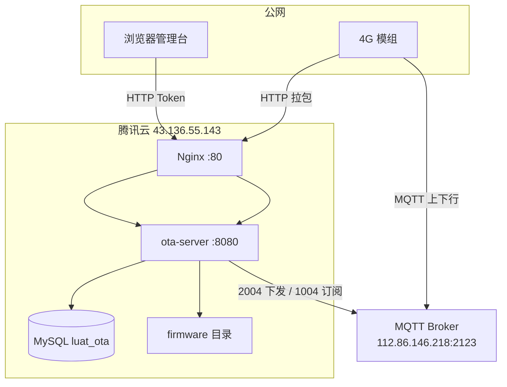
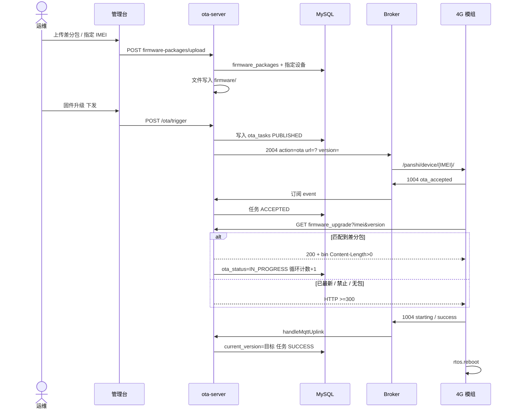
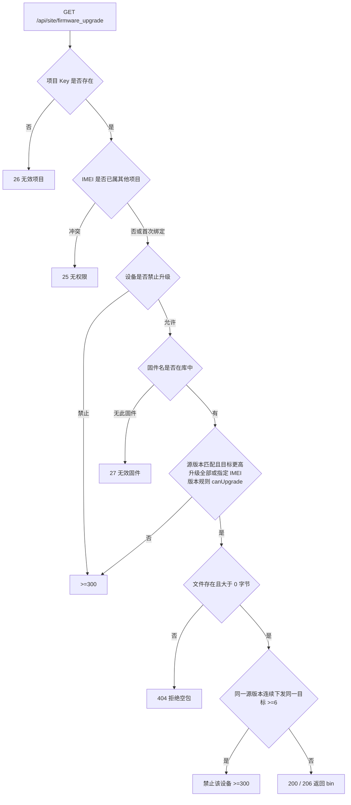
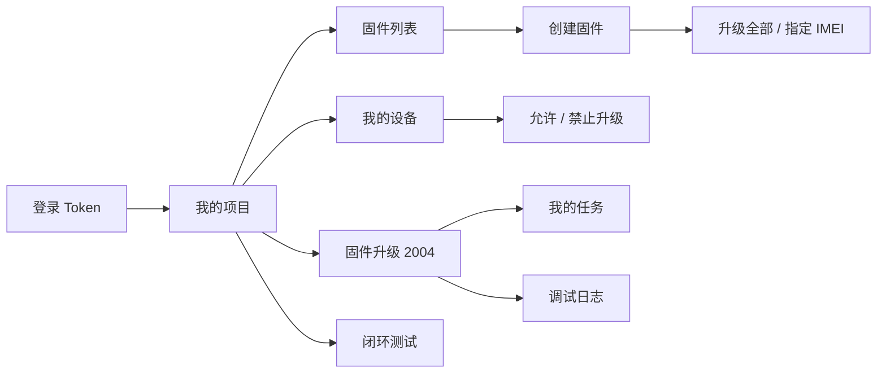
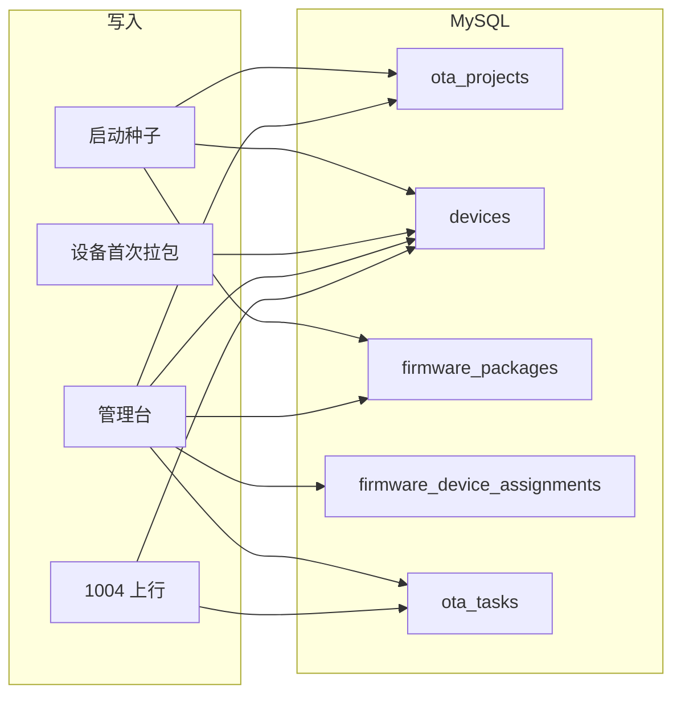

# 4G OTA 系统流程图

生产入口：http://43.136.55.143/admin.html  
设备拉包：`GET /api/site/firmware_upgrade?imei=&project_key=&firmware_name=&version=`

操作细节见 [OTA_ADMIN.md](OTA_ADMIN.md)，协议见 [OTA_PROTOCOL.md](OTA_PROTOCOL.md)，FOTA 规则见 [OTA_FOTA.md](OTA_FOTA.md)。

---

## 1. 部署与组件

MQTT **不经过 Nginx**：应用直连 Broker。  
Topic：下行 `/panshi/device/{IMEI}/`，上行 `/panshi/app/{IMEI}/event`。

---

## 2. 端到端升级（主流程）

固件 lua **不用改**：2004 带 `url` 时，模组按该地址拉包。

---

## 3. 拉包决策

版本规则：脚本 `A.B.C` 中 B 无意义；允许 A 不变且 C 增大，或 A 增大且 C 不减小；禁止 core 回退。

---

## 4. 管理台业务

| 菜单 | 落库 |
|------|------|
| 我的项目 | `ota_projects` |
| 我的设备 | `devices` |
| 固件列表 | `firmware_packages` / `firmware_device_assignments` |
| 固件升级 | MQTT 2004 + `ota_tasks` |
| 我的任务 | `ota_tasks` |
| 调试日志 | `logs/ota-audit.jsonl` |
| 闭环测试 | 模拟 IMEI `862323084068999` |

---

## 5. 数据落库

重启应用容器不丢数据（volume `ota_server_mysql_data`）。已有 IMEI 的真实版本不会被种子覆盖。
